*Vector spaces:* span, subspaces, coordinates, bases, linear independence, orthogonal
and orthonormal basis, operations on vector subspaces, complementary subspace,
orthogonal complement of a subspace, linear transformation, null space, image space,
column space, row space, rank, system of linear equations, null space and rank in
MATLAB
*Algorithms:*  Row-echelon form, Gaussian
elimination, inverse of a matrix, computing inverse, ill-conditioned matrices


# Gaussian Elimination - ELI15 Explanation

## What is Gaussian Elimination?

Think of Gaussian elimination like organizing a messy pile of equations to solve them step by step. It's named after Carl Friedrich Gauss, a brilliant mathematician, but the technique is actually much older.

**The Big Idea**: When you have multiple equations with multiple unknowns (like x, y, z), Gaussian elimination helps you systematically eliminate variables one by one until you can solve everything.

## The Process - Like Cleaning Your Room

Imagine you have a system of equations like this:
```
2x - 4y + 2z = -8
2x + 2y + z = 5  
x + y - 2z = 5
```

Gaussian elimination works in two main phases:

### Phase 1: Forward Elimination (Making it "Row Echelon Form")
This is like organizing your messy room - you work from top to bottom, left to right:

1. **Pick a "pivot"** - Choose the first variable in the first equation
2. **Eliminate below** - Use this equation to eliminate that variable from all equations below it
3. **Move to the next** - Go to the next variable and repeat
4. **Keep going** - Until you have a "staircase" pattern

### Phase 2: Back Substitution (Solving)
Now you work backwards, like putting the finishing touches on your organized room:
1. Start with the last equation (which should have only one variable)
2. Solve for that variable
3. Substitute back into the equation above
4. Keep going until you've found all variables

## Visual Process

```mermaid
---
config:
  flowchart:
    nodeSpacing: 75
    rankSpacing: 75
---
flowchart TD
    A["🎯 Start: System of Equations<br/>Multiple variables mixed together"] --> B["📋 Step 1: Choose Pivot<br/>Pick first non-zero element"]
    
    B --> C["🔄 Step 2: Row Operations<br/>• Add/subtract equations<br/>• Multiply by constants<br/>• Swap equation order"]
    
    C --> D["⬇️ Step 3: Eliminate Below<br/>Make all elements below pivot = 0"]
    
    D --> E{"🤔 More columns<br/>to process?"}
    
    E -->|Yes| F["➡️ Move to next column<br/>Repeat process"]
    F --> B
    
    E -->|No| G["📐 Row Echelon Form<br/>Staircase pattern achieved"]
    
    G --> H["🔙 Back Substitution<br/>Solve from bottom up"]
    
    H --> I["✅ Solution Found<br/>All variables determined"]
    
    style A fill:#e1f5fe
    style G fill:#f3e5f5
    style I fill:#e8f5e8
```



## Real Example Walkthrough

Let's solve the system from the textbook:
```
2x - 4y + 2z = -8  (equation 1)
2x + 2y + z = 5    (equation 2)  
x + y - 2z = 5     (equation 3)
```

**Step 1**: Eliminate x from equations 2 and 3
- Subtract equation 1 from equation 2: `6y - z = 13`
- Subtract ½ of equation 1 from equation 3: `3y - 3z = 9`

**Step 2**: Eliminate y from equation 3
- Subtract ½ of the new equation 2 from equation 3: `(-5/2)z = 5/2`

**Step 3**: Back substitute
- From equation 3: `z = -1`
- Substitute into equation 2: `y = 2`  
- Substitute both into equation 1: `x = 1`

## Why Does This Work?

The key insight is that we're not changing the solution - we're just rewriting the same information in a cleaner way. It's like having the same story told in a more organized manner.

**Row operations preserve solutions**:
- Adding one equation to another doesn't change what x, y, z should be
- Multiplying an equation by a non-zero number doesn't change the solution
- Swapping equation order is just reorganizing

## When Do You Use This?

- **Computer graphics**: Transforming 3D objects
- **Engineering**: Solving circuit problems, structural analysis
- **Economics**: Finding market equilibrium points
- **Machine learning**: Training neural networks
- **Any time** you have multiple equations with multiple unknowns!

The beauty is that computers can do this process automatically for systems with hundreds or thousands of variables - something that would take humans forever to solve by hand.

## Key Takeaway

Gaussian elimination is like having a systematic method for untangling a knot. Instead of randomly pulling at threads, you follow a specific process that's guaranteed to work, making the complex simple through organized steps.


---

## The Minto Pyramid: Gaussian Elimination Through the Eyes of Hogwarts
*In the soothing voice of Morgan Freeman*

Now, if you'll allow me to take you on a different kind of journey - one where the ancient art of solving equations meets the magical world of Harry Potter. You see, Gaussian elimination isn't just mathematics; it's wizardry in its purest form.

### The Main Spell: *Eliminatus Systematicus*

Picture, if you will, young Harry Potter standing before the Sorting Hat, but instead of houses, he's facing a chaotic tangle of mathematical equations. The Sorting Hat - our Gaussian elimination - doesn't just randomly assign solutions. No, it follows an ancient, methodical magic that brings order from chaos, one deliberate step at a time.

The essence of this spell is simple: **Transform the impossible into the inevitable through systematic elimination**.

### The Three Sacred Principles of Mathematical Wizardry

#### First Principle: The Art of the Pivot (Like Choosing Your Wand)

Just as Ollivander knew that the wand chooses the wizard, in Gaussian elimination, we must choose our pivot wisely. Picture Professor McGonagall teaching Transfiguration - she doesn't randomly wave her wand. She selects the most powerful element in each row, the one with the greatest magical potential, and uses it to transform everything below.

*"The pivot,"* as McGonagall might say, *"is not merely a number. It is the key that unlocks the door to mathematical truth."*

#### Second Principle: The Forward Pass (Clearing the Path to the Philosopher's Stone)

Remember Harry's journey through the obstacles protecting the Philosopher's Stone? Each challenge had to be overcome in order - you couldn't skip the Devil's Snare to get to the chess game. Similarly, our forward elimination works methodically:

- **Fluffy's Challenge**: Choose your pivot (the three-headed dog of mathematics)
- **Devil's Snare**: Eliminate variables below (stay calm, don't panic)
- **Flying Keys**: Move systematically column by column (catch the right one)
- **Wizard's Chess**: Make strategic moves (row operations)

Each step prepares you for the next, creating that beautiful staircase pattern - what we call row echelon form.

#### Third Principle: The Backward Journey (Like Harry's Return from the Mirror of Erised)

Once you've reached the end - your row echelon form - you must journey back, but now with wisdom. This is back substitution, and it's like Harry understanding what he truly saw in the Mirror of Erised. You start with what you know for certain (the last equation with one variable) and work backward, each revelation illuminating the previous mystery.

### The Supporting Spells: Why This Magic Never Fails

#### The Preservation Charm
*"You see,"* I would tell you in my most reassuring voice, *"the beautiful thing about row operations is that they're like the Unbreakable Vow of mathematics. When you add one equation to another, when you multiply by a constant, when you swap their order - you're not changing the fundamental truth. You're simply... revealing it."*

The solution remains constant, like love in the Harry Potter universe - it may be hidden, transformed, or disguised, but it endures.

#### The Universality Principle
This magic works everywhere - from the Muggle world of computer graphics to the wizarding world of artificial intelligence. Whether you're:
- Transforming Quidditch statistics (computer graphics)
- Balancing the Gringotts ledgers (economics)
- Brewing the perfect Polyjuice Potion (chemistry)
- Training a Sorting Hat algorithm (machine learning)

The same systematic approach applies.

### The Deeper Magic: Why Gaussian Elimination Matters

*"There's something profound happening here,"* I might whisper, as if sharing a secret by the fireplace in the Gryffindor common room. *"This isn't just about solving equations. This is about bringing order to chaos, about finding truth in complexity, about the very human desire to understand and organize our world."*

When young wizards first learn this spell, they often ask, "But Professor Freeman, why can't we just guess?" And the answer, my dear student, is the same reason Hermione never just guessed at her spells. True magic - whether mathematical or mystical - requires method, patience, and respect for the underlying principles.

### The Final Wisdom

As our journey through this mathematical Hogwarts comes to an end, remember this: Gaussian elimination is more than an algorithm. It's a philosophy. It teaches us that even the most complex problems can be solved if we approach them systematically, with patience and respect for the process.

*"And so,"* as I might conclude while the camera slowly pans across the Great Hall of Mathematics, *"the next time you face a system of equations, remember - you're not just solving for x, y, and z. You're participating in an ancient tradition of bringing light to darkness, order to chaos, and understanding to mystery. That, my friends, is the true magic of Gaussian elimination."*

*The End.*

---

*"Mathematics, like magic, is not about the destination - it's about the transformation that occurs along the journey."* - Morgan Freeman (probably)