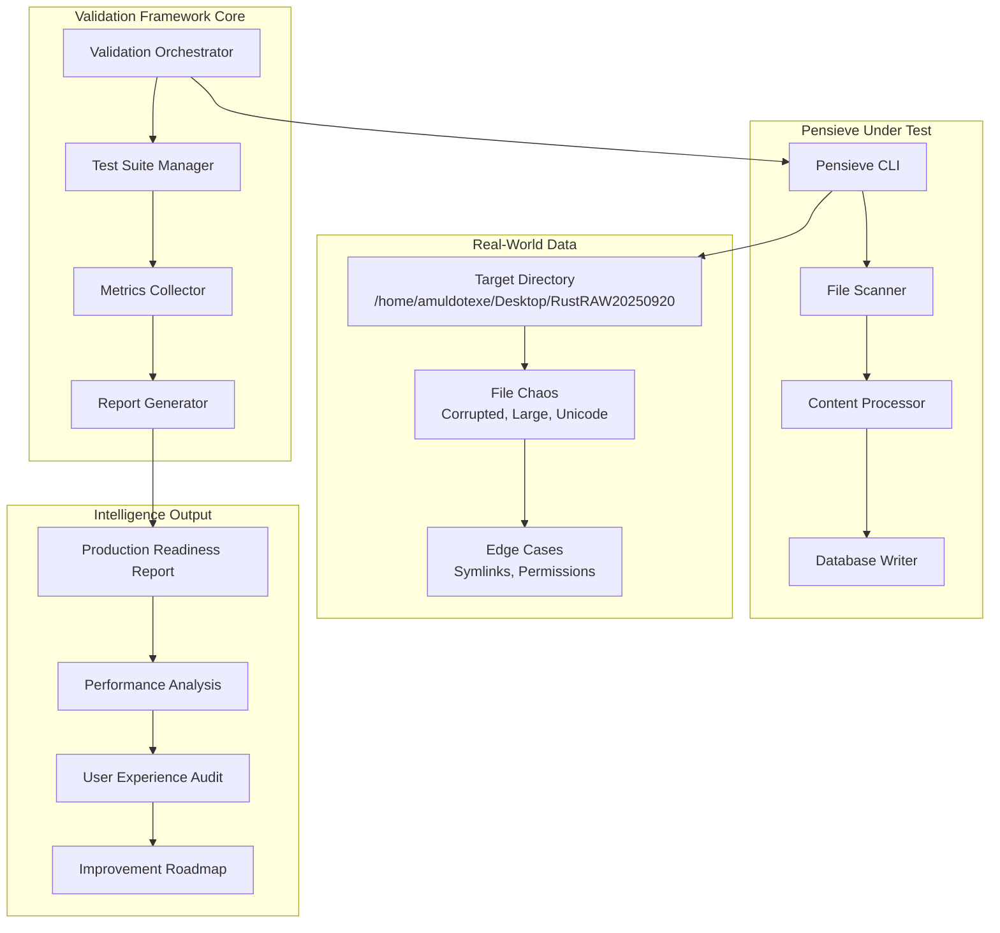
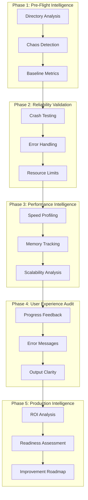

# Design Document

## Overview

The Pensieve Real-World Validation System is a comprehensive testing and intelligence-gathering framework designed to transform pensieve from "works in demos" to "production-ready." This system systematically stress-tests pensieve against real-world data chaos while generating actionable insights for improvement.

**Core Design Philosophy:**
1. **Intelligence Over Testing**: Generate actionable insights, not just pass/fail results
2. **User-Centric Validation**: Test what users actually experience, not what developers think they experience  
3. **Production Readiness Focus**: Every test should answer "Is this ready for production?"
4. **Reusable Framework**: Design for reuse across different CLI tools and datasets

**Key Innovation**: This isn't just a test suite - it's a product intelligence system that discovers edge cases, measures user experience, and generates improvement roadmaps.

## Architecture

### High-Level System Architecture



### Validation Pipeline Architecture



## Components and Interfaces

### Core Validation Framework

```rust
/// Main orchestrator for the validation framework
pub struct ValidationOrchestrator {
    config: ValidationConfig,
    metrics_collector: MetricsCollector,
    report_generator: ReportGenerator,
}

/// Configuration for validation runs
#[derive(Debug, Clone)]
pub struct ValidationConfig {
    pub target_directory: PathBuf,
    pub pensieve_binary_path: PathBuf,
    pub output_directory: PathBuf,
    pub timeout_seconds: u64,
    pub memory_limit_mb: u64,
    pub performance_thresholds: PerformanceThresholds,
}

/// Performance expectations and thresholds
#[derive(Debug, Clone)]
pub struct PerformanceThresholds {
    pub min_files_per_second: f64,
    pub max_memory_mb: u64,
    pub max_processing_time_seconds: u64,
    pub acceptable_error_rate: f64,
}
```

### Intelligence Collection System

```rust
/// Comprehensive metrics collection during validation
pub struct MetricsCollector {
    start_time: Instant,
    memory_tracker: MemoryTracker,
    performance_tracker: PerformanceTracker,
    error_tracker: ErrorTracker,
    user_experience_tracker: UXTracker,
}

/// Real-time performance monitoring
pub struct PerformanceTracker {
    pub files_processed_per_second: Vec<f64>,
    pub memory_usage_over_time: Vec<(Instant, u64)>,
    pub database_operation_times: Vec<Duration>,
    pub file_type_processing_speeds: HashMap<String, Vec<Duration>>,
}

/// Error pattern analysis
pub struct ErrorTracker {
    pub error_categories: HashMap<ErrorCategory, u32>,
    pub error_messages: Vec<ErrorInstance>,
    pub recovery_success_rate: f64,
    pub critical_failures: Vec<CriticalFailure>,
}

/// User experience quality metrics
pub struct UXTracker {
    pub progress_update_frequency: Vec<Duration>,
    pub message_clarity_scores: Vec<MessageClarity>,
    pub completion_feedback_quality: CompletionFeedback,
    pub interruption_handling_quality: InterruptionHandling,
}
```

### Directory Analysis and Chaos Detection

```rust
/// Pre-flight analysis of target directory
pub struct DirectoryAnalyzer {
    pub file_type_detector: FileTypeDetector,
    pub chaos_detector: ChaosDetector,
    pub baseline_calculator: BaselineCalculator,
}

/// Identifies problematic files that might break pensieve
pub struct ChaosDetector;

impl ChaosDetector {
    /// Detect files that commonly cause issues
    pub fn detect_chaos_files(&self, directory: &Path) -> ChaosReport {
        ChaosReport {
            files_without_extensions: self.find_extensionless_files(directory),
            misleading_extensions: self.find_misleading_extensions(directory),
            unicode_filenames: self.find_unicode_filenames(directory),
            extremely_large_files: self.find_large_files(directory, 100_000_000), // 100MB+
            zero_byte_files: self.find_zero_byte_files(directory),
            permission_issues: self.find_permission_issues(directory),
            symlink_chains: self.find_symlink_chains(directory),
            corrupted_files: self.detect_corrupted_files(directory),
        }
    }
}

/// Comprehensive directory analysis report
#[derive(Debug)]
pub struct ChaosReport {
    pub files_without_extensions: Vec<PathBuf>,
    pub misleading_extensions: Vec<MisleadingFile>,
    pub unicode_filenames: Vec<PathBuf>,
    pub extremely_large_files: Vec<LargeFile>,
    pub zero_byte_files: Vec<PathBuf>,
    pub permission_issues: Vec<PermissionIssue>,
    pub symlink_chains: Vec<SymlinkChain>,
    pub corrupted_files: Vec<CorruptedFile>,
}
```

### Pensieve Integration and Monitoring

```rust
/// Wrapper for running pensieve with comprehensive monitoring
pub struct PensieveRunner {
    binary_path: PathBuf,
    metrics_collector: Arc<Mutex<MetricsCollector>>,
    process_monitor: ProcessMonitor,
}

impl PensieveRunner {
    /// Run pensieve with full monitoring and intelligence collection
    pub async fn run_with_monitoring(
        &self,
        target_dir: &Path,
        output_db: &Path,
    ) -> Result<ValidationResults, ValidationError> {
        let mut child = self.spawn_pensieve_process(target_dir, output_db)?;
        
        // Start monitoring threads
        let memory_monitor = self.start_memory_monitoring(&child);
        let output_monitor = self.start_output_monitoring(&child);
        let performance_monitor = self.start_performance_monitoring();
        
        // Wait for completion with timeout
        let result = tokio::time::timeout(
            Duration::from_secs(self.config.timeout_seconds),
            child.wait()
        ).await;
        
        // Collect all metrics
        self.collect_final_metrics(result, memory_monitor, output_monitor, performance_monitor).await
    }
    
    /// Monitor pensieve's memory usage in real-time
    fn start_memory_monitoring(&self, process: &Child) -> JoinHandle<Vec<MemoryReading>> {
        let pid = process.id();
        tokio::spawn(async move {
            let mut readings = Vec::new();
            let mut interval = tokio::time::interval(Duration::from_millis(500));
            
            loop {
                interval.tick().await;
                if let Ok(memory_usage) = get_process_memory_usage(pid) {
                    readings.push(MemoryReading {
                        timestamp: Instant::now(),
                        memory_mb: memory_usage,
                    });
                } else {
                    break; // Process ended
                }
            }
            readings
        })
    }
}
```

### Intelligence Report Generation

```rust
/// Generates comprehensive intelligence reports
pub struct ReportGenerator {
    template_engine: TemplateEngine,
    export_formats: Vec<ExportFormat>,
}

impl ReportGenerator {
    /// Generate the main production readiness report
    pub fn generate_production_readiness_report(
        &self,
        validation_results: &ValidationResults,
    ) -> ProductionReadinessReport {
        ProductionReadinessReport {
            overall_assessment: self.assess_production_readiness(validation_results),
            reliability_score: self.calculate_reliability_score(validation_results),
            performance_assessment: self.assess_performance(validation_results),
            user_experience_score: self.assess_user_experience(validation_results),
            critical_issues: self.identify_critical_issues(validation_results),
            improvement_roadmap: self.generate_improvement_roadmap(validation_results),
            scaling_guidance: self.generate_scaling_guidance(validation_results),
        }
    }
    
    /// Assess overall production readiness
    fn assess_production_readiness(&self, results: &ValidationResults) -> ProductionReadiness {
        let reliability_ok = results.crash_count == 0 && results.critical_errors.is_empty();
        let performance_ok = results.performance_degradation < 0.2; // <20% slowdown
        let ux_ok = results.user_experience_score > 7.0; // Out of 10
        
        match (reliability_ok, performance_ok, ux_ok) {
            (true, true, true) => ProductionReadiness::Ready,
            (true, true, false) => ProductionReadiness::ReadyWithUXCaveats,
            (true, false, _) => ProductionReadiness::ReadyWithPerformanceCaveats,
            (false, _, _) => ProductionReadiness::NotReady,
        }
    }
}

/// Main validation results structure
#[derive(Debug)]
pub struct ValidationResults {
    pub directory_analysis: DirectoryAnalysis,
    pub chaos_report: ChaosReport,
    pub reliability_results: ReliabilityResults,
    pub performance_results: PerformanceResults,
    pub user_experience_results: UXResults,
    pub deduplication_roi: DeduplicationROI,
}

/// Production readiness assessment
#[derive(Debug, PartialEq)]
pub enum ProductionReadiness {
    Ready,
    ReadyWithUXCaveats,
    ReadyWithPerformanceCaveats,
    NotReady,
}
```

## Data Models

### Validation Configuration Model

```rust
/// Complete validation configuration
#[derive(Debug, Clone, Serialize, Deserialize)]
pub struct ValidationConfig {
    // Target configuration
    pub target_directory: PathBuf,
    pub pensieve_binary_path: PathBuf,
    pub output_directory: PathBuf,
    
    // Resource limits
    pub timeout_seconds: u64,
    pub memory_limit_mb: u64,
    pub disk_space_limit_mb: u64,
    
    // Performance expectations
    pub performance_thresholds: PerformanceThresholds,
    
    // Validation scope
    pub validation_phases: Vec<ValidationPhase>,
    pub chaos_detection_enabled: bool,
    pub detailed_profiling_enabled: bool,
    
    // Reporting configuration
    pub export_formats: Vec<ExportFormat>,
    pub report_detail_level: ReportDetailLevel,
}

#[derive(Debug, Clone, Serialize, Deserialize)]
pub struct PerformanceThresholds {
    pub min_files_per_second: f64,
    pub max_memory_mb: u64,
    pub max_processing_time_seconds: u64,
    pub acceptable_error_rate: f64,
    pub max_performance_degradation: f64, // 0.2 = 20% slowdown acceptable
}
```

### Intelligence Data Models

```rust
/// Comprehensive directory analysis results
#[derive(Debug, Serialize, Deserialize)]
pub struct DirectoryAnalysis {
    pub total_files: u64,
    pub total_directories: u64,
    pub total_size_bytes: u64,
    pub file_type_distribution: HashMap<String, FileTypeStats>,
    pub size_distribution: SizeDistribution,
    pub depth_analysis: DepthAnalysis,
    pub chaos_indicators: ChaosIndicators,
}

/// File type processing statistics
#[derive(Debug, Serialize, Deserialize)]
pub struct FileTypeStats {
    pub count: u64,
    pub total_size_bytes: u64,
    pub average_size_bytes: u64,
    pub largest_file: PathBuf,
    pub processing_complexity: ProcessingComplexity,
}

/// Deduplication return on investment analysis
#[derive(Debug, Serialize, Deserialize)]
pub struct DeduplicationROI {
    pub file_level_duplicates: u64,
    pub storage_saved_bytes: u64,
    pub storage_saved_percentage: f64,
    pub processing_time_saved_seconds: f64,
    pub deduplication_overhead_seconds: f64,
    pub net_benefit_seconds: f64,
    pub roi_recommendation: ROIRecommendation,
}

#[derive(Debug, Serialize, Deserialize)]
pub enum ROIRecommendation {
    HighValue, // >50% savings
    ModerateValue, // 20-50% savings
    LowValue, // 5-20% savings
    Negative, // Overhead exceeds savings
}
```

### Report Data Models

```rust
/// Main production readiness report
#[derive(Debug, Serialize, Deserialize)]
pub struct ProductionReadinessReport {
    pub generated_at: DateTime<Utc>,
    pub validation_config: ValidationConfig,
    pub overall_assessment: ProductionReadiness,
    
    // Core assessments
    pub reliability_score: ReliabilityScore,
    pub performance_assessment: PerformanceAssessment,
    pub user_experience_score: UXScore,
    
    // Critical findings
    pub critical_issues: Vec<CriticalIssue>,
    pub blockers: Vec<Blocker>,
    pub high_priority_improvements: Vec<Improvement>,
    
    // Strategic guidance
    pub improvement_roadmap: ImprovementRoadmap,
    pub scaling_guidance: ScalingGuidance,
    pub deployment_recommendations: DeploymentRecommendations,
}

/// Specific improvement recommendation
#[derive(Debug, Serialize, Deserialize)]
pub struct Improvement {
    pub title: String,
    pub description: String,
    pub impact: Impact,
    pub effort: Effort,
    pub priority: Priority,
    pub affected_scenarios: Vec<String>,
    pub suggested_solution: String,
    pub reproduction_steps: Option<Vec<String>>,
}

#[derive(Debug, Serialize, Deserialize)]
pub enum Impact {
    Critical, // Blocks production use
    High,     // Significantly affects user experience
    Medium,   // Noticeable but not blocking
    Low,      // Minor improvement
}

#[derive(Debug, Serialize, Deserialize)]
pub enum Effort {
    Low,    // <1 day
    Medium, // 1-3 days
    High,   // 1-2 weeks
    Epic,   // >2 weeks
}
```

## Error Handling

### Validation Error Hierarchy

```rust
/// Comprehensive error handling for validation framework
#[derive(Error, Debug)]
pub enum ValidationError {
    #[error("Pensieve binary not found at path: {path}")]
    PensieveBinaryNotFound { path: PathBuf },
    
    #[error("Target directory not accessible: {path} - {cause}")]
    DirectoryNotAccessible { path: PathBuf, cause: String },
    
    #[error("Pensieve process crashed: {exit_code} - {stderr}")]
    PensieveCrashed { exit_code: i32, stderr: String },
    
    #[error("Validation timeout after {seconds}s")]
    ValidationTimeout { seconds: u64 },
    
    #[error("Resource limit exceeded: {resource} - {limit}")]
    ResourceLimitExceeded { resource: String, limit: String },
    
    #[error("Report generation failed: {cause}")]
    ReportGenerationFailed { cause: String },
    
    #[error("Configuration error: {field} - {message}")]
    ConfigurationError { field: String, message: String },
}

/// Error recovery strategies
pub struct ErrorRecoveryManager;

impl ErrorRecoveryManager {
    /// Attempt to recover from validation errors
    pub fn attempt_recovery(&self, error: &ValidationError) -> RecoveryAction {
        match error {
            ValidationError::ValidationTimeout { .. } => {
                RecoveryAction::RetryWithLongerTimeout
            }
            ValidationError::ResourceLimitExceeded { resource, .. } => {
                if resource == "memory" {
                    RecoveryAction::RetryWithMemoryOptimization
                } else {
                    RecoveryAction::RetryWithResourceIncrease
                }
            }
            ValidationError::PensieveCrashed { .. } => {
                RecoveryAction::AnalyzeCrashAndReport
            }
            _ => RecoveryAction::FailFast,
        }
    }
}
```

## Testing Strategy

### Validation Framework Testing

```rust
/// Test the validation framework itself
#[cfg(test)]
mod validation_framework_tests {
    use super::*;
    
    #[tokio::test]
    async fn test_chaos_detection_accuracy() {
        // Create a test directory with known chaos files
        let test_dir = create_chaos_test_directory().await;
        let detector = ChaosDetector::new();
        
        let chaos_report = detector.detect_chaos_files(&test_dir).await;
        
        // Verify all known chaos files are detected
        assert_eq!(chaos_report.files_without_extensions.len(), 3);
        assert_eq!(chaos_report.misleading_extensions.len(), 2);
        assert_eq!(chaos_report.unicode_filenames.len(), 5);
    }
    
    #[tokio::test]
    async fn test_performance_tracking_accuracy() {
        let tracker = PerformanceTracker::new();
        
        // Simulate pensieve processing
        let mock_process = create_mock_pensieve_process();
        let results = tracker.monitor_process(mock_process).await;
        
        // Verify performance metrics are captured accurately
        assert!(results.files_processed_per_second.len() > 0);
        assert!(results.memory_usage_over_time.len() > 0);
    }
    
    #[test]
    fn test_production_readiness_assessment() {
        let results = create_test_validation_results();
        let generator = ReportGenerator::new();
        
        let assessment = generator.assess_production_readiness(&results);
        
        match results.crash_count {
            0 => assert_ne!(assessment, ProductionReadiness::NotReady),
            _ => assert_eq!(assessment, ProductionReadiness::NotReady),
        }
    }
}
```

### Integration Testing Strategy

```rust
/// End-to-end validation framework testing
#[cfg(test)]
mod integration_tests {
    use super::*;
    
    #[tokio::test]
    async fn test_complete_validation_pipeline() {
        // Test the entire validation pipeline with a known dataset
        let config = ValidationConfig {
            target_directory: PathBuf::from("test_data/sample_chaos_directory"),
            pensieve_binary_path: PathBuf::from("target/debug/pensieve"),
            timeout_seconds: 300,
            // ... other config
        };
        
        let orchestrator = ValidationOrchestrator::new(config);
        let results = orchestrator.run_validation().await.unwrap();
        
        // Verify comprehensive results
        assert!(results.directory_analysis.total_files > 0);
        assert!(results.chaos_report.files_without_extensions.len() >= 0);
        assert!(results.reliability_results.crash_count == 0);
        
        // Verify report generation
        let report = orchestrator.generate_reports(&results).unwrap();
        assert!(report.overall_assessment != ProductionReadiness::NotReady);
    }
}
```

## Design Decisions and Rationales

### 1. Intelligence-First Architecture

**Decision**: Design as an intelligence system, not just a test suite

**Rationale**:
- **User Value**: Developers need actionable insights, not just pass/fail results
- **Product Development**: Intelligence drives better product decisions than simple testing
- **Reusability**: Intelligence frameworks are more valuable and reusable than test scripts

**Implementation**: Every component generates insights and recommendations, not just metrics

### 2. Real-World Chaos Focus

**Decision**: Explicitly test against real-world data chaos rather than clean test data

**Rationale**:
- **Production Reality**: Clean test data doesn't reveal production issues
- **User Trust**: Tools that handle chaos gracefully build user confidence
- **Competitive Advantage**: Most tools fail on edge cases - handling them well differentiates pensieve

**Implementation**: Dedicated chaos detection and systematic edge case testing

### 3. User Experience as First-Class Metric

**Decision**: Treat user experience quality as equally important to functional correctness

**Rationale**:
- **Adoption Driver**: Poor UX kills tool adoption regardless of functionality
- **Support Reduction**: Clear feedback reduces support burden
- **Professional Perception**: Good UX makes tools appear more professional and trustworthy

**Implementation**: Dedicated UX tracking and assessment with specific improvement recommendations

### 4. ROI-Focused Validation

**Decision**: Measure and report return on investment for key features like deduplication

**Rationale**:
- **Business Justification**: Users need to justify tool adoption to managers
- **Feature Validation**: Features should provide measurable value
- **Resource Optimization**: Users should know when features aren't worth the overhead

**Implementation**: Comprehensive ROI analysis with clear recommendations

### 5. Reusable Framework Design

**Decision**: Design the validation framework to be reusable for other CLI tools

**Rationale**:
- **Broader Impact**: Framework becomes valuable beyond just pensieve
- **Community Value**: Other developers can benefit from the methodology
- **Long-term Maintenance**: Reusable frameworks get better maintenance and contributions

**Implementation**: Tool-agnostic interfaces with clear extension points

This design creates a comprehensive validation system that goes beyond simple testing to provide actionable intelligence about pensieve's production readiness, user experience quality, and improvement opportunities.