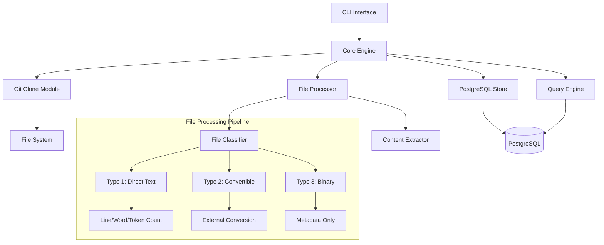

# Design Document

## Overview

This design implements a high-performance Rust-based code ingestion system that transforms GitHub repositories into queryable PostgreSQL databases. The system prioritizes developer velocity by providing instant access to structured codebase data through familiar SQL interfaces.

**Core Architecture Principle**: Stream-first processing with zero-copy optimizations wherever possible, leveraging Rust's ownership model for memory safety and performance.

## Architecture

### System Components



### Data Flow

1. **Ingestion Flow**: CLI → Git Clone → File Discovery → Classification → Content Extraction → PostgreSQL Storage
2. **Query Flow**: CLI → SQL Parser → PostgreSQL Query → Result Formatting → Terminal Output
3. **IDE Integration Flow**: Query → Temp File → Task Generation → Result Storage

## Components and Interfaces

### 1. CLI Interface (`src/cli/mod.rs`)

```rust
use clap::{Parser, Subcommand};
use std::path::PathBuf;

#[derive(Parser)]
#[command(name = "code-ingest")]
#[command(about = "Ingest GitHub repositories into PostgreSQL for fast code analysis")]
pub struct Cli {
    #[command(subcommand)]
    pub command: Commands,
}

#[derive(Subcommand)]
pub enum Commands {
    /// Ingest a GitHub repository
    Ingest {
        /// GitHub repository URL
        repo_url: String,
        /// Local database path
        #[arg(long, default_value = "./analysis")]
        db_path: PathBuf,
        /// GitHub personal access token
        #[arg(long, env = "GITHUB_TOKEN")]
        token: Option<String>,
        /// Local clone path (temporary)
        #[arg(long, default_value = "/tmp/code-ingest")]
        clone_path: PathBuf,
    },
    /// Execute SQL query against ingested data
    Sql {
        /// SQL query to execute
        query: String,
        /// Database path
        #[arg(long, default_value = "./analysis")]
        db_path: PathBuf,
        /// Limit results
        #[arg(long, default_value = "100")]
        limit: usize,
    },
    /// List available ingestion tables
    ListTables {
        #[arg(long, default_value = "./analysis")]
        db_path: PathBuf,
    },
    /// Show sample data from a table
    Sample {
        /// Table name to sample
        #[arg(long)]
        table: String,
        #[arg(long, default_value = "./analysis")]
        db_path: PathBuf,
        #[arg(long, default_value = "5")]
        limit: usize,
    },
    /// Prepare query results for IDE analysis
    QueryPrepare {
        /// SQL query
        query: String,
        #[arg(long, default_value = "./analysis")]
        db_path: PathBuf,
        /// Temporary file for results
        #[arg(long)]
        temp_path: PathBuf,
        /// Tasks file for IDE
        #[arg(long)]
        tasks_file: PathBuf,
        /// Output table name
        #[arg(long)]
        output_table: String,
    },
    /// Store analysis results back to database
    StoreResult {
        #[arg(long, default_value = "./analysis")]
        db_path: PathBuf,
        #[arg(long)]
        output_table: String,
        #[arg(long)]
        result_file: PathBuf,
        #[arg(long)]
        original_query: String,
    },
    /// Start PostgreSQL setup guide
    PgStart,
}
```

### 2. Core Engine (`src/core/mod.rs`)

```rust
use anyhow::Result;
use std::path::Path;
use tokio::sync::mpsc;

pub struct IngestionEngine {
    db_pool: sqlx::PgPool,
    clone_manager: GitCloneManager,
    file_processor: FileProcessor,
    progress_tx: mpsc::Sender<IngestionProgress>,
}

#[derive(Debug)]
pub struct IngestionConfig {
    pub repo_url: String,
    pub local_clone_path: PathBuf,
    pub db_path: PathBuf,
    pub github_token: Option<String>,
    pub max_file_size: usize,
}

#[derive(Debug)]
pub enum IngestionProgress {
    CloneStarted,
    CloneCompleted { files_discovered: usize },
    FileProcessed { path: String, file_type: FileType },
    IngestionCompleted { 
        table_name: String, 
        total_files: usize,
        duration_seconds: u64,
    },
    Error { message: String },
}

impl IngestionEngine {
    pub async fn new(db_path: &Path) -> Result<Self> {
        let db_pool = create_database_pool(db_path).await?;
        ensure_schema_exists(&db_pool).await?;
        
        Ok(Self {
            db_pool,
            clone_manager: GitCloneManager::new(),
            file_processor: FileProcessor::new(),
            progress_tx: create_progress_channel(),
        })
    }
    
    pub async fn ingest_repository(&self, config: IngestionConfig) -> Result<IngestionResult> {
        let ingestion_id = self.start_ingestion_record(&config).await?;
        let table_name = format!("INGEST_{}", chrono::Utc::now().format("%Y%m%d%H%M%S"));
        
        // Create timestamped table
        self.create_ingestion_table(&table_name).await?;
        
        // Clone repository
        self.progress_tx.send(IngestionProgress::CloneStarted).await?;
        let repo_path = self.clone_manager.clone_repo(&config).await?;
        
        // Process files in parallel
        let file_stream = discover_files(&repo_path).await?;
        let processed_files = self.process_files_parallel(file_stream, &table_name).await?;
        
        // Complete ingestion record
        self.complete_ingestion_record(ingestion_id, processed_files.len()).await?;
        
        Ok(IngestionResult {
            table_name,
            files_processed: processed_files.len(),
            ingestion_id,
        })
    }
}
```

### 3. File Classification System (`src/processing/classifier.rs`)

```rust
use std::path::Path;
use std::collections::HashSet;

#[derive(Debug, Clone, PartialEq)]
pub enum FileType {
    DirectText,
    Convertible,
    Binary,
}

#[derive(Debug)]
pub struct FileClassifier {
    direct_text_extensions: HashSet<&'static str>,
    convertible_extensions: HashSet<&'static str>,
}

impl FileClassifier {
    pub fn new() -> Self {
        let direct_text_extensions = [
            "rs", "py", "js", "ts", "md", "txt", "json", "yaml", "yml", "toml",
            "sql", "sh", "bash", "c", "cpp", "cc", "cxx", "h", "hpp", "java",
            "go", "rb", "php", "html", "css", "xml", "dockerfile", "gitignore",
            "env", "ini", "cfg", "conf", "log", "csv", "tsv"
        ].into_iter().collect();
        
        let convertible_extensions = [
            "pdf", "docx", "xlsx", "pptx", "odt", "ods", "odp"
        ].into_iter().collect();
        
        Self {
            direct_text_extensions,
            convertible_extensions,
        }
    }
    
    pub fn classify_file(&self, path: &Path) -> FileType {
        let extension = path.extension()
            .and_then(|ext| ext.to_str())
            .unwrap_or("")
            .to_lowercase();
            
        if self.direct_text_extensions.contains(extension.as_str()) {
            FileType::DirectText
        } else if self.convertible_extensions.contains(extension.as_str()) {
            FileType::Convertible
        } else {
            FileType::Binary
        }
    }
}

#[derive(Debug)]
pub struct FileMetadata {
    pub path: PathBuf,
    pub filename: String,
    pub extension: Option<String>,
    pub size_bytes: u64,
    pub file_type: FileType,
}

#[derive(Debug)]
pub struct ProcessedFile {
    pub metadata: FileMetadata,
    pub content: Option<String>,
    pub line_count: Option<u32>,
    pub word_count: Option<u32>,
    pub token_count: Option<u32>,
    pub conversion_command: Option<String>,
}
```

### 4. Content Extraction Pipeline (`src/processing/extractor.rs`)

```rust
use tokio::fs;
use tokio::process::Command;
use anyhow::{Result, Context};

pub struct ContentExtractor {
    token_counter: TokenCounter,
}

impl ContentExtractor {
    pub async fn extract_content(&self, metadata: FileMetadata) -> Result<ProcessedFile> {
        match metadata.file_type {
            FileType::DirectText => self.extract_direct_text(metadata).await,
            FileType::Convertible => self.extract_convertible(metadata).await,
            FileType::Binary => self.extract_binary_metadata(metadata).await,
        }
    }
    
    async fn extract_direct_text(&self, metadata: FileMetadata) -> Result<ProcessedFile> {
        let content = fs::read_to_string(&metadata.path).await
            .with_context(|| format!("Failed to read file: {:?}", metadata.path))?;
            
        let line_count = content.lines().count() as u32;
        let word_count = content.split_whitespace().count() as u32;
        let token_count = self.token_counter.count_tokens(&content)?;
        
        Ok(ProcessedFile {
            metadata,
            content: Some(content),
            line_count: Some(line_count),
            word_count: Some(word_count),
            token_count: Some(token_count),
            conversion_command: None,
        })
    }
    
    async fn extract_convertible(&self, metadata: FileMetadata) -> Result<ProcessedFile> {
        let conversion_result = match metadata.extension.as_deref() {
            Some("pdf") => self.convert_pdf(&metadata.path).await?,
            Some("docx") => self.convert_docx(&metadata.path).await?,
            Some("xlsx") => self.convert_xlsx(&metadata.path).await?,
            _ => return self.extract_binary_metadata(metadata).await,
        };
        
        let line_count = conversion_result.content.lines().count() as u32;
        let word_count = conversion_result.content.split_whitespace().count() as u32;
        let token_count = self.token_counter.count_tokens(&conversion_result.content)?;
        
        Ok(ProcessedFile {
            metadata,
            content: Some(conversion_result.content),
            line_count: Some(line_count),
            word_count: Some(word_count),
            token_count: Some(token_count),
            conversion_command: Some(conversion_result.command),
        })
    }
    
    async fn convert_pdf(&self, path: &Path) -> Result<ConversionResult> {
        let output = Command::new("pdftotext")
            .arg(path)
            .arg("-")
            .output()
            .await
            .context("Failed to execute pdftotext")?;
            
        if !output.status.success() {
            anyhow::bail!("pdftotext failed: {}", String::from_utf8_lossy(&output.stderr));
        }
        
        Ok(ConversionResult {
            content: String::from_utf8_lossy(&output.stdout).to_string(),
            command: format!("pdftotext {} -", path.display()),
        })
    }
}

#[derive(Debug)]
struct ConversionResult {
    content: String,
    command: String,
}

pub struct TokenCounter {
    // Using tiktoken-rs or similar for token counting
}

impl TokenCounter {
    pub fn count_tokens(&self, text: &str) -> Result<u32> {
        // Implementation using tiktoken-rs
        // For MVP, could use simple word count * 1.3 approximation
        Ok((text.split_whitespace().count() as f32 * 1.3) as u32)
    }
}
```

## Data Models

### PostgreSQL Schema

```sql
-- Metadata table for tracking ingestions
CREATE TABLE IF NOT EXISTS ingestion_meta (
    ingestion_id BIGSERIAL PRIMARY KEY,
    repo_url VARCHAR NOT NULL,
    local_path VARCHAR NOT NULL,
    start_timestamp_unix BIGINT NOT NULL,
    end_timestamp_unix BIGINT,
    table_name VARCHAR NOT NULL,
    total_files_processed INTEGER,
    created_at TIMESTAMP DEFAULT NOW()
);

-- Template for timestamped ingestion tables
CREATE TABLE IF NOT EXISTS INGEST_TEMPLATE (
    file_id BIGSERIAL PRIMARY KEY,
    ingestion_id BIGINT REFERENCES ingestion_meta(ingestion_id),
    filepath VARCHAR NOT NULL,
    filename VARCHAR NOT NULL,
    extension VARCHAR,
    file_size_bytes BIGINT NOT NULL,
    line_count INTEGER,
    word_count INTEGER,
    token_count INTEGER,
    content_text TEXT,
    file_type VARCHAR NOT NULL CHECK (file_type IN ('direct_text', 'convertible', 'binary')),
    conversion_command VARCHAR,
    relative_path VARCHAR NOT NULL,
    absolute_path VARCHAR NOT NULL,
    created_at TIMESTAMP DEFAULT NOW()
);

-- Full-text search index on content
CREATE INDEX IF NOT EXISTS idx_content_fts ON INGEST_TEMPLATE USING gin(to_tsvector('english', content_text));

-- Query result tables for IDE integration
CREATE TABLE IF NOT EXISTS QUERYRESULT_TEMPLATE (
    result_id BIGSERIAL PRIMARY KEY,
    original_query TEXT NOT NULL,
    query_timestamp TIMESTAMP DEFAULT NOW(),
    result_data JSONB,
    analysis_tasks TEXT,
    final_insights TEXT,
    created_at TIMESTAMP DEFAULT NOW()
);
```

### Rust Data Models

```rust
use serde::{Deserialize, Serialize};
use sqlx::FromRow;
use chrono::{DateTime, Utc};

#[derive(Debug, FromRow, Serialize, Deserialize)]
pub struct IngestionMeta {
    pub ingestion_id: i64,
    pub repo_url: String,
    pub local_path: String,
    pub start_timestamp_unix: i64,
    pub end_timestamp_unix: Option<i64>,
    pub table_name: String,
    pub total_files_processed: Option<i32>,
    pub created_at: DateTime<Utc>,
}

#[derive(Debug, FromRow, Serialize, Deserialize)]
pub struct IngestedFile {
    pub file_id: i64,
    pub ingestion_id: i64,
    pub filepath: String,
    pub filename: String,
    pub extension: Option<String>,
    pub file_size_bytes: i64,
    pub line_count: Option<i32>,
    pub word_count: Option<i32>,
    pub token_count: Option<i32>,
    pub content_text: Option<String>,
    pub file_type: String,
    pub conversion_command: Option<String>,
    pub relative_path: String,
    pub absolute_path: String,
    pub created_at: DateTime<Utc>,
}

#[derive(Debug, Serialize, Deserialize)]
pub struct QueryResult {
    pub result_id: i64,
    pub original_query: String,
    pub query_timestamp: DateTime<Utc>,
    pub result_data: serde_json::Value,
    pub analysis_tasks: Option<String>,
    pub final_insights: Option<String>,
    pub created_at: DateTime<Utc>,
}
```

## Error Handling

### Error Hierarchy

```rust
use thiserror::Error;

#[derive(Error, Debug)]
pub enum CodeIngestError {
    #[error("Git operation failed: {0}")]
    Git(#[from] git2::Error),
    
    #[error("Database error: {0}")]
    Database(#[from] sqlx::Error),
    
    #[error("File system error: {0}")]
    FileSystem(#[from] std::io::Error),
    
    #[error("File processing error: {file_path} - {cause}")]
    FileProcessing { file_path: String, cause: String },
    
    #[error("Conversion failed: {tool} - {message}")]
    ConversionFailed { tool: String, message: String },
    
    #[error("Configuration error: {0}")]
    Configuration(String),
    
    #[error("GitHub authentication failed: {0}")]
    Authentication(String),
    
    #[error("Repository not found or inaccessible: {url}")]
    RepositoryNotFound { url: String },
    
    #[error("PostgreSQL connection failed: {message}")]
    DatabaseConnection { message: String },
}

pub type Result<T> = std::result::Result<T, CodeIngestError>;
```

## Testing Strategy

### Unit Tests
- File classification accuracy (100% for known extensions)
- Content extraction correctness
- Token counting precision (within 5% of tiktoken)
- SQL query generation and execution

### Integration Tests
- End-to-end ingestion workflow
- PostgreSQL schema creation and migration
- Git clone with authentication
- File conversion pipeline

### Performance Tests
- Ingestion speed: >100 files/second for text files
- Query response time: <1 second for 10,000 file repositories
- Memory usage: Constant regardless of repository size
- Concurrent ingestion handling

### Test Plan for Each Interface

```rust
#[cfg(test)]
mod tests {
    use super::*;
    
    #[tokio::test]
    async fn test_file_classification_accuracy() {
        let classifier = FileClassifier::new();
        
        assert_eq!(classifier.classify_file(Path::new("main.rs")), FileType::DirectText);
        assert_eq!(classifier.classify_file(Path::new("doc.pdf")), FileType::Convertible);
        assert_eq!(classifier.classify_file(Path::new("image.jpg")), FileType::Binary);
    }
    
    #[tokio::test]
    async fn test_ingestion_performance_contract() {
        let engine = IngestionEngine::new(Path::new("./test_db")).await.unwrap();
        let start = std::time::Instant::now();
        
        let result = engine.ingest_repository(create_test_config()).await.unwrap();
        let duration = start.elapsed();
        
        // Performance contract: <2 minutes for 100MB repo
        assert!(duration.as_secs() < 120);
        assert!(result.files_processed > 0);
    }
    
    #[tokio::test]
    async fn test_query_response_time_contract() {
        let engine = setup_test_engine_with_data().await;
        let start = std::time::Instant::now();
        
        let results = engine.execute_sql_query(
            "SELECT filepath FROM INGEST_TEST WHERE content_text LIKE '%function%'"
        ).await.unwrap();
        
        let duration = start.elapsed();
        
        // Performance contract: <1 second query response
        assert!(duration.as_millis() < 1000);
        assert!(!results.is_empty());
    }
}
```

This design provides a solid foundation for implementing the Shreyas-level requirements with clear interfaces, performance contracts, and comprehensive error handling.