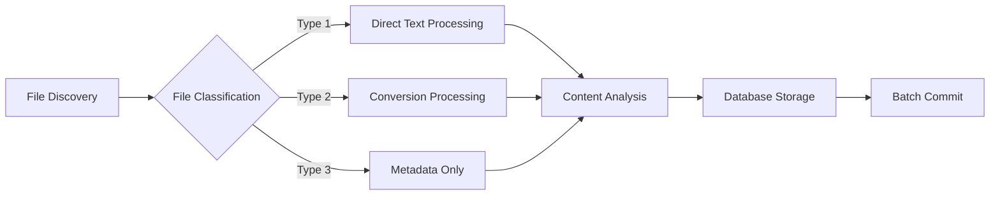

# Design Document

## Overview

The S03-ingest-code-to-pgdb system is a Rust-based code ingestion and analysis platform that transforms GitHub repositories and local codebases into searchable PostgreSQL databases. The system enables developers to systematically analyze large codebases using structured LLM workflows through IDE integration.

## Architecture

### High-Level Architecture

```mermaid
graph TB
    subgraph "Input Sources"
        A[GitHub Repository URL]
        B[Local Folder Path]
    end
    
    subgraph "Core System"
        C[CLI Interface]
        D[Ingestion Engine]
        E[File Processor]
        F[Query Engine]
        G[Task Generator]
    end
    
    subgraph "Storage Layer"
        H[(PostgreSQL Database)]
        I[INGEST_* Tables]
        J[QUERYRESULT_* Tables]
        K[ingestion_meta Table]
    end
    
    subgraph "Output Layer"
        L[Temporary Files]
        M[Task Markdown Files]
        N[Individual MD Files]
    end
    
    subgraph "IDE Integration"
        O[Kiro IDE]
        P[Task Execution]
        Q[LLM Analysis]
    end
    
    A --> C
    B --> C
    C --> D
    D --> E
    E --> H
    H --> I
    H --> K
    C --> F
    F --> H
    F --> L
    C --> G
    G --> M
    H --> J
    L --> O
    M --> O
    O --> P
    P --> Q
    Q --> N
    N --> C
###
 System Components

#### 1. CLI Interface (`cli.rs`)
- **Purpose**: Primary user interaction point
- **Responsibilities**:
  - Command parsing and validation
  - Database path management
  - Progress reporting
  - Error handling and user feedback
- **Key Commands**:
  - `code-ingest <url|path> --db-path <path>`
  - `code-ingest query-prepare --sql "..." --temp-path <path> --tasks-file <path> --output-table <name>`
  - `code-ingest generate-tasks --sql "..." --tasks-file <path> --output-table <name>`
  - `code-ingest print-to-md --table <name> --sql "..." --prefix <name> --location <path>`
  - `code-ingest list-tables --db-path <path>`

#### 2. Ingestion Engine (`ingestion/mod.rs`)
- **Purpose**: Handles repository cloning and local folder processing
- **Responsibilities**:
  - Git repository cloning with progress tracking
  - Local folder traversal and file discovery
  - File classification (Type 1, 2, 3)
  - Batch processing coordination
- **Key Modules**:
  - `git_cloner.rs` - GitHub repository cloning
  - `folder_processor.rs` - Local folder processing
  - `file_classifier.rs` - Three-type file classification

#### 3. File Processor (`processing/mod.rs`)
- **Purpose**: Processes files based on their classification
- **Responsibilities**:
  - Type 1: Direct text file reading
  - Type 2: Text conversion via external commands
  - Type 3: Metadata extraction only
  - Content analysis (line count, word count, token estimation)
- **Key Modules**:
  - `text_processor.rs` - Direct text file handling
  - `converter.rs` - External command execution for Type 2 files
  - `metadata_extractor.rs` - File metadata collection

#### 4. Database Layer (`database/mod.rs`)
- **Purpose**: PostgreSQL interaction and schema management
- **Responsibilities**:
  - Connection management
  - Table creation and management
  - Batch insertions for performance
  - Query execution and result formatting
- **Key Modules**:
  - `connection.rs` - Database connection handling
  - `schema.rs` - Table creation and migration
  - `operations.rs` - CRUD operations
  - `query_formatter.rs` - Result formatting for LLM consumption

#### 5. Task Generator (`tasks/mod.rs`)
- **Purpose**: Creates structured task markdown for IDE integration
- **Responsibilities**:
  - Query result analysis
  - 7-part task division algorithm
  - Kiro-compatible numbering (1., 1.1, 1.2, etc.)
  - Markdown generation with proper formatting
- **Key Modules**:
  - `task_divider.rs` - Mathematical division into 7 groups
  - `markdown_generator.rs` - Structured markdown creation
  - `chunk_analyzer.rs` - File chunking with overlap

## Components and Interfaces

### Core Traits

```rust
/// Main ingestion trait for different source types
pub trait SourceIngester {
    async fn ingest(&self, source: &str, db_path: &Path) -> Result<IngestionResult, IngestionError>;
    async fn validate_source(&self, source: &str) -> Result<(), ValidationError>;
}

/// File processing trait for different file types
pub trait FileProcessor {
    fn can_process(&self, file_path: &Path) -> bool;
    async fn process(&self, file_path: &Path) -> Result<ProcessedFile, ProcessingError>;
    fn get_file_type(&self) -> FileType;
}

/// Database operations trait
pub trait DatabaseOperations {
    async fn create_ingestion_table(&self, timestamp: &str) -> Result<String, DatabaseError>;
    async fn insert_files_batch(&self, table_name: &str, files: Vec<ProcessedFile>) -> Result<(), DatabaseError>;
    async fn execute_query(&self, sql: &str) -> Result<QueryResult, DatabaseError>;
    async fn store_analysis_result(&self, table_name: &str, result: AnalysisResult) -> Result<(), DatabaseError>;
}

/// Task generation trait
pub trait TaskGenerator {
    async fn generate_tasks(&self, query_result: &QueryResult, config: &TaskConfig) -> Result<TaskStructure, TaskError>;
    fn divide_into_groups(&self, tasks: Vec<Task>, group_count: usize) -> Vec<TaskGroup>;
}
```

### Data Models

```rust
#[derive(Debug, Clone, Serialize, Deserialize)]
pub struct ProcessedFile {
    pub filepath: String,
    pub filename: String,
    pub extension: String,
    pub file_size_bytes: i64,
    pub line_count: Option<i32>,
    pub word_count: Option<i32>,
    pub token_count: Option<i32>,
    pub content_text: Option<String>,
    pub file_type: FileType,
    pub conversion_command: Option<String>,
    pub relative_path: String,
    pub absolute_path: String,
}

#[derive(Debug, Clone)]
pub enum FileType {
    DirectText,
    Convertible,
    NonText,
}

#[derive(Debug, Clone)]
pub struct IngestionResult {
    pub table_name: String,
    pub files_processed: i32,
    pub ingestion_id: i64,
    pub duration: Duration,
}

#[derive(Debug, Clone)]
pub struct TaskStructure {
    pub groups: Vec<TaskGroup>,
    pub total_tasks: usize,
    pub metadata: TaskMetadata,
}

#[derive(Debug, Clone)]
pub struct TaskGroup {
    pub id: usize,
    pub title: String,
    pub tasks: Vec<Task>,
}

#[derive(Debug, Clone)]
pub struct Task {
    pub id: String,
    pub description: String,
    pub file_path: Option<String>,
    pub chunk_info: Option<ChunkInfo>,
}

#[derive(Debug, Clone)]
pub struct ChunkInfo {
    pub start_line: i32,
    pub end_line: i32,
    pub chunk_number: i32,
}
```

## Data Models

### Database Schema Implementation

#### INGEST_* Tables
```sql
CREATE TABLE INGEST_20250927143022 (
    file_id BIGSERIAL PRIMARY KEY,
    ingestion_id BIGINT NOT NULL REFERENCES ingestion_meta(ingestion_id),
    filepath VARCHAR NOT NULL,
    filename VARCHAR NOT NULL,
    extension VARCHAR,
    file_size_bytes BIGINT NOT NULL,
    line_count INTEGER,
    word_count INTEGER,
    token_count INTEGER,
    content_text TEXT,
    file_type VARCHAR NOT NULL CHECK (file_type IN ('direct_text', 'convertible', 'non_text')),
    conversion_command VARCHAR,
    relative_path VARCHAR NOT NULL,
    absolute_path VARCHAR NOT NULL,
    created_at TIMESTAMP DEFAULT NOW()
);

-- Indexes for performance
CREATE INDEX idx_ingest_filepath ON INGEST_20250927143022(filepath);
CREATE INDEX idx_ingest_extension ON INGEST_20250927143022(extension);
CREATE INDEX idx_ingest_file_type ON INGEST_20250927143022(file_type);
CREATE INDEX idx_ingest_content_text ON INGEST_20250927143022 USING gin(to_tsvector('english', content_text));
```

#### QUERYRESULT_* Tables
```sql
CREATE TABLE QUERYRESULT_auth_analysis (
    analysis_id BIGSERIAL PRIMARY KEY,
    sql_query TEXT NOT NULL,
    prompt_file_path VARCHAR,
    llm_result TEXT NOT NULL,
    created_at TIMESTAMP DEFAULT NOW()
);

-- Index for searching analysis results
CREATE INDEX idx_queryresult_created_at ON QUERYRESULT_auth_analysis(created_at);
CREATE INDEX idx_queryresult_prompt ON QUERYRESULT_auth_analysis(prompt_file_path);
```

#### Metadata Table
```sql
CREATE TABLE ingestion_meta (
    ingestion_id BIGSERIAL PRIMARY KEY,
    repo_url VARCHAR,
    local_path VARCHAR NOT NULL,
    start_timestamp_unix BIGINT NOT NULL,
    end_timestamp_unix BIGINT,
    table_name VARCHAR NOT NULL,
    total_files_processed INTEGER,
    created_at TIMESTAMP DEFAULT NOW()
);

CREATE INDEX idx_ingestion_meta_table_name ON ingestion_meta(table_name);
CREATE INDEX idx_ingestion_meta_repo_url ON ingestion_meta(repo_url);
```

### File Processing Pipeline



## Error Handling

### Error Hierarchy

```rust
#[derive(Error, Debug)]
pub enum SystemError {
    #[error("Ingestion error: {0}")]
    Ingestion(#[from] IngestionError),
    
    #[error("Database error: {0}")]
    Database(#[from] DatabaseError),
    
    #[error("Processing error: {0}")]
    Processing(#[from] ProcessingError),
    
    #[error("Task generation error: {0}")]
    TaskGeneration(#[from] TaskError),
    
    #[error("IO error: {0}")]
    Io(#[from] std::io::Error),
}

#[derive(Error, Debug)]
pub enum IngestionError {
    #[error("Git clone failed: {repo_url} - {cause}")]
    GitCloneFailed { repo_url: String, cause: String },
    
    #[error("Local path not found: {path}")]
    LocalPathNotFound { path: String },
    
    #[error("Permission denied: {path}")]
    PermissionDenied { path: String },
    
    #[error("Repository too large: {size_mb}MB exceeds limit")]
    RepositoryTooLarge { size_mb: u64 },
}

#[derive(Error, Debug)]
pub enum DatabaseError {
    #[error("Connection failed: {url} - {cause}")]
    ConnectionFailed { url: String, cause: String },
    
    #[error("Table creation failed: {table_name} - {cause}")]
    TableCreationFailed { table_name: String, cause: String },
    
    #[error("Query execution failed: {query} - {cause}")]
    QueryFailed { query: String, cause: String },
    
    #[error("Transaction failed: {cause}")]
    TransactionFailed { cause: String },
}
```

## Testing Strategy

### Unit Testing Approach

```rust
#[cfg(test)]
mod tests {
    use super::*;
    use tempfile::TempDir;
    use tokio_test;

    #[tokio::test]
    async fn test_file_classification() {
        let classifier = FileClassifier::new();
        
        // Test Type 1 (Direct Text)
        assert_eq!(classifier.classify_file("test.rs"), FileType::DirectText);
        assert_eq!(classifier.classify_file("README.md"), FileType::DirectText);
        
        // Test Type 2 (Convertible)
        assert_eq!(classifier.classify_file("doc.pdf"), FileType::Convertible);
        assert_eq!(classifier.classify_file("sheet.xlsx"), FileType::Convertible);
        
        // Test Type 3 (Non-Text)
        assert_eq!(classifier.classify_file("image.jpg"), FileType::NonText);
        assert_eq!(classifier.classify_file("binary.exe"), FileType::NonText);
    }

    #[tokio::test]
    async fn test_task_division() {
        let generator = TaskGenerator::new();
        let tasks = create_test_tasks(35); // 35 test tasks
        
        let groups = generator.divide_into_groups(tasks, 7);
        
        assert_eq!(groups.len(), 7);
        assert_eq!(groups[0].tasks.len(), 5); // 35 ÷ 7 = 5 tasks per group
        assert_eq!(groups[6].tasks.len(), 5);
    }

    #[tokio::test]
    async fn test_database_operations() {
        let temp_dir = TempDir::new().unwrap();
        let db = create_test_database(&temp_dir).await;
        
        // Test table creation
        let table_name = db.create_ingestion_table("20250927143022").await.unwrap();
        assert_eq!(table_name, "INGEST_20250927143022");
        
        // Test file insertion
        let files = create_test_files(10);
        db.insert_files_batch(&table_name, files).await.unwrap();
        
        // Test query execution
        let result = db.execute_query(&format!("SELECT COUNT(*) FROM {}", table_name)).await.unwrap();
        assert_eq!(result.row_count, 10);
    }
}
```

### Integration Testing

```rust
#[tokio::test]
async fn test_end_to_end_ingestion() {
    let temp_dir = TempDir::new().unwrap();
    let db_path = temp_dir.path().join("test.db");
    
    // Create test repository structure
    let repo_dir = create_test_repo(&temp_dir);
    
    // Run ingestion
    let result = ingest_local_folder(repo_dir.path(), &db_path).await.unwrap();
    
    // Verify results
    assert!(result.files_processed > 0);
    assert!(result.table_name.starts_with("INGEST_"));
    
    // Verify database content
    let db = Database::connect(&db_path).await.unwrap();
    let query_result = db.execute_query(&format!(
        "SELECT COUNT(*) FROM {}", 
        result.table_name
    )).await.unwrap();
    
    assert_eq!(query_result.row_count, result.files_processed as usize);
}

#[tokio::test]
async fn test_task_generation_workflow() {
    let temp_dir = TempDir::new().unwrap();
    let db_path = temp_dir.path().join("test.db");
    let tasks_file = temp_dir.path().join("tasks.md");
    
    // Setup test data
    setup_test_ingestion(&db_path).await;
    
    // Generate tasks
    let config = TaskConfig {
        sql_query: "SELECT * FROM INGEST_20250927143022".to_string(),
        output_table: "QUERYRESULT_test".to_string(),
        tasks_file: tasks_file.clone(),
        group_count: 7,
    };
    
    let task_structure = generate_tasks(&db_path, &config).await.unwrap();
    
    // Verify task structure
    assert_eq!(task_structure.groups.len(), 7);
    assert!(tasks_file.exists());
    
    // Verify markdown format
    let content = std::fs::read_to_string(&tasks_file).unwrap();
    assert!(content.contains("- [ ] 1. Task Group 1"));
    assert!(content.contains("- [ ] 1.1"));
}
```

### Performance Testing

```rust
#[tokio::test]
async fn test_large_repository_performance() {
    let temp_dir = TempDir::new().unwrap();
    let db_path = temp_dir.path().join("perf_test.db");
    
    // Create large test repository (1000 files)
    let repo_dir = create_large_test_repo(&temp_dir, 1000);
    
    let start = Instant::now();
    let result = ingest_local_folder(repo_dir.path(), &db_path).await.unwrap();
    let duration = start.elapsed();
    
    // Performance assertions
    assert!(duration < Duration::from_secs(30)); // Should complete within 30 seconds
    assert_eq!(result.files_processed, 1000);
    
    // Memory usage should be reasonable
    let memory_usage = get_current_memory_usage();
    assert!(memory_usage < 500_000_000); // Less than 500MB
}

#[tokio::test]
async fn test_concurrent_operations() {
    let temp_dir = TempDir::new().unwrap();
    let db_path = temp_dir.path().join("concurrent_test.db");
    
    // Setup database
    let db = Database::connect(&db_path).await.unwrap();
    db.create_ingestion_table("20250927143022").await.unwrap();
    
    // Run concurrent operations
    let mut handles = vec![];
    for i in 0..10 {
        let db_clone = db.clone();
        let handle = tokio::spawn(async move {
            let files = create_test_files(100);
            db_clone.insert_files_batch("INGEST_20250927143022", files).await
        });
        handles.push(handle);
    }
    
    // Wait for all operations to complete
    for handle in handles {
        handle.await.unwrap().unwrap();
    }
    
    // Verify final count
    let result = db.execute_query("SELECT COUNT(*) FROM INGEST_20250927143022").await.unwrap();
    assert_eq!(result.row_count, 1000); // 10 * 100 files
}
```

This design provides a comprehensive foundation for implementing the code ingestion system with proper separation of concerns, robust error handling, and thorough testing coverage.