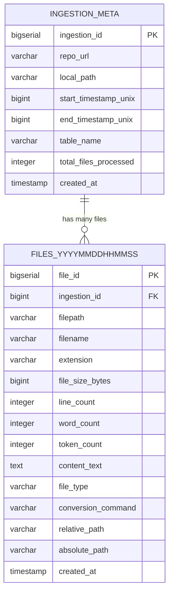

# Requirements Document

## Introduction

This feature implements a code ingestion system that clones GitHub repositories and stores their content in a PostgreSQL database for efficient querying and analysis. The system will enable developers to ingest entire codebases, search through code semantically, and retrieve relevant code snippets for LLM-assisted development.

The system draws inspiration from GitIngest but focuses on persistent storage in PostgreSQL rather than one-time text generation, enabling incremental updates, version tracking, and advanced querying capabilities.

## Requirements

### Requirement 1: Repository Cloning and Local Storage

**User Story:** As a developer, I want to ingest code from GitHub repositories to a user-specified local folder, so that I can have persistent access to the codebase for analysis.

#### Acceptance Criteria

1. WHEN I provide a GitHub repository URL and local folder path THEN the system SHALL clone the repository to that specified location
2. WHEN I provide a GitHub Personal Access Token THEN the system SHALL authenticate and access private repositories
3. WHEN I specify a branch, tag, or commit hash THEN the system SHALL checkout that specific reference
4. WHEN the local folder already exists THEN the system SHALL either update the existing clone or create a new timestamped subdirectory
5. IF the repository does not exist or is inaccessible THEN the system SHALL return a clear error message

### Requirement 2: File System Processing and Three-Type Classification

**User Story:** As a developer, I want the system to intelligently process repository files and classify them into three distinct types, so that appropriate processing is applied to each file category.

#### Acceptance Criteria

1. WHEN processing a repository THEN the system SHALL recursively traverse all directories
2. WHEN encountering files THEN the system SHALL classify them into three types:
   - **Type 1 (Direct Text)**: Files that are already text-based (.md, .txt, .py, .js, .rs, .java, .c, .cpp, .h, .json, .yaml, .xml, .html, .css, .sql, .sh, etc.)
   - **Type 2 (Convertible to Text)**: Files that can be converted to text via terminal commands (.pdf, .docx, .xlsx, .pptx, .odt, etc.)
   - **Type 3 (Non-Text Relevant)**: Files that cannot be meaningfully converted to text (.jpg, .png, .gif, .mp4, .zip, .exe, .bin, etc.)
3. WHEN encountering .gitignore files THEN the system SHALL respect ignore patterns by default
4. WHEN I provide custom include/exclude patterns THEN the system SHALL apply those filters
5. WHEN a file exceeds the maximum size limit THEN the system SHALL skip that file and log the decision
6. WHEN processing symlinks THEN the system SHALL handle them safely without infinite loops

### Requirement 3: PostgreSQL Storage Schema with Three-Type Processing

**User Story:** As a developer, I want code content stored in a structured PostgreSQL database with timestamped tables and proper handling of all three file types, so that I can track ingestion history and query file-level metrics.

#### Acceptance Criteria

1. WHEN starting an ingestion query THEN the system SHALL create a timestamped table in format `files_YYYYMMDDHHMMSS`
2. WHEN processing Type 1 files (direct text) THEN the system SHALL store: filepath, filename, extension, file_size_bytes, line_count, word_count, token_count, content_text, file_type='direct_text'
3. WHEN processing Type 2 files (convertible) THEN the system SHALL store: filepath, filename, extension, file_size_bytes, line_count, word_count, token_count, content_text, conversion_command, file_type='convertible'
4. WHEN processing Type 3 files (non-text) THEN the system SHALL store: filepath, filename, extension, file_size_bytes, NULL for text metrics, file_type='non_text'
5. WHEN a query (GitHub repo ingestion) starts THEN the system SHALL record in `ingestion_meta` table: ingestion_id, repo_url, local_path, start_timestamp_unix, table_name
6. WHEN the ingestion ends THEN the system SHALL update the `ingestion_meta` record with end_timestamp_unix and total_files_processed
7. WHEN storing all files THEN the system SHALL include common fields: created_at, ingestion_id (foreign key), relative_path, absolute_path

### Database Schema ER Diagram

### Requirement 4: Content Indexing and Search

**User Story:** As a developer, I want to search through ingested code efficiently, so that I can find relevant code snippets and understand codebase structure.

#### Acceptance Criteria

1. WHEN content is stored THEN the system SHALL create full-text search indexes on file content
2. WHEN I search for code patterns THEN the system SHALL return ranked results with file paths and line numbers
3. WHEN searching across multiple repositories THEN the system SHALL support repository-scoped queries
4. WHEN retrieving search results THEN the system SHALL include sufficient context around matches
5. WHEN querying by file type or path patterns THEN the system SHALL support structured metadata queries

### Requirement 5: Incremental Updates

**User Story:** As a developer, I want to update previously ingested repositories efficiently, so that I can keep my code database current without re-processing unchanged files.

#### Acceptance Criteria

1. WHEN re-ingesting a repository THEN the system SHALL detect which files have changed since last ingestion
2. WHEN files are unchanged THEN the system SHALL skip re-processing those files
3. WHEN files are deleted from the repository THEN the system SHALL mark them as deleted in the database
4. WHEN new files are added THEN the system SHALL process and store only the new files
5. WHEN tracking changes THEN the system SHALL maintain a history of file modifications

### Requirement 6: API and CLI Interface

**User Story:** As a developer, I want both programmatic and command-line interfaces, so that I can integrate the system into various workflows.

#### Acceptance Criteria

1. WHEN using the CLI THEN the system SHALL provide commands for ingesting, searching, and managing repositories
2. WHEN using the API THEN the system SHALL expose REST endpoints for all major operations
3. WHEN operations are long-running THEN the system SHALL provide progress feedback and status updates
4. WHEN errors occur THEN the system SHALL return structured error responses with actionable messages
5. WHEN querying results THEN the system SHALL support pagination and result limiting

### Requirement 7: Performance and Scalability

**User Story:** As a developer, I want the system to handle large repositories and multiple concurrent operations efficiently, so that it scales with my team's needs.

#### Acceptance Criteria

1. WHEN ingesting large repositories THEN the system SHALL complete processing within reasonable time limits
2. WHEN multiple users access the system THEN the system SHALL handle concurrent operations safely
3. WHEN storing large amounts of content THEN the system SHALL optimize database storage and query performance
4. WHEN memory usage grows THEN the system SHALL implement proper cleanup and resource management
5. WHEN processing fails THEN the system SHALL provide retry mechanisms and graceful degradation

### Requirement 8: Configuration and Extensibility

**User Story:** As a developer, I want to configure the system for different use cases and extend it with custom processing logic, so that it adapts to various project needs.

#### Acceptance Criteria

1. WHEN deploying the system THEN the system SHALL support configuration via environment variables and config files
2. WHEN processing different file types THEN the system SHALL allow custom file type handlers
3. WHEN integrating with different databases THEN the system SHALL support configurable connection parameters
4. WHEN extending functionality THEN the system SHALL provide plugin interfaces for custom processors
5. WHEN monitoring the system THEN the system SHALL expose metrics and health check endpoints