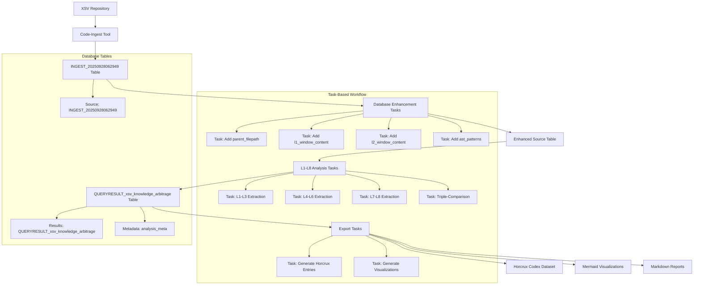
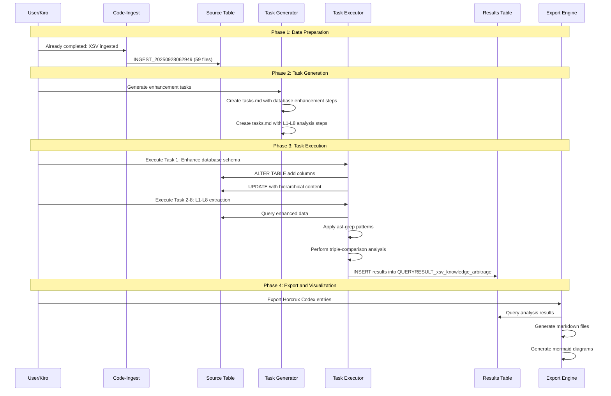

# Design Document

# SPEC CLASSIFICATION : Analysis Spec
This is an analysis only Spec - we will be using tools and scripts but will not be making enhancements


## Overview

The S04 Knowledge Arbitrage system implements a revolutionary multi-scale context window approach to extract L1-L8 insights from the burnt-sushi/xsv codebase. This system transforms traditional file-by-file analysis into hierarchical knowledge extraction that mirrors how expert programmers understand code architecture.

The design leverages our existing code-ingest infrastructure, enhances it with semantic search capabilities via ast-grep, and implements a triple-comparison analysis framework to systematically extract decades of engineering wisdom for The Horcrux Codex.

## Architecture

### System Overview



### Task-Based Data Flow Architecture



## Components and Interfaces

### 1. Database Enhancement Module

**Purpose**: Transform flat file storage into hierarchical context-aware database

**Interface**:
```rust
pub trait DatabaseEnhancer {
    async fn add_parent_filepath_column(&self) -> Result<()>;
    async fn populate_l1_window_content(&self) -> Result<()>;
    async fn populate_l2_window_content(&self) -> Result<()>;
    async fn add_ast_patterns_column(&self) -> Result<()>;
    async fn verify_enhancement_integrity(&self) -> Result<EnhancementReport>;
}
```

**Implementation Strategy**:
- Simple path logic: go back by 1 slash for parent_filepath
- Window functions for content aggregation
- Deterministic ordering: `ORDER BY parent_filepath, filepath`
- Analytics-first design accepting redundancy

### 2. Semantic Search Integration

**Purpose**: Replace text-based grep with AST-aware pattern matching

**Interface**:
```rust
pub trait SemanticSearcher {
    async fn extract_patterns(&self, pattern: &str, language: &str) -> Result<Vec<AstMatch>>;
    async fn find_optimization_patterns(&self) -> Result<OptimizationReport>;
    async fn extract_architectural_patterns(&self) -> Result<ArchitectureReport>;
    async fn identify_language_limitations(&self) -> Result<LanguageLimitationReport>;
}
```

**Key Patterns for XSV**:
```bash
# L1 Micro-optimizations
ast-grep run -p 'unsafe { $$$ }' -l rust
ast-grep run -p 'Vec::with_capacity($CAP)' -l rust
ast-grep run -p 'BufReader::new($READER)' -l rust

# L2 Design patterns
ast-grep run -p 'impl<$GENERICS> $TRAIT for $TYPE { $$$ }' -l rust
ast-grep run -p 'Result<$OK, $ERR>' -l rust

# L3 Micro-library opportunities
ast-grep run -p 'pub struct $NAME { $$$ }' -l rust
ast-grep run -p 'pub fn $NAME($ARGS) -> $RET' -l rust
```

### 3. Triple-Comparison Analysis Engine

**Purpose**: Systematic multi-scale pattern recognition

**Interface**:
```rust
pub trait TripleComparator {
    async fn compare_individual_vs_module(&self, file_id: i64) -> Result<ComparisonInsights>;
    async fn compare_individual_vs_system(&self, file_id: i64) -> Result<ComparisonInsights>;
    async fn compare_module_vs_system(&self, parent_path: &str) -> Result<ComparisonInsights>;
    async fn generate_scaling_analysis(&self) -> Result<ScalingReport>;
}
```

**Analysis Framework**:
1. **Individual vs L1**: How file patterns compose within modules
2. **Individual vs L2**: How file patterns relate to system architecture  
3. **L1 vs L2**: How module patterns scale to system-wide principles

### 4. L1-L8 Extraction Engine with Performance Contracts

**Purpose**: Systematic knowledge arbitrage across all extraction levels with measurable performance contracts

**Interface**:
```rust
pub trait KnowledgeExtractor {
    // Tactical Implementation (L1-L3) - Requirement 1
    async fn extract_micro_optimizations(&self, context: &MultiScaleContext) -> Result<L1Report>;
    async fn extract_design_patterns(&self, context: &MultiScaleContext) -> Result<L2Report>;
    async fn identify_micro_libraries(&self, context: &MultiScaleContext) -> Result<L3Report>;
    
    // Strategic Architecture (L4-L6) - Requirement 2
    async fn identify_macro_opportunities(&self, context: &MultiScaleContext) -> Result<L4Report>;
    async fn analyze_architecture_decisions(&self, context: &MultiScaleContext) -> Result<L5Report>;
    async fn examine_hardware_interaction(&self, context: &MultiScaleContext) -> Result<L6Report>;
    
    // Foundational Evolution (L7-L8) - Requirement 3
    async fn identify_language_limitations(&self, context: &MultiScaleContext) -> Result<L7Report>;
    async fn perform_intent_archaeology(&self, git_context: &GitArchaeologyContext) -> Result<L8Report>;
    
    // Performance Contract (Requirement 1.4): Complete L1-L3 extraction in <30 seconds
    async fn extract_tactical_implementation_batch(&self, file_batch: &[FileContext]) -> Result<TacticalImplementationReport>;
}

// Requirement 3: Intent Archaeology with Git Context
pub trait IntentArchaeologist {
    async fn analyze_commit_history(&self, file_path: &str) -> Result<CommitAnalysis>;
    async fn extract_issue_discussions(&self, commit_refs: &[String]) -> Result<IssueContext>;
    async fn identify_rejected_alternatives(&self, pr_discussions: &[PullRequestContext]) -> Result<AlternativeAnalysis>;
    async fn document_constraint_driven_tradeoffs(&self, historical_context: &HistoricalContext) -> Result<TradeoffAnalysis>;
}

#[derive(Debug, Clone)]
pub struct MultiScaleContext {
    pub individual_content: String,    // content_text
    pub module_content: String,        // l1_window_content  
    pub system_content: String,        // l2_window_content
    pub ast_patterns: serde_json::Value, // ast_patterns JSONB
}

#[derive(Debug, Clone)]
pub struct GitArchaeologyContext {
    pub commit_history: Vec<CommitInfo>,
    pub issue_references: Vec<IssueInfo>,
    pub pr_discussions: Vec<PullRequestInfo>,
    pub constraint_timeline: Vec<ConstraintEvent>,
}
```

### 5. Multi-Persona Expert Council with Systematic Chunked Processing

**Purpose**: Challenge assumptions and ensure comprehensive analysis through systematic chunked processing (Requirement 6)

**Interface**:
```rust
pub trait ExpertCouncil {
    // Requirement 6: Multi-persona analysis for each chunk
    async fn activate_domain_expert(&self, chunk: &CodeChunk) -> Result<DomainInsights>;
    async fn activate_strategic_analyst(&self, chunk: &CodeChunk) -> Result<StrategyInsights>;
    async fn activate_implementation_specialist(&self, chunk: &CodeChunk) -> Result<ImplInsights>;
    async fn activate_ux_advocate(&self, chunk: &CodeChunk) -> Result<UXInsights>;
    async fn activate_skeptical_engineer(&self, chunk: &CodeChunk) -> Result<SkepticalChallenges>;
    
    // Requirement 6: Mandatory challenge-response cycle
    async fn process_skeptical_challenges(&self, insights: Vec<Insight>, challenges: SkepticalChallenges) -> Result<ChallengeResponses>;
    async fn synthesize_council_insights(&self, insights: Vec<Insight>, responses: ChallengeResponses) -> Result<RefinedInsights>;
    
    // Requirement 6: Verification question generation
    async fn generate_verification_questions(&self, insights: &RefinedInsights) -> Result<Vec<VerificationQuestion>>;
    async fn validate_claims_against_context(&self, questions: &[VerificationQuestion], context: &MultiScaleContext) -> Result<ValidationReport>;
}

pub trait ChunkedProcessor {
    // Requirement 6: Systematic chunked processing
    async fn segment_content_into_chunks(&self, content: &str) -> Result<Vec<CodeChunk>>;
    async fn process_chunk_with_expert_council(&self, chunk: &CodeChunk) -> Result<ChunkAnalysisResult>;
    async fn track_processing_progress(&self, chunk_id: &str, status: ProcessingStatus) -> Result<()>;
}

#[derive(Debug, Clone)]
pub struct CodeChunk {
    pub chunk_id: String,
    pub content: String,
    pub line_range: (usize, usize),
    pub overlap_metadata: OverlapMetadata,
    pub context_level: ContextLevel, // Individual, L1, L2
}

#[derive(Debug, Clone)]
pub struct OverlapMetadata {
    pub previous_chunk_overlap: Option<(usize, usize)>, // 10-20 line overlap
    pub next_chunk_overlap: Option<(usize, usize)>,
}
```

### 6. Task-Based Output Generation Engine

**Purpose**: Generate structured outputs for specialized repositories and The Horcrux Codex (Requirements 7 & 8)

**Interface**:
```rust
pub trait OutputGenerator {
    // Requirement 7: Task-Based Knowledge Arbitrage Output Generation
    async fn generate_optimization_arbitrage_tasks(&self, analysis_results: &AnalysisResults) -> Result<TasksDocument>;
    async fn generate_cross_paradigm_translation_tasks(&self, ecosystem_patterns: &EcosystemPatterns) -> Result<TasksDocument>;
    async fn generate_unsafe_compendium_tasks(&self, unsafe_analysis: &UnsafeAnalysis) -> Result<TasksDocument>;
    async fn generate_horcrux_codex_preparation_tasks(&self, insights: &KnowledgeArbitrageOutput) -> Result<TasksDocument>;
    
    // Requirement 8: Task-Based Visualization and Export System
    async fn generate_visualization_tasks(&self, analysis_results: &AnalysisResults) -> Result<TasksDocument>;
    async fn generate_export_tasks(&self, export_config: &ExportConfiguration) -> Result<TasksDocument>;
    async fn generate_metadata_tasks(&self, analysis_metadata: &AnalysisMetadata) -> Result<TasksDocument>;
}

pub trait HorcruxCodexFormatter {
    // Requirement 7.4: Format insights as structured training data
    async fn format_insights_for_llm_training(&self, insights: &[Insight]) -> Result<Vec<HorcruxEntry>>;
    async fn add_context_and_rationale(&self, entry: &mut HorcruxEntry, context: &MultiScaleContext) -> Result<()>;
    async fn generate_verification_metadata(&self, entry: &HorcruxEntry) -> Result<VerificationMetadata>;
    async fn store_in_jsonb_format(&self, entries: &[HorcruxEntry]) -> Result<serde_json::Value>;
}

pub trait VisualizationGenerator {
    // Requirement 8.1 & 8.2: Mermaid diagram generation from analysis results
    async fn generate_module_dependency_diagrams(&self, results: &QueryResults) -> Result<Vec<MermaidDiagram>>;
    async fn generate_data_flow_pipeline_diagrams(&self, pipeline_analysis: &PipelineAnalysis) -> Result<Vec<MermaidDiagram>>;
    async fn generate_performance_optimization_diagrams(&self, perf_analysis: &PerformanceAnalysis) -> Result<Vec<MermaidDiagram>>;
    async fn generate_bottleneck_analysis_diagrams(&self, bottlenecks: &BottleneckAnalysis) -> Result<Vec<MermaidDiagram>>;
}

pub trait CodeIngestExporter {
    // Requirement 8.3: Use code-ingest export functionality
    async fn export_to_markdown(&self, results: &AnalysisResults) -> Result<MarkdownExport>;
    async fn export_to_json(&self, results: &AnalysisResults) -> Result<JsonExport>;
    async fn export_horcrux_dataset(&self, entries: &[HorcruxEntry]) -> Result<HorcruxDataset>;
}
```

## Data Models

### Task-Based Database Schema

#### Source Table (Already Exists)
```sql
-- INGEST_20250928062949 - XSV codebase already ingested
-- Contains: filepath, filename, content_text, extension, etc.
-- Will be enhanced with additional columns via tasks
```

#### Enhanced Source Table (Built into Ingestion)
```sql
-- Enhanced ingestion table schema (built during ingestion process)
-- Requirement 4: Enhanced Ingestion with Multi-Scale Context Windows
CREATE TABLE INGEST_YYYYMMDDHHMMSS (
    -- Original columns
    file_id BIGSERIAL PRIMARY KEY,
    ingestion_id BIGINT,
    filepath VARCHAR NOT NULL,
    filename VARCHAR NOT NULL,
    extension VARCHAR,
    file_size_bytes BIGINT NOT NULL,
    line_count INTEGER,
    word_count INTEGER,
    token_count INTEGER,
    content_text TEXT,
    file_type VARCHAR NOT NULL,
    relative_path VARCHAR NOT NULL,
    absolute_path VARCHAR NOT NULL,
    created_at TIMESTAMP DEFAULT NOW(),
    
    -- Multi-scale context columns (Requirement 4: automatically populated during ingestion)
    parent_filepath VARCHAR,          -- Rule: go back by 1 slash, if no slash then equals filepath
    grandfather_filepath VARCHAR,     -- Parent of parent_filepath for L2 aggregation
    l1_window_content TEXT,           -- All files within same parent_filepath, ordered alphabetically
    l2_window_content TEXT,           -- All files within same grandfather_filepath, ordered by parent then filepath
    ast_patterns JSONB,               -- Common Rust pattern matches for analytics-ready access
    
    -- Chunked processing support (Requirement 6)
    chunk_boundaries JSONB,           -- 300-500 line chunks with 10-20 line overlap metadata
    processing_metadata JSONB        -- Track systematic processing progress
);

-- Populated automatically during ingestion process (Requirement 4):
-- 1. parent_filepath: simple rule-based calculation
-- 2. grandfather_filepath: parent of parent for L2 context
-- 3. l1_window_content: directory-level file concatenation
-- 4. l2_window_content: system-level aggregation
-- 5. ast_patterns: Rust-specific pattern extraction
-- 6. chunk_boundaries: systematic segmentation for analysis
```

#### Results Table (Created by Tasks)
```sql
-- QUERYRESULT_xsv_knowledge_arbitrage - Created by analysis tasks
CREATE TABLE QUERYRESULT_xsv_knowledge_arbitrage (
    result_id BIGSERIAL PRIMARY KEY,
    source_file_id BIGINT REFERENCES "INGEST_20250928062949"(file_id),
    analysis_type VARCHAR NOT NULL,   -- 'L1', 'L2', 'L3', etc.
    
    -- Core analysis data
    filepath VARCHAR NOT NULL,
    filename VARCHAR NOT NULL,
    parent_filepath VARCHAR,
    
    -- Extracted insights
    insight_category VARCHAR NOT NULL, -- 'micro_optimization', 'design_pattern', etc.
    insight_title VARCHAR NOT NULL,
    insight_description TEXT NOT NULL,
    code_example TEXT,
    pattern_match JSONB,              -- ast-grep match details
    
    -- Knowledge arbitrage metadata
    performance_impact VARCHAR,       -- 'high', 'medium', 'low'
    reusability_score INTEGER,        -- 1-10 scale
    complexity_level VARCHAR,         -- 'beginner', 'intermediate', 'advanced'
    transferability VARCHAR,          -- 'xsv_specific', 'csv_domain', 'general_rust'
    
    -- Cross-scale analysis
    individual_context TEXT,          -- content_text
    module_context TEXT,              -- l1_window_content
    system_context TEXT,              -- l2_window_content
    scaling_pattern VARCHAR,          -- How pattern scales across levels
    
    -- Horcrux Codex preparation
    horcrux_entry JSONB,              -- Formatted for LLM training
    verification_questions TEXT[],     -- Fact-checkable questions
    
    -- Metadata
    created_at TIMESTAMP DEFAULT NOW(),
    analysis_version VARCHAR DEFAULT '1.0',
    task_execution_id VARCHAR         -- Links to specific task run
);

-- Indexes for efficient analysis
CREATE INDEX idx_analysis_type ON QUERYRESULT_xsv_knowledge_arbitrage(analysis_type);
CREATE INDEX idx_insight_category ON QUERYRESULT_xsv_knowledge_arbitrage(insight_category);
CREATE INDEX idx_transferability ON QUERYRESULT_xsv_knowledge_arbitrage(transferability);
CREATE INDEX idx_horcrux_entry ON QUERYRESULT_xsv_knowledge_arbitrage USING gin(horcrux_entry);
```

#### Analysis Metadata Table
```sql
-- analysis_meta - Track task execution and results (Requirement 8.4)
CREATE TABLE analysis_meta (
    analysis_id BIGSERIAL PRIMARY KEY,
    source_table VARCHAR NOT NULL,    -- 'INGEST_20250928062949'
    results_table VARCHAR NOT NULL,   -- 'QUERYRESULT_xsv_knowledge_arbitrage'
    analysis_type VARCHAR NOT NULL,   -- 'L1_L8_knowledge_arbitrage'
    
    -- Requirement 8.4: Complete metadata storage
    analysis_methodology VARCHAR NOT NULL, -- 'Knowledge_Arbitrage_L1_L8'
    xsv_version VARCHAR,              -- XSV codebase version
    xsv_commit_hash VARCHAR,          -- Specific commit analyzed
    analysis_timestamp TIMESTAMP NOT NULL,
    source_database_path VARCHAR NOT NULL, -- '/Users/neetipatni/desktop/PensieveDB01'
    source_table_reference VARCHAR NOT NULL, -- 'INGEST_20250928062949'
    
    -- Execution metadata
    start_timestamp TIMESTAMP NOT NULL,
    end_timestamp TIMESTAMP,
    total_files_analyzed INTEGER,
    total_insights_extracted INTEGER,
    
    -- Task tracking
    tasks_completed TEXT[],           -- List of completed task IDs
    tasks_failed TEXT[],              -- List of failed task IDs
    
    -- Quality metrics (Requirement 8.4: L1-L8 extraction completeness)
    extraction_completeness JSONB,    -- L1-L8 completion percentages
    validation_results JSONB,         -- Expert council validation
    chunked_processing_stats JSONB,   -- Requirement 6: chunk processing metrics
    
    created_at TIMESTAMP DEFAULT NOW()
);
```

### Knowledge Arbitrage Output Schema

```rust
#[derive(Serialize, Deserialize, Debug)]
pub struct KnowledgeArbitrageOutput {
    pub metadata: AnalysisMetadata,
    pub tactical_implementation: TacticalInsights,    // L1-L3 (Requirement 1)
    pub strategic_architecture: StrategyInsights,     // L4-L6 (Requirement 2)
    pub foundational_evolution: FoundationInsights,   // L7-L8 (Requirement 3)
    pub cross_scale_patterns: CrossScalePatterns,     // Requirement 5: Triple-comparison results
    pub horcrux_codex_entries: Vec<HorcruxEntry>,     // Requirement 7: LLM training data
    pub visualizations: Vec<MermaidDiagram>,          // Requirement 8: Mermaid diagrams
    pub expert_council_validation: ExpertCouncilResults, // Requirement 6: Multi-persona analysis
}

#[derive(Serialize, Deserialize, Debug)]
pub struct AnalysisMetadata {
    pub xsv_commit_hash: String,
    pub analysis_timestamp: DateTime<Utc>,
    pub database_table: String,
    pub database_path: String,                        // Requirement 8.4: source database path
    pub files_analyzed: u32,
    pub extraction_completeness: ExtractionCompleteness,
    pub analysis_methodology: String,                 // Requirement 8.4: methodology tracking
}

#[derive(Serialize, Deserialize, Debug)]
pub struct TacticalInsights {
    pub micro_optimizations: Vec<MicroOptimization>,  // L1: Requirement 1.1
    pub design_patterns: Vec<DesignPattern>,          // L2: Requirement 1.2
    pub micro_libraries: Vec<MicroLibraryOpportunity>, // L3: Requirement 1.3
}

#[derive(Serialize, Deserialize, Debug)]
pub struct StrategyInsights {
    pub macro_opportunities: Vec<MacroOpportunity>,   // L4: Requirement 2.1
    pub lld_decisions: Vec<LowLevelDesignDecision>,   // L5: Requirement 2.2
    pub domain_architecture: Vec<DomainArchPattern>, // L6: Requirement 2.3
}

#[derive(Serialize, Deserialize, Debug)]
pub struct FoundationInsights {
    pub language_limitations: Vec<LanguageLimitation>, // L7: Requirement 3.1
    pub intent_archaeology: Vec<IntentArchaeology>,     // L8: Requirement 3.2
    pub historical_constraints: Vec<HistoricalConstraint>, // L8: Requirement 3.3
}

#[derive(Serialize, Deserialize, Debug)]
pub struct CrossScalePatterns {
    // Requirement 5: Triple-comparison analysis results
    pub individual_vs_module: Vec<ComparisonInsight>,
    pub individual_vs_system: Vec<ComparisonInsight>,
    pub module_vs_system: Vec<ComparisonInsight>,
    pub scaling_patterns: Vec<ScalingPattern>,
}

#[derive(Serialize, Deserialize, Debug)]
pub struct ExpertCouncilResults {
    // Requirement 6: Multi-persona analysis results
    pub domain_expert_insights: Vec<DomainInsight>,
    pub strategic_analyst_insights: Vec<StrategyInsight>,
    pub implementation_specialist_insights: Vec<ImplInsight>,
    pub ux_advocate_insights: Vec<UXInsight>,
    pub skeptical_challenges: Vec<SkepticalChallenge>,
    pub challenge_responses: Vec<ChallengeResponse>,
    pub verification_questions: Vec<VerificationQuestion>, // Requirement 6.4
    pub validation_results: Vec<ValidationResult>,
}

#[derive(Serialize, Deserialize, Debug)]
pub struct HorcruxEntry {
    // Requirement 7.4: Structured training data format
    pub entry_id: String,
    pub insight_category: String,
    pub context: MultiScaleContext,
    pub rationale: String,
    pub code_example: Option<String>,
    pub verification_metadata: VerificationMetadata,
    pub transferability_score: u8,
    pub performance_impact: PerformanceImpact,
}
```

## Error Handling

### Robust Analysis Pipeline

```rust
#[derive(Error, Debug)]
pub enum AnalysisError {
    #[error("Database enhancement failed: {cause}")]
    DatabaseEnhancement { cause: String },
    
    #[error("ast-grep pattern failed: {pattern} - {cause}")]
    SemanticSearchFailed { pattern: String, cause: String },
    
    #[error("L{level} extraction failed: {cause}")]
    ExtractionFailed { level: u8, cause: String },
    
    #[error("Triple comparison failed for file {file_id}: {cause}")]
    ComparisonFailed { file_id: i64, cause: String },
    
    #[error("Expert council synthesis failed: {cause}")]
    CouncilSynthesisFailed { cause: String },
    
    #[error("Output generation failed: {format} - {cause}")]
    OutputGenerationFailed { format: String, cause: String },
}

pub type AnalysisResult<T> = Result<T, AnalysisError>;
```

### Graceful Degradation Strategy

1. **Partial Analysis**: Continue with available data if some files fail
2. **Pattern Fallback**: Use text search if ast-grep patterns fail
3. **Context Reconstruction**: Rebuild missing context windows from available data
4. **Insight Validation**: Cross-validate insights across multiple extraction methods

## Testing Strategy

### Test Plan for Multi-Scale Analysis

#### Unit Tests
```rust
#[tokio::test]
async fn test_parent_filepath_calculation() {
    assert_eq!(calculate_parent_filepath("./xsv/src/cmd/sort.rs"), "./xsv/src/cmd");
    assert_eq!(calculate_parent_filepath("./xsv/README.md"), "./xsv");
    assert_eq!(calculate_parent_filepath("README.md"), "README.md");
}

#[tokio::test]
async fn test_l1_window_content_generation() {
    let files = vec![
        ("./xsv/src/cmd/sort.rs", "sort code"),
        ("./xsv/src/cmd/join.rs", "join code"),
    ];
    let l1_content = generate_l1_window_content(&files).await.unwrap();
    assert!(l1_content.contains("sort code"));
    assert!(l1_content.contains("join code"));
    assert!(l1_content.contains("--- FILE SEPARATOR ---"));
}

#[tokio::test]
async fn test_ast_grep_pattern_extraction() {
    let pattern = "struct $NAME { $$$ }";
    let results = extract_ast_patterns(pattern, "rust", "./test-data/").await.unwrap();
    assert!(!results.is_empty());
    assert!(results[0].meta_variables.contains_key("NAME"));
}
```

#### Integration Tests
```rust
#[tokio::test]
async fn test_complete_xsv_analysis_pipeline() {
    // Test the entire pipeline from database enhancement to output generation
    let analyzer = XSVAnalyzer::new(test_database_url()).await.unwrap();
    
    // Enhance database schema
    analyzer.enhance_database_schema().await.unwrap();
    
    // Run semantic search
    let patterns = analyzer.extract_all_patterns().await.unwrap();
    assert!(!patterns.is_empty());
    
    // Perform L1-L8 extraction
    let insights = analyzer.extract_all_insights().await.unwrap();
    assert!(insights.tactical_implementation.micro_optimizations.len() > 0);
    
    // Generate outputs
    let outputs = analyzer.generate_knowledge_arbitrage_outputs().await.unwrap();
    assert!(!outputs.horcrux_codex_entries.is_empty());
}
```

#### Performance Tests
```rust
#[tokio::test]
async fn test_analysis_performance_contracts() {
    let start = Instant::now();
    
    // L1-L3 extraction should complete in <30 seconds
    let tactical_insights = extract_tactical_insights().await.unwrap();
    assert!(start.elapsed() < Duration::from_secs(30));
    
    // Database queries should be <1 second for single file analysis
    let query_start = Instant::now();
    let file_analysis = analyze_single_file(1).await.unwrap();
    assert!(query_start.elapsed() < Duration::from_secs(1));
}
```

#### Validation Tests
```rust
#[tokio::test]
async fn test_knowledge_arbitrage_quality() {
    let insights = extract_all_insights().await.unwrap();
    
    // Verify L1 insights contain concrete optimizations
    assert!(insights.tactical_implementation.micro_optimizations
        .iter()
        .any(|opt| opt.performance_impact.is_some()));
    
    // Verify L8 insights contain historical context
    assert!(insights.foundational_evolution.intent_archaeology
        .iter()
        .any(|arch| arch.commit_references.len() > 0));
    
    // Verify cross-scale pattern consistency
    validate_cross_scale_consistency(&insights).unwrap();
}
```

### Verification Framework

#### Expert Council Validation
```rust
pub async fn validate_insights_with_expert_council(
    insights: &KnowledgeArbitrageOutput
) -> AnalysisResult<ValidationReport> {
    let mut challenges = Vec::new();
    
    // Skeptical Engineer challenges
    let skeptical_challenges = generate_skeptical_challenges(insights).await?;
    challenges.extend(skeptical_challenges);
    
    // Domain Expert validation
    let domain_validation = validate_with_domain_expert(insights).await?;
    
    // Generate fact-checkable questions
    let verification_questions = generate_verification_questions(insights).await?;
    
    Ok(ValidationReport {
        challenges,
        domain_validation,
        verification_questions,
        overall_confidence: calculate_confidence_score(insights),
    })
}
```

## Database Configuration

### Target Database Location
- **Database Path**: `/Users/neetipatni/desktop/PensieveDB01` (Requirements Scope)
- **Source Table**: `INGEST_20250928062949` (XSV codebase already ingested)
- **Results Table**: `QUERYRESULT_xsv_knowledge_arbitrage` (to be created)
- **Metadata Table**: `analysis_meta` (to be created)

### Enhanced Ingestion Requirements
The design assumes that **Requirement 4** (Enhanced Ingestion with Multi-Scale Context Windows) will be implemented as enhancements to the existing ingestion process, not as post-processing steps. This design decision prioritizes:

1. **Analytics-Ready Access**: Single-query access to all context levels
2. **Performance**: Avoid expensive JOIN operations during analysis
3. **Redundancy Acceptance**: Storage efficiency traded for query efficiency
4. **Systematic Processing**: Built-in support for chunked analysis

## Implementation Phases

### Phase 1: Enhanced Ingestion Implementation (Week 1)
- **Requirement 4**: Implement automatic multi-scale context window generation during ingestion
- Add parent_filepath and grandfather_filepath calculation logic
- Implement l1_window_content and l2_window_content population
- Add ast_patterns extraction with common Rust patterns
- Implement chunk_boundaries generation for systematic processing
- Verify enhanced ingestion with XSV codebase re-ingestion

### Phase 2: Triple-Comparison Framework (Week 1)
- **Requirement 5**: Implement three-way comparative analysis
- Build individual↔module↔system comparison engine
- Implement scaling pattern identification
- Create efficient single-row context access patterns
- Validate cross-scale consistency detection

### Phase 3: L1-L8 Extraction Engine (Week 2)
- **Requirements 1-3**: Implement complete knowledge arbitrage extraction
- Build tactical implementation extraction (L1-L3) with <30s performance contract
- Implement strategic architecture analysis (L4-L6)
- Build foundational evolution insights (L7-L8) with Git archaeology
- Integrate semantic search with ast-grep patterns

### Phase 4: Multi-Persona Expert Council (Week 2)
- **Requirement 6**: Implement systematic chunked processing
- Build expert council with 5 mandatory personas
- Implement challenge-response cycle with Skeptical Engineer
- Create verification question generation (5-10 per insight)
- Build progress tracking for systematic chunk processing

### Phase 5: Task-Based Output Generation (Week 3)
- **Requirements 7-8**: Implement structured output generation
- Build optimization arbitrage, cross-paradigm translation, and unsafe compendium task generators
- Implement Horcrux Codex preparation with JSONB formatting
- Create Mermaid visualization generation from analysis results
- Integrate code-ingest export functionality

### Phase 6: Validation and Quality Assurance (Week 3)
- Complete metadata tracking with all required fields (Requirement 8.4)
- Validate L1-L8 extraction completeness metrics
- Perform end-to-end testing with XSV codebase
- Generate comprehensive analysis reports
- Final quality assurance and documentation

## Design Rationales and Key Decisions

### 1. Enhanced Ingestion vs Post-Processing (Requirement 4)
**Decision**: Implement multi-scale context windows during ingestion rather than as post-processing steps.

**Rationale**: 
- **Performance**: Single-query access to all context levels eliminates expensive JOINs
- **Analytics-First**: Optimizes for analysis workload over storage efficiency
- **Systematic Processing**: Built-in chunk boundaries enable systematic progress tracking
- **Redundancy Acceptance**: Storage cost traded for query performance and simplicity

### 2. Task-Based Architecture (Requirements 7-8)
**Decision**: Structure all outputs as executable tasks rather than direct generation.

**Rationale**:
- **Systematic Execution**: Enables step-by-step progress tracking and validation
- **Reproducibility**: Each task can be re-executed independently
- **Quality Control**: Tasks can include validation steps and quality checks
- **Integration**: Aligns with code-ingest task-based workflow patterns

### 3. Multi-Persona Expert Council (Requirement 6)
**Decision**: Mandatory Skeptical Engineer challenges for all insights.

**Rationale**:
- **Bias Mitigation**: Prevents confirmation bias in pattern recognition
- **Quality Assurance**: Forces validation of claims against evidence
- **Systematic Rigor**: Ensures comprehensive analysis rather than cherry-picking
- **Knowledge Arbitrage**: Challenges assumptions to extract deeper insights

### 4. Performance Contracts (Requirement 1.4)
**Decision**: <30 second performance contract for L1-L3 extraction across entire XSV codebase.

**Rationale**:
- **Interactive Analysis**: Enables rapid iteration and exploration
- **Scalability Validation**: Proves approach works for larger codebases
- **Resource Efficiency**: Demonstrates practical applicability
- **Quality Gate**: Performance degradation indicates architectural issues

### 5. Triple-Comparison Framework (Requirement 5)
**Decision**: Store all three context levels (individual, module, system) in single database row.

**Rationale**:
- **Query Efficiency**: Eliminates complex JOINs for multi-scale analysis
- **Pattern Recognition**: Enables immediate cross-scale pattern identification
- **Systematic Analysis**: Ensures consistent context availability for all files
- **Analytics Optimization**: Optimizes for analysis workload over normalization

### 6. Git Archaeology Integration (Requirement 3.2)
**Decision**: Separate Git context extraction from code analysis.

**Rationale**:
- **Data Source Separation**: Git history requires different access patterns than code content
- **Historical Accuracy**: Preserves temporal context and decision rationale
- **Constraint Documentation**: Captures external factors influencing design decisions
- **Intent Preservation**: Maintains "why" context for architectural decisions

This design provides a comprehensive foundation for transforming the XSV codebase analysis from traditional file processing into systematic Knowledge Arbitrage extraction, directly supporting the mission to achieve top-5 Rust programmer mastery through decades of accumulated engineering wisdom.