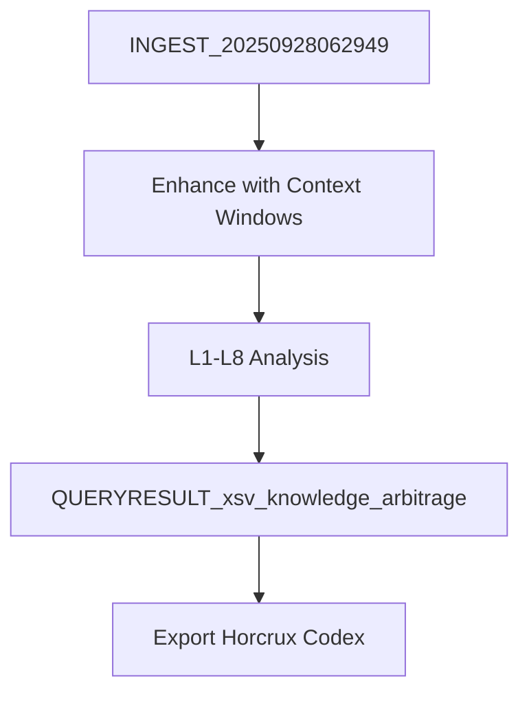

# Design Document

## Overview

Extract L1-L8 knowledge arbitrage insights from the burnt-sushi/xsv codebase using multi-scale context windows and systematic analysis. Transform the existing ingested codebase into structured insights for The Horcrux Codex.

## Architecture



## Core Components

### 1. Database Enhancement
- Add context window columns to existing INGEST_20250928062949 table
- Generate parent_filepath, l1_window_content, l2_window_content
- Extract AST patterns using ast-grep

### 2. L1-L8 Analysis Engine
- **L1-L3**: Tactical patterns (micro-optimizations, design patterns, micro-libraries)
- **L4-L6**: Strategic architecture (macro opportunities, LLD decisions, domain patterns)
- **L7-L8**: Foundational insights (language limitations, intent archaeology)

### 3. Output Generation
- Store results in QUERYRESULT_xsv_knowledge_arbitrage table
- Export Horcrux Codex training data
- Generate Mermaid visualizations

## Database Schema

### Enhanced Source Table
```sql
ALTER TABLE "INGEST_20250928062949" ADD COLUMN parent_filepath VARCHAR;
ALTER TABLE "INGEST_20250928062949" ADD COLUMN l1_window_content TEXT;
ALTER TABLE "INGEST_20250928062949" ADD COLUMN l2_window_content TEXT;
ALTER TABLE "INGEST_20250928062949" ADD COLUMN ast_patterns JSONB;
```

### Results Table
```sql
CREATE TABLE QUERYRESULT_xsv_knowledge_arbitrage (
    result_id BIGSERIAL PRIMARY KEY,
    source_file_id BIGINT,
    analysis_type VARCHAR NOT NULL,
    insight_category VARCHAR NOT NULL,
    insight_title VARCHAR NOT NULL,
    insight_description TEXT NOT NULL,
    code_example TEXT,
    horcrux_entry JSONB,
    created_at TIMESTAMP DEFAULT NOW()
);
```

## Concrete Implementation Steps

### Step 1: Generate Analysis Tasks (2 minutes)
```bash
# Generate tasks for L1-L8 analysis using existing multi-scale context
code-ingest generate-tasks \
  --sql "SELECT * FROM INGEST_20250928062949" \
  --output-table QUERYRESULT_xsv_knowledge_arbitrage \
  --tasks-file ./xsv-analysis-tasks.md \
  --db-path /Users/neetipatni/desktop/PensieveDB01
```

### Step 2: Execute Analysis Tasks in IDE (15 minutes)
```bash
# Open the generated tasks file in Kiro IDE
# Execute each task - they use the existing context columns:
# - content_text (individual file)
# - l1_window_content (directory level)  
# - l2_window_content (system level)
# - ast_patterns (semantic patterns)
```

### Step 3: Export Results (1 minute)
```bash
# Export Horcrux Codex format
code-ingest print-to-md \
  --db-path /Users/neetipatni/desktop/PensieveDB01 \
  --table QUERYRESULT_xsv_knowledge_arbitrage \
  --prefix xsv-knowledge-arbitrage \
  --location ./horcrux-codex/
```

## Why This Works

1. **Multi-scale context already exists**: The INGEST table already has parent_filepath, l1_window_content, l2_window_content, ast_patterns
2. **generate-tasks**: Creates analysis prompts that leverage existing context columns
3. **IDE execution**: Run the generated tasks in Kiro, results stored automatically
4. **Export**: One command generates training data

Total time: ~18 minutes for complete L1-L8 analysis of 59 files.