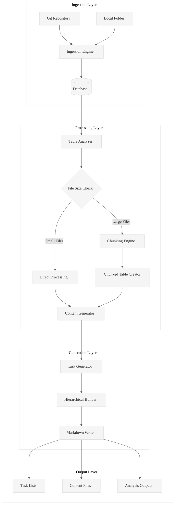

# Design Document

## Overview

The S05 Task List Generator is a sophisticated codebase analysis system that transforms database-stored code into structured analysis workflows. The system supports both basic file-level analysis and advanced chunked processing for large files, with flexible ingestion from git repositories or local folders.

The core innovation is the hierarchical task generation that creates systematic analysis workflows, enabling deep codebase understanding through the L1-L8 extraction hierarchy defined in the steering documents.

## Architecture

### High-Level Architecture



### Component Architecture

The system follows a layered architecture with clear separation of concerns:

1. **Ingestion Layer**: Handles both git repositories and local folder processing
2. **Processing Layer**: Manages database operations, chunking logic, and content preparation
3. **Generation Layer**: Creates hierarchical task structures and markdown output
4. **Output Layer**: Produces final analysis artifacts

## Components and Interfaces

### 1. Ingestion Engine

**Purpose**: Unified interface for processing both git repositories and local folders

```rust
pub trait IngestionProvider {
    async fn ingest(&self, source: IngestionSource, db_path: &Path) -> Result<String, IngestionError>;
    async fn validate_source(&self, source: &IngestionSource) -> Result<(), ValidationError>;
}

pub enum IngestionSource {
    GitRepository(String),
    LocalFolder { path: PathBuf, recursive: bool },
}

pub struct IngestionEngine {
    git_provider: GitIngestionProvider,
    folder_provider: FolderIngestionProvider,
}
```

**Key Responsibilities**:
- Source validation (URL accessibility, folder existence)
- Unified database schema creation
- File content extraction and metadata collection
- Error handling for network/filesystem issues

### 2. Chunking Engine

**Purpose**: Intelligent file splitting for large codebases

```rust
pub struct ChunkingEngine {
    chunk_size: usize,
    overlap_strategy: OverlapStrategy,
}

pub struct ChunkMetadata {
    pub chunk_number: u32,
    pub start_line: u32,
    pub end_line: u32,
    pub context_before: Option<String>,
    pub context_after: Option<String>,
}

impl ChunkingEngine {
    pub async fn create_chunked_table(&self, table_name: &str, chunk_size: usize) -> Result<String, ChunkingError>;
    pub fn chunk_content(&self, content: &str, metadata: &FileMetadata) -> Vec<ChunkData>;
    pub fn generate_context(&self, chunks: &[ChunkData], current_index: usize, level: ContextLevel) -> String;
}
```

**Key Features**:
- LOC-based chunking with configurable size
- Context preservation (L1: ±1 chunk, L2: ±2 chunks)
- Maintains file relationships and metadata
- Handles edge cases (small files, boundary conditions)

### 3. Task Generator

**Purpose**: Creates hierarchical task structures with configurable depth and grouping

```rust
pub struct TaskGenerator {
    levels: u8,
    groups_per_level: u8,
    prompt_file: PathBuf,
}

pub struct TaskHierarchy {
    pub levels: Vec<TaskLevel>,
    pub total_tasks: usize,
}

pub struct TaskLevel {
    pub level: u8,
    pub tasks: Vec<Task>,
}

pub struct Task {
    pub id: String,
    pub description: String,
    pub content_files: Vec<PathBuf>,
    pub prompt_reference: String,
    pub output_path: PathBuf,
    pub subtasks: Vec<Task>,
}
```

**Algorithm**:
1. Query database for row count
2. Calculate optimal task distribution across hierarchy
3. Generate task IDs with proper numbering (1.1, 1.2, 2.1, etc.)
4. Create content file references for each task
5. Build markdown structure with checkboxes

### 4. Content Generator

**Purpose**: Creates the three-tier content files (A, L1, L2) for analysis

```rust
pub struct ContentGenerator {
    output_dir: PathBuf,
    table_name: String,
}

pub struct ContentSet {
    pub content_a: PathBuf,    // Primary content
    pub content_l1: PathBuf,   // L1 context
    pub content_l2: PathBuf,   // L2 context
}

impl ContentGenerator {
    pub async fn generate_content_files(&self, row_data: &RowData) -> Result<ContentSet, ContentError>;
    pub async fn generate_chunked_content(&self, chunk_data: &ChunkData) -> Result<ContentSet, ContentError>;
}
```

## Data Models

### Database Schema

**Base Table Structure**:
```sql
CREATE TABLE IF NOT EXISTS {table_name} (
    id INTEGER PRIMARY KEY AUTOINCREMENT,
    file_id TEXT NOT NULL,
    filepath TEXT NOT NULL,
    filename TEXT NOT NULL,
    extension TEXT,
    line_count INTEGER,
    content TEXT,
    created_at TIMESTAMP DEFAULT CURRENT_TIMESTAMP
);
```

**Chunked Table Structure**:
```sql
CREATE TABLE IF NOT EXISTS {table_name}_{chunk_size} (
    id INTEGER PRIMARY KEY AUTOINCREMENT,
    file_id TEXT NOT NULL,
    filepath TEXT NOT NULL,
    parent_filepath TEXT NOT NULL,
    filename TEXT NOT NULL,
    extension TEXT,
    chunk_number INTEGER NOT NULL,
    chunk_start_line INTEGER NOT NULL,
    chunk_end_line INTEGER NOT NULL,
    line_count INTEGER,
    content TEXT,
    content_l1 TEXT,
    content_l2 TEXT,
    created_at TIMESTAMP DEFAULT CURRENT_TIMESTAMP
);
```

### Configuration Models

```rust
#[derive(Debug, Clone, Serialize, Deserialize)]
pub struct GenerationConfig {
    pub table_name: String,
    pub levels: u8,
    pub groups: u8,
    pub output_file: PathBuf,
    pub prompt_file: Option<PathBuf>,
    pub chunk_size: Option<usize>,
}

#[derive(Debug, Clone, Serialize, Deserialize)]
pub struct IngestionConfig {
    pub source: IngestionSource,
    pub db_path: PathBuf,
    pub file_filters: Vec<String>,
    pub max_file_size: Option<usize>,
}
```

## Error Handling

### Error Hierarchy

```rust
#[derive(Error, Debug)]
pub enum TaskGeneratorError {
    #[error("Database error: {0}")]
    Database(#[from] sqlx::Error),
    
    #[error("Ingestion failed: {source} - {cause}")]
    Ingestion { source: String, cause: String },
    
    #[error("Chunking error: {0}")]
    Chunking(#[from] ChunkingError),
    
    #[error("File system error: {0}")]
    FileSystem(#[from] std::io::Error),
    
    #[error("Invalid configuration: {field} - {reason}")]
    Configuration { field: String, reason: String },
}

#[derive(Error, Debug)]
pub enum ChunkingError {
    #[error("Invalid chunk size: {size} (must be > 0)")]
    InvalidChunkSize { size: usize },
    
    #[error("Table creation failed: {table_name}")]
    TableCreation { table_name: String },
    
    #[error("Context generation failed for chunk {chunk_id}")]
    ContextGeneration { chunk_id: u32 },
}
```

### Error Recovery Strategies

1. **Database Errors**: Retry with exponential backoff, fallback to read-only mode
2. **File System Errors**: Skip problematic files, log warnings, continue processing
3. **Network Errors**: Retry git operations, provide offline mode suggestions
4. **Chunking Errors**: Fall back to whole-file processing for problematic files

## Testing Strategy

### Unit Testing

1. **Chunking Algorithm Tests**:
   - Verify correct LOC-based splitting
   - Test context generation for L1/L2 levels
   - Edge cases: empty files, single-line files, exact chunk boundaries

2. **Task Generation Tests**:
   - Hierarchical structure validation
   - Proper numbering sequences
   - Content file reference accuracy

3. **Database Operations Tests**:
   - Table creation and schema validation
   - Data insertion and retrieval
   - Chunked table generation

### Integration Testing

1. **End-to-End Workflows**:
   - Git repository ingestion → task generation
   - Local folder ingestion → chunked analysis
   - Complete pipeline with real codebases

2. **Performance Testing**:
   - Large repository processing (>10k files)
   - Memory usage during chunking operations
   - Database query performance with large datasets

### Property-Based Testing

```rust
proptest! {
    #[test]
    fn chunking_preserves_content(
        content in ".*",
        chunk_size in 1usize..1000
    ) {
        let chunks = chunk_content(&content, chunk_size);
        let reconstructed = chunks.iter().map(|c| &c.content).collect::<String>();
        prop_assert_eq!(content, reconstructed);
    }
    
    #[test]
    fn task_hierarchy_is_valid(
        levels in 1u8..8,
        groups in 1u8..20
    ) {
        let hierarchy = generate_task_hierarchy(levels, groups);
        prop_assert_eq!(hierarchy.levels.len(), levels as usize);
        for level in &hierarchy.levels {
            prop_assert!(level.tasks.len() <= groups as usize);
        }
    }
}
```

## Performance Considerations

### Optimization Strategies

1. **Database Optimization**:
   - Indexed queries on filepath and file_id
   - Batch insertions for chunked data
   - Connection pooling for concurrent operations

2. **Memory Management**:
   - Streaming file processing for large files
   - Lazy loading of content data
   - Configurable chunk size limits

3. **Concurrency**:
   - Parallel file processing during ingestion
   - Concurrent chunk generation
   - Async I/O for file operations

### Performance Targets

- **Ingestion**: Process 1000 files/minute for typical codebases
- **Chunking**: Handle files up to 100k LOC with <2GB memory usage
- **Task Generation**: Generate hierarchical tasks for 10k+ files in <30 seconds

## Security Considerations

1. **Path Validation**: Prevent directory traversal attacks in local folder ingestion
2. **Resource Limits**: Configurable limits on file sizes and processing time
3. **Database Security**: Parameterized queries to prevent SQL injection
4. **File System Access**: Restricted to specified directories and database paths