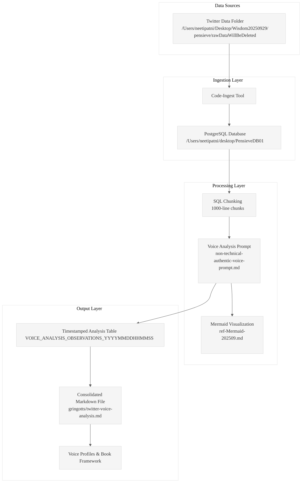

# Design Document: Understanding My Twitter Voice

## Overview

This system leverages the existing code-ingest tool to analyze 60,000+ tweets for authentic voice patterns and book creation insights. The design follows a simple three-stage pipeline: ingest Twitter data into PostgreSQL, chunk the content for analysis, and apply specialized voice analysis prompts to extract patterns and insights.

## Architecture



## Components and Interfaces

### 1. Data Ingestion Component
- **Tool**: Existing code-ingest binary (`./target/release/code-ingest`)
- **Input**: Twitter data folder with text files
- **Output**: Timestamped PostgreSQL table (`INGEST_YYYYMMDDHHMMSS`)
- **Interface**: Command-line execution with folder and database path parameters

### 2. Data Chunking Component
- **Tool**: SQL queries against ingested data
- **Input**: Content from `content_text` field in ingested table
- **Output**: 1000-line chunks with metadata preservation
- **Interface**: PostgreSQL queries with LIMIT/OFFSET or window functions

### 3. Voice Analysis Component
- **Tool**: LLM processing with specialized prompt
- **Input**: Text chunks + voice analysis prompt
- **Output**: Structured analysis results (voice patterns, gems, insights)
- **Interface**: Prompt application with chunk content as context

### 4. Results Storage Component
- **Tool**: PostgreSQL table creation and data insertion
- **Input**: Analysis results from voice processing
- **Output**: Timestamped observations table
- **Interface**: SQL INSERT operations with structured schema

### 5. Results Extraction Component
- **Tool**: SQL query and markdown file generation
- **Input**: Completed analysis data from PostgreSQL
- **Output**: Consolidated markdown file in gringotts folder
- **Interface**: File system write operations with structured markdown format

## Data Models

### Ingested Twitter Data Schema
```sql
-- Created by code-ingest (example: INGEST_20250929040158)
CREATE TABLE INGEST_YYYYMMDDHHMMSS (
    file_id BIGSERIAL PRIMARY KEY,
    filepath VARCHAR NOT NULL,
    filename VARCHAR NOT NULL,
    extension VARCHAR,
    file_size_bytes BIGINT,
    line_count INTEGER,
    word_count INTEGER,
    content_text TEXT,                -- Full tweet content (searchable)
    parent_filepath VARCHAR,          -- Directory context
    l1_window_content TEXT,           -- Directory-level context
    l2_window_content TEXT,           -- System-level context
    ast_patterns JSONB,               -- Semantic patterns
    file_type VARCHAR,                -- Processing type
    ingestion_timestamp TIMESTAMP DEFAULT NOW()
);
```

### Voice Analysis Observations Schema
```sql
-- Created for storing analysis results
CREATE TABLE VOICE_ANALYSIS_OBSERVATIONS_YYYYMMDDHHMMSS (
    observation_id BIGSERIAL PRIMARY KEY,
    source_table VARCHAR NOT NULL,           -- Reference to ingested data table
    chunk_number INTEGER,                    -- Sequential chunk number
    source_file_ids INTEGER[],               -- Array of file_ids from source chunk
    
    -- Raw Analysis Output
    analysis_output TEXT,                    -- Full output from voice analysis prompt
    
    -- Metadata
    analysis_timestamp TIMESTAMP DEFAULT NOW(),
    chunk_word_count INTEGER,
    processing_notes TEXT
);
```

## Error Handling

### Ingestion Errors
- **File Access Issues**: Verify folder path exists and is readable
- **Database Connection**: Ensure PostgreSQL is running and accessible
- **Disk Space**: Monitor available space for database growth

### Processing Errors
- **Empty Chunks**: Handle cases where 1000-line chunks contain insufficient content
- **Prompt Failures**: Implement retry logic for LLM processing failures
- **Database Writes**: Handle constraint violations and connection timeouts

### Data Integrity
- **Chunk Boundaries**: Ensure no content is lost between chunks
- **Reference Integrity**: Maintain links between observations and source data
- **Timestamp Consistency**: Use consistent timestamp formats across tables

## Testing Strategy

### Unit Testing
- **SQL Chunking Logic**: Verify 1000-line chunks are created correctly
- **Database Schema**: Test table creation and data insertion
- **Reference Tracking**: Ensure source file IDs are properly maintained

### Integration Testing
- **End-to-End Pipeline**: Test complete flow from ingestion to analysis storage
- **Code-Ingest Integration**: Verify compatibility with existing tool
- **Prompt Processing**: Test voice analysis prompt application to sample chunks

### Performance Testing
- **Large Dataset Handling**: Test with full 60k+ tweet corpus
- **Database Performance**: Monitor query performance on large tables
- **Memory Usage**: Ensure chunking doesn't cause memory issues

### Data Quality Testing
- **Content Preservation**: Verify original tweet content is maintained
- **Metadata Accuracy**: Check file paths and timestamps are correct
- **Analysis Completeness**: Ensure all chunks are processed and stored