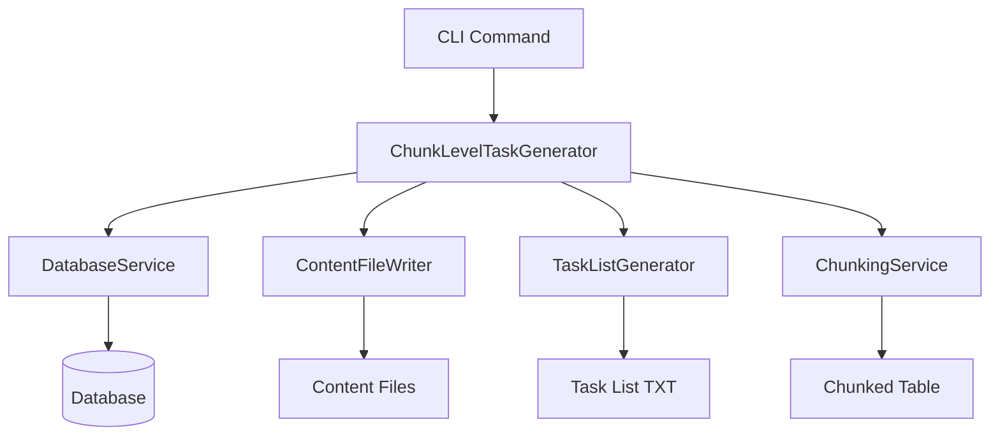
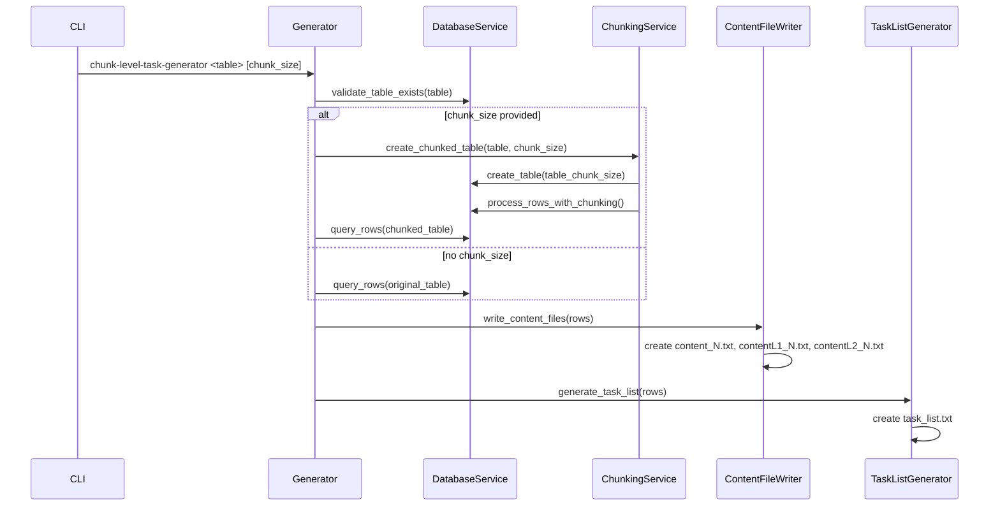

# Design Document

## Overview

The `chunk-level-task-generator` command provides a simplified interface for generating content files and task lists from database tables. It operates in two modes: file-level (no chunk size) and chunk-level (with chunk size), replacing the complex existing task generation system with a single, focused command.

## Architecture

### Core Components



### Data Flow



## Components and Interfaces

### ChunkLevelTaskGenerator

```rust
/// Main command handler for chunk-level task generation
pub struct ChunkLevelTaskGenerator {
    database: Arc<DatabaseService>,
    content_writer: ContentFileWriter,
    task_generator: TaskListGenerator,
    chunking_service: ChunkingService,
}

impl ChunkLevelTaskGenerator {
    /// Execute the command with given parameters
    pub async fn execute(
        &self,
        table_name: &str,
        chunk_size: Option<usize>,
        db_path: Option<PathBuf>,
    ) -> Result<TaskGenerationResult, TaskGeneratorError>;
}
```

### DatabaseService

```rust
/// Database operations for task generation
pub struct DatabaseService {
    pool: Arc<PgPool>,
}

impl DatabaseService {
    /// Validate that a table exists and has required columns
    pub async fn validate_table(&self, table_name: &str) -> Result<TableInfo, DatabaseError>;
    
    /// Query rows from a table for task generation
    pub async fn query_rows(&self, table_name: &str) -> Result<Vec<IngestedFile>, DatabaseError>;
    
    /// Create a new chunked table
    pub async fn create_chunked_table(&self, original_table: &str, chunk_size: usize) -> Result<String, DatabaseError>;
}
```

### ChunkingService

```rust
/// Handles file chunking logic
pub struct ChunkingService {
    database: Arc<DatabaseService>,
}

impl ChunkingService {
    /// Process rows with chunking logic
    pub async fn process_with_chunking(
        &self,
        original_table: &str,
        chunked_table: &str,
        chunk_size: usize,
    ) -> Result<ChunkingResult, ChunkingError>;
    
    /// Apply chunking rules: copy small files, chunk large files
    fn apply_chunking_rules(&self, file: &IngestedFile, chunk_size: usize) -> Vec<ChunkedFile>;
}
```

### ContentFileWriter

```rust
/// Writes content files to disk
pub struct ContentFileWriter {
    output_dir: PathBuf,
}

impl ContentFileWriter {
    /// Write content files for a set of rows
    pub async fn write_content_files(&self, rows: &[IngestedFile]) -> Result<Vec<PathBuf>, IoError>;
    
    /// Write individual content files for a row
    fn write_row_files(&self, row: &IngestedFile, row_number: usize) -> Result<ContentFiles, IoError>;
}
```

### TaskListGenerator

```rust
/// Generates task list in txt format
pub struct TaskListGenerator;

impl TaskListGenerator {
    /// Generate task list referencing content files
    pub fn generate_task_list(&self, rows: &[IngestedFile]) -> Result<String, TaskGeneratorError>;
}
```

## Data Models

### ChunkedFile

```rust
/// Represents a file after chunking processing
#[derive(Debug, Clone)]
pub struct ChunkedFile {
    pub original_file_id: i64,
    pub chunk_number: usize,
    pub content: String,
    pub content_l1: String, // current + next
    pub content_l2: String, // current + next + next2
    pub line_count: i32,
}
```

### TaskGenerationResult

```rust
/// Result of task generation operation
#[derive(Debug)]
pub struct TaskGenerationResult {
    pub table_used: String,
    pub rows_processed: usize,
    pub content_files_created: usize,
    pub task_list_path: PathBuf,
    pub chunked_table_created: Option<String>,
}
```

### ContentFiles

```rust
/// Paths to content files for a single row
#[derive(Debug)]
pub struct ContentFiles {
    pub content: PathBuf,
    pub content_l1: PathBuf,
    pub content_l2: PathBuf,
}
```

## Error Handling

### TaskGeneratorError

```rust
#[derive(Error, Debug)]
pub enum TaskGeneratorError {
    #[error("Table '{table}' does not exist")]
    TableNotFound { table: String },
    
    #[error("Invalid chunk size: {size} (must be > 0)")]
    InvalidChunkSize { size: usize },
    
    #[error("Database error: {0}")]
    Database(#[from] DatabaseError),
    
    #[error("IO error: {0}")]
    Io(#[from] std::io::Error),
    
    #[error("Chunking failed: {cause}")]
    ChunkingFailed { cause: String },
}
```

## Testing Strategy

### Unit Tests

```rust
#[cfg(test)]
mod tests {
    use super::*;
    
    #[tokio::test]
    async fn test_file_level_mode() {
        // Test file-level mode without chunking
        let generator = create_test_generator().await;
        let result = generator.execute("test_table", None, None).await.unwrap();
        
        assert_eq!(result.rows_processed, 5);
        assert_eq!(result.content_files_created, 15); // 3 files per row
        assert!(result.chunked_table_created.is_none());
    }
    
    #[tokio::test]
    async fn test_chunk_level_mode() {
        // Test chunk-level mode with chunking
        let generator = create_test_generator().await;
        let result = generator.execute("test_table", Some(500), None).await.unwrap();
        
        assert!(result.chunked_table_created.is_some());
        assert!(result.rows_processed > 0);
    }
    
    #[test]
    fn test_chunking_logic_small_file() {
        // Test that small files are copied unchanged
        let chunking_service = ChunkingService::new(mock_database());
        let file = create_small_test_file(100); // 100 LOC
        let chunks = chunking_service.apply_chunking_rules(&file, 500);
        
        assert_eq!(chunks.len(), 1);
        assert_eq!(chunks[0].content, file.content_text.unwrap());
    }
    
    #[test]
    fn test_chunking_logic_large_file() {
        // Test that large files are broken into chunks
        let chunking_service = ChunkingService::new(mock_database());
        let file = create_large_test_file(1500); // 1500 LOC
        let chunks = chunking_service.apply_chunking_rules(&file, 500);
        
        assert_eq!(chunks.len(), 3); // 1500 / 500 = 3 chunks
        
        // Test L1 and L2 concatenation
        assert!(chunks[0].content_l1.contains(&chunks[0].content));
        assert!(chunks[0].content_l1.contains(&chunks[1].content));
        assert!(chunks[0].content_l2.contains(&chunks[0].content));
        assert!(chunks[0].content_l2.contains(&chunks[1].content));
        assert!(chunks[0].content_l2.contains(&chunks[2].content));
    }
    
    #[test]
    fn test_error_handling() {
        // Test various error conditions
        let generator = create_test_generator().await;
        
        // Test invalid table
        let result = generator.execute("nonexistent_table", None, None).await;
        assert!(matches!(result.unwrap_err(), TaskGeneratorError::TableNotFound { .. }));
        
        // Test invalid chunk size
        let result = generator.execute("test_table", Some(0), None).await;
        assert!(matches!(result.unwrap_err(), TaskGeneratorError::InvalidChunkSize { .. }));
    }
}
```

### Integration Tests

```rust
#[tokio::test]
async fn test_end_to_end_file_level() {
    // Test complete file-level workflow
    let temp_dir = create_temp_dir();
    let db = create_test_database().await;
    let generator = ChunkLevelTaskGenerator::new(db, temp_dir.clone());
    
    // Execute command
    let result = generator.execute("INGEST_TEST", None, None).await.unwrap();
    
    // Verify content files exist
    for i in 1..=result.rows_processed {
        assert!(temp_dir.join(format!("content_{}.txt", i)).exists());
        assert!(temp_dir.join(format!("contentL1_{}.txt", i)).exists());
        assert!(temp_dir.join(format!("contentL2_{}.txt", i)).exists());
    }
    
    // Verify task list exists and has correct format
    let task_list = std::fs::read_to_string(result.task_list_path).unwrap();
    assert!(task_list.contains("content_1.txt"));
    assert!(task_list.contains("contentL1_1.txt"));
    assert!(task_list.contains("contentL2_1.txt"));
}

#[tokio::test]
async fn test_end_to_end_chunk_level() {
    // Test complete chunk-level workflow
    let temp_dir = create_temp_dir();
    let db = create_test_database_with_large_files().await;
    let generator = ChunkLevelTaskGenerator::new(db, temp_dir.clone());
    
    // Execute command with chunking
    let result = generator.execute("INGEST_LARGE", Some(500), None).await.unwrap();
    
    // Verify chunked table was created
    assert!(result.chunked_table_created.is_some());
    let chunked_table = result.chunked_table_created.unwrap();
    assert_eq!(chunked_table, "INGEST_LARGE_500");
    
    // Verify chunked table has more rows than original (due to chunking)
    let original_count = db.count_rows("INGEST_LARGE").await.unwrap();
    let chunked_count = db.count_rows(&chunked_table).await.unwrap();
    assert!(chunked_count >= original_count);
}
```

## Performance Considerations

### Database Operations
- Use streaming queries for large tables to avoid memory issues
- Batch insert operations for chunked table creation
- Use prepared statements for repeated operations

### File I/O
- Write content files asynchronously using `tokio::fs`
- Use buffered writers for large content files
- Clean up temporary files on error

### Memory Management
- Process rows in batches to avoid loading entire table into memory
- Use `Arc` for shared database connections
- Implement proper RAII patterns for resource cleanup

## CLI Integration

### Command Definition

```rust
/// New chunk-level task generator command
ChunkLevelTaskGenerator {
    /// Database table name
    table_name: String,
    
    /// Optional chunk size for large file processing
    chunk_size: Option<usize>,
    
    /// Database path (can also be set globally)
    #[arg(long)]
    db_path: Option<PathBuf>,
    
    /// Output directory for content files
    #[arg(long, default_value = ".")]
    output_dir: PathBuf,
}
```

### Command Execution

```rust
async fn execute_chunk_level_task_generator(
    &self,
    table_name: String,
    chunk_size: Option<usize>,
    db_path: Option<PathBuf>,
    output_dir: PathBuf,
) -> Result<()> {
    let db_path = db_path.or_else(|| self.db_path.clone());
    let database = Database::from_path_or_env(db_path).await?;
    
    let generator = ChunkLevelTaskGenerator::new(
        Arc::new(DatabaseService::new(database.pool().clone())),
        ContentFileWriter::new(output_dir.clone()),
        TaskListGenerator::new(),
        ChunkingService::new(),
    );
    
    let result = generator.execute(&table_name, chunk_size, db_path).await?;
    
    println!("✅ Task generation complete:");
    println!("   Table used: {}", result.table_used);
    println!("   Rows processed: {}", result.rows_processed);
    println!("   Content files created: {}", result.content_files_created);
    println!("   Task list: {}", result.task_list_path.display());
    
    if let Some(chunked_table) = result.chunked_table_created {
        println!("   Chunked table created: {}", chunked_table);
    }
    
    Ok(())
}
```