# Pensieve Local LLM Server - Minimal PRD

## Executive Summary

**Current Status**: Foundation complete, ready for MLX integration
**Target**: Apple Silicon local LLM server with Anthropic API compatibility
**Framework**: MLX (Apple's official machine learning framework)
**Default Model**: Phi-3-mini-128k-instruct-4bit
**Target Platform**: macOS with Apple Silicon (M1/M2/M3)

The Pensieve Local LLM Server currently provides a **complete HTTP API foundation** with authentication, streaming, and modular architecture. The system is **ready for MLX integration** and will deliver cloud-like performance with local privacy.

## Section 0: Complete User Journey Visualization

```mermaid
---
title: Pensieve Local LLM Server - Complete User Journey
accTitle: Pensieve User Journey Flowchart
accDescr: "A comprehensive flowchart showing the complete user journey from installation to Claude Code integration with the Pensieve Local LLM Server, including automatic model download, server startup, and configuration steps."
config:
  flowchart:
    defaultRenderer: "elk"
  theme: "base"
  themeVariables:
    primaryColor: "#ECECFF"
    primaryTextColor: "#363636"
    primaryBorderColor: "#363636"
    lineColor: "#363636"
    secondaryColor: "#f8f8ff"
    tertiaryColor: "#f0f7ff"
    fontFamily: "system-ui, -apple-system, sans-serif"
    fontSize: "14px"
    nodeSpacing: 75
    rankSpacing: 75
    wrappingWidth: 150
---
flowchart TD
    Start([User Starts Journey]) --> Decision1{Has<br/>Apple Silicon?}

    Decision1 -- No --> Error1[⚠️ Unsupported Platform<br/>MLX requires Apple Silicon<br/>M1/M2/M3 Macs]
    Error1 --> End[❌ Journey Ends]

    Decision1 -- Yes --> Step1[📦 Install Dependencies<br/>• MLX Framework<br/>• Python 3.9+<br/>• Rust Toolchain]

    Step1 --> Step2[🚀 Single Command Setup<br/><code>cargo run -p pensieve-01 -- start</code>]

    Step2 --> AutoModel[📥 Auto-Download Model<br/>Phi-3-mini-128k-instruct-4bit<br/>from Hugging Face]

    AutoModel --> AutoServer[🔧 Auto-Configure Server<br/>• MLX Acceleration<br/>• Metal GPU Support<br/>• Port 7777]

    AutoServer --> Step3[✅ Server Running<br/>🌐 http://127.0.0.1:7777<br/>⚡ MLX + Metal Acceleration]

    Step3 --> Step4[⚙️ Configure Claude Code<br/><code>export ANTHROPIC_BASE_URL=http://127.0.0.1:7777</code><br/><code>export ANTHROPIC_API_KEY=pensieve-local-key</code>]

    Step4 --> Step5[🎯 Launch Claude Code<br/>• Full 128k Context<br/>• 25-40 tokens/second<br/>• Local Privacy]

    Step5 --> Success[🎉 Success!<br/>Magical Local LLM Experience<br/>Identical to Cloud Claude]

    Success --> End

    %% Styling for different node types
    classDef startNode fill:#90EE90,stroke:#2E8B57,stroke-width:3px
    classDef processNode fill:#ECECFF,stroke:#363636,stroke-width:2px
    classDef decisionNode fill:#FFF8DC,stroke:#DAA520,stroke-width:2px
    classDef successNode fill:#98FB98,stroke:#228B22,stroke-width:2px
    classDef errorNode fill:#FFB6C1,stroke:#DC143C,stroke-width:2px

    class Start startNode
    class Step1,Step2,Step3,Step4,Step5,Advanced,AutoModel,AutoServer processNode
    class Decision1 decisionNode
    class Success successNode
    class Error1,End errorNode
```

## Technical Choices

### **Framework: MLX (Definitive Choice)**

**Why MLX**: Apple's official machine learning framework designed specifically for Apple Silicon
- **Performance Evidence**: MLX provides 25-40 TPS vs 15-30 TPS with alternative frameworks
- **Metal Integration**: Direct access to Apple Metal for GPU acceleration
- **Memory Efficiency**: Optimized for Apple Silicon memory architecture
- **Future-Proofing**: Official Apple support ensures continued development

**Risk Assessment**: Limited to Apple ecosystem, but this aligns with target user base

### **Model: Phi-3 Mini 4-bit (Optimal Choice)**

**Why Phi-3 Mini**: Excellent balance of performance, capability, and memory efficiency
- **Memory Usage**: ~1.5GB for 4-bit quantized model (fits in 16GB+ systems)
- **Context Window**: 128K token context for complex conversations
- **Performance**: Strong reasoning capabilities with fast inference
- **Availability**: Readily available on Hugging Face with MLX community support

**Alternative Considered**: Larger models (7B+ parameters) - rejected due to memory constraints

### **Architecture: 8-Crate Modular Design**

**Why This Architecture**: Proven foundation with clean separation of concerns
- **pensieve-01**: CLI interface and server lifecycle management
- **pensieve-02**: HTTP API server with Anthropic compatibility
- **pensieve-03**: API models and data structures
- **pensieve-04**: Inference engine (ready for MLX integration)
- **pensieve-05**: Model support and data management
- **pensieve-06**: Metal support (Apple Silicon optimization)
- **pensieve-07**: Core foundation with traits and error handling
- **pensieve-08**: Claude Core integration

**Risk Assessment**: Coordination complexity, but benefits outweigh costs

### **API Standard: Anthropic Compatibility (Strategic Choice)**

**Why Anthropic API**: Drop-in compatibility with Claude Code and existing tools
- **User Familiarity**: Developers already know Anthropic API
- **Tool Integration**: Works seamlessly with Claude Code, Cursor, etc.
- **Market Standard**: Established format for LLM APIs
- **Documentation**: Extensive examples and community support

**Risk Assessment**: Dependency on external API standard, but widely adopted

## MVP Scope

### **What's Working Now** ✅
- HTTP API server with authentication
- Streaming response support
- 8-crate modular architecture
- CLI interface with basic commands
- Mock responses for testing
- Port 7777 server configuration

### **What's Next (Current Focus)** 🔄
- MLX framework integration
- Real Phi-3 model inference
- Automatic model downloading from Hugging Face
- Performance optimization with Metal acceleration

### **Success Criteria** 🎯
- **MVP Success**: First real token generation with MLX
- **Performance Target**: 25+ TPS throughput
- **Memory Target**: <12GB total usage
- **Integration Target**: Claude Code compatibility verified

## Implementation Timeline

### **Phase 1: MLX Integration (Current Focus)**
- Integrate MLX framework into pensieve-04
- Implement real model loading and inference
- Replace mock responses with MLX-powered generation
- Test with Phi-3-mini-128k-instruct-4bit

### **Phase 2: Performance Optimization**
- Metal backend optimization
- Memory management for 16GB systems
- Concurrent request handling
- Performance benchmarking and tuning

### **Phase 3: Production Polish**
- Error handling refinement
- Logging and monitoring
- Configuration management
- Documentation updates

## Key Benefits

- **🚀 Instant Setup**: One-command installation and configuration
- **🔮 Magical Experience**: Simple, intuitive user journey
- **⚡ Local Privacy**: All processing happens locally on device
- **🎯 High Performance**: Optimized for Apple Silicon with MLX
- **🛡️ Secure**: Local processing eliminates data privacy concerns
- **💰 Cost Effective**: No API fees for local inference

## Risks and Mitigations

### **Technical Risks**
- **MLX Integration Complexity**: Mitigated by extensive research and reference implementations
- **Performance Variability**: Mitigated by Metal optimization and performance testing
- **Memory Constraints**: Mitigated by 4-bit quantization and efficient caching

### **Platform Risks**
- **Apple Silicon Dependency**: Accepted limitation aligned with target market
- **Model Availability**: Mitigated by Hugging Face community support
- **Compatibility Issues**: Mitigated by Anthropic API standardization

---

**Current Status**: Foundation Complete, Ready for MLX Integration
**Last Updated**: October 29, 2025
**Version**: 0.1.0-MVP