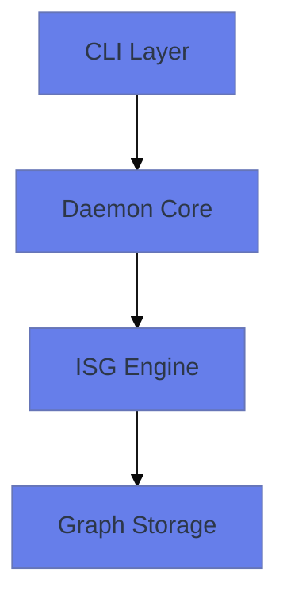

# Mermaid Steering Guidelines

## 🎯 Core Requirement: Mermaid-Only Diagrams

**ALL DIAGRAMS IN THIS PROJECT MUST BE IN MERMAID FORMAT ONLY**

This is non-negotiable to ensure compatibility with GitHub and other platforms.

## 📐 Layout Preference Hierarchy

1. **FIRST PREFERENCE: Squarish** - Aspect ratio between 0.9-1.1 (nearly square)
2. **SECOND PREFERENCE: Vertical** - Taller than wide (aspect ratio < 0.9)
3. **LAST RESORT: Horizontal** - Wider than tall (aspect ratio > 1.1)

## 🔧 Mermaid Configuration Standards

### Basic Template (Use this for all diagrams)

```mermaid
%%{init: {'theme': 'base', 'themeVariables': {'primaryColor': '#667eea', 'primaryTextColor': '#2d3748', 'lineColor': '#cbd5e0'}}}%%
flowchart TD
    %% Your diagram content here
```

### Layout Direction Strategy

- **For naturally wide content**: Use `direction TD` (Top-Down) to make it taller and more square
- **For naturally tall content**: Use `direction LR` (Left-Right) to make it wider and more square
- **When squarish isn't achievable**: **Prefer vertical (TD) over horizontal (LR)** layouts

### Spacing Configuration

```mermaid
%%{init: {'theme': 'base', 'flowchart': {'nodeSpacing': 75, 'rankSpacing': 75}}}%%
```

Setting similar values for `nodeSpacing` and `rankSpacing` (75) produces squarish layouts.

## 📋 Diagram Types and Usage

### 1. Architecture Diagrams (flowchart)

Use for system architecture, component relationships, data flow.



### 2. Process Flows (flowchart)

Use for workflows, execution paths, operational procedures.

### 3. Class/Component Diagrams (classDiagram)

Use for software structure, relationships between components.

### 4. Sequence Diagrams (sequenceDiagram)

Use for interactions between components over time.

## 🎨 Styling Guidelines

### Colors (Project Palette)

- **Primary**: `#667eea` (Indigo)
- **Secondary**: `#48bb78` (Green)
- **Accent**: `#ed8936` (Orange)
- **Text**: `#2d3748` (Dark Gray)
- **Lines**: `#cbd5e0` (Light Gray)

### Node Types

- **Processes**: `[Process Name]`
- **Decisions**: `{Decision?}`
- **Data**: `[(Data)]`
- **Database**: `[(Database)]`
- **Start/End**: `([Start/End])`

## ✅ Quality Checklist

Before committing any diagram:

- [ ] Diagram uses Mermaid format only
- [ ] Layout preference hierarchy followed (squarish > vertical > horizontal)
- [ ] Aspect ratio is between 0.9-1.1 if possible
- [ ] Colors match project palette
- [ ] Text is readable (not too small)
- [ ] Diagram renders correctly on GitHub
- [ ] Node labels are concise but descriptive
- [ ] Arrows clearly show relationships

## 🚫 Common Mistakes to Avoid

1. **Using other diagram formats** (PlantUML, GraphViz DOT, etc.)
2. **Creating very wide horizontal layouts** (prefer vertical)
3. **Using too many colors** (stick to project palette)
4. **Overcrowding diagrams** (break into multiple diagrams if needed)
5. **Using tiny text** (ensure readability)
6. **Complex layouts that don't render well on GitHub**

## 📖 Additional Resources

- [Mermaid Syntax Guide](https://mermaid.js.org/intro/syntax-reference.html)
- [Mermaid Live Editor](https://mermaid.live)
- [Project Mermaid Reference](../docs/mermaid-reference.md)

---

**REMEMBER**: Mermaid-only diagrams ensure maximum compatibility and professional appearance across all platforms.