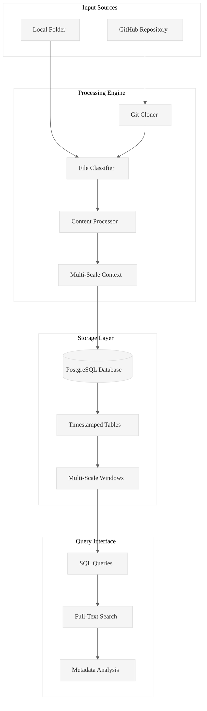
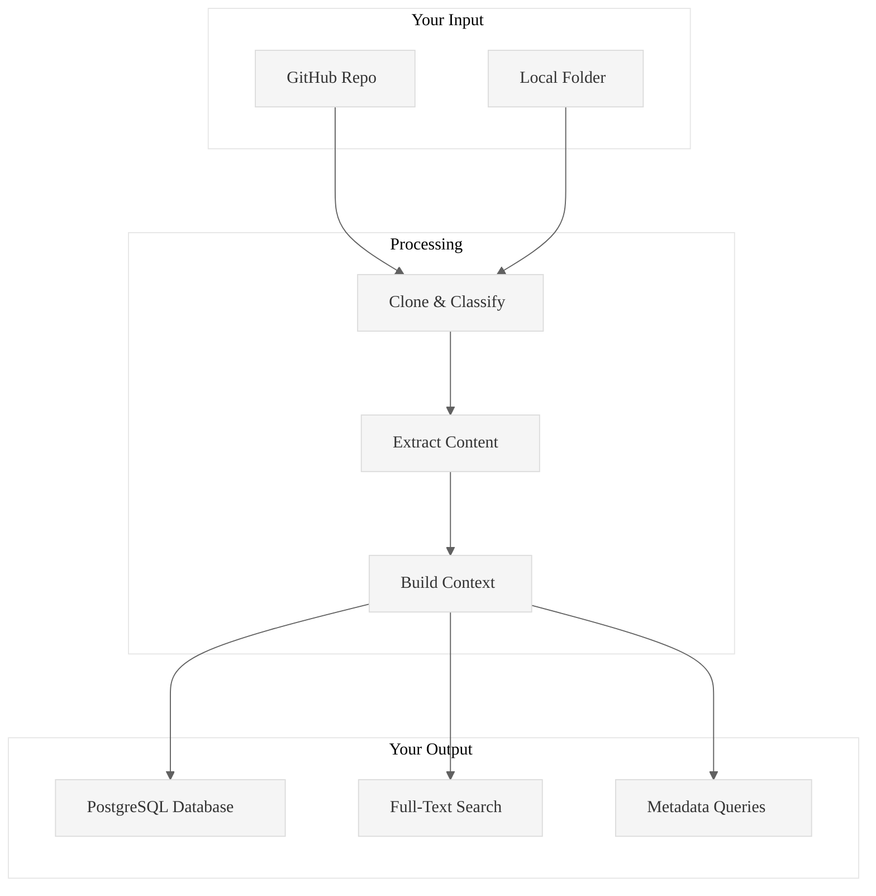
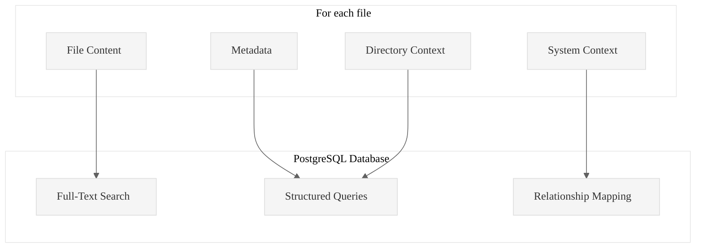

# Code Ingest

**Transform any codebase into queryable PostgreSQL intelligence in seconds.**

Point it at a GitHub repo or local folder. Get back a structured database with full-text search, metadata queries, and multi-scale context windows. That's it.

Code Ingest is a production-ready Rust tool that ingests GitHub repositories, local folders, and documents into PostgreSQL databases, enabling systematic code analysis through SQL queries and structured data exploration.

## Core Value Proposition

**Problem**: Analyzing large codebases manually is time-consuming and inconsistent.  
**Solution**: Automated ingestion + PostgreSQL storage = queryable code intelligence.  
**Result**: 100+ files/second processing with full-text search and metadata analysis.

## Architecture Overview




## What you get

One command gives you everything:

```bash
# Ingest any codebase into PostgreSQL
./target/release/code-ingest ingest https://github.com/user/repo --db-path ./db
```

Result: A queryable PostgreSQL database with full-text search, metadata, and multi-scale context. No more manual file hunting.

## How it works



## Real performance

Tested on actual repos:
- **59 files processed in 1.79 seconds** (XSV repository)
- **9 large files in 1.46 seconds** (local folder)
- **Memory usage under 25MB** for both

## Common workflows

### Ingest any GitHub repo
```bash
./target/release/code-ingest ingest https://github.com/user/repo --db-path ./analysis
```

### Ingest local code or documents
```bash
./target/release/code-ingest ingest /absolute/path/to/folder \
  --folder-flag --db-path ./analysis
```

### Query your ingested code
```bash
# Find all async functions
./target/release/code-ingest sql \
  "SELECT filepath FROM TABLE_NAME WHERE content_text LIKE '%async fn%'" \
  --db-path ./analysis

# List all Rust files with line counts
./target/release/code-ingest sql \
  "SELECT filepath, line_count FROM TABLE_NAME WHERE extension = 'rs'" \
  --db-path ./analysis

# Full-text search across all files
./target/release/code-ingest sql \
  "SELECT filepath, filename FROM TABLE_NAME WHERE content_text ILIKE '%error handling%'" \
  --db-path ./analysis
```

### Explore your database
```bash
# List all ingested tables
./target/release/code-ingest list-tables --db-path ./analysis

# Sample data from a table
./target/release/code-ingest sample --table TABLE_NAME --db-path ./analysis

# Get table schema
./target/release/code-ingest describe --table TABLE_NAME --db-path ./analysis
```

## What you need

- Rust 1.70+
- PostgreSQL 12+
- Git (for repos)

That's it. The tool handles the rest.

## What gets stored



### Database schema
- **File content**: Full text with search indexing
- **Metadata**: File paths, sizes, types, line counts
- **Context windows**: Directory and system-level relationships
- **Timestamps**: When files were ingested and processed

### Query capabilities
- Full-text search across all content
- Metadata filtering (file types, sizes, etc.)
- Pattern matching and regex searches
- Relationship queries between files
- Performance analytics (largest files, most complex, etc.)

## Build it

```bash
git clone <this-repo>
cd pensieve/code-ingest
cargo build --release
```

## File support

Works with most text files (`.rs`, `.py`, `.js`, `.md`, `.json`, etc.). Converts documents (`.pdf`, `.docx`). Stores metadata for binaries.

---

**Stop wandering through codebases. Start with structured data.**

See [READMELongForm20250929.md](READMELongForm20250929.md) for comprehensive documentation and examples.