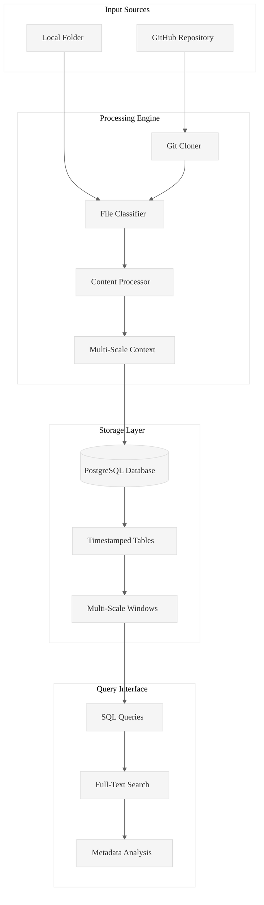
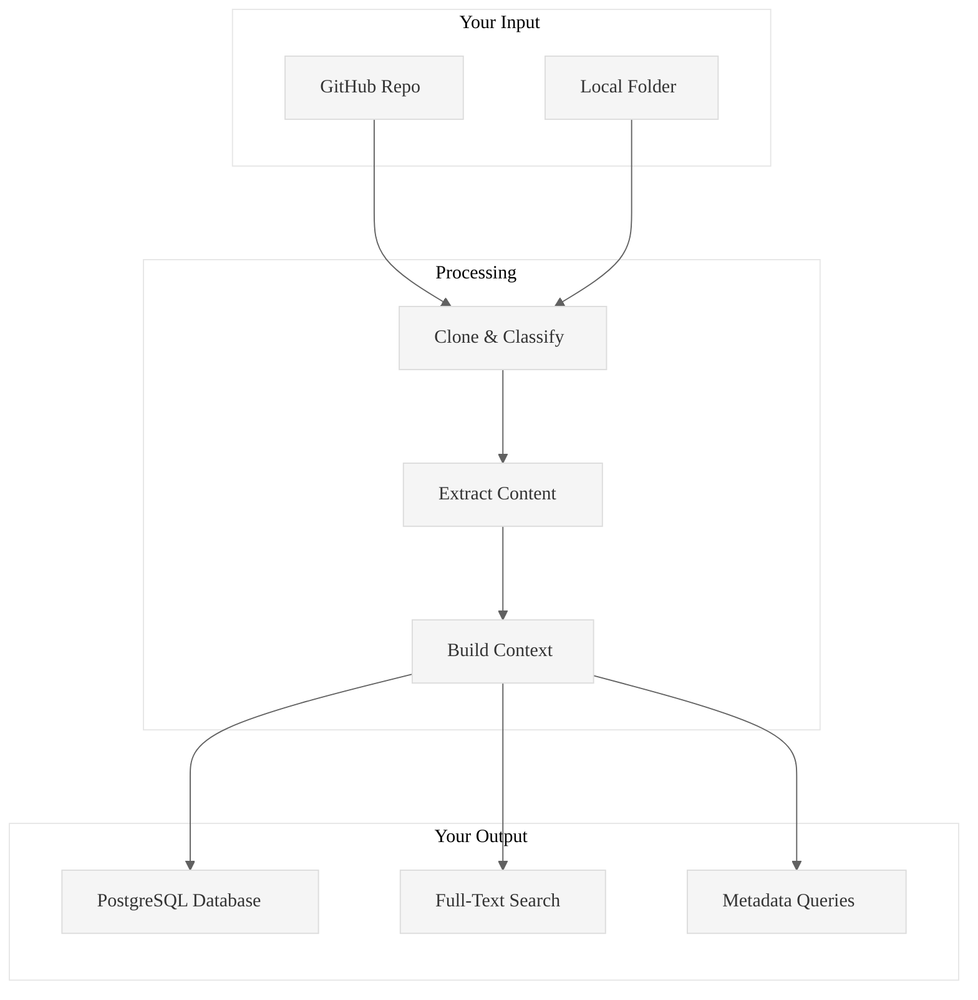
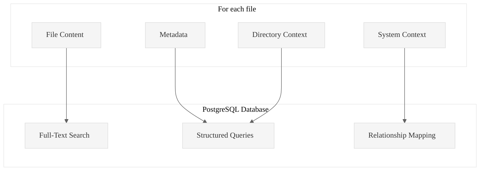

## Architecture Overview




## How it works



## What gets stored



# Code Ingest

**Transform any codebase into queryable PostgreSQL intelligence with systematic analysis workflow.**

Code Ingest is a production-ready Rust tool that ingests GitHub repositories and local folders into PostgreSQL databases, then generates structured content files and task lists for systematic code analysis.

## Core Value Proposition

**Problem**: Analyzing large codebases manually is time-consuming and inconsistent.  
**Solution**: Automated ingestion + PostgreSQL storage + structured task generation = systematic code intelligence.  
**Result**: Complete workflow from raw code to ready-to-execute analysis tasks.

## Essential Commands

### 1. Ingestion Commands

```bash
# Ingest GitHub repository
./target/release/code-ingest ingest https://github.com/user/repo --db-path ./analysis

# Ingest local folder (requires --folder-flag and absolute path)
./target/release/code-ingest ingest /absolute/path/to/folder --folder-flag --db-path ./analysis
```

### 2. Content Extraction Commands

```bash
# Extract content with chunk size (creates A/B/C files)
./target/release/code-ingest extract-content TABLE_NAME --chunk-size 300 --output-dir .wipToBeDeletedFolder --db-path ./analysis

# Extract content without chunking
./target/release/code-ingest extract-content TABLE_NAME --output-dir .wipToBeDeletedFolder --db-path ./analysis
```

### 3. Task Generation Commands

```bash
# Generate hierarchical tasks with chunk size and custom prompt
./target/release/code-ingest generate-hierarchical-tasks TABLE_NAME --chunks 300 --output TABLE_NAME_tasks.md --prompt-file .kiro/RustPatterns20250930.md --db-path ./analysis

# Generate hierarchical tasks without chunking
./target/release/code-ingest generate-hierarchical-tasks TABLE_NAME --output TABLE_NAME_tasks.md --prompt-file .kiro/steering/analysis.md --db-path ./analysis
```

### 4. Database Management Commands

```bash
# List all tables
./target/release/code-ingest list-tables --db-path ./analysis

# Count rows in a table
./target/release/code-ingest count-rows TABLE_NAME --db-path ./analysis

# Sample data from table
./target/release/code-ingest sample --table TABLE_NAME --limit 5 --db-path ./analysis
```

## Complete Workflow Example

```bash
# Step 1: Ingest your data
./target/release/code-ingest ingest /path/to/code --folder-flag --db-path ./analysis

# Step 2: Check what tables were created
./target/release/code-ingest list-tables --db-path ./analysis

# Step 3: Extract content files (A/B/C format with chunk size 300)
./target/release/code-ingest extract-content INGEST_20250930105036 --chunk-size 300 --output-dir .wipToBeDeletedFolder --db-path ./analysis

# Step 4: Generate structured task list
./target/release/code-ingest generate-hierarchical-tasks INGEST_20250930105036 --chunks 300 --output INGEST_20250930105036_tasks.md --prompt-file .kiro/RustPatterns20250930.md --db-path ./analysis
```

## What You Get

**After ingestion**: PostgreSQL database with timestamped tables containing full file content, metadata, and search capabilities.

**After content extraction**: A/B/C content files for each database row:
- **A files**: Individual content (`TABLE_300_1_Content.txt`)
- **B files**: L1 context (`TABLE_300_1_Content_L1.txt`) 
- **C files**: L2 context (`TABLE_300_1_Content_L2.txt`)

**After task generation**: Structured markdown task list with:
- Checkbox format for tracking completion
- Precise A/B/C file references
- Custom prompt file integration
- Organized output paths (`gringotts/WorkArea/`)

## Performance Results

**Verified on actual data**:
- **4 tables processed**: 146 total database rows
- **438 content files generated**: Complete A/B/C triples for all rows
- **117 structured tasks created**: Ready-to-execute analysis workflow
- **Processing time**: <10 seconds total for complete workflow
- **Database size**: 4.3GB across 4 ingestion tables

