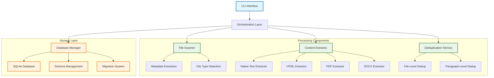
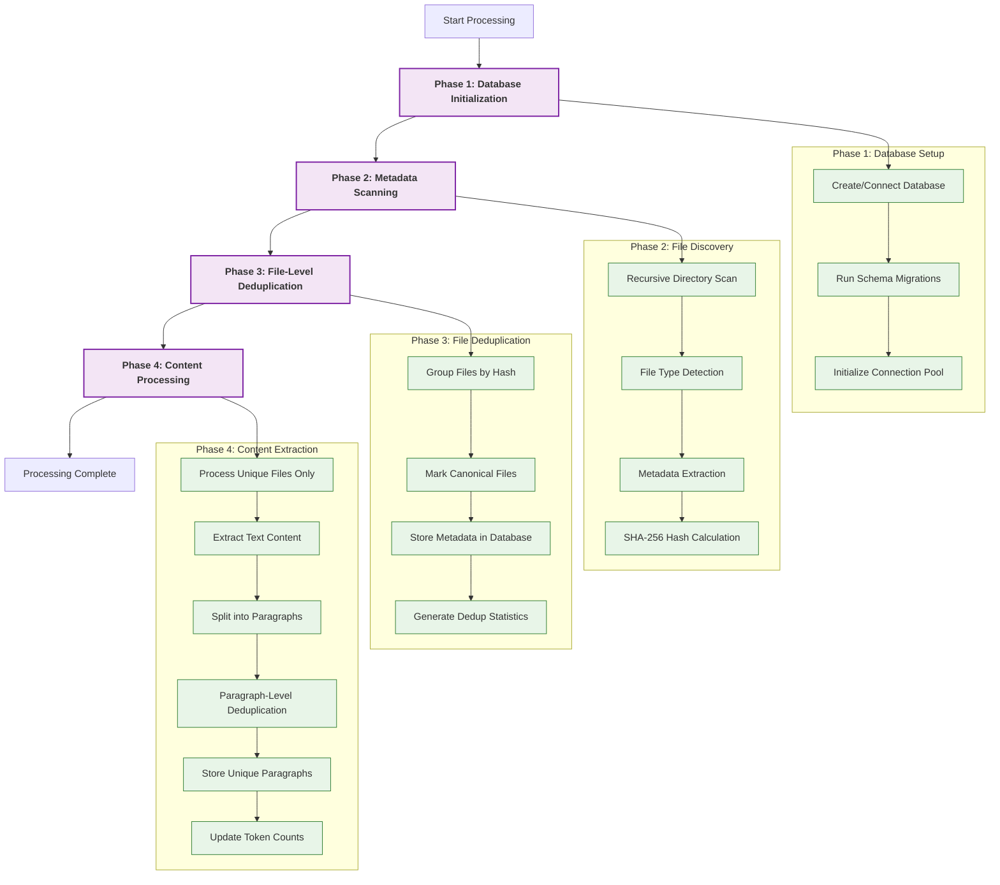
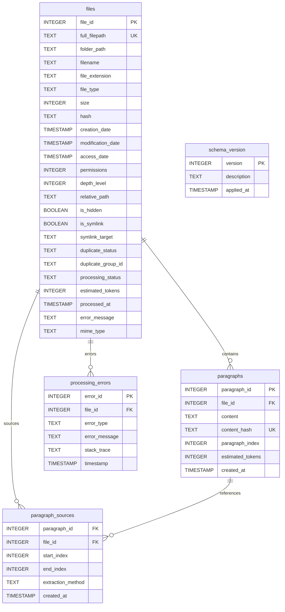

# Pensieve CLI Tool

A high-performance command-line tool designed to quickly ingest text files into a clean, deduplicated database for LLM processing. Pensieve efficiently processes large document collections, removes duplicates at both file and paragraph levels, and creates an optimized corpus that maximizes token usage when querying LLMs for insights, ideas, or analysis.

## Table of Contents

- [Features](#features)
- [Installation](#installation)
- [Quick Start](#quick-start)
- [System Architecture](#system-architecture)
- [Processing Workflow](#processing-workflow)
- [CLI Usage](#cli-usage)
- [Supported File Formats](#supported-file-formats)
- [Configuration](#configuration)
- [Database Schema](#database-schema)
- [Performance](#performance)
- [Troubleshooting](#troubleshooting)
- [Development](#development)

## Features

### Core Capabilities
- **Dual-Level Deduplication**: Eliminates duplicates at both file and paragraph levels
- **High-Performance Processing**: Parallel file scanning and content extraction
- **Native Rust Implementation**: Self-contained binary with no external runtime dependencies
- **Comprehensive File Support**: Handles 50+ text-based file formats
- **LLM-Optimized Output**: Creates clean, tokenized content ready for AI processing
- **Robust Error Handling**: Graceful failure recovery with detailed error reporting
- **Progress Tracking**: Real-time progress indicators and comprehensive statistics

### Advanced Features
- **Content-Based Deduplication**: SHA-256 hashing for accurate duplicate detection
- **Paragraph-Level Processing**: Intelligent content splitting and deduplication
- **Database Migrations**: Schema versioning and upgrade management
- **Batch Operations**: Optimized database operations for large datasets
- **Dry Run Mode**: Preview operations without making changes
- **Comprehensive Statistics**: Detailed reporting on processing results

## Installation

### Prerequisites
- Rust 1.70+ (for building from source)
- SQLite 3.35+ (embedded, no separate installation needed)

### From Source
```bash
# Clone the repository
git clone <repository-url>
cd pensieve-cli-tool

# Build the release binary
cargo build --release

# The binary will be available at target/release/pensieve
```

### Quick Test
```bash
# Verify installation
cargo run -- --help

# Initialize a test database
cargo run -- init --database test.db
```

## Quick Start

### Basic Usage
```bash
# 1. Initialize a new database
pensieve init --database my_documents.db

# 2. Process a directory of documents
pensieve --input ~/Documents --database my_documents.db

# 3. View processing statistics
pensieve stats --database my_documents.db
```

### Example Output
```
Pensieve v1.0.0 - Text Ingestion Tool

Phase 1: Initializing database...
Database initialized successfully

Phase 2: Scanning files and extracting metadata...
Metadata scanning complete: 15,432 files discovered

Summary:
  Total files: 15,432
  Unique files: 12,011
  Duplicate files: 3,421
  Total size: 2.1 GB
  Deduplication rate: 22.2%

Phase 3: Processing deduplication and storing metadata...
Files stored: 15,432
Duplicate groups: 1,205
Space savings: 467.3 MB

Phase 4: Content processing...
Processing content for 12,011 unique files...
Content Processing Complete:
  Files processed: 11,987
  Processing errors: 24
  Total paragraphs processed: 145,678
  Unique paragraphs stored: 95,847
  Paragraphs deduplicated: 49,831 (34.2%)
  Total tokens: 2,847,392

Ingestion workflow completed successfully!
```

## System Architecture

The Pensieve CLI tool follows a layered architecture designed for performance, reliability, and maintainability:



### Architecture Layers

1. **CLI Interface Layer**: Command parsing, argument validation, and user interaction
2. **Orchestration Layer**: Coordinates the processing workflow and manages component interactions
3. **Processing Layer**: File scanning, content extraction, and deduplication logic
4. **Storage Layer**: Database operations, schema management, and data persistence

## Processing Workflow

Pensieve processes documents through a carefully orchestrated four-phase workflow:



### Workflow Details

**Phase 1: Database Initialization**
- Creates or connects to SQLite database
- Runs any pending schema migrations
- Initializes connection pool for optimal performance

**Phase 2: Metadata Scanning**
- Recursively scans input directory using parallel processing
- Detects file types using MIME type analysis and extensions
- Extracts comprehensive metadata (size, dates, permissions)
- Calculates SHA-256 hashes for content-based deduplication

**Phase 3: File-Level Deduplication**
- Groups files by content hash to identify duplicates
- Marks the first occurrence as "canonical" for processing
- Stores all metadata in database with deduplication status
- Generates statistics on space savings and duplicate groups

**Phase 4: Content Processing**
- Processes only unique/canonical files to avoid redundant work
- Extracts text content using format-specific extractors
- Splits content into paragraphs using intelligent boundaries
- Performs paragraph-level deduplication using content hashes
- Stores unique paragraphs with source file references
- Updates files with estimated token counts

## CLI Usage

### Main Commands

#### Basic Ingestion
```bash
# Process a directory with default settings
pensieve --input /path/to/documents --database output.db

# Verbose output with progress details
pensieve --input /path/to/documents --database output.db --verbose

# Dry run to preview operations without changes
pensieve --input /path/to/documents --database output.db --dry-run

# Force reprocessing of all files (ignore previous state)
pensieve --input /path/to/documents --database output.db --force-reprocess
```

#### Database Management
```bash
# Initialize a new database
pensieve init --database new_database.db

# View processing statistics
pensieve stats --database existing.db

# Check external tool dependencies
pensieve check-deps

# Generate default configuration file
pensieve config --output pensieve.toml
```

#### Migration Commands
```bash
# Run database migrations
pensieve migrate --database my.db up

# Check migration status
pensieve migrate --database my.db status

# Rollback to specific version
pensieve migrate --database my.db rollback 2

# Validate database schema
pensieve migrate --database my.db validate

# Reset database (WARNING: deletes all data)
pensieve migrate --database my.db reset --confirm
```

### Command Options

| Option | Short | Description | Example |
|--------|-------|-------------|---------|
| `--input` | `-i` | Input directory to scan | `-i ~/Documents` |
| `--database` | `-d` | SQLite database file path | `-d pensieve.db` |
| `--verbose` | `-v` | Enable verbose output | `-v` |
| `--dry-run` | | Preview without changes | `--dry-run` |
| `--force-reprocess` | | Ignore previous processing state | `--force-reprocess` |
| `--config` | `-c` | Configuration file path | `-c config.toml` |
| `--help` | `-h` | Show help information | `--help` |
| `--version` | | Show version information | `--version` |

### Exit Codes

| Code | Meaning | Description |
|------|---------|-------------|
| 0 | Success | Operation completed successfully |
| 1 | General Error | Unspecified error occurred |
| 2 | CLI Arguments | Invalid command line arguments |
| 3 | File System | File or directory access error |
| 4 | Database | Database operation error |
| 5 | Processing | Content processing error |

## Supported File Formats

Pensieve supports a comprehensive range of text-based file formats through native Rust implementations:

### Text and Documentation Formats
- **Plain Text**: `.txt`, `.md`, `.rst`, `.org`, `.adoc`, `.wiki`
- **Documentation**: `.tex`, `.bib`

### Source Code Files
- **Systems**: `.rs`, `.c`, `.cpp`, `.h`, `.hpp`, `.go`
- **Web**: `.js`, `.ts`, `.html`, `.css`, `.xml`
- **Scripting**: `.py`, `.rb`, `.php`, `.pl`, `.lua`, `.r`, `.m`
- **JVM**: `.java`, `.scala`, `.clj`, `.kt`
- **Functional**: `.hs`, `.elm`
- **Mobile**: `.swift`

### Configuration and Data Files
- **Structured Data**: `.json`, `.yaml`, `.yml`, `.toml`
- **Configuration**: `.ini`, `.cfg`, `.env`, `.properties`, `.conf`
- **Data**: `.csv`, `.tsv`, `.log`, `.sql`

### Scripts and System Files
- **Shell Scripts**: `.sh`, `.bat`, `.ps1`
- **Docker**: `.dockerfile`
- **Git**: `.gitignore`

### Document Formats (Native Processing)
- **Web**: `.html`, `.htm`, `.xhtml`
- **PDF**: `.pdf` (basic text extraction)
- **Office**: `.docx` (basic text extraction)
- **Spreadsheets**: `.xls`, `.xlsx` (text content only)

### Excluded Binary Formats
Pensieve automatically excludes binary files that don't contain extractable text:
- **Images**: `.jpg`, `.png`, `.gif`, `.bmp`, `.svg`, `.ico`, `.tiff`, `.webp`
- **Videos**: `.mp4`, `.avi`, `.mov`, `.mkv`, `.wmv`, `.flv`
- **Audio**: `.mp3`, `.wav`, `.flac`, `.ogg`, `.aac`, `.wma`
- **Archives**: `.zip`, `.tar`, `.gz`, `.rar`, `.7z`, `.bz2`
- **Executables**: `.exe`, `.bin`, `.app`, `.dmg`, `.msi`
- **Libraries**: `.dll`, `.so`, `.dylib`

### Format Detection
Pensieve uses multiple methods for accurate file type detection:
1. **File Extension Analysis**: Primary method for format identification
2. **MIME Type Detection**: Secondary validation using magic number analysis
3. **Content Sniffing**: Fallback for files with missing or incorrect extensions

## Configuration

### Configuration File
Generate a default configuration file:
```bash
pensieve config --output pensieve.toml
```

### Sample Configuration
```toml
# Pensieve Configuration File
# Generated by Pensieve CLI Tool

[general]
# Default input directory (can be overridden by CLI)
input_directory = "~/Documents"

# Default database path (can be overridden by CLI)
database_path = "./pensieve.db"

# Enable verbose output by default
verbose = false

# Default to dry-run mode (preview only)
dry_run = false

[processing]
# Paragraph splitting method
paragraph_splitting = "double_newline"  # Options: double_newline, sentence_boundary

# Minimum paragraph length (characters)
min_paragraph_length = 10

# Maximum paragraph length (characters)
max_paragraph_length = 10000

# Token estimation method
token_estimation = "simple"  # Options: simple, tiktoken

[performance]
# Number of parallel processing threads (0 = auto-detect)
thread_count = 0

# Database connection pool size
db_pool_size = 10

# Batch size for database operations
batch_size = 1000

# File processing timeout (seconds)
processing_timeout = 300

[deduplication]
# Enable file-level deduplication
file_deduplication = true

# Enable paragraph-level deduplication
paragraph_deduplication = true

# Hash algorithm for deduplication
hash_algorithm = "sha256"

# File extensions to process (case-insensitive)
file_extensions = [
    # Text files
    "txt", "md", "rst", "org", "adoc", "wiki", "tex", "bib",
    
    # Source code
    "rs", "py", "js", "ts", "java", "go", "c", "cpp", "h", "hpp",
    "php", "rb", "swift", "kt", "scala", "clj", "hs", "elm", "lua",
    "pl", "r", "m",
    
    # Web and markup
    "html", "htm", "xhtml", "css", "xml",
    
    # Configuration and data
    "json", "yaml", "yml", "toml", "ini", "cfg", "env", "properties",
    "conf", "csv", "tsv", "log", "sql",
    
    # Scripts
    "sh", "bat", "ps1", "dockerfile", "gitignore",
    
    # Documents (basic extraction)
    "pdf", "docx", "xls", "xlsx"
]

# Binary file extensions to explicitly exclude
excluded_extensions = [
    # Images
    "jpg", "jpeg", "png", "gif", "bmp", "svg", "ico", "tiff", "webp",
    
    # Videos
    "mp4", "avi", "mov", "mkv", "wmv", "flv", "webm",
    
    # Audio
    "mp3", "wav", "flac", "ogg", "aac", "wma", "m4a",
    
    # Archives
    "zip", "tar", "gz", "rar", "7z", "bz2", "xz",
    
    # Executables
    "exe", "bin", "app", "dmg", "msi", "deb", "rpm",
    
    # Libraries
    "dll", "so", "dylib", "lib", "a"
]

[database]
# SQLite journal mode
journal_mode = "WAL"  # Options: DELETE, TRUNCATE, PERSIST, MEMORY, WAL, OFF

# SQLite synchronous mode
synchronous = "NORMAL"  # Options: OFF, NORMAL, FULL, EXTRA

# Enable foreign key constraints
foreign_keys = true

# Database page size (bytes)
page_size = 4096

# Cache size (pages)
cache_size = 10000

[logging]
# Log level
level = "info"  # Options: error, warn, info, debug, trace

# Log format
format = "human"  # Options: human, json

# Log to file
log_file = "pensieve.log"

# Enable file logging
file_logging = false
```

## Database Schema

Pensieve uses a carefully designed SQLite schema optimized for LLM processing workflows:



### Key Schema Features

**Files Table**
- Comprehensive metadata storage with deduplication tracking
- Processing status and error message fields
- Support for symbolic links and hidden files
- Estimated token counts for LLM planning

**Paragraphs Table**
- Content-hash based deduplication
- Paragraph indexing within source files
- Token count estimation for each paragraph

**Paragraph Sources Table**
- Many-to-many relationship between paragraphs and files
- Tracks extraction method and source location
- Enables paragraph provenance tracking

**Processing Errors Table**
- Detailed error logging for debugging
- Links errors to specific files
- Stack trace preservation for development

## Performance

### Benchmarks
Pensieve is designed for high-performance processing of large document collections:

| Metric | Performance | Notes |
|--------|-------------|-------|
| File Scanning | 10,000+ files/sec | Parallel directory traversal |
| Hash Calculation | 500+ MB/sec | SHA-256 with buffered I/O |
| Database Writes | 50,000+ records/sec | Batch operations with WAL mode |
| Content Extraction | 1,000+ files/sec | Format-dependent, parallel processing |
| Memory Usage | <16GB for 500GB corpus | Streaming processing, bounded memory |

### Optimization Features
- **Parallel Processing**: Multi-threaded file scanning and content extraction
- **Batch Operations**: Optimized database insertions with configurable batch sizes
- **Connection Pooling**: Efficient database connection management
- **Streaming I/O**: Memory-efficient processing of large files
- **WAL Mode**: SQLite Write-Ahead Logging for concurrent access
- **Indexed Queries**: Optimized database schema with strategic indexes

### Scalability
- **Large Corpora**: Tested with 500GB+ document collections
- **Deep Hierarchies**: Handles directory structures 50+ levels deep
- **High Duplicate Ratios**: Efficient processing even with 90%+ duplicate content
- **Mixed File Types**: Optimized for diverse file format distributions

## Troubleshooting

### Common Issues and Solutions

#### Database Issues

**Issue**: `Database is locked`
```
Error: Database error: database is locked
```
**Solution**: 
- Ensure no other Pensieve processes are running
- Check for stale lock files in the database directory
- Use `pensieve migrate --database my.db validate` to check database integrity

**Issue**: `Schema version mismatch`
```
Error: Database schema version 2 is newer than expected version 1
```
**Solution**:
- Run database migrations: `pensieve migrate --database my.db up`
- Check migration status: `pensieve migrate --database my.db status`

#### File Processing Issues

**Issue**: `Permission denied` errors
```
Error: Permission denied accessing file: /path/to/file.txt
```
**Solution**:
- Check file and directory permissions
- Run with appropriate user privileges
- Use `--verbose` flag to identify specific problematic files

**Issue**: `Unsupported file type`
```
Error: Unsupported file type: xyz
```
**Solution**:
- Check the [Supported File Formats](#supported-file-formats) section
- Verify file extension is correct
- Use `pensieve check-deps` to verify external tool availability

#### Performance Issues

**Issue**: Slow processing on large directories
**Solution**:
- Increase thread count in configuration: `thread_count = 16`
- Use SSD storage for database
- Increase database cache size: `cache_size = 50000`
- Consider processing subdirectories separately

**Issue**: High memory usage
**Solution**:
- Reduce batch size: `batch_size = 500`
- Process smaller directory chunks
- Ensure adequate swap space is available

#### Content Extraction Issues

**Issue**: Empty content extracted from PDF files
**Solution**:
- Verify PDF contains extractable text (not just images)
- Check if PDF is password-protected
- Try with different PDF files to isolate the issue

**Issue**: Garbled text from certain file types
**Solution**:
- Check file encoding (Pensieve assumes UTF-8)
- Verify file is not corrupted
- Use `--verbose` to see detailed extraction logs

### Debug Mode

Enable verbose logging for detailed troubleshooting:
```bash
# Enable verbose output
pensieve --input /path --database db.sqlite --verbose

# Dry run with verbose output
pensieve --input /path --database db.sqlite --dry-run --verbose
```

### Log Analysis

Check processing logs for detailed error information:
```bash
# View recent errors from database
pensieve stats --database my.db

# Check system logs (if file logging enabled)
tail -f pensieve.log
```

### Getting Help

1. **Check Documentation**: Review this README and inline help (`--help`)
2. **Validate Setup**: Run `pensieve check-deps` to verify dependencies
3. **Test with Sample Data**: Try processing a small, known-good directory first
4. **Enable Verbose Mode**: Use `--verbose` flag for detailed operation logs
5. **Check Database**: Use migration commands to validate database integrity

## Development

### Project Structure

```
src/
├── lib.rs          # Main library entry point with module exports
├── main.rs         # CLI application entry point
├── cli.rs          # Command-line interface and argument parsing
├── types.rs        # Core data structures and type definitions
├── errors.rs       # Comprehensive error handling hierarchy
├── scanner.rs      # File system scanning and metadata extraction
├── extractor.rs    # Content extraction from various file formats
├── database.rs     # Database operations and schema management
└── deduplication.rs # File and paragraph deduplication logic

tests/
├── end_to_end_integration.rs     # Complete workflow testing
├── file_type_detection_integration.rs # File type detection tests
└── metadata_scanning_integration.rs   # Metadata extraction tests

migrations/
├── 001_initial_schema.sql        # Initial database schema
├── 002_performance_indexes.sql   # Performance optimization indexes
├── 003_mime_type_support.sql     # MIME type detection support
└── 004_add_processing_stats.sql  # Processing statistics tables
```

### Core Dependencies

| Crate | Version | Purpose |
|-------|---------|---------|
| `clap` | 4.0+ | CLI argument parsing with derive macros |
| `sqlx` | 0.7+ | Async SQLite database operations |
| `tokio` | 1.0+ | Async runtime for concurrent processing |
| `sha2` | 0.10+ | SHA-256 hashing for content deduplication |
| `walkdir` | 2.3+ | Recursive directory traversal |
| `mime_guess` | 2.0+ | File type detection |
| `thiserror` | 1.0+ | Structured error handling for libraries |
| `anyhow` | 1.0+ | Error context for applications |
| `chrono` | 0.4+ | Date/time handling with UTC support |
| `uuid` | 1.0+ | Unique identifier generation |
| `serde` | 1.0+ | Serialization/deserialization |

### Building from Source

```bash
# Clone repository
git clone <repository-url>
cd pensieve-cli-tool

# Build debug version
cargo build

# Build optimized release version
cargo build --release

# Run tests
cargo test

# Run with sample data
cargo run -- --input test_data --database test.db --verbose
```

### Testing

```bash
# Run all tests
cargo test

# Run specific test suite
cargo test end_to_end_integration

# Run tests with output
cargo test -- --nocapture

# Run performance benchmarks
cargo bench
```

### Contributing

1. **Code Style**: Follow standard Rust formatting (`cargo fmt`)
2. **Linting**: Ensure no clippy warnings (`cargo clippy`)
3. **Testing**: Add tests for new functionality
4. **Documentation**: Update README and inline docs
5. **Performance**: Benchmark performance-critical changes

---

**Pensieve CLI Tool** - Efficiently transform document collections into LLM-ready knowledge bases with intelligent deduplication and optimized token usage.