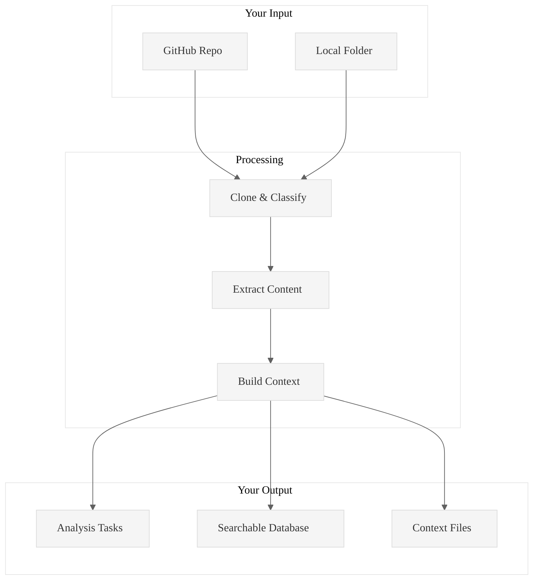
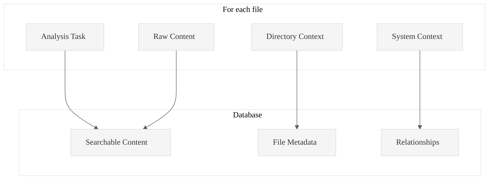

# Code Ingest

**Turn any codebase into structured analysis tasks in seconds**

Point it at a GitHub repo or local folder. Get back organized tasks for systematic code review. That's it.

## What you get

Two commands give you everything:

```bash
# 1. Ingest code
./target/release/code-ingest ingest https://github.com/user/repo --db-path ./db

# 2. Get analysis tasks  
./target/release/code-ingest generate-hierarchical-tasks TABLE_NAME \
  --levels 4 --groups 7 --output tasks.md --db-path ./db
```

Result: Structured markdown files with systematic analysis tasks. No more staring at random files wondering where to start.

## How it works



## Real performance

Tested on actual repos:
- **59 files processed in 1.79 seconds** (XSV repository)
- **9 large files in 1.46 seconds** (local folder)
- **Memory usage under 25MB** for both

## Common workflows

### Analyze any GitHub repo
```bash
./target/release/code-ingest ingest https://github.com/user/repo --db-path ./analysis
./target/release/code-ingest generate-hierarchical-tasks TABLE_NAME \
  --output tasks.md --db-path ./analysis
```

### Analyze local code
```bash
./target/release/code-ingest ingest /absolute/path/to/code \
  --folder-flag --db-path ./analysis
./target/release/code-ingest generate-hierarchical-tasks TABLE_NAME \
  --output tasks.md --db-path ./analysis
```

### Break down large files
```bash
# Split files into 50-line chunks for detailed review
./target/release/code-ingest generate-hierarchical-tasks TABLE_NAME \
  --chunks 50 --output detailed-tasks.md --db-path ./analysis
```

### Search your code
```bash
# Find all async functions
./target/release/code-ingest sql \
  "SELECT filepath FROM TABLE_NAME WHERE content_text LIKE '%async fn%'" \
  --db-path ./analysis

# List all Rust files
./target/release/code-ingest sql \
  "SELECT filepath, line_count FROM TABLE_NAME WHERE extension = 'rs'" \
  --db-path ./analysis
```

## What you need

- Rust 1.70+
- PostgreSQL 12+
- Git (for repos)

That's it. The tool handles the rest.

## What gets generated



### Task files
- **File-level**: One task per file
- **Chunked**: One task per 50-line chunk (for large files)

### Content files
- **Raw**: Original file content
- **Context**: How it fits with other files
- **Architecture**: System-level patterns

### Database
- Full-text search across all content
- Metadata queries (file types, sizes, etc.)
- Relationship mapping between files

## Build it

```bash
git clone <this-repo>
cd pensieve/code-ingest
cargo build --release
```

## File support

Works with most text files (`.rs`, `.py`, `.js`, `.md`, `.json`, etc.). Converts documents (`.pdf`, `.docx`). Stores metadata for binaries.

---

**Stop wandering through codebases. Start with a plan.**

See [READMELongForm20250929.md](READMELongForm20250929.md) for technical details.