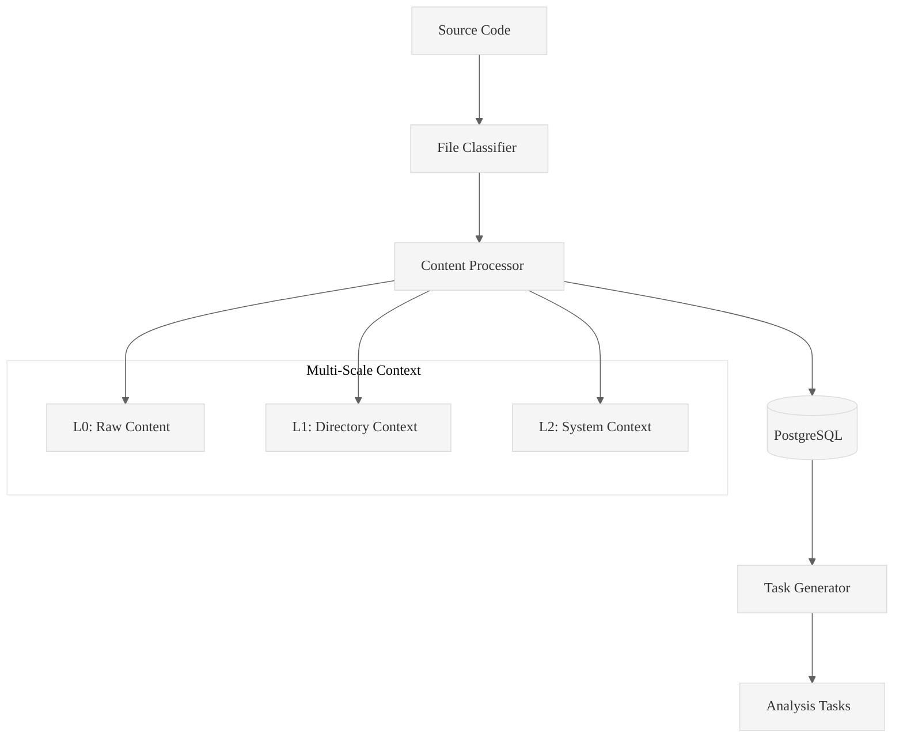

# Code Ingest

**High-performance Rust tool for systematic codebase analysis**

Transform GitHub repositories and local folders into queryable PostgreSQL databases with hierarchical task generation for methodical code analysis.

## Quick Start

```bash
# Build
cargo build --release

# Ingest GitHub repository
./target/release/code-ingest ingest https://github.com/BurntSushi/xsv --db-path ./database

# Ingest local folder
./target/release/code-ingest ingest /path/to/folder --folder-flag --db-path ./database

# Generate analysis tasks
./target/release/code-ingest generate-hierarchical-tasks TABLE_NAME \
  --levels 4 --groups 7 --output tasks.md --db-path ./database
```

## Core Features

- **🚀 High Performance**: 100+ files/second processing
- **🎯 Multi-Scale Context**: Automatic L1/L2 context window generation
- **📊 Hierarchical Tasks**: Structured analysis with 4-level task hierarchies
- **🔄 Chunked Analysis**: Split large files into 50-line manageable chunks
- **💾 PostgreSQL Storage**: Optimized database schema with full-text search
- **🔍 SQL Interface**: Direct query access to ingested code

## Architecture



## Validated Performance

### XSV Repository Test
- **Files**: 59 processed in 1.79s (32.96 files/sec)
- **Tasks**: 194 chunks generated from 50-line splits
- **Memory**: 8.04 MB peak usage

### Local Folder Test  
- **Files**: 9 files (4.3MB) in 1.46s
- **Tasks**: 1,551 chunks for detailed analysis
- **Memory**: 10.84 MB peak usage

## Usage Examples

### Basic Ingestion
```bash
# GitHub repository
./target/release/code-ingest ingest https://github.com/user/repo --db-path ./db

# Local folder (requires absolute path)
./target/release/code-ingest ingest /absolute/path/to/code --folder-flag --db-path ./db
```

### Task Generation
```bash
# File-level analysis
./target/release/code-ingest generate-hierarchical-tasks INGEST_20250929040158 \
  --levels 4 --groups 7 --output file-tasks.md --db-path ./db

# Chunked analysis (50 lines per chunk)
./target/release/code-ingest generate-hierarchical-tasks INGEST_20250929040158 \
  --chunks 50 --output chunked-tasks.md --db-path ./db
```

### Data Exploration
```bash
# List tables
./target/release/code-ingest list-tables --db-path ./db

# Query data
./target/release/code-ingest sql \
  "SELECT filepath, line_count FROM INGEST_20250929040158 WHERE extension = 'rs'" \
  --db-path ./db

# Sample data
./target/release/code-ingest sample --table INGEST_20250929040158 --limit 5 --db-path ./db
```

## File Support

| Type | Extensions | Processing |
|------|------------|------------|
| **Text** | `.rs`, `.py`, `.js`, `.md`, `.json`, etc. | Full content + metrics |
| **Convertible** | `.pdf`, `.docx`, `.xlsx` | External tool conversion |
| **Binary** | `.jpg`, `.png`, `.zip`, etc. | Metadata only |

## Requirements

- **Rust**: 1.70+
- **PostgreSQL**: 12+
- **Git**: For repository cloning
- **Optional**: `pdftotext`, `pandoc` for document conversion

## Database Schema

```sql
CREATE TABLE INGEST_YYYYMMDDHHMMSS (
    file_id BIGSERIAL PRIMARY KEY,
    filepath VARCHAR NOT NULL,
    content_text TEXT,
    parent_filepath VARCHAR,      -- L1 grouping
    l1_window_content TEXT,       -- Directory context  
    l2_window_content TEXT,       -- System context
    ast_patterns JSONB,           -- Semantic patterns
    -- ... metadata columns
);
```

## Generated Outputs

### Task Files
- **File-level**: One task per file for systematic review
- **Chunked**: One task per 50-line chunk for detailed analysis

### Content Files  
- **A Files**: Raw file content
- **B Files**: L1 context (directory-level relationships)
- **C Files**: L2 context (system-level architecture)

## Performance Tuning

```bash
# Adjust concurrency
export CODE_INGEST_MAX_CONCURRENCY=8

# PostgreSQL optimization (automatic)
# - Connection pooling: 20 max connections
# - Session optimization: work_mem, temp_buffers
# - Indexing: Full-text search, metadata queries
```

## Development

```bash
# Build and test
cargo build --release
cargo test

# Run with debug logging
RUST_LOG=debug ./target/release/code-ingest ingest <source> --db-path <db>
```

## License

MIT License

---

**Transform any codebase into queryable intelligence in seconds.**

For detailed documentation, see [READMELongForm20250929.md](READMELongForm20250929.md).