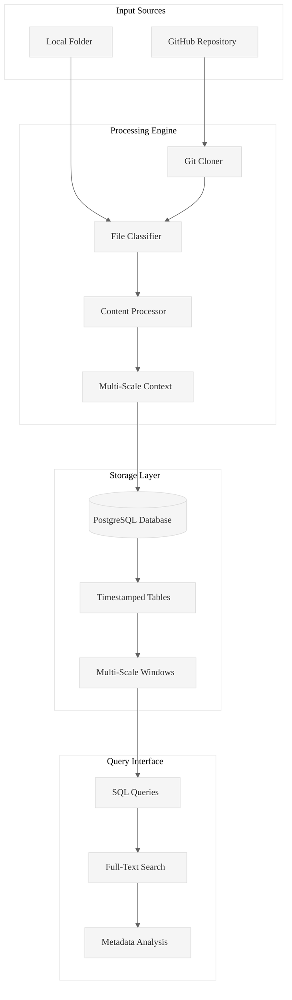
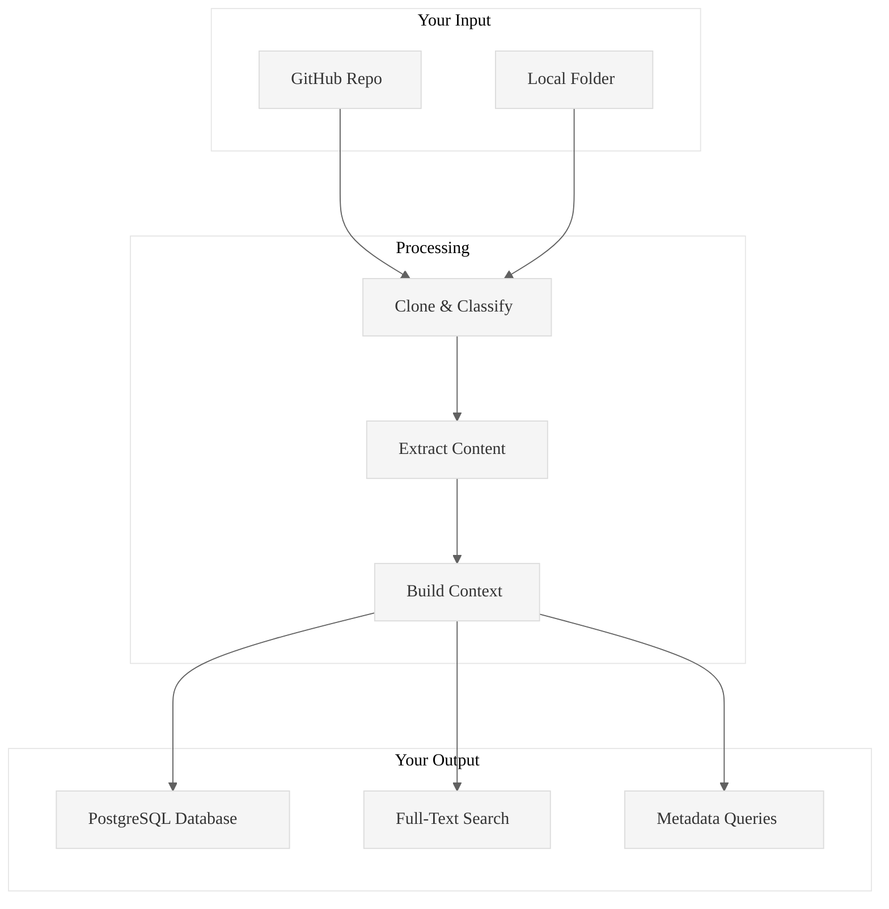
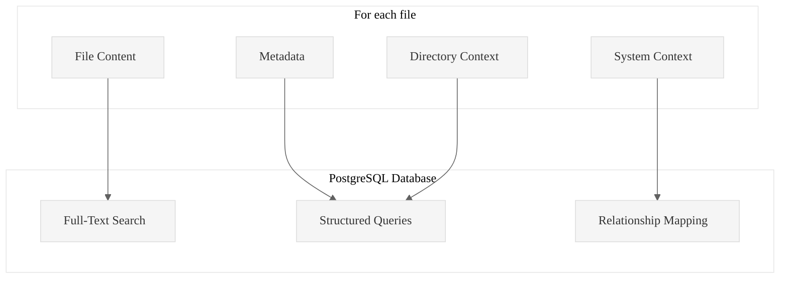

## Architecture Overview

```mermaid
%%{init: {
  "theme": "base",
  "themeVariables": {
    "primaryColor": "#F5F5F5",
    "secondaryColor": "#E0E0E0",
    "lineColor": "#616161",
    "textColor": "#212121",
    "fontSize": "16px",
    "fontFamily": "Helvetica, Arial, sans-serif"
  },
  "flowchart": {
    "nodeSpacing": 70,
    "rankSpacing": 80,
    "wrappingWidth": 160,
    "curve": "basis"
  },
  "useMaxWidth": false
}}%%

flowchart TD
    subgraph "Input Sources"
        A[GitHub Repository]
        B[Local Folder]
    end
    
    subgraph "Processing Engine"
        C[Git Cloner]
        D[File Classifier]
        E[Content Processor]
        F[Multi-Scale Context]
    end
    
    subgraph "Storage Layer"
        G[(PostgreSQL Database)]
        H[Timestamped Tables]
        I[Multi-Scale Windows]
    end
    
    subgraph "Query Interface"
        J[SQL Queries]
        K[Full-Text Search]
        L[Metadata Analysis]
    end
    
    A --> C
    B --> D
    C --> D
    D --> E
    E --> F
    F --> G
    G --> H
    H --> I
    I --> J
    J --> K
    K --> L
```

## How it works

```mermaid
%%{init: {
  "theme": "base",
  "themeVariables": {
    "primaryColor": "#F5F5F5",
    "secondaryColor": "#E0E0E0",
    "lineColor": "#616161",
    "textColor": "#212121",
    "fontSize": "16px",
    "fontFamily": "Helvetica, Arial, sans-serif"
  },
  "flowchart": {
    "nodeSpacing": 70,
    "rankSpacing": 80,
    "wrappingWidth": 160,
    "curve": "basis"
  },
  "useMaxWidth": false
}}%%

flowchart TD
    subgraph "Your Input"
        A[GitHub Repo]
        B[Local Folder]
    end
    
    subgraph "Processing"
        C[Clone & Classify]
        D[Extract Content]
        E[Build Context]
    end
    
    subgraph "Your Output"
        F[PostgreSQL Database]
        G[Full-Text Search]
        H[Metadata Queries]
    end
    
    A --> C
    B --> C
    C --> D
    D --> E
    E --> F
    E --> G
    E --> H
```

## What gets stored

```mermaid
%%{init: {
  "theme": "base",
  "themeVariables": {
    "primaryColor": "#F5F5F5",
    "secondaryColor": "#E0E0E0",
    "lineColor": "#616161",
    "textColor": "#212121",
    "fontSize": "16px",
    "fontFamily": "Helvetica, Arial, sans-serif"
  },
  "flowchart": {
    "nodeSpacing": 70,
    "rankSpacing": 80,
    "wrappingWidth": 160,
    "curve": "basis"
  },
  "useMaxWidth": false
}}%%

flowchart TD
    subgraph "For each file"
        A[File Content]
        B[Metadata]
        C[Directory Context]
        D[System Context]
    end
    
    subgraph "PostgreSQL Database"
        E[Full-Text Search]
        F[Structured Queries]
        G[Relationship Mapping]
    end
    
    A --> E
    B --> F
    C --> F
    D --> G
```

