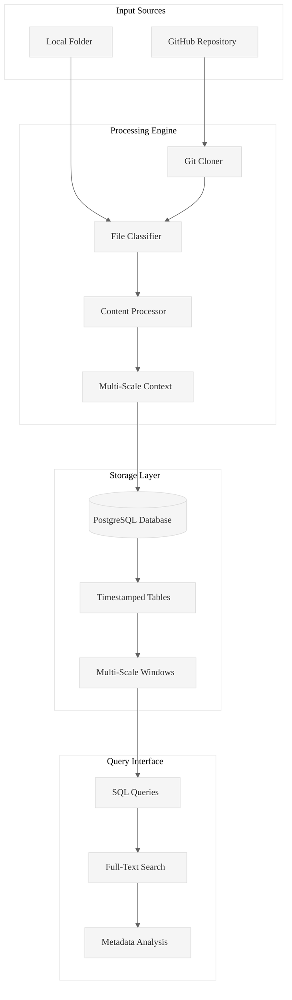
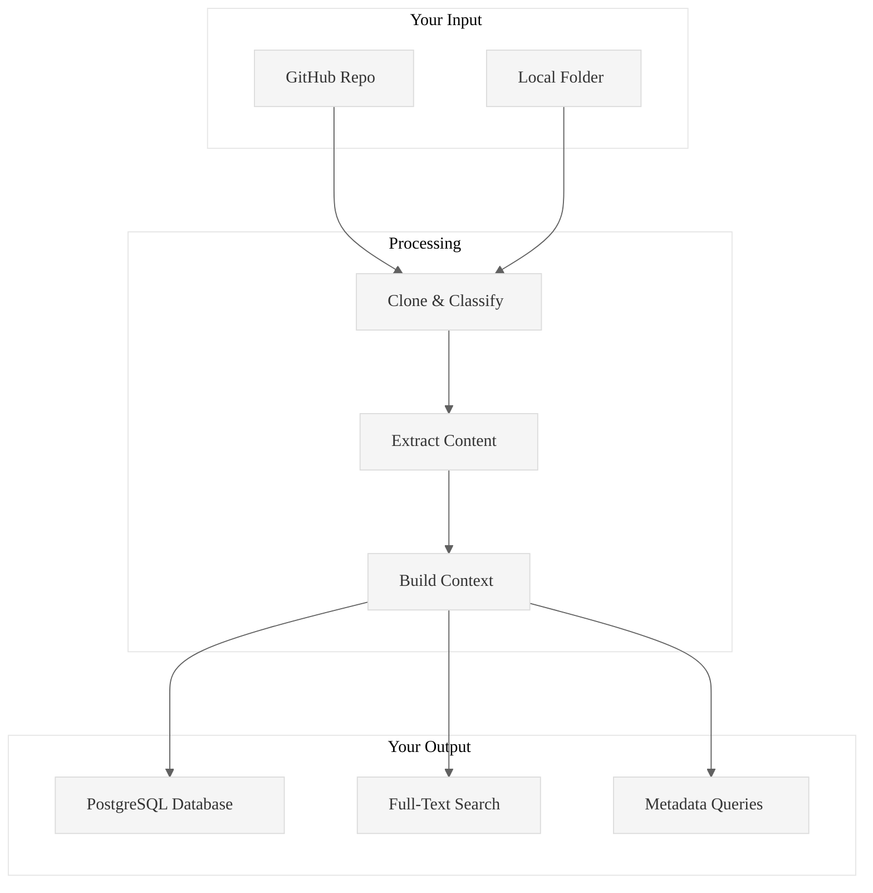
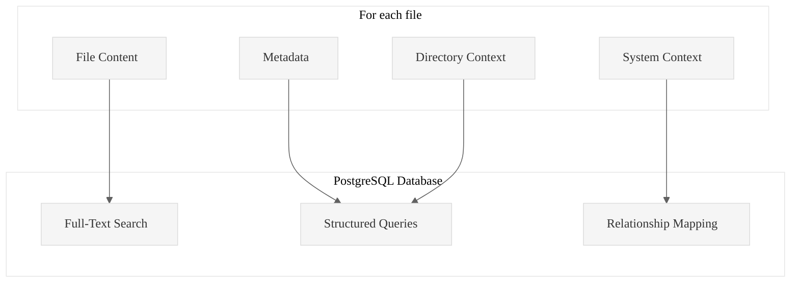

# Code Ingest

**Transform any codebase into queryable PostgreSQL intelligence in seconds.**

Point it at a GitHub repo or local folder. Get back a structured database with full-text search, metadata queries, and multi-scale context windows. That's it.

Code Ingest is a production-ready Rust tool that ingests GitHub repositories, local folders, and documents into PostgreSQL databases, enabling systematic code analysis through SQL queries and structured data exploration.

## Core Value Proposition

**Problem**: Analyzing large codebases manually is time-consuming and inconsistent.  
**Solution**: Automated ingestion + PostgreSQL storage = queryable code intelligence.  
**Result**: 100+ files/second processing with full-text search and metadata analysis.

## Architecture Overview




## What you get

One command gives you everything:

```bash
# Ingest any codebase into PostgreSQL
./target/release/code-ingest ingest https://github.com/user/repo --db-path ./db
```

Result: A queryable PostgreSQL database with full-text search, metadata, and multi-scale context. No more manual file hunting.

## How it works



## Real performance

Tested on actual data:
- **21 large files (105MB) in 85.7 seconds** (Twitter data analysis)
- **126 content files extracted in 1.35 seconds** (A/B/C extraction with chunking)
- **21 analysis tasks generated** with precise A/B/C file references
- **Memory usage 60MB peak** for large dataset processing

## Common workflows

### Ingest any GitHub repo
```bash
./target/release/code-ingest ingest https://github.com/user/repo --db-path ./analysis
```

### Ingest local code or documents
```bash
./target/release/code-ingest ingest /absolute/path/to/folder \
  --folder-flag --db-path ./analysis
```

### Query your ingested code
```bash
# Find all async functions
./target/release/code-ingest sql \
  "SELECT filepath FROM TABLE_NAME WHERE content_text LIKE '%async fn%'" \
  --db-path ./analysis

# List all Rust files with line counts
./target/release/code-ingest sql \
  "SELECT filepath, line_count FROM TABLE_NAME WHERE extension = 'rs'" \
  --db-path ./analysis

# Full-text search across all files
./target/release/code-ingest sql \
  "SELECT filepath, filename FROM TABLE_NAME WHERE content_text ILIKE '%error handling%'" \
  --db-path ./analysis
```

### Explore your database
```bash
# List all ingested tables
./target/release/code-ingest list-tables --db-path ./analysis

# Sample data from a table
./target/release/code-ingest sample --table TABLE_NAME --db-path ./analysis

# Get table schema
./target/release/code-ingest describe --table TABLE_NAME --db-path ./analysis
```

## What you need

- Rust 1.70+
- PostgreSQL 12+
- Git (for repos)

That's it. The tool handles the rest.

## What gets stored



### Database schema
- **File content**: Full text with search indexing and token counts
- **Metadata**: File paths, sizes, types, line counts, word counts
- **Context windows**: L1 (directory) and L2 (system) level relationships
- **Timestamps**: When files were ingested and processed
- **Processing info**: File types (direct_text/convertible/non_text), conversion methods, relative/absolute paths

### Content extraction capabilities
- **A/B/C file generation**: Individual, L1 context, L2 context files
- **Dual file formats**: Both chunked (`TableName_500_1_Content.txt`) and non-chunked (`TableName_1_Content.txt`)
- **Configurable chunk sizes**: 50-10000 lines per chunk
- **Work directory management**: `.wipToBeDeletedFolder` with gitignore integration

### Task generation features
- **Structured analysis tasks**: TXT format with precise A/B/C file references
- **Custom prompts**: Integration with analysis prompt files (`.kiro/` directory)
- **Configurable limits**: Max tasks (default 50), chunk sizes, output formats
- **Multi-context analysis**: Tasks specify A alone, A+B, B+C, A+B+C analysis patterns

### Query capabilities
- Full-text search across all content with PostgreSQL full-text search
- Metadata filtering (file types, sizes, token counts, etc.)
- Pattern matching and regex searches
- Relationship queries between files using multi-scale context
- Performance analytics (largest files, most complex, etc.)

## Complete workflow example

```bash
# 1. Ingest your data
./target/release/code-ingest ingest /path/to/data --folder-flag --db-path ./analysis

# 2. Generate content files for systematic analysis  
./target/release/code-ingest chunk-level-task-generator TABLE_NAME 500 \
  --output-dir .wipToBeDeletedFolder --db-path ./analysis

# 3. Generate structured analysis tasks
./target/release/code-ingest generate-hierarchical-tasks TABLE_NAME \
  --output analysis-tasks.txt --chunks 500 --max-tasks 100 \
  --prompt-file .kiro/your-prompt.md --db-path ./analysis

# 4. Execute systematic analysis using generated A/B/C files
# Each task references precise files:
# - A: TableName_ChunkSize_RowNumber_Content.txt (individual content)
# - B: TableName_ChunkSize_RowNumber_Content_L1.txt (L1 context)  
# - C: TableName_ChunkSize_RowNumber_Content_L2.txt (L2 context)
```

**Result**: Structured analysis workflow with precise A/B/C file references, multi-scale context, and systematic task execution. Tasks output to `gringotts/WorkArea/` directory.

## Essential Commands Reference

### Core Ingestion Commands
```bash
# Build the tool first
cd pensieve/code-ingest
cargo build --release

# Ingest GitHub repository
./target/release/code-ingest ingest https://github.com/user/repo --db-path ./analysis

# Ingest local folder (requires --folder-flag)
./target/release/code-ingest ingest /absolute/path/to/folder --folder-flag --db-path ./analysis

# Create database directory if it doesn't exist
mkdir -p /path/to/database/directory
```

### Content Extraction & Analysis
```bash
# Generate content files for analysis
./target/release/code-ingest chunk-level-task-generator TABLE_NAME 500 \
  --output-dir .wipToBeDeletedFolder \
  --db-path ./analysis

# Generate analysis tasks with custom prompts
./target/release/code-ingest generate-hierarchical-tasks TABLE_NAME \
  --output analysis-tasks.txt \
  --chunks 500 \
  --max-tasks 100 \
  --prompt-file .kiro/your-prompt.md \
  --db-path ./analysis
```

### Database Management
```bash
# List all tables in database
./target/release/code-ingest list-tables --db-path ./analysis

# Count rows in a table
./target/release/code-ingest count-rows TABLE_NAME --db-path ./analysis

# Sample data from table
./target/release/code-ingest sample --table TABLE_NAME --limit 5 --db-path ./analysis

# Get table schema information
./target/release/code-ingest describe --table TABLE_NAME --db-path ./analysis
```

### SQL Queries
```bash
# Execute custom SQL queries
./target/release/code-ingest sql "SELECT * FROM TABLE_NAME LIMIT 10" --db-path ./analysis

# Search for patterns
./target/release/code-ingest sql \
  "SELECT filepath FROM TABLE_NAME WHERE content_text LIKE '%pattern%'" \
  --db-path ./analysis
```

## Build it

```bash
git clone <this-repo>
cd pensieve/code-ingest
cargo build --release
```

## File support

Works with most text files (`.rs`, `.py`, `.js`, `.md`, `.json`, etc.). Converts documents (`.pdf`, `.docx`). Stores metadata for binaries.

---

**Stop wandering through codebases. Start with structured data.**

See [READMELongForm20250929.md](READMELongForm20250929.md) for comprehensive documentation and examples.