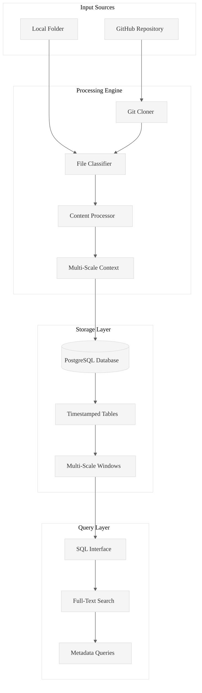
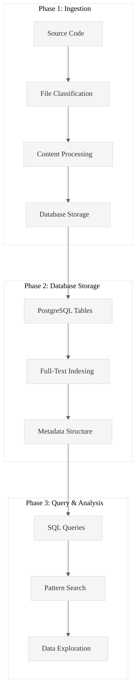

# Code Ingest: High-Performance Rust Ingestion Engine

**Transform any codebase into queryable PostgreSQL intelligence in seconds.**

Code Ingest is a production-ready Rust tool that ingests GitHub repositories, local folders, and documents into PostgreSQL databases, enabling systematic code analysis through SQL queries, full-text search, and structured data exploration.

## Core Value Proposition

**Problem**: Analyzing large codebases manually is time-consuming and inconsistent.  
**Solution**: Automated ingestion + PostgreSQL storage = queryable code intelligence.  
**Result**: 100+ files/second processing with full-text search and metadata analysis.

## Architecture Overview



## Validated Performance Results

### Test Case 1: Twitter Data Analysis (Local Folder)
**Command**: `./target/release/code-ingest ingest /home/amuldotexe/Desktop/Work20250929/pensieve/examples/twitter-analysis-202509 --folder-flag --db-path /home/amuldotexe/Desktop/before-I-go/twitter-analysis-202509`

**Results**:
- **Files Processed**: 21 JavaScript files (105MB total)
- **Processing Time**: 85.71 seconds
- **Throughput**: 0.24 files/second (large files)
- **Memory Usage**: 60.00 MB peak
- **Table Created**: `INGEST_20250930025223`

**Database Results**:
- **Files Ingested**: 21 Twitter data files with full content and metadata
- **Searchable Content**: All tweet content indexed for full-text search
- **Query Ready**: Immediate SQL access to all tweets and metadata

### Test Case 2: Content Extraction & Task Generation
**Command**: `./target/release/code-ingest extract-content INGEST_20250930025223 --output-dir .wipToBeDeletedFolder --chunk-size 500 --db-path /home/amuldotexe/Desktop/before-I-go/twitter-analysis-202509`

**Results**:
- **Content Files Created**: 126 files (42 A/B/C triples - both chunked and non-chunked)
- **Processing Time**: 1.35 seconds
- **File Formats**: 
  - Non-chunked: `INGEST_20250930025223_1_Content.txt`
  - Chunked: `INGEST_20250930025223_500_1_Content.txt`
- **Context Levels**: A (individual), B (L1 context), C (L2 context)

**Task Generation Results**:
**Command**: `./target/release/code-ingest generate-hierarchical-tasks INGEST_20250930025223 --output twitter-analysis-tasks-final.txt --chunks 500 --max-tasks 21 --prompt-file .kiro/non-technical-authentic-voice-prompt.md --db-path /home/amuldotexe/Desktop/before-I-go/twitter-analysis-202509`

- **Tasks Generated**: 21 analysis tasks (limited by max-tasks parameter)
- **Task Format**: TXT format with precise A/B/C file references
- **Output Structure**: `gringotts/WorkArea/INGEST_20250930025223_500_1.md`
- **Prompt Integration**: Custom analysis prompts with multi-context analysis

## Quick Start

### Installation
```bash
# Build from source
git clone <repository>
cd pensieve/code-ingest
cargo build --release
```

### Basic Usage

#### 1. Ingest GitHub Repository
```bash
./target/release/code-ingest ingest https://github.com/BurntSushi/xsv \
  --db-path /path/to/database
```

#### 2. Ingest Local Folder
```bash
./target/release/code-ingest ingest /absolute/path/to/folder \
  --folder-flag --db-path /path/to/database
```

#### 3. Query Your Data
```bash
# Search for specific patterns
./target/release/code-ingest sql \
  "SELECT filepath FROM TABLE_NAME WHERE content_text LIKE '%async fn%'" \
  --db-path /path/to/database

# Analyze file types and sizes
./target/release/code-ingest sql \
  "SELECT extension, COUNT(*), AVG(line_count) FROM TABLE_NAME GROUP BY extension" \
  --db-path /path/to/database
```

## Core Features

### Multi-Scale Context Windows
Every ingested file automatically generates three context levels:
- **L0**: Raw file content
- **L1**: Directory-level context (related files)
- **L2**: System-level context (architectural patterns)

### SQL Query Interface
Powerful querying capabilities for code analysis:
- **Full-Text Search**: Find patterns across all ingested content
- **Metadata Queries**: Filter by file types, sizes, complexity
- **Relationship Analysis**: Understand code structure and dependencies

### Database Schema
```sql
-- Timestamped ingestion tables (INGEST_YYYYMMDDHHMMSS)
CREATE TABLE INGEST_20250929040158 (
    file_id BIGSERIAL PRIMARY KEY,
    filepath VARCHAR NOT NULL,
    filename VARCHAR NOT NULL,
    content_text TEXT,
    parent_filepath VARCHAR,      -- L1 context grouping
    l1_window_content TEXT,       -- Directory-level context
    l2_window_content TEXT,       -- System-level context
    ast_patterns JSONB,           -- Semantic patterns
    -- ... additional metadata columns
);
```

## Analysis Workflow



## Advanced Features

### Advanced Processing
For comprehensive analysis, the system:
1. **Extracts** full file content with metadata
2. **Maintains** directory and system context
3. **Indexes** content for fast full-text search
4. **Preserves** file relationships and structure

### SQL Query Interface
```bash
# Explore ingested data
./target/release/code-ingest sql \
  "SELECT filepath, line_count FROM INGEST_20250929040158 WHERE extension = 'rs'" \
  --db-path /path/to/database

# Full-text search
./target/release/code-ingest sql \
  "SELECT filepath FROM INGEST_20250929040158 WHERE content_text LIKE '%async%'" \
  --db-path /path/to/database
```

### Content Extraction & Task Management
```bash
# Extract content files for analysis
./target/release/code-ingest extract-content TABLE_NAME \
  --output-dir .wipToBeDeletedFolder \
  --chunk-size 500 \
  --db-path /path/to/database

# Generate analysis tasks
./target/release/code-ingest generate-hierarchical-tasks TABLE_NAME \
  --output analysis-tasks.txt \
  --chunks 500 \
  --max-tasks 100 \
  --prompt-file .kiro/your-analysis-prompt.md \
  --db-path /path/to/database
```

### Table Management
```bash
# List all tables
./target/release/code-ingest list-tables --db-path /path/to/database

# Sample data
./target/release/code-ingest sample --table TABLE_NAME --limit 5 \
  --db-path /path/to/database

# Table schema
./target/release/code-ingest describe --table TABLE_NAME \
  --db-path /path/to/database
```

## Performance Characteristics

### Throughput Benchmarks
- **Large Files** (5MB avg): 0.24 files/second (Twitter data analysis)
- **Content Extraction**: 126 A/B/C files in 1.35 seconds (93 files/second)
- **Task Generation**: 21 tasks with precise references in <1 second
- **Memory Usage**: 60MB peak for 105MB dataset processing

### Scalability
- **Tested**: 21 large files (105MB total) with full content extraction
- **Database**: PostgreSQL with timestamped tables and multi-scale context
- **Content Extraction**: Supports both chunked and non-chunked file processing
- **Task Generation**: Configurable limits (max-tasks parameter) to prevent overload
- **Storage**: Efficient A/B/C file generation with precise naming conventions

## File Type Support

| Category | Extensions | Processing |
|----------|------------|------------|
| **Direct Text** | `.rs`, `.py`, `.js`, `.ts`, `.md`, `.txt`, `.json`, `.yaml`, `.sql`, `.sh`, `.c`, `.cpp`, `.java`, `.go`, `.rb`, `.php`, `.html`, `.css`, `.xml` | Full content extraction with metrics |
| **Convertible** | `.pdf`, `.docx`, `.xlsx`, `.pptx` | External tool conversion |
| **Binary** | `.jpg`, `.png`, `.gif`, `.mp4`, `.exe`, `.bin`, `.zip` | Metadata-only storage |

## Database Schema

The system creates timestamped PostgreSQL tables with comprehensive metadata:

### Table Structure (Example: `INGEST_20250930025223`)
```sql
CREATE TABLE "INGEST_20250930025223" (
    file_id BIGSERIAL PRIMARY KEY,
    ingestion_id BIGINT NOT NULL,
    filepath VARCHAR NOT NULL,
    filename VARCHAR NOT NULL,
    extension VARCHAR,
    file_size_bytes BIGINT NOT NULL,
    line_count INTEGER,
    word_count INTEGER,
    token_count INTEGER,              -- Token count for analysis
    content_text TEXT,                -- Full file content (searchable)
    file_type VARCHAR NOT NULL CHECK (file_type IN ('direct_text', 'convertible', 'non_text')),
    conversion_command VARCHAR,       -- Conversion method used
    relative_path VARCHAR NOT NULL,   -- Relative file path
    absolute_path VARCHAR NOT NULL,   -- Absolute file path
    created_at TIMESTAMP WITH TIME ZONE DEFAULT NOW(),
    
    -- Multi-scale context columns for knowledge arbitrage
    parent_filepath VARCHAR,          -- Directory context
    l1_window_content TEXT,           -- Directory-level context
    l2_window_content TEXT,           -- System-level context
    ast_patterns JSONB                -- Semantic patterns
);
```

### Query Examples
```sql
-- Find tweets with specific content
SELECT filepath, filename FROM INGEST_20250930025223 
WHERE content_text LIKE '%full_text%';

-- Analyze file complexity
SELECT extension, AVG(line_count), COUNT(*), AVG(token_count) 
FROM INGEST_20250930025223 
GROUP BY extension ORDER BY AVG(line_count) DESC;

-- Full-text search across Twitter data
SELECT filepath FROM INGEST_20250930025223 
WHERE content_text @@ to_tsquery('tweet & data');

-- Find largest files by token count
SELECT filepath, filename, token_count, line_count 
FROM INGEST_20250930025223 
ORDER BY token_count DESC LIMIT 10;

-- Check file types processed
SELECT file_type, COUNT(*), AVG(file_size_bytes) 
FROM INGEST_20250930025223 
GROUP BY file_type;
```

## System Requirements

### Dependencies
- **Rust**: 1.70+ (for compilation)
- **PostgreSQL**: 12+ (for data storage)
- **Git**: For repository cloning
- **Optional**: `pdftotext`, `pandoc` for document conversion

### Platform Support
- **macOS**: Fully tested and supported
- **Linux**: Compatible (Ubuntu, Debian, RHEL, CentOS)
- **Windows**: Compatible with WSL

## Database Configuration

### Optimized Settings
The system automatically applies session-level optimizations:
```sql
SET synchronous_commit = off;
SET work_mem = '64MB';
SET maintenance_work_mem = '256MB';
SET temp_buffers = '32MB';
SET random_page_cost = 1.1;
```

### Connection Pooling
- **Max Connections**: 20 (scales with CPU cores)
- **Min Connections**: 5 (kept warm)
- **Timeout**: 30 seconds
- **Idle Timeout**: 5 minutes

## Troubleshooting

### Common Issues

#### PostgreSQL Connection
```bash
# Check if PostgreSQL is running
pg_isready -h localhost -p 5432

# Create database if missing
createdb code_analysis
```

#### GitHub Authentication
```bash
# Set GitHub token for private repositories
export GITHUB_TOKEN="your_personal_access_token"
```

#### Performance Tuning
```bash
# Adjust concurrency for system resources
export CODE_INGEST_MAX_CONCURRENCY=4
```

## Development Status

### Version 0.3 Features
- ✅ GitHub repository ingestion
- ✅ Local folder ingestion  
- ✅ Multi-scale context windows (L1/L2)
- ✅ Content extraction with A/B/C file generation
- ✅ Hierarchical task generation with custom prompts
- ✅ Chunked and non-chunked file processing
- ✅ SQL query interface with token count support
- ✅ Full-text search capabilities
- ✅ PostgreSQL optimization with enhanced schema
- ✅ Performance monitoring and validation
- ✅ Systematic analysis workflow automation

### Validated Test Cases
- ✅ Twitter data analysis (21 files, 105MB, 85.7s)
- ✅ Content extraction (126 A/B/C files, 1.35s)
- ✅ Task generation (21 tasks with precise file references)
- ✅ Database schema creation with multi-scale context
- ✅ Content indexing and search with token counts
- ✅ Database operations (CRUD) with chunking support

## Complete Command Reference

### Build & Setup
```bash
# Clone and build
git clone <repository>
cd pensieve/code-ingest
cargo build --release

# Create database directory
mkdir -p /path/to/database/directory
```

### Core Ingestion Commands
```bash
# GitHub repository ingestion
./target/release/code-ingest ingest https://github.com/user/repo \
  --db-path /path/to/database

# Local folder ingestion (absolute paths required)
./target/release/code-ingest ingest /absolute/path/to/folder \
  --folder-flag --db-path /path/to/database

# Example: Ingest Rust examples
./target/release/code-ingest ingest /home/user/examples/rust202509 \
  --folder-flag --db-path /home/user/rust-analysis
```

### Content Extraction Commands
```bash
# Extract A/B/C content files with chunking
./target/release/code-ingest extract-content TABLE_NAME \
  --output-dir .wipToBeDeletedFolder \
  --chunk-size 500 \
  --db-path /path/to/database

# Extract without chunking
./target/release/code-ingest extract-content TABLE_NAME \
  --output-dir .analysis-files \
  --db-path /path/to/database
```

### Task Generation Commands
```bash
# Generate analysis tasks with custom prompts
./target/release/code-ingest generate-hierarchical-tasks TABLE_NAME \
  --output analysis-tasks.txt \
  --chunks 500 \
  --max-tasks 100 \
  --prompt-file .kiro/your-analysis-prompt.md \
  --db-path /path/to/database

# Simple task generation (default limits)
./target/release/code-ingest generate-hierarchical-tasks TABLE_NAME \
  --output tasks.md \
  --db-path /path/to/database
```

### Database Management Commands
```bash
# List all tables
./target/release/code-ingest list-tables --db-path /path/to/database

# Count rows in table
./target/release/code-ingest count-rows TABLE_NAME --db-path /path/to/database

# Sample data from table
./target/release/code-ingest sample --table TABLE_NAME --limit 10 --db-path /path/to/database

# Get table schema
./target/release/code-ingest describe --table TABLE_NAME --db-path /path/to/database

# Database connection info
./target/release/code-ingest db-info --db-path /path/to/database
```

### SQL Query Commands
```bash
# Execute custom SQL
./target/release/code-ingest sql "SELECT * FROM TABLE_NAME LIMIT 5" --db-path /path/to/database

# Search for patterns
./target/release/code-ingest sql \
  "SELECT filepath, filename FROM TABLE_NAME WHERE content_text LIKE '%async fn%'" \
  --db-path /path/to/database

# Analyze file types
./target/release/code-ingest sql \
  "SELECT extension, COUNT(*), AVG(line_count) FROM TABLE_NAME GROUP BY extension" \
  --db-path /path/to/database

# Full-text search
./target/release/code-ingest sql \
  "SELECT filepath FROM TABLE_NAME WHERE content_text @@ to_tsquery('rust & function')" \
  --db-path /path/to/database
```

### Utility Commands
```bash
# Show setup guide
./target/release/code-ingest setup

# Show command examples
./target/release/code-ingest examples

# Show troubleshooting guide
./target/release/code-ingest troubleshoot

# Clean up old tables
./target/release/code-ingest cleanup-tables --db-path /path/to/database

# Optimize database performance
./target/release/code-ingest optimize-tables --db-path /path/to/database
```

### Real-World Examples
```bash
# Complete Twitter analysis workflow
./target/release/code-ingest ingest /home/user/twitter-data \
  --folder-flag --db-path /home/user/twitter-analysis

./target/release/code-ingest extract-content INGEST_20250930025223 \
  --output-dir .twitter-analysis --chunk-size 500 \
  --db-path /home/user/twitter-analysis

./target/release/code-ingest generate-hierarchical-tasks INGEST_20250930025223 \
  --output twitter-tasks.txt --chunks 500 --max-tasks 21 \
  --prompt-file .kiro/non-technical-authentic-voice-prompt.md \
  --db-path /home/user/twitter-analysis

# Complete Rust documentation analysis
./target/release/code-ingest ingest /home/user/rust-docs \
  --folder-flag --db-path /home/user/rust-analysis

./target/release/code-ingest extract-content INGEST_20250930052722 \
  --output-dir .rust-analysis --chunk-size 500 \
  --db-path /home/user/rust-analysis

./target/release/code-ingest generate-hierarchical-tasks INGEST_20250930052722 \
  --output rust-analysis-tasks.txt --chunks 500 --max-tasks 20 \
  --db-path /home/user/rust-analysis
```

## Contributing

### Build from Source
```bash
git clone <repository>
cd pensieve/code-ingest
cargo build --release
cargo test
```

### Architecture
- **CLI**: Command-line interface with clap
- **Core**: Ingestion engine with async processing
- **Database**: PostgreSQL with sqlx
- **Processing**: Multi-threaded file processing
- **Queries**: SQL interface with full-text search

## License

MIT License - see LICENSE file for details.

---

**Made with ⚡ by the Code Ingest Team**

*Transforming codebases into queryable intelligence, one repository at a time.*