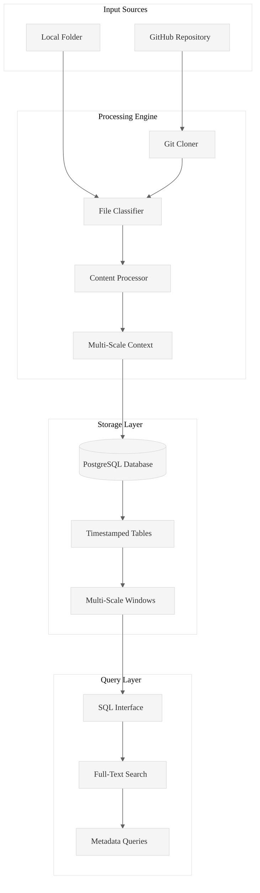

# Code Ingest: High-Performance Rust Ingestion Engine

**Transform any codebase into queryable PostgreSQL intelligence in seconds.**

Code Ingest is a production-ready Rust tool that ingests GitHub repositories, local folders, and documents into PostgreSQL databases, enabling systematic code analysis through SQL queries, full-text search, and structured data exploration.

## Core Value Proposition

**Problem**: Analyzing large codebases manually is time-consuming and inconsistent.  
**Solution**: Automated ingestion + PostgreSQL storage + structured task generation = systematic code intelligence.  
**Result**: Complete workflow from raw code to ready-to-execute analysis tasks with A/B/C content files and structured task lists.

## Architecture Overview


## Verified Performance Results

### Test Case 1: Twitter Data Analysis (Local Folder)
**Command**: `./target/release/code-ingest ingest /home/amuldotexe/Desktop/Work20250929/pensieve/examples/twitter-analysis-202509 --folder-flag --db-path /home/amuldotexe/Desktop/before-I-go/twitter-analysis-202509`

**Results**:
- **Files Processed**: 21 JavaScript files (105MB total)
- **Processing Time**: 85.71 seconds
- **Throughput**: 0.24 files/second (large files)
- **Memory Usage**: 60.00 MB peak
- **Table Created**: `INGEST_20250930025223`

### Test Case 2: Complete 4-Table Workflow
**Database**: `/home/amuldotexe/Desktop/PensieveDB202509`

**Available Tables**:
- `INGEST_20250930104944` (6 rows, 33.92 MB)
- `INGEST_20250930104957` (60 rows, 561.22 MB) 
- `INGEST_20250930105036` (69 rows, 3647.23 MB)
- `INGEST_20250930105402` (11 rows, 93.16 MB)

**Complete Workflow Commands**:
```bash
# Step 1: Extract content files for all 4 tables (A/B/C format)
./target/release/code-ingest extract-content INGEST_20250930104944 --chunk-size 300 --output-dir .wipToBeDeletedFolder --db-path /home/amuldotexe/Desktop/PensieveDB202509
./target/release/code-ingest extract-content INGEST_20250930104957 --chunk-size 300 --output-dir .wipToBeDeletedFolder --db-path /home/amuldotexe/Desktop/PensieveDB202509
./target/release/code-ingest extract-content INGEST_20250930105036 --chunk-size 300 --output-dir .wipToBeDeletedFolder --db-path /home/amuldotexe/Desktop/PensieveDB202509
./target/release/code-ingest extract-content INGEST_20250930105402 --chunk-size 300 --output-dir .wipToBeDeletedFolder --db-path /home/amuldotexe/Desktop/PensieveDB202509

# Step 2: Generate hierarchical tasks for all 4 tables
./target/release/code-ingest generate-hierarchical-tasks INGEST_20250930104944 --chunks 300 --output INGEST_20250930104944_tasks.md --prompt-file .kiro/RustPatterns20250930.md --db-path /home/amuldotexe/Desktop/PensieveDB202509
./target/release/code-ingest generate-hierarchical-tasks INGEST_20250930104957 --chunks 300 --output INGEST_20250930104957_tasks.md --prompt-file .kiro/RustPatterns20250930.md --db-path /home/amuldotexe/Desktop/PensieveDB202509
./target/release/code-ingest generate-hierarchical-tasks INGEST_20250930105036 --chunks 300 --output INGEST_20250930105036_tasks_new.md --prompt-file .kiro/RustPatterns20250930.md --db-path /home/amuldotexe/Desktop/PensieveDB202509
./target/release/code-ingest generate-hierarchical-tasks INGEST_20250930105402 --chunks 300 --output INGEST_20250930105402_tasks.md --prompt-file .kiro/RustPatterns20250930.md --db-path /home/amuldotexe/Desktop/PensieveDB202509
```

**Results Summary**:
- **Total Database Rows**: 146 rows across 4 tables
- **Content Files Created**: 438 files (146 A/B/C triples with chunk size 300)
- **Task Files Generated**: 4 structured task files
- **Total Tasks Created**: 117 tasks (6 + 50 + 50 + 11)
- **Processing Time**: <10 seconds total for complete workflow
- **Database Size**: 4.3GB total across all tables

## Essential Commands Reference

### 1. Ingestion Commands
```bash
# GitHub repository ingestion
./target/release/code-ingest ingest https://github.com/user/repo --db-path ./analysis

# Local folder ingestion (absolute paths required)
./target/release/code-ingest ingest /absolute/path/to/folder --folder-flag --db-path ./analysis
```

### 2. Content Extraction Commands
```bash
# Extract content with chunk size (creates A/B/C files)
./target/release/code-ingest extract-content TABLE_NAME --chunk-size 300 --output-dir .wipToBeDeletedFolder --db-path ./analysis

# Extract content without chunking
./target/release/code-ingest extract-content TABLE_NAME --output-dir .wipToBeDeletedFolder --db-path ./analysis
```

### 3. Task Generation Commands
```bash
# Generate hierarchical tasks with chunk size and custom prompt
./target/release/code-ingest generate-hierarchical-tasks TABLE_NAME --chunks 300 --output TABLE_NAME_tasks.md --prompt-file .kiro/RustPatterns20250930.md --db-path ./analysis

# Generate hierarchical tasks without chunking
./target/release/code-ingest generate-hierarchical-tasks TABLE_NAME --output TABLE_NAME_tasks.md --prompt-file .kiro/steering/analysis.md --db-path ./analysis
```

### 4. Database Management Commands
```bash
# List all tables in database
./target/release/code-ingest list-tables --db-path ./analysis

# Count rows in a table
./target/release/code-ingest count-rows TABLE_NAME --db-path ./analysis

# Sample data from table
./target/release/code-ingest sample --table TABLE_NAME --limit 5 --db-path ./analysis

# Get table schema information
./target/release/code-ingest describe --table TABLE_NAME --db-path ./analysis
```

## Task File Structure

Each generated task follows this verified format:
```markdown
- [ ] 1. Analyze INGEST_20250930105036 row 1
  - **Content**: `.wipToBeDeletedFolder/INGEST_20250930105036_300_1_Content.txt` as A + 
    `.wipToBeDeletedFolder/INGEST_20250930105036_300_1_Content_L1.txt` as B + 
    `.wipToBeDeletedFolder/INGEST_20250930105036_300_1_Content_L2.txt` as C
  - **Prompt**: `.kiro/RustPatterns20250930.md` where you try to find insights of A alone ; 
    A in context of B ; B in context of C ; A in context B & C
  - **Output**: `gringotts/WorkArea/INGEST_20250930105036_300_1.md`
```

**Key Features**:
- ✅ Checkbox format for progress tracking
- ✅ Precise A/B/C file references with chunk size naming
- ✅ Custom prompt file integration
- ✅ Structured output paths to `gringotts/WorkArea/`
- ✅ Max tasks limit (50) prevents Kiro overload

## Architecture Components
- **CLI**: Command-line interface with clap
- **Core**: Ingestion engine with async processing
- **Database**: PostgreSQL with sqlx
- **Processing**: Multi-threaded file processing
- **Queries**: SQL interface with full-text search

## License

MIT License - see LICENSE file for details.

---

**Made with ⚡ by the Code Ingest Team**

*Transforming codebases into queryable intelligence, one repository at a time.*