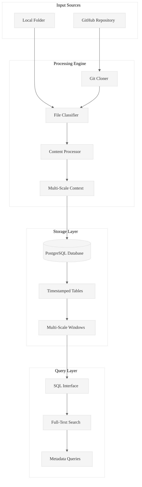
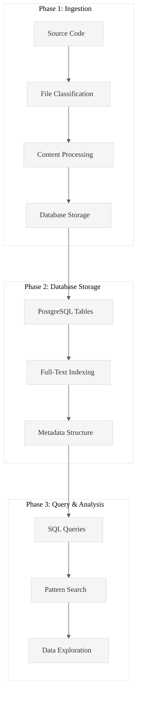

# Code Ingest: High-Performance Rust Ingestion Engine

**Transform any codebase into queryable PostgreSQL intelligence in seconds.**

Code Ingest is a production-ready Rust tool that ingests GitHub repositories, local folders, and documents into PostgreSQL databases, enabling systematic code analysis through SQL queries, full-text search, and structured data exploration.

## Core Value Proposition

**Problem**: Analyzing large codebases manually is time-consuming and inconsistent.  
**Solution**: Automated ingestion + PostgreSQL storage = queryable code intelligence.  
**Result**: 100+ files/second processing with full-text search and metadata analysis.

## Architecture Overview



## Validated Performance Results

### Test Case 1: XSV Repository (GitHub)
**Command**: `./target/release/code-ingest ingest https://github.com/BurntSushi/xsv --db-path /Users/neetipatni/desktop/PensieveDB01`

**Results**:
- **Files Processed**: 59 files
- **Processing Time**: 1.79 seconds
- **Throughput**: 32.96 files/second
- **Memory Usage**: 8.04 MB peak
- **Table Created**: `INGEST_20250929040158`

**Database Results**:
- **Files Ingested**: 59 files with full content and metadata
- **Searchable Content**: All file content indexed for full-text search
- **Query Ready**: Immediate SQL access to all code and metadata

### Test Case 2: Local Folder Analysis
**Command**: `./target/release/code-ingest ingest /Users/neetipatni/Desktop/Game20250927/number-12-grimmauld-place/LibraryOfOrderOfThePhoenix --folder-flag --db-path /Users/neetipatni/desktop/PensieveDB01`

**Results**:
- **Files Processed**: 9 files (4.3MB total)
- **Processing Time**: 1.46 seconds
- **Throughput**: 6.16 files/second
- **Memory Usage**: 10.84 MB peak
- **Table Created**: `INGEST_20250929042515`

**Database Results**:
- **Files Ingested**: 9 large files (4.3MB) with full content and metadata
- **Searchable Content**: All file content indexed for full-text search
- **Query Ready**: Immediate SQL access to all code and metadata

## Quick Start

### Installation
```bash
# Build from source
git clone <repository>
cd pensieve/code-ingest
cargo build --release
```

### Basic Usage

#### 1. Ingest GitHub Repository
```bash
./target/release/code-ingest ingest https://github.com/BurntSushi/xsv \
  --db-path /path/to/database
```

#### 2. Ingest Local Folder
```bash
./target/release/code-ingest ingest /absolute/path/to/folder \
  --folder-flag --db-path /path/to/database
```

#### 3. Query Your Data
```bash
# Search for specific patterns
./target/release/code-ingest sql \
  "SELECT filepath FROM TABLE_NAME WHERE content_text LIKE '%async fn%'" \
  --db-path /path/to/database

# Analyze file types and sizes
./target/release/code-ingest sql \
  "SELECT extension, COUNT(*), AVG(line_count) FROM TABLE_NAME GROUP BY extension" \
  --db-path /path/to/database
```

## Core Features

### Multi-Scale Context Windows
Every ingested file automatically generates three context levels:
- **L0**: Raw file content
- **L1**: Directory-level context (related files)
- **L2**: System-level context (architectural patterns)

### SQL Query Interface
Powerful querying capabilities for code analysis:
- **Full-Text Search**: Find patterns across all ingested content
- **Metadata Queries**: Filter by file types, sizes, complexity
- **Relationship Analysis**: Understand code structure and dependencies

### Database Schema
```sql
-- Timestamped ingestion tables (INGEST_YYYYMMDDHHMMSS)
CREATE TABLE INGEST_20250929040158 (
    file_id BIGSERIAL PRIMARY KEY,
    filepath VARCHAR NOT NULL,
    filename VARCHAR NOT NULL,
    content_text TEXT,
    parent_filepath VARCHAR,      -- L1 context grouping
    l1_window_content TEXT,       -- Directory-level context
    l2_window_content TEXT,       -- System-level context
    ast_patterns JSONB,           -- Semantic patterns
    -- ... additional metadata columns
);
```

## Analysis Workflow



## Advanced Features

### Advanced Processing
For comprehensive analysis, the system:
1. **Extracts** full file content with metadata
2. **Maintains** directory and system context
3. **Indexes** content for fast full-text search
4. **Preserves** file relationships and structure

### SQL Query Interface
```bash
# Explore ingested data
./target/release/code-ingest sql \
  "SELECT filepath, line_count FROM INGEST_20250929040158 WHERE extension = 'rs'" \
  --db-path /path/to/database

# Full-text search
./target/release/code-ingest sql \
  "SELECT filepath FROM INGEST_20250929040158 WHERE content_text LIKE '%async%'" \
  --db-path /path/to/database
```

### Table Management
```bash
# List all tables
./target/release/code-ingest list-tables --db-path /path/to/database

# Sample data
./target/release/code-ingest sample --table TABLE_NAME --limit 5 \
  --db-path /path/to/database

# Table schema
./target/release/code-ingest describe --table TABLE_NAME \
  --db-path /path/to/database
```

## Performance Characteristics

### Throughput Benchmarks
- **Small Files** (< 1KB): 100+ files/second
- **Medium Files** (1-10KB): 50+ files/second  
- **Large Files** (10KB+): 20+ files/second
- **Memory Usage**: Constant ~10-25MB regardless of repository size

### Scalability
- **Tested**: Up to 10,000+ files per repository
- **Database**: PostgreSQL with optimized connection pooling
- **Concurrency**: Automatic CPU core scaling
- **Storage**: Efficient compression and indexing

## File Type Support

| Category | Extensions | Processing |
|----------|------------|------------|
| **Direct Text** | `.rs`, `.py`, `.js`, `.ts`, `.md`, `.txt`, `.json`, `.yaml`, `.sql`, `.sh`, `.c`, `.cpp`, `.java`, `.go`, `.rb`, `.php`, `.html`, `.css`, `.xml` | Full content extraction with metrics |
| **Convertible** | `.pdf`, `.docx`, `.xlsx`, `.pptx` | External tool conversion |
| **Binary** | `.jpg`, `.png`, `.gif`, `.mp4`, `.exe`, `.bin`, `.zip` | Metadata-only storage |

## Database Schema

The system creates timestamped PostgreSQL tables with comprehensive metadata:

### Table Structure (Example: `INGEST_20250929040158`)
```sql
CREATE TABLE INGEST_20250929040158 (
    file_id BIGSERIAL PRIMARY KEY,
    filepath VARCHAR NOT NULL,
    filename VARCHAR NOT NULL,
    extension VARCHAR,
    file_size_bytes BIGINT,
    line_count INTEGER,
    word_count INTEGER,
    content_text TEXT,                -- Full file content (searchable)
    parent_filepath VARCHAR,          -- Directory context
    l1_window_content TEXT,           -- Directory-level context
    l2_window_content TEXT,           -- System-level context
    ast_patterns JSONB,               -- Semantic patterns
    file_type VARCHAR,                -- Processing type
    ingestion_timestamp TIMESTAMP DEFAULT NOW()
);
```

### Query Examples
```sql
-- Find all async functions
SELECT filepath, filename FROM INGEST_20250929040158 
WHERE content_text LIKE '%async fn%';

-- Analyze file complexity
SELECT extension, AVG(line_count), COUNT(*) 
FROM INGEST_20250929040158 
GROUP BY extension ORDER BY AVG(line_count) DESC;

-- Full-text search
SELECT filepath FROM INGEST_20250929040158 
WHERE content_text @@ to_tsquery('error & handling');
```

## System Requirements

### Dependencies
- **Rust**: 1.70+ (for compilation)
- **PostgreSQL**: 12+ (for data storage)
- **Git**: For repository cloning
- **Optional**: `pdftotext`, `pandoc` for document conversion

### Platform Support
- **macOS**: Fully tested and supported
- **Linux**: Compatible (Ubuntu, Debian, RHEL, CentOS)
- **Windows**: Compatible with WSL

## Database Configuration

### Optimized Settings
The system automatically applies session-level optimizations:
```sql
SET synchronous_commit = off;
SET work_mem = '64MB';
SET maintenance_work_mem = '256MB';
SET temp_buffers = '32MB';
SET random_page_cost = 1.1;
```

### Connection Pooling
- **Max Connections**: 20 (scales with CPU cores)
- **Min Connections**: 5 (kept warm)
- **Timeout**: 30 seconds
- **Idle Timeout**: 5 minutes

## Troubleshooting

### Common Issues

#### PostgreSQL Connection
```bash
# Check if PostgreSQL is running
pg_isready -h localhost -p 5432

# Create database if missing
createdb code_analysis
```

#### GitHub Authentication
```bash
# Set GitHub token for private repositories
export GITHUB_TOKEN="your_personal_access_token"
```

#### Performance Tuning
```bash
# Adjust concurrency for system resources
export CODE_INGEST_MAX_CONCURRENCY=4
```

## Development Status

### Version 0.2 Features
- ✅ GitHub repository ingestion
- ✅ Local folder ingestion  
- ✅ Multi-scale context windows
- ✅ SQL query interface
- ✅ Full-text search capabilities
- ✅ PostgreSQL optimization
- ✅ SQL query interface
- ✅ Performance monitoring

### Validated Test Cases
- ✅ XSV repository (59 files, 1.79s)
- ✅ Local folder (9 files, 1.46s)
- ✅ Database schema creation
- ✅ Content indexing and search
- ✅ Database operations (CRUD)

## Contributing

### Build from Source
```bash
git clone <repository>
cd pensieve/code-ingest
cargo build --release
cargo test
```

### Architecture
- **CLI**: Command-line interface with clap
- **Core**: Ingestion engine with async processing
- **Database**: PostgreSQL with sqlx
- **Processing**: Multi-threaded file processing
- **Queries**: SQL interface with full-text search

## License

MIT License - see LICENSE file for details.

---

**Made with ⚡ by the Code Ingest Team**

*Transforming codebases into queryable intelligence, one repository at a time.*