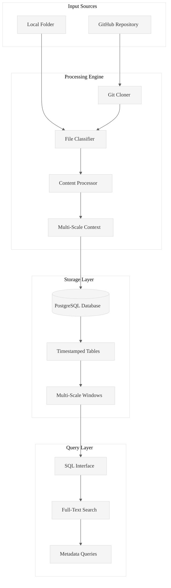

# Code Ingest: High-Performance Rust Ingestion Engine

**Transform any codebase into queryable PostgreSQL intelligence in seconds.**

Code Ingest is a production-ready Rust tool that ingests GitHub repositories, local folders, and documents into PostgreSQL databases, enabling systematic code analysis through SQL queries, full-text search, and structured data exploration.

## Core Value Proposition

**Problem**: Analyzing large codebases manually is time-consuming and inconsistent.  
**Solution**: Automated ingestion + PostgreSQL storage + structured task generation = systematic code intelligence.  
**Result**: Complete workflow from raw code to ready-to-execute analysis tasks with A/B/C content files and structured task lists.

## Architecture Overview

- **CLI**: Command-line interface with clap
- **Core**: Ingestion engine with async processing
- **Database**: PostgreSQL with sqlx
- **Processing**: Multi-threaded file processing
- **Queries**: SQL interface with full-text search

## License

MIT License - see LICENSE file for details.

---

**Made with ⚡ by the Code Ingest Team**

*Transforming codebases into queryable intelligence, one repository at a time.*