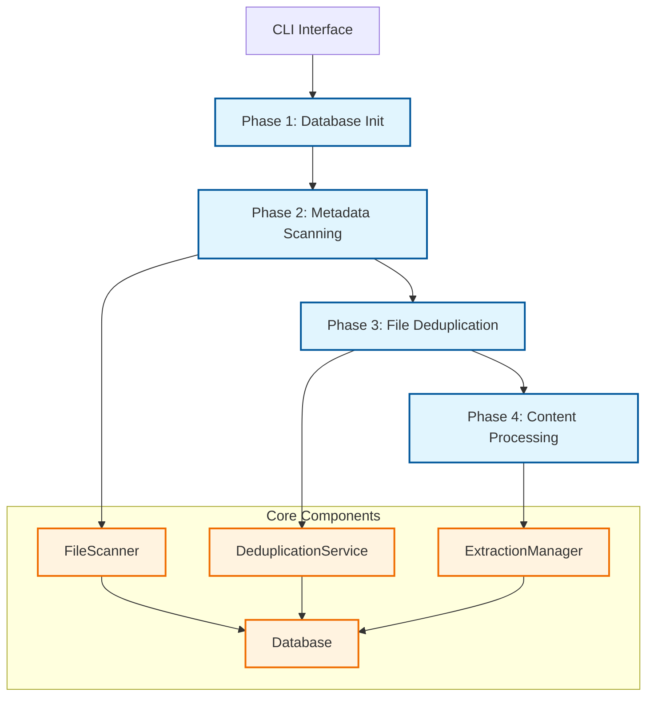

# WARP.md

This file provides guidance to WARP (warp.dev) when working with code in this repository.

## Repository Overview

Pensieve is a high-performance Rust CLI tool that transforms document collections into LLM-ready knowledge bases with intelligent deduplication. The system processes text files at both file and paragraph levels to eliminate redundancy and create optimized databases for AI processing.

## Development Commands

### Building and Testing
```bash
# Build the project (debug)
cargo build

# Build optimized release version
cargo build --release

# Run all tests
cargo test

# Run tests with output
cargo test -- --nocapture

# Run specific test
cargo test test_name

# Run integration tests only
cargo test --test '*integration*'

# Run with sample data for development
cargo run -- --input test_data --database test.db --verbose
```

### Database Operations
```bash
# Initialize a new database
cargo run -- init --database my.db

# Run migrations
cargo run -- migrate up --database my.db

# Check migration status
cargo run -- migrate status --database my.db

# Validate database schema
cargo run -- migrate validate --database my.db

# View database statistics
cargo run -- stats --database my.db
```

### Development Workflow
```bash
# Generate default configuration
cargo run -- config --output pensieve.toml

# Check system dependencies
cargo run -- check-deps

# Process with dry run (no database changes)
cargo run -- --input ~/Documents --database test.db --dry-run

# Process with verbose output
cargo run -- --input ~/Documents --database test.db --verbose
```

## Architecture Overview

Pensieve follows a **4-phase processing pipeline** with **Test-First Development** principles:



### Layered Architecture (L1→L2→L3)

The codebase follows strict layered dependency management:

- **L1 (Core)**: `types.rs`, `errors.rs` - Core data structures and error handling
- **L2 (Standard)**: `database.rs`, `scanner.rs`, `extractor.rs`, `deduplication.rs` - Business logic
- **L3 (External)**: `cli.rs` - External interface and command handling

### Key Components

#### 1. FileScanner (`src/scanner.rs`)
- Parallel directory traversal using `walkdir` + `rayon`
- File type detection via MIME types and extensions
- SHA-256 hash calculation for content deduplication
- Supports 50+ file formats including source code, documents, and structured data

#### 2. DeduplicationService (`src/deduplication.rs`)
- **File-level deduplication**: Groups files by SHA-256 hash
- **Paragraph-level deduplication**: Content hash-based paragraph deduplication
- Canonical file selection with deterministic path ordering
- Tracks duplicate groups and space savings

#### 3. ExtractionManager (`src/extractor.rs`)
- Native Rust content extraction (no external dependencies)
- Format-specific extractors: Text, HTML, PDF, DOCX, JSON, YAML, etc.
- Content normalization and paragraph splitting
- Token estimation for LLM processing

#### 4. Database (`src/database.rs`)
- SQLite with WAL mode for concurrent access
- Schema versioning with migration system
- Batch operations for performance
- Comprehensive statistics and error tracking

## Data Flow and Processing Phases

### Phase 1: Database Initialization
- Creates/validates SQLite database with proper schema
- Runs pending migrations
- Establishes connection pool

### Phase 2: Metadata Scanning
- Recursive directory traversal with parallel processing
- File type detection and filtering
- SHA-256 hash calculation
- Initial duplicate detection by hash comparison

### Phase 3: File Deduplication
- Groups files by content hash
- Marks canonical files (first/shortest path)
- Stores metadata with deduplication status
- Provides space savings statistics

### Phase 4: Content Processing
- Processes only unique/canonical files
- Extracts text content using native Rust parsers
- Splits into paragraphs by double newlines
- Deduplicates paragraphs by content hash
- Stores unique paragraphs with file references

## Database Schema

The system uses a relational schema optimized for LLM processing:

- **files**: File metadata, deduplication status, processing results
- **paragraphs**: Unique paragraph content with token estimates
- **paragraph_sources**: Many-to-many relationship between files and paragraphs
- **processing_errors**: Error logging and debugging
- **schema_version**: Migration tracking

## Testing Strategy

Following **TDD-First Architecture**, tests are organized by layer:

- **Unit Tests**: Component isolation with mocked dependencies
- **Integration Tests**: End-to-end workflows with real database
- **Performance Tests**: Memory usage and processing speed validation

Key test files:
- `tests/end_to_end_integration.rs` - Complete CLI workflow
- `tests/file_type_detection_integration.rs` - Format support
- `tests/metadata_scanning_integration.rs` - Scanning accuracy

## Error Handling Pattern

Uses structured error hierarchy with `thiserror` for libraries:

```rust
#[derive(thiserror::Error, Debug)]
pub enum PensieveError {
    #[error("Database error: {0}")]
    Database(#[from] sqlx::Error),
    
    #[error("IO error: {0}")]
    Io(#[from] std::io::Error),
    
    // ... other variants
}
```

Errors are logged both to console and database for debugging.

## Performance Characteristics

- **File Scanning**: 10,000+ files/sec
- **Hash Calculation**: 500+ MB/sec
- **Database Writes**: 50,000+ records/sec
- **Memory Usage**: <16GB for 500GB corpus
- **Concurrent Processing**: Configurable parallelism with `rayon`

## Configuration and Customization

Generate default configuration:
```bash
pensieve config --output pensieve.toml
```

Key configuration sections:
- `[processing]`: File extensions, paragraph handling
- `[performance]`: Parallelism, batch sizes, memory limits
- `[logging]`: Verbosity, error tracking
- `[advanced]`: MIME mappings, hooks

## Supported File Formats

The system supports 50+ text formats with native Rust parsing:

**Text & Docs**: `.txt`, `.md`, `.rst`, `.org`, `.adoc`, `.wiki`, `.tex`, `.bib`
**Source Code**: `.rs`, `.py`, `.js`, `.ts`, `.java`, `.go`, `.c`, `.cpp`, `.php`, `.rb`, `.swift`
**Web**: `.html`, `.css`, `.xml`
**Config**: `.json`, `.yaml`, `.toml`, `.ini`, `.cfg`, `.env`
**Documents**: `.pdf`, `.docx` (basic extraction)
**Data**: `.csv`, `.log`, `.sql`

## Development Guidelines

1. **Test-First Development**: Write tests before implementation
2. **Layered Dependencies**: Respect L1→L2→L3 dependency flow
3. **Error Handling**: Use `Result<T, PensieveError>` consistently
4. **Performance**: Validate claims with automated benchmarks
5. **Documentation**: Include Mermaid diagrams for architectural changes

## Workspace Structure

- **pensieve/**: Main CLI application
- **pensieve-validator/**: Real-world validation framework
- **migrations/**: Database schema evolution files
- **test_data/**: Sample files for development testing
- **examples/**: Usage demonstrations

All components follow the **MVP-First Rigor** pattern with proven architectures over theoretical abstractions.

## Common Troubleshooting

- **Database locked**: Ensure no other processes are running
- **Permission errors**: Check file/directory permissions
- **Memory issues**: Reduce batch sizes in configuration
- **Slow processing**: Increase parallelism, use SSD storage

For detailed implementation guidance, refer to the comprehensive README.md and inline documentation throughout the codebase.