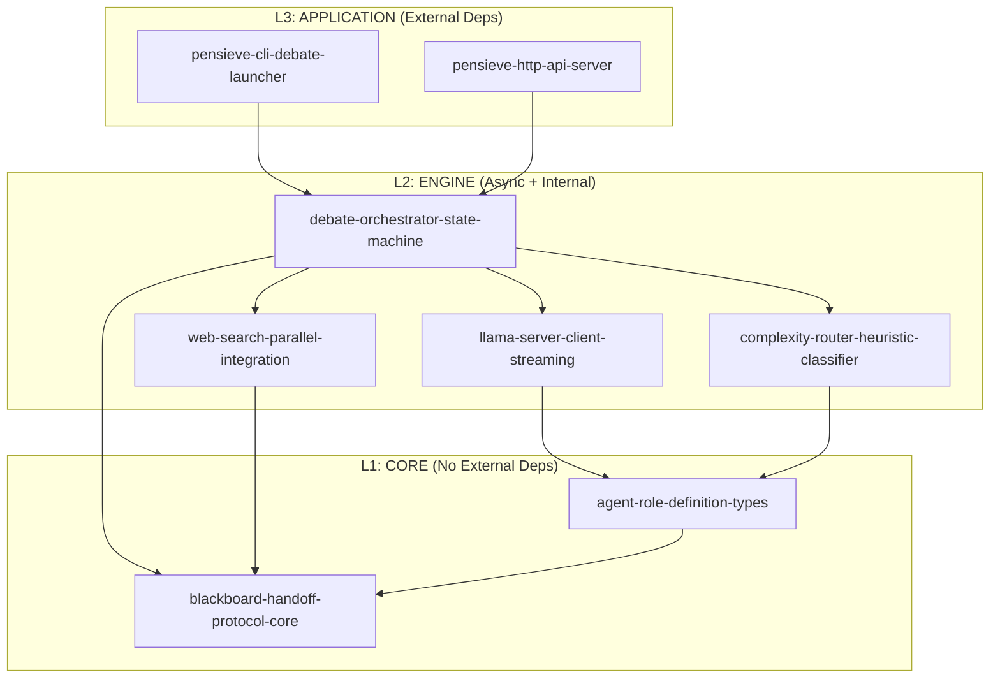
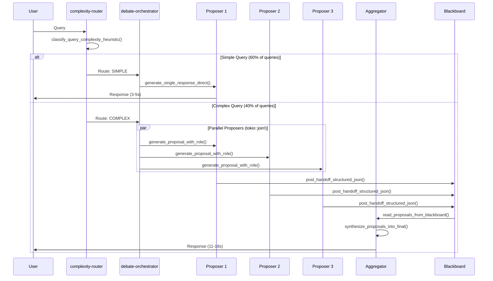
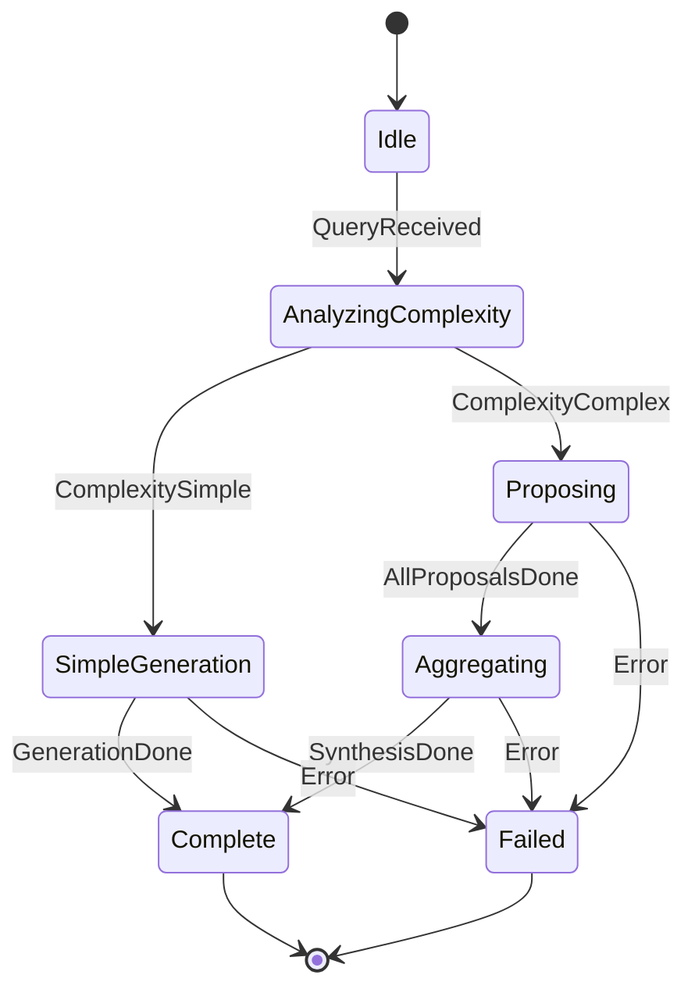
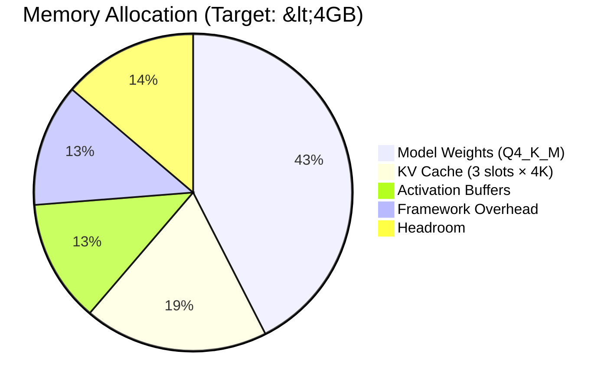

# Architecture: MoA-Lite Debate System

**Version:** 0.1.0
**Status:** Design Phase
**Last Updated:** 2025-12-03

---

## 1. Executive Summary

Multi-Agent Debate AI Assistant implementing 2-layer Mixture-of-Agents Lite (MoA-Lite) architecture for local LLM inference on Mac Mini M4. Target: **65-75% Claude quality** for OSS coding tasks.

---

## 2. Layered Architecture (L1 → L2 → L3)



### Layer Responsibilities

| Layer | Crate | 4-Word Name | Responsibility |
|-------|-------|-------------|----------------|
| **L1** | Core Types | `agent-role-definition-types` | Agent traits, role enums, config types |
| **L1** | Handoff | `blackboard-handoff-protocol-core` | Structured JSON handoff (150-300 tokens) |
| **L2** | LLM Client | `llama-server-client-streaming` | HTTP + SSE streaming to llama-server |
| **L2** | Router | `complexity-router-heuristic-classifier` | Simple vs Complex query classification |
| **L2** | Orchestrator | `debate-orchestrator-state-machine` | MoA-Lite state machine coordination |
| **L2** | Search | `web-search-parallel-integration` | Tavily/Brave parallel web search |
| **L3** | CLI | `pensieve-cli-debate-launcher` | Zero-config CLI entry point |
| **L3** | Server | `pensieve-http-api-server` | Axum HTTP API server |

---

## 3. MoA-Lite Debate Flow



---

## 4. Crate Specifications (4-Word Names)

### 4.1 agent-role-definition-types (L1 Core)

**Purpose:** Agent role traits and type definitions.

```rust
//! L1 Core: No external dependencies
//!
//! # Executable Specification
//!
//! ## Preconditions
//! - None (pure type definitions)
//!
//! ## Postconditions
//! - AgentRole enum defines exactly 3 roles: Drafter, Critic, Synthesizer
//! - AgentConfig provides temperature, max_tokens per role
//! - All types implement Clone, Debug, Serialize, Deserialize

/// Agent role in the debate system (exactly 3 roles)
#[derive(Debug, Clone, Copy, PartialEq, Eq)]
pub enum AgentRole {
    /// Generates initial proposal (temp: 0.7, max: 512 tokens)
    Drafter,
    /// Reviews and critiques proposals (temp: 0.3, max: 384 tokens)
    Critic,
    /// Synthesizes final answer (temp: 0.5, max: 768 tokens)
    Synthesizer,
}

/// Configuration for agent execution
#[derive(Debug, Clone)]
pub struct AgentConfig {
    pub role: AgentRole,
    pub temperature: f32,
    pub max_tokens_output: usize,
    pub system_prompt_template: String,
}

impl AgentConfig {
    /// Create drafter config default
    pub fn create_drafter_config_default() -> Self { /* ... */ }

    /// Create critic config default
    pub fn create_critic_config_default() -> Self { /* ... */ }

    /// Create synthesizer config default
    pub fn create_synthesizer_config_default() -> Self { /* ... */ }
}
```

**Function Naming (4 words):**
- `create_drafter_config_default()`
- `create_critic_config_default()`
- `create_synthesizer_config_default()`
- `validate_agent_config_constraints()`

---

### 4.2 blackboard-handoff-protocol-core (L1 Core)

**Purpose:** Structured handoff between agents (150-300 tokens).

```rust
//! L1 Core: Structured JSON handoff protocol
//!
//! # Executable Specification
//!
//! ## Preconditions
//! - conversation_id is valid UUID
//! - context_summary is 150-300 tokens
//!
//! ## Postconditions
//! - HandoffMessage serializes to valid JSON
//! - Token count validated before posting
//!
//! ## Error Conditions
//! - BlackboardError::TokenBudgetExceeded if > 300 tokens

pub const MIN_HANDOFF_TOKEN_COUNT: usize = 150;
pub const MAX_HANDOFF_TOKEN_COUNT: usize = 300;

/// Structured handoff message between agents
#[derive(Debug, Clone, Serialize, Deserialize)]
pub struct HandoffMessage {
    pub conversation_id: Uuid,
    pub from_role: AgentRole,
    pub to_role: AgentRole,
    pub context_summary: String,
    pub key_points: Vec<String>,
    pub confidence_score: f32,
    pub timestamp: DateTime<Utc>,
}

/// Blackboard trait for agent communication
pub trait Blackboard: Send + Sync {
    /// Post handoff to blackboard
    fn post_handoff_to_blackboard(&self, msg: HandoffMessage) -> Result<(), BlackboardError>;

    /// Read latest handoff for role
    fn read_latest_handoff_for_role(&self, conv_id: Uuid, role: AgentRole)
        -> Result<Option<HandoffMessage>, BlackboardError>;

    /// Count tokens in handoff
    fn count_tokens_in_handoff(&self, msg: &HandoffMessage) -> usize;

    /// Validate handoff token budget
    fn validate_handoff_token_budget(&self, msg: &HandoffMessage) -> Result<(), BlackboardError>;
}

#[derive(Debug, thiserror::Error)]
pub enum BlackboardError {
    #[error("Token budget exceeded: {actual} > {max}")]
    TokenBudgetExceeded { actual: usize, max: usize },

    #[error("Conversation not found: {0}")]
    ConversationNotFound(Uuid),
}
```

**Function Naming (4 words):**
- `post_handoff_to_blackboard()`
- `read_latest_handoff_for_role()`
- `count_tokens_in_handoff()`
- `validate_handoff_token_budget()`
- `clear_conversation_from_blackboard()`

---

### 4.3 llama-server-client-streaming (L2 Engine)

**Purpose:** HTTP client for llama.cpp server with SSE streaming.

```rust
//! L2 Engine: HTTP client for llama-server
//!
//! # Executable Specification
//!
//! ## Preconditions
//! - llama-server running at base_url (default: http://127.0.0.1:8080)
//! - Server configured with --parallel 3 --cont-batching
//!
//! ## Postconditions
//! - Streaming tokens via Server-Sent Events
//! - Each token event includes: token, token_id, is_stop
//!
//! ## Performance Contract
//! - Health check responds in <100ms
//! - First token latency <500ms
//! - Token throughput: 35-45 tok/s per stream

#[derive(Debug, Clone)]
pub struct LlamaClientConfig {
    pub base_url: String,
    pub timeout_ms: u64,
    pub max_retries: u32,
    pub slot_id: Option<u32>,
}

impl Default for LlamaClientConfig {
    fn default() -> Self {
        Self {
            base_url: "http://127.0.0.1:8080".into(),
            timeout_ms: 30_000,
            max_retries: 2,
            slot_id: None,
        }
    }
}

/// LLM client trait for abstraction
#[async_trait]
pub trait LlmClient: Send + Sync {
    /// Generate with streaming response
    async fn generate_streaming_token_response(
        &self,
        prompt: &str,
        max_tokens: usize,
        temperature: f32,
    ) -> Result<TokenStream, LlamaClientError>;

    /// Generate complete response (blocking)
    async fn generate_complete_response_blocking(
        &self,
        prompt: &str,
        max_tokens: usize,
        temperature: f32,
    ) -> Result<String, LlamaClientError>;

    /// Check server health status
    async fn check_server_health_status(&self) -> Result<bool, LlamaClientError>;
}

#[derive(Debug, thiserror::Error)]
pub enum LlamaClientError {
    #[error("Connection failed: {0}")]
    ConnectionFailed(String),

    #[error("Request timeout after {0}ms")]
    RequestTimeout(u64),

    #[error("All slots busy")]
    AllSlotsBusy,
}
```

**Function Naming (4 words):**
- `generate_streaming_token_response()`
- `generate_complete_response_blocking()`
- `check_server_health_status()`
- `parse_sse_token_event()`
- `retry_request_with_backoff()`

---

### 4.4 complexity-router-heuristic-classifier (L2 Engine)

**Purpose:** Classify query complexity for routing decision.

```rust
//! L2 Engine: Heuristic complexity classification
//!
//! # Executable Specification
//!
//! ## Preconditions
//! - Query is non-empty string
//!
//! ## Postconditions
//! - Returns ComplexityLevel::Simple OR ComplexityLevel::Complex
//! - Classification takes <10ms (no LLM calls)
//!
//! ## Routing Distribution Target
//! - 60% Simple (direct generation)
//! - 40% Complex (full debate)

#[derive(Debug, Clone, Copy, PartialEq, Eq)]
pub enum ComplexityLevel {
    /// Direct generation path (3-5s latency)
    Simple,
    /// Full debate workflow (11-18s latency)
    Complex,
}

/// Features extracted for classification
#[derive(Debug, Clone)]
pub struct QueryFeatures {
    pub token_count: usize,
    pub has_code_block: bool,
    pub has_reasoning_keywords: bool,
    pub has_multi_step_indicators: bool,
}

pub trait ComplexityRouter: Send + Sync {
    /// Extract features from query
    fn extract_features_from_query(&self, query: &str) -> QueryFeatures;

    /// Classify query complexity level
    fn classify_query_complexity_level(&self, query: &str) -> ComplexityLevel;

    /// Classify with confidence score
    fn classify_with_confidence_score(&self, query: &str) -> (ComplexityLevel, f32);
}

/// Heuristic-based router (no LLM)
pub struct HeuristicRouter {
    complex_keywords: Vec<&'static str>,
    token_threshold: usize,
}

impl Default for HeuristicRouter {
    fn default() -> Self {
        Self {
            complex_keywords: vec![
                "explain", "analyze", "compare", "implement",
                "debug", "refactor", "design", "architecture",
                "step by step", "walk through", "trade-offs",
            ],
            token_threshold: 50,
        }
    }
}
```

**Function Naming (4 words):**
- `extract_features_from_query()`
- `classify_query_complexity_level()`
- `classify_with_confidence_score()`
- `check_reasoning_keywords_present()`
- `check_code_block_present()`

---

### 4.5 debate-orchestrator-state-machine (L2 Engine)

**Purpose:** MoA-Lite state machine coordinating debate workflow.



```rust
//! L2 Engine: State machine orchestrator
//!
//! # Executable Specification
//!
//! ## Preconditions
//! - LlamaClient connected to llama-server
//! - Blackboard initialized
//!
//! ## Postconditions
//! - Simple queries: <5s latency
//! - Complex queries: <18s latency
//! - All state transitions logged
//!
//! ## Performance Contract
//! - Parallel proposers via tokio::join!
//! - Exactly ONE task in_progress at a time

#[derive(Debug, Clone, PartialEq)]
pub enum OrchestratorState {
    Idle,
    AnalyzingComplexity,
    SimpleGeneration,
    Proposing { round: usize },
    Aggregating,
    Complete,
    Failed { reason: String },
}

#[derive(Debug, Clone)]
pub enum OrchestratorEvent {
    QueryReceived { query: String },
    ComplexityDetermined { level: ComplexityLevel },
    ProposalComplete { agent: AgentRole, result: String },
    AllProposalsComplete,
    SynthesisComplete { output: String },
    ErrorOccurred { message: String },
}

pub struct DebateOrchestrator<L, B, R>
where
    L: LlmClient,
    B: Blackboard,
    R: ComplexityRouter,
{
    llm_client: Arc<L>,
    blackboard: Arc<B>,
    router: Arc<R>,
    current_state: OrchestratorState,
}

impl<L, B, R> DebateOrchestrator<L, B, R>
where
    L: LlmClient,
    B: Blackboard,
    R: ComplexityRouter,
{
    /// Process query through debate
    pub async fn process_query_through_debate(&mut self, query: &str)
        -> Result<DebateResult, OrchestratorError>;

    /// Transition to next state
    pub fn transition_to_next_state(&mut self, event: OrchestratorEvent)
        -> Result<OrchestratorState, OrchestratorError>;

    /// Execute parallel proposers
    async fn execute_parallel_proposers_concurrently(&self, query: &str)
        -> Result<Vec<String>, OrchestratorError>;
}
```

**Function Naming (4 words):**
- `process_query_through_debate()`
- `transition_to_next_state()`
- `execute_parallel_proposers_concurrently()`
- `synthesize_proposals_into_final()`
- `validate_state_transition_allowed()`

---

### 4.6 web-search-parallel-integration (L2 Engine)

**Purpose:** Parallel web search via Tavily/Brave APIs.

```rust
//! L2 Engine: Parallel web search
//!
//! # Executable Specification
//!
//! ## Preconditions
//! - TAVILY_API_KEY or BRAVE_API_KEY in environment
//!
//! ## Postconditions
//! - Returns max 3 search results
//! - Search executes in parallel with first proposer
//!
//! ## Performance Contract
//! - Search latency: <2s (hidden behind proposer)

#[derive(Debug, Clone, Serialize, Deserialize)]
pub struct SearchResult {
    pub title: String,
    pub url: String,
    pub snippet: String,
    pub relevance_score: f32,
}

#[async_trait]
pub trait WebSearchProvider: Send + Sync {
    /// Search for relevant content
    async fn search_for_relevant_content(
        &self,
        query: &str,
        max_results: usize,
    ) -> Result<Vec<SearchResult>, SearchError>;

    /// Check provider availability
    fn check_provider_availability(&self) -> bool;
}

pub struct TavilySearchClient { /* ... */ }
pub struct BraveSearchClient { /* ... */ }
pub struct FallbackSearchProvider { /* ... */ }
```

**Function Naming (4 words):**
- `search_for_relevant_content()`
- `check_provider_availability()`
- `format_results_for_context()`
- `parse_tavily_api_response()`
- `parse_brave_api_response()`

---

### 4.7 pensieve-cli-debate-launcher (L3 Application)

**Purpose:** Zero-config CLI entry point.

```rust
//! L3 Application: CLI launcher
//!
//! # Executable Specification
//!
//! ## Preconditions
//! - Mac M-series with 16GB+ RAM
//! - Internet for model download (first run)
//!
//! ## Postconditions
//! - Model downloaded to ~/.cache/pensieve/
//! - llama-server spawned as subprocess
//! - Ready for queries in <30s first run

/// CLI arguments (zero required)
#[derive(Parser)]
#[command(name = "pensieve")]
#[command(about = "Multi-Agent Debate AI Assistant")]
pub struct CliArgs {
    /// Model path (auto-downloads if missing)
    #[arg(long, env = "PENSIEVE_MODEL_PATH")]
    model_path: Option<PathBuf>,

    /// Server port
    #[arg(long, default_value = "8080")]
    port: u16,
}

pub async fn run_cli_main_entrypoint() -> anyhow::Result<()> {
    // 1. Parse args
    // 2. Check system prerequisites
    // 3. Download model if needed
    // 4. Spawn llama-server
    // 5. Start orchestrator
    // 6. Enter REPL loop
}
```

**Function Naming (4 words):**
- `run_cli_main_entrypoint()`
- `check_system_prerequisites_quietly()`
- `download_model_with_progress()`
- `spawn_llama_server_subprocess()`
- `run_interactive_repl_loop()`

---

### 4.8 pensieve-http-api-server (L3 Application)

**Purpose:** HTTP API server (OpenAI-compatible).

```rust
//! L3 Application: HTTP API server
//!
//! # Executable Specification
//!
//! ## Preconditions
//! - Orchestrator initialized
//!
//! ## Postconditions
//! - /v1/chat/completions endpoint available
//! - /health endpoint responds
//! - Streaming SSE supported

pub fn create_http_api_router(state: AppState) -> Router {
    Router::new()
        .route("/health", get(handle_health_check_request))
        .route("/v1/chat/completions", post(handle_chat_completion_request))
        .route("/v1/models", get(handle_list_models_request))
        .layer(/* tracing, cors, timeout */)
        .with_state(state)
}

async fn handle_health_check_request() -> &'static str { "OK" }

async fn handle_chat_completion_request(
    State(state): State<AppState>,
    Json(req): Json<ChatCompletionRequest>,
) -> Result<impl IntoResponse, AppError> {
    // Route through orchestrator
}
```

**Function Naming (4 words):**
- `create_http_api_router()`
- `handle_health_check_request()`
- `handle_chat_completion_request()`
- `handle_list_models_request()`
- `stream_response_via_sse()`

---

## 5. TDD Test Contracts

### 5.1 Performance Contract Tests

```rust
/// Performance: Simple query <5s
#[tokio::test]
async fn test_simple_query_latency_contract() {
    let orchestrator = create_test_orchestrator().await;
    let start = Instant::now();

    let _ = orchestrator.process_query_through_debate("What is Rust?").await;

    assert!(start.elapsed() < Duration::from_secs(5),
        "Simple query took {:?}, expected <5s", start.elapsed());
}

/// Performance: Complex query <18s
#[tokio::test]
async fn test_complex_query_latency_contract() {
    let orchestrator = create_test_orchestrator().await;
    let start = Instant::now();

    let _ = orchestrator.process_query_through_debate(
        "Explain step by step how to implement async iterators in Rust"
    ).await;

    assert!(start.elapsed() < Duration::from_secs(18),
        "Complex query took {:?}, expected <18s", start.elapsed());
}

/// Performance: Handoff token budget
#[test]
fn test_handoff_token_budget_contract() {
    let blackboard = InMemoryBlackboard::new();
    let handoff = create_test_handoff();

    let tokens = blackboard.count_tokens_in_handoff(&handoff);

    assert!(tokens >= MIN_HANDOFF_TOKEN_COUNT, "Too few tokens: {}", tokens);
    assert!(tokens <= MAX_HANDOFF_TOKEN_COUNT, "Too many tokens: {}", tokens);
}
```

### 5.2 Complexity Router Tests

```rust
/// Router: Simple queries classified correctly
#[test]
fn test_classify_simple_queries_correctly() {
    let router = HeuristicRouter::default();

    assert_eq!(
        router.classify_query_complexity_level("What is Rust?"),
        ComplexityLevel::Simple
    );
    assert_eq!(
        router.classify_query_complexity_level("Define ownership"),
        ComplexityLevel::Simple
    );
}

/// Router: Complex queries classified correctly
#[test]
fn test_classify_complex_queries_correctly() {
    let router = HeuristicRouter::default();

    assert_eq!(
        router.classify_query_complexity_level("Explain step by step how async works"),
        ComplexityLevel::Complex
    );
    assert_eq!(
        router.classify_query_complexity_level("Design a distributed cache architecture"),
        ComplexityLevel::Complex
    );
}
```

---

## 6. Implementation Phases

### Phase 1: Foundation (Day 1)
- [ ] Create `agent-role-definition-types` crate
- [ ] Create `blackboard-handoff-protocol-core` crate
- [ ] Write tests FIRST (RED phase)
- [ ] Implement to pass tests (GREEN phase)

### Phase 2: LLM Client (Day 2)
- [ ] Create `llama-server-client-streaming` crate
- [ ] Test against running llama-server
- [ ] Implement SSE streaming parser

### Phase 3: Router + Orchestrator (Day 3)
- [ ] Create `complexity-router-heuristic-classifier` crate
- [ ] Create `debate-orchestrator-state-machine` crate
- [ ] Test state transitions

### Phase 4: Web Search + Integration (Day 4)
- [ ] Create `web-search-parallel-integration` crate
- [ ] Integrate all components
- [ ] End-to-end tests

### Phase 5: Applications (Day 5)
- [ ] Create `pensieve-cli-debate-launcher` crate
- [ ] Create `pensieve-http-api-server` crate
- [ ] Zero-config setup validation

---

## 7. Memory Budget (Mac Mini M4)



| Component | Allocation | Notes |
|-----------|------------|-------|
| Model weights (shared) | 1.7 GB | Qwen2.5-3B Q4_K_M |
| KV cache (3 slots × 4K) | 768 MB | Q8_0 quantization |
| Activation buffers | 512 MB | Temporary GPU memory |
| Framework overhead | 512 MB | llama.cpp + Rust |
| **Total** | **~3.5 GB** | ✅ Under 4GB target |

---

## 8. Appendix: 4-Word Naming Reference

### Crate Names (hyphens)
| Crate | Words Count | Pattern |
|-------|-------------|---------|
| `agent-role-definition-types` | 4 ✅ | noun-noun-noun-noun |
| `blackboard-handoff-protocol-core` | 4 ✅ | noun-noun-noun-noun |
| `llama-server-client-streaming` | 4 ✅ | noun-noun-noun-noun |
| `complexity-router-heuristic-classifier` | 4 ✅ | noun-noun-noun-noun |
| `debate-orchestrator-state-machine` | 4 ✅ | noun-noun-noun-noun |
| `web-search-parallel-integration` | 4 ✅ | noun-noun-noun-noun |
| `pensieve-cli-debate-launcher` | 4 ✅ | noun-noun-noun-noun |
| `pensieve-http-api-server` | 4 ✅ | noun-noun-noun-noun |

### Function Names (underscores)
| Function | Words Count | Pattern |
|----------|-------------|---------|
| `create_drafter_config_default()` | 4 ✅ | verb-noun-noun-qualifier |
| `post_handoff_to_blackboard()` | 4 ✅ | verb-noun-prep-noun |
| `generate_streaming_token_response()` | 4 ✅ | verb-noun-noun-noun |
| `classify_query_complexity_level()` | 4 ✅ | verb-noun-noun-noun |
| `process_query_through_debate()` | 4 ✅ | verb-noun-prep-noun |
| `execute_parallel_proposers_concurrently()` | 4 ✅ | verb-noun-noun-adverb |

---

*End of Architecture Document*
