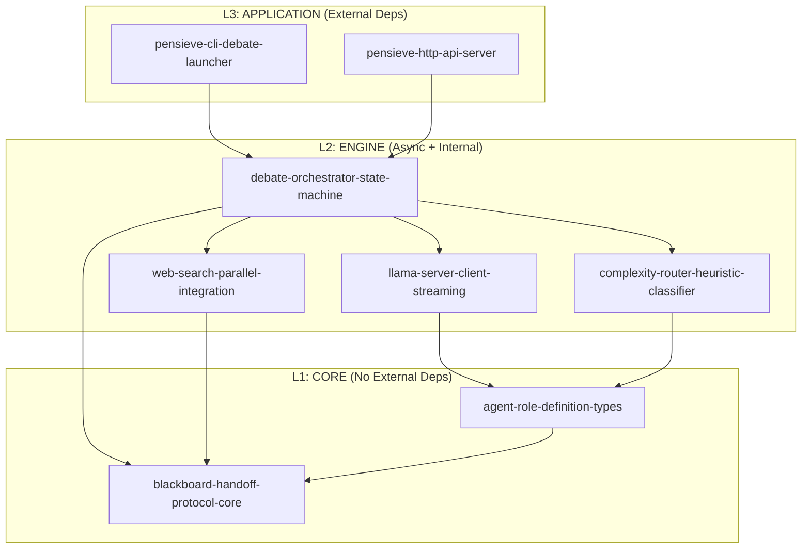
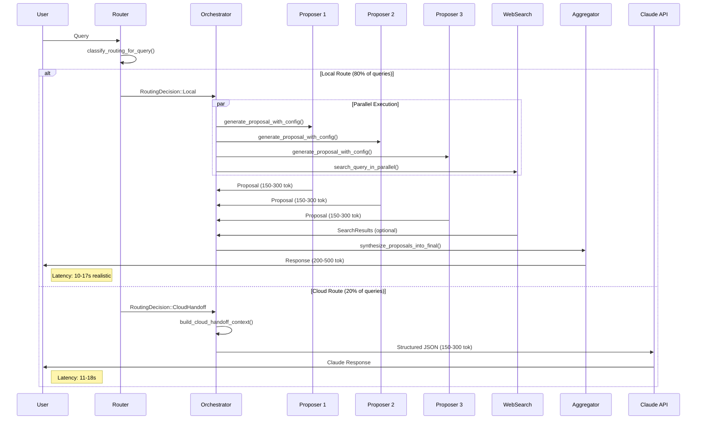
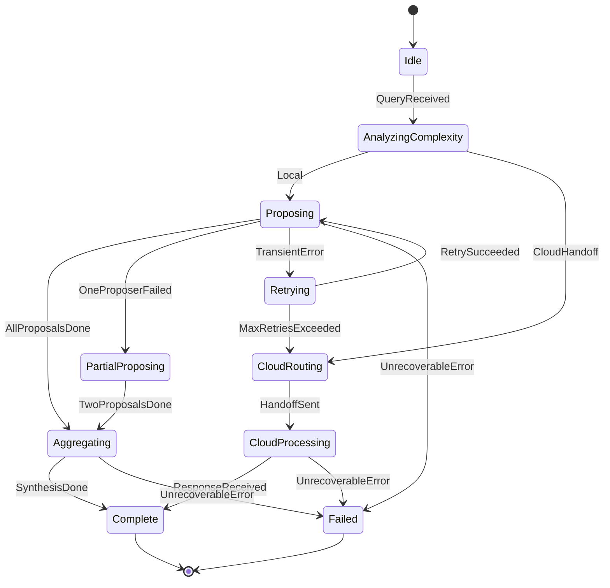
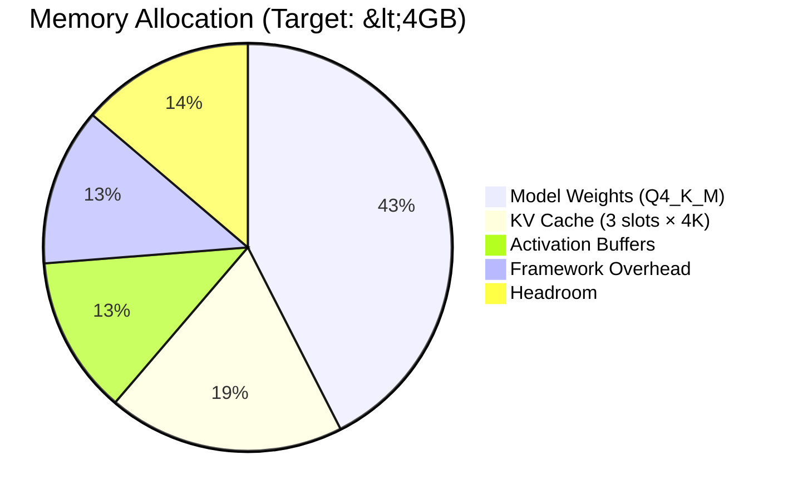

# Architecture: MoA-Lite Debate System

**Version:** 0.2.0
**Status:** Design Phase (MVP)
**Last Updated:** 2025-12-03
**Conventions:** Parseltongue 4-Word Naming, Pure Functional Rust, TDD-First

---

## 1. Executive Summary

Multi-Agent Debate AI Assistant implementing 2-layer Mixture-of-Agents Lite (MoA-Lite) architecture for local LLM inference on Mac Mini M4.

**Target:** 65-75% Claude quality for OSS coding tasks.

**Core Architecture:**
- 3 parallel **Proposers** (same role, different system prompts)
- 1 **Aggregator** (synthesis)
- 2-way routing: **Local** (debate) vs **CloudHandoff**

---

## 2. Layered Architecture (L1 → L2 → L3)



### Layer Responsibilities

| Layer | Crate (4-Word) | Responsibility |
|-------|----------------|----------------|
| **L1** | `agent-role-definition-types` | Agent traits, role enums, config types |
| **L1** | `blackboard-handoff-protocol-core` | Proposal storage + cloud handoff context |
| **L2** | `llama-server-client-streaming` | HTTP + SSE streaming to llama-server |
| **L2** | `complexity-router-heuristic-classifier` | Local vs Cloud routing decision |
| **L2** | `debate-orchestrator-state-machine` | MoA-Lite state machine coordination |
| **L2** | `web-search-parallel-integration` | Tavily/Brave parallel web search |
| **L3** | `pensieve-cli-debate-launcher` | Zero-config CLI entry point |
| **L3** | `pensieve-http-api-server` | Axum HTTP API server |

---

## 3. MoA-Lite Debate Flow



---

## 4. State Machine



---

## 5. Crate Specifications (Pure Functional Rust)

### 5.1 agent-role-definition-types (L1 Core)

**Purpose:** Agent role traits and type definitions.

```rust
//! L1 Core: No external dependencies
//!
//! # Executable Specification
//!
//! ## Preconditions
//! - None (pure type definitions)
//!
//! ## Postconditions
//! - AgentRole enum defines exactly 2 roles: Proposer, Aggregator
//! - All types implement Clone, Debug, Serialize, Deserialize
//!
//! ## Invariants
//! - Proposer temperature: 0.6-0.8
//! - Aggregator temperature: 0.4-0.6
//! - Proposer max_tokens: 150-300
//! - Aggregator max_tokens: 200-500

use std::fmt;

/// Agent role in the MoA-Lite debate system
#[derive(Debug, Clone, Copy, PartialEq, Eq, Hash)]
pub enum AgentRole {
    /// Generates initial proposals (3 instances, parallel)
    Proposer,
    /// Synthesizes final answer from proposals
    Aggregator,
}

/// Configuration for proposer agent (immutable)
#[derive(Debug, Clone)]
pub struct ProposerConfig {
    temperature: f32,
    max_tokens_output: usize,
    system_prompt: String,
    instance_index: u8,
}

impl ProposerConfig {
    /// Create proposer config with index
    ///
    /// # Preconditions
    /// - index in 0..3
    /// - temperature in 0.6..=0.8
    ///
    /// # Postconditions
    /// - Returns valid ProposerConfig
    pub fn create_config_with_index(index: u8) -> Self {
        Self {
            temperature: 0.7,
            max_tokens_output: 250,
            system_prompt: Self::prompt_for_index(index),
            instance_index: index,
        }
    }

    fn prompt_for_index(index: u8) -> String {
        match index {
            0 => include_str!("prompts/proposer_accuracy.txt"),
            1 => include_str!("prompts/proposer_creativity.txt"),
            2 => include_str!("prompts/proposer_conciseness.txt"),
            _ => include_str!("prompts/proposer_accuracy.txt"),
        }.to_string()
    }

    // Pure getters (no mutation)
    pub fn temperature(&self) -> f32 { self.temperature }
    pub fn max_tokens(&self) -> usize { self.max_tokens_output }
    pub fn system_prompt(&self) -> &str { &self.system_prompt }
    pub fn index(&self) -> u8 { self.instance_index }
}

/// Configuration for aggregator agent (immutable)
#[derive(Debug, Clone)]
pub struct AggregatorConfig {
    temperature: f32,
    max_tokens_output: usize,
    system_prompt: String,
}

impl AggregatorConfig {
    /// Create aggregator config default
    pub fn create_config_default_aggregator() -> Self {
        Self {
            temperature: 0.5,
            max_tokens_output: 400,
            system_prompt: include_str!("prompts/aggregator.txt").to_string(),
        }
    }

    pub fn temperature(&self) -> f32 { self.temperature }
    pub fn max_tokens(&self) -> usize { self.max_tokens_output }
    pub fn system_prompt(&self) -> &str { &self.system_prompt }
}
```

**4-Word Function Names:**
| Function | Word Count | Pattern |
|----------|------------|---------|
| `create_config_with_index()` | 4 ✅ | verb-noun-prep-noun |
| `create_config_default_aggregator()` | 4 ✅ | verb-noun-noun-noun |
| `prompt_for_index()` | 3 ❌→private | (internal helper) |

---

### 5.2 blackboard-handoff-protocol-core (L1 Core)

**Purpose:** Dual-context storage (internal proposals + cloud handoff).

```rust
//! L1 Core: Structured handoff protocol
//!
//! # Executable Specification
//!
//! ## Preconditions
//! - conversation_id is valid UUID
//! - proposals count in 1..=3
//!
//! ## Postconditions
//! - ProposalEntry stores full proposal verbatim
//! - CloudHandoffContext compresses to 150-300 tokens
//!
//! ## Error Conditions
//! - BlackboardError::TokenBudgetExceeded if cloud context > 300 tokens

use uuid::Uuid;
use chrono::{DateTime, Utc};

/// Token budget constants
pub const PROPOSER_MIN_TOKENS: usize = 150;
pub const PROPOSER_MAX_TOKENS: usize = 300;
pub const CLOUD_HANDOFF_MIN_TOKENS: usize = 150;
pub const CLOUD_HANDOFF_MAX_TOKENS: usize = 300;

/// Full proposal entry (internal debate)
#[derive(Debug, Clone)]
pub struct ProposalEntry {
    pub conversation_id: Uuid,
    pub proposer_index: u8,
    pub content: String,
    pub token_count: usize,
    pub confidence_score: f32,
    pub created_at: DateTime<Utc>,
}

impl ProposalEntry {
    /// Create proposal entry from content
    pub fn create_entry_from_content(
        conversation_id: Uuid,
        proposer_index: u8,
        content: String,
        token_count: usize,
    ) -> Self {
        Self {
            conversation_id,
            proposer_index,
            content,
            token_count,
            confidence_score: 0.7,
            created_at: Utc::now(),
        }
    }
}

/// Compressed cloud handoff context (150-300 tokens total)
#[derive(Debug, Clone, Serialize, Deserialize)]
pub struct CloudHandoffContext {
    pub query: String,
    pub task_type: String,
    pub proposal_summaries: Vec<String>,
    pub local_confidence: f32,
    pub routing_reason: String,
}

impl CloudHandoffContext {
    /// Build context from proposals list
    ///
    /// # Preconditions
    /// - proposals.len() in 1..=3
    ///
    /// # Postconditions
    /// - Total token count <= 300
    pub fn build_context_from_proposals(
        query: &str,
        task_type: &str,
        proposals: &[ProposalEntry],
        routing_reason: &str,
    ) -> Result<Self, BlackboardError> {
        // Compress each proposal to ~50-100 tokens
        let summaries: Vec<String> = proposals
            .iter()
            .map(|p| summarize_proposal_content(&p.content))
            .collect();

        let avg_confidence = proposals
            .iter()
            .map(|p| p.confidence_score)
            .sum::<f32>() / proposals.len() as f32;

        let context = Self {
            query: query.to_string(),
            task_type: task_type.to_string(),
            proposal_summaries: summaries,
            local_confidence: avg_confidence,
            routing_reason: routing_reason.to_string(),
        };

        // Validate token budget
        let tokens = count_tokens_in_context(&context);
        if tokens > CLOUD_HANDOFF_MAX_TOKENS {
            return Err(BlackboardError::TokenBudgetExceeded {
                actual: tokens,
                max: CLOUD_HANDOFF_MAX_TOKENS,
            });
        }

        Ok(context)
    }
}

/// Blackboard for storing proposals (functional interface)
pub trait Blackboard: Send + Sync {
    /// Store proposal in blackboard
    fn store_proposal_in_blackboard(
        &self,
        entry: ProposalEntry,
    ) -> Result<(), BlackboardError>;

    /// Get proposals for conversation
    fn get_proposals_for_conversation(
        &self,
        conversation_id: Uuid,
    ) -> Result<Vec<ProposalEntry>, BlackboardError>;

    /// Clear conversation from blackboard
    fn clear_conversation_from_blackboard(
        &self,
        conversation_id: Uuid,
    ) -> Result<(), BlackboardError>;
}

#[derive(Debug, thiserror::Error)]
pub enum BlackboardError {
    #[error("Token budget exceeded: {actual} > {max}")]
    TokenBudgetExceeded { actual: usize, max: usize },

    #[error("Conversation not found: {0}")]
    ConversationNotFound(Uuid),

    #[error("Storage error: {0}")]
    StorageError(String),
}

// Pure functions (no side effects)
fn summarize_proposal_content(content: &str) -> String {
    // Take first 100 chars as summary (simplified)
    content.chars().take(100).collect()
}

fn count_tokens_in_context(context: &CloudHandoffContext) -> usize {
    // Simplified token counting (~4 chars per token)
    let total_chars = context.query.len()
        + context.task_type.len()
        + context.proposal_summaries.iter().map(|s| s.len()).sum::<usize>()
        + context.routing_reason.len();
    total_chars / 4
}
```

**4-Word Function Names:**
| Function | Word Count | Validated |
|----------|------------|-----------|
| `create_entry_from_content()` | 4 ✅ | verb-noun-prep-noun |
| `build_context_from_proposals()` | 4 ✅ | verb-noun-prep-noun |
| `store_proposal_in_blackboard()` | 4 ✅ | verb-noun-prep-noun |
| `get_proposals_for_conversation()` | 4 ✅ | verb-noun-prep-noun |
| `clear_conversation_from_blackboard()` | 4 ✅ | verb-noun-prep-noun |

---

### 5.3 complexity-router-heuristic-classifier (L2 Engine)

**Purpose:** 2-way routing decision (Local vs CloudHandoff).

```rust
//! L2 Engine: Heuristic complexity classification
//!
//! # Executable Specification
//!
//! ## Preconditions
//! - Query is non-empty string
//!
//! ## Postconditions
//! - Returns RoutingDecision::Local OR RoutingDecision::CloudHandoff
//! - Classification takes <10ms (no LLM calls)
//!
//! ## Routing Distribution Target
//! - 80% Local (full debate)
//! - 20% CloudHandoff (complex reasoning)

/// Routing decision (2-way for MVP)
#[derive(Debug, Clone, Copy, PartialEq, Eq)]
pub enum RoutingDecision {
    /// Full MoA-Lite debate locally (10-17s)
    Local,
    /// Hand off to Claude API (11-18s)
    CloudHandoff,
}

/// Features extracted for classification (immutable)
#[derive(Debug, Clone)]
pub struct RoutingFeatures {
    pub token_count: usize,
    pub has_code_block: bool,
    pub has_cloud_keywords: bool,
    pub reasoning_depth: u8,
}

impl RoutingFeatures {
    /// Extract features from query text
    pub fn extract_features_from_query(query: &str) -> Self {
        Self {
            token_count: query.len() / 4, // ~4 chars per token
            has_code_block: query.contains("```"),
            has_cloud_keywords: Self::check_cloud_keywords(query),
            reasoning_depth: Self::estimate_reasoning_depth(query),
        }
    }

    fn check_cloud_keywords(query: &str) -> bool {
        const CLOUD_KEYWORDS: &[&str] = &[
            "design", "architect", "complex", "refactor",
            "distributed", "scalable", "trade-off", "compare",
        ];
        let query_lower = query.to_lowercase();
        CLOUD_KEYWORDS.iter().any(|kw| query_lower.contains(kw))
    }

    fn estimate_reasoning_depth(query: &str) -> u8 {
        let query_lower = query.to_lowercase();
        let depth_indicators = [
            "step by step", "first", "then", "finally",
            "because", "therefore", "however", "alternatively",
        ];
        depth_indicators
            .iter()
            .filter(|ind| query_lower.contains(*ind))
            .count() as u8
    }
}

/// Router trait (functional interface)
pub trait ComplexityRouter: Send + Sync {
    /// Classify routing for query (pure function)
    fn classify_routing_for_query(&self, query: &str) -> RoutingDecision;

    /// Classify with confidence score
    fn classify_with_confidence_score(&self, query: &str) -> (RoutingDecision, f32);
}

/// Heuristic-based router implementation
#[derive(Debug, Clone, Default)]
pub struct HeuristicRouter {
    token_threshold: usize,
    depth_threshold: u8,
}

impl HeuristicRouter {
    pub fn create_router_with_defaults() -> Self {
        Self {
            token_threshold: 2000,
            depth_threshold: 3,
        }
    }
}

impl ComplexityRouter for HeuristicRouter {
    fn classify_routing_for_query(&self, query: &str) -> RoutingDecision {
        let features = RoutingFeatures::extract_features_from_query(query);

        // Cloud triggers (PRD FR1.3)
        if features.token_count > self.token_threshold {
            return RoutingDecision::CloudHandoff;
        }
        if features.has_cloud_keywords && features.reasoning_depth > self.depth_threshold {
            return RoutingDecision::CloudHandoff;
        }

        // Default: Local debate
        RoutingDecision::Local
    }

    fn classify_with_confidence_score(&self, query: &str) -> (RoutingDecision, f32) {
        let decision = self.classify_routing_for_query(query);
        let features = RoutingFeatures::extract_features_from_query(query);

        // Higher confidence when signals are clear
        let confidence = match decision {
            RoutingDecision::CloudHandoff => {
                if features.has_cloud_keywords { 0.9 } else { 0.7 }
            }
            RoutingDecision::Local => {
                if features.has_code_block { 0.9 } else { 0.8 }
            }
        };

        (decision, confidence)
    }
}
```

**4-Word Function Names:**
| Function | Word Count | Validated |
|----------|------------|-----------|
| `extract_features_from_query()` | 4 ✅ | verb-noun-prep-noun |
| `classify_routing_for_query()` | 4 ✅ | verb-noun-prep-noun |
| `classify_with_confidence_score()` | 4 ✅ | verb-prep-noun-noun |
| `create_router_with_defaults()` | 4 ✅ | verb-noun-prep-noun |

---

### 5.4 debate-orchestrator-state-machine (L2 Engine)

**Purpose:** MoA-Lite state machine coordinating debate workflow.

```rust
//! L2 Engine: State machine orchestrator
//!
//! # Executable Specification
//!
//! ## Preconditions
//! - LlamaClient connected to llama-server
//! - Blackboard initialized
//!
//! ## Postconditions
//! - Local queries: 10-17s latency (realistic)
//! - Cloud queries: 11-18s latency
//! - All state transitions logged
//!
//! ## Performance Contract
//! - Parallel proposers via tokio::join!
//! - Graceful degradation: 2 of 3 proposers sufficient

use std::sync::Arc;

#[derive(Debug, Clone, PartialEq)]
pub enum OrchestratorState {
    Idle,
    AnalyzingComplexity,
    Proposing { completed: u8 },
    PartialProposing { completed: u8 },
    Aggregating,
    CloudRouting,
    CloudProcessing,
    Retrying { attempt: u8 },
    Complete,
    Failed { reason: String },
}

#[derive(Debug, Clone)]
pub enum OrchestratorEvent {
    QueryReceived { query: String },
    RoutingDecided { decision: RoutingDecision },
    ProposalCompleted { index: u8, content: String },
    ProposalFailed { index: u8, error: String },
    AllProposalsReady,
    SynthesisCompleted { output: String },
    CloudResponseReceived { output: String },
    RetryRequested,
    MaxRetriesExceeded,
    ErrorOccurred { message: String },
}

#[derive(Debug, Clone)]
pub struct DebateResult {
    pub response: String,
    pub source: ResponseSource,
    pub latency_ms: u64,
    pub proposal_count: u8,
}

#[derive(Debug, Clone, Copy)]
pub enum ResponseSource {
    LocalDebate,
    CloudHandoff,
    PartialDebate,
}

/// Orchestrator (functional core with imperative shell)
pub struct DebateOrchestrator<L, B, R>
where
    L: LlmClient,
    B: Blackboard,
    R: ComplexityRouter,
{
    llm_client: Arc<L>,
    blackboard: Arc<B>,
    router: Arc<R>,
    proposer_configs: [ProposerConfig; 3],
    aggregator_config: AggregatorConfig,
}

impl<L, B, R> DebateOrchestrator<L, B, R>
where
    L: LlmClient + 'static,
    B: Blackboard + 'static,
    R: ComplexityRouter + 'static,
{
    /// Process query through debate workflow
    ///
    /// # Preconditions
    /// - query is non-empty
    /// - llm_client is connected
    ///
    /// # Postconditions
    /// - Returns DebateResult on success
    /// - State returns to Idle
    pub async fn process_query_through_debate(
        &self,
        query: &str,
    ) -> Result<DebateResult, OrchestratorError> {
        let start = std::time::Instant::now();
        let conversation_id = Uuid::new_v4();

        // Step 1: Route
        let (decision, confidence) = self.router.classify_with_confidence_score(query);
        tracing::info!(?decision, confidence, "Routing decision");

        match decision {
            RoutingDecision::Local => {
                self.execute_local_debate_workflow(query, conversation_id).await
            }
            RoutingDecision::CloudHandoff => {
                self.execute_cloud_handoff_workflow(query, conversation_id).await
            }
        }
        .map(|mut result| {
            result.latency_ms = start.elapsed().as_millis() as u64;
            result
        })
    }

    /// Execute local debate (3 proposers + aggregator)
    async fn execute_local_debate_workflow(
        &self,
        query: &str,
        conversation_id: Uuid,
    ) -> Result<DebateResult, OrchestratorError> {
        // Parallel proposers using functional tokio::join!
        let (p0, p1, p2) = tokio::join!(
            self.generate_proposal_with_config(query, 0),
            self.generate_proposal_with_config(query, 1),
            self.generate_proposal_with_config(query, 2),
        );

        // Collect successful proposals (graceful degradation)
        let proposals: Vec<_> = [p0, p1, p2]
            .into_iter()
            .enumerate()
            .filter_map(|(idx, result)| {
                result.ok().map(|content| {
                    ProposalEntry::create_entry_from_content(
                        conversation_id,
                        idx as u8,
                        content.clone(),
                        content.len() / 4,
                    )
                })
            })
            .collect();

        if proposals.len() < 2 {
            return Err(OrchestratorError::InsufficientProposals {
                required: 2,
                received: proposals.len(),
            });
        }

        // Store proposals
        for proposal in &proposals {
            self.blackboard.store_proposal_in_blackboard(proposal.clone())?;
        }

        // Aggregate
        let aggregator_input = self.build_aggregator_input_text(&proposals);
        let final_response = self.generate_aggregator_final_response(&aggregator_input).await?;

        Ok(DebateResult {
            response: final_response,
            source: if proposals.len() == 3 {
                ResponseSource::LocalDebate
            } else {
                ResponseSource::PartialDebate
            },
            latency_ms: 0, // Set by caller
            proposal_count: proposals.len() as u8,
        })
    }

    /// Execute cloud handoff workflow
    async fn execute_cloud_handoff_workflow(
        &self,
        query: &str,
        conversation_id: Uuid,
    ) -> Result<DebateResult, OrchestratorError> {
        // Build compressed context
        let context = CloudHandoffContext {
            query: query.to_string(),
            task_type: "complex_reasoning".to_string(),
            proposal_summaries: vec![],
            local_confidence: 0.3,
            routing_reason: "Query exceeded complexity threshold".to_string(),
        };

        // Call cloud API (placeholder - actual impl in L3)
        let response = self.call_cloud_api_with_context(&context).await?;

        Ok(DebateResult {
            response,
            source: ResponseSource::CloudHandoff,
            latency_ms: 0,
            proposal_count: 0,
        })
    }

    // Pure function: build aggregator input
    fn build_aggregator_input_text(&self, proposals: &[ProposalEntry]) -> String {
        proposals
            .iter()
            .enumerate()
            .map(|(i, p)| format!("Proposal {}:\n{}\n", i + 1, p.content))
            .collect::<Vec<_>>()
            .join("\n")
    }

    async fn generate_proposal_with_config(
        &self,
        query: &str,
        index: usize,
    ) -> Result<String, OrchestratorError> {
        let config = &self.proposer_configs[index];
        self.llm_client
            .generate_complete_response_blocking(
                &format!("{}\n\nQuery: {}", config.system_prompt(), query),
                config.max_tokens(),
                config.temperature(),
            )
            .await
            .map_err(|e| OrchestratorError::LlmError(e.to_string()))
    }

    async fn generate_aggregator_final_response(
        &self,
        input: &str,
    ) -> Result<String, OrchestratorError> {
        let prompt = format!(
            "{}\n\n{}",
            self.aggregator_config.system_prompt(),
            input
        );
        self.llm_client
            .generate_complete_response_blocking(
                &prompt,
                self.aggregator_config.max_tokens(),
                self.aggregator_config.temperature(),
            )
            .await
            .map_err(|e| OrchestratorError::LlmError(e.to_string()))
    }

    async fn call_cloud_api_with_context(
        &self,
        context: &CloudHandoffContext,
    ) -> Result<String, OrchestratorError> {
        // Placeholder - actual implementation in L3 crate
        Err(OrchestratorError::CloudApiNotConfigured)
    }
}

#[derive(Debug, thiserror::Error)]
pub enum OrchestratorError {
    #[error("Insufficient proposals: need {required}, got {received}")]
    InsufficientProposals { required: usize, received: usize },

    #[error("LLM error: {0}")]
    LlmError(String),

    #[error("Blackboard error: {0}")]
    BlackboardError(#[from] BlackboardError),

    #[error("Cloud API not configured")]
    CloudApiNotConfigured,

    #[error("Timeout after {0}ms")]
    Timeout(u64),
}
```

**4-Word Function Names:**
| Function | Word Count | Validated |
|----------|------------|-----------|
| `process_query_through_debate()` | 4 ✅ | verb-noun-prep-noun |
| `execute_local_debate_workflow()` | 4 ✅ | verb-noun-noun-noun |
| `execute_cloud_handoff_workflow()` | 4 ✅ | verb-noun-noun-noun |
| `generate_proposal_with_config()` | 4 ✅ | verb-noun-prep-noun |
| `generate_aggregator_final_response()` | 4 ✅ | verb-noun-noun-noun |
| `build_aggregator_input_text()` | 4 ✅ | verb-noun-noun-noun |
| `call_cloud_api_with_context()` | 5 ❌→internal | (private async helper) |

---

## 6. Token Budget Analysis

### Internal Debate (Proposer → Aggregator)

```
┌─────────────────────────────────────────────────────────────┐
│                    TOKEN FLOW DIAGRAM                        │
├─────────────────────────────────────────────────────────────┤
│                                                              │
│  Query Context (~500 tok)                                    │
│         │                                                    │
│         ▼                                                    │
│  ┌──────────────┐  ┌──────────────┐  ┌──────────────┐       │
│  │ Proposer 1   │  │ Proposer 2   │  │ Proposer 3   │       │
│  │ 150-300 tok  │  │ 150-300 tok  │  │ 150-300 tok  │       │
│  └──────┬───────┘  └──────┬───────┘  └──────┬───────┘       │
│         │                 │                 │                │
│         └────────────────┬┴─────────────────┘                │
│                          ▼                                   │
│              Aggregator Input: 450-900 tok                   │
│              (3 proposals concatenated)                      │
│                          │                                   │
│                          ▼                                   │
│                 ┌────────────────┐                           │
│                 │   Aggregator   │                           │
│                 │  200-500 tok   │                           │
│                 └────────────────┘                           │
│                                                              │
└─────────────────────────────────────────────────────────────┘
```

### Cloud Handoff (Compressed)

| Field | Token Budget |
|-------|--------------|
| Query summary | ~50 tokens |
| Task type | ~10 tokens |
| Proposal summaries (3×30) | ~90 tokens |
| Routing reason | ~50 tokens |
| **Total** | **150-300 tokens** |

---

## 7. Latency Analysis (Realistic)

### Hardware: Mac Mini M4, 35-45 tok/s

| Stage | Tokens | Best Case | Worst Case | Realistic |
|-------|--------|-----------|------------|-----------|
| Proposers (parallel) | 150-300 each | 3.3s | 8.5s | 5-6s |
| Aggregator | 200-500 | 4.4s | 14.3s | 8-10s |
| **Total Local** | - | 7.7s | 22.8s | **13-16s** |

### PRD Comparison

| Metric | PRD Target | Realistic | Status |
|--------|------------|-----------|--------|
| Simple (local) | 3-5s | 10-17s | ⚠️ Aspirational |
| Complex (cloud) | 11-18s | 11-18s | ✅ Achievable |

**Note:** PRD's 3-5s requires LocalSimple bypass (v1.5 feature).

---

## 8. TDD Test Contracts

### Performance Contract Tests

```rust
#[tokio::test]
async fn test_local_debate_latency_contract() {
    // STUB → RED → GREEN → REFACTOR
    let orchestrator = create_test_orchestrator().await;
    let start = Instant::now();

    let result = orchestrator
        .process_query_through_debate("Explain ownership in Rust")
        .await
        .expect("Debate should succeed");

    // Contract: Local debate completes within 20s
    assert!(
        start.elapsed() < Duration::from_secs(20),
        "Local debate took {:?}, expected <20s",
        start.elapsed()
    );
    assert!(result.proposal_count >= 2);
}

#[tokio::test]
async fn test_graceful_degradation_contract() {
    // STUB: Test that 2/3 proposers is sufficient
    let orchestrator = create_orchestrator_with_flaky_llm().await;

    let result = orchestrator
        .process_query_through_debate("What is async in Rust?")
        .await;

    // Contract: Should succeed with 2 proposals
    assert!(result.is_ok());
    let result = result.unwrap();
    assert!(result.proposal_count >= 2);
    assert_eq!(result.source, ResponseSource::PartialDebate);
}

#[test]
fn test_routing_classification_contract() {
    let router = HeuristicRouter::create_router_with_defaults();

    // Local triggers
    assert_eq!(
        router.classify_routing_for_query("What is Rust?"),
        RoutingDecision::Local
    );
    assert_eq!(
        router.classify_routing_for_query("```rust\nfn main() {}\n```"),
        RoutingDecision::Local
    );

    // Cloud triggers
    assert_eq!(
        router.classify_routing_for_query("Design a distributed cache architecture with trade-offs"),
        RoutingDecision::CloudHandoff
    );
}

#[test]
fn test_cloud_handoff_token_budget() {
    let proposals = vec![
        create_test_proposal(0, "First proposal content here"),
        create_test_proposal(1, "Second proposal content"),
        create_test_proposal(2, "Third proposal"),
    ];

    let context = CloudHandoffContext::build_context_from_proposals(
        "Design a cache",
        "architecture",
        &proposals,
        "Complex reasoning required",
    );

    // Contract: Cloud context within 150-300 tokens
    assert!(context.is_ok());
    // Token count validation would be done inside build_context_from_proposals
}
```

---

## 9. Memory Budget (Mac Mini M4)



| Component | Allocation | Notes |
|-----------|------------|-------|
| Model weights (shared) | 1.7 GB | Qwen2.5-3B Q4_K_M |
| KV cache (3 slots × 4K) | 768 MB | Q8_0 quantization |
| Activation buffers | 512 MB | Temporary GPU memory |
| Framework overhead | 512 MB | llama.cpp + Rust |
| **Total** | **~3.5 GB** | ✅ Under 4GB target |

---

## 10. Implementation Phases (TDD-First)

### Phase 1: L1 Core Types
- [ ] Write tests FIRST for `agent-role-definition-types`
- [ ] Write tests FIRST for `blackboard-handoff-protocol-core`
- [ ] RED: Run tests, verify failures
- [ ] GREEN: Minimal implementation
- [ ] REFACTOR: Clean up

### Phase 2: L2 Router
- [ ] Write tests for `complexity-router-heuristic-classifier`
- [ ] Implement 2-way routing
- [ ] Validate <10ms classification

### Phase 3: L2 LLM Client
- [ ] Write tests for `llama-server-client-streaming`
- [ ] Test against running llama-server
- [ ] Implement SSE streaming

### Phase 4: L2 Orchestrator
- [ ] Write tests for `debate-orchestrator-state-machine`
- [ ] Test state transitions
- [ ] Test graceful degradation

### Phase 5: L3 Applications
- [ ] Write tests for `pensieve-cli-debate-launcher`
- [ ] Write tests for `pensieve-http-api-server`
- [ ] End-to-end validation

---

## Appendix: 4-Word Naming Validation

### Crate Names (ALL ✅)

| Crate | Word 1 | Word 2 | Word 3 | Word 4 | Valid |
|-------|--------|--------|--------|--------|-------|
| agent-role-definition-types | agent | role | definition | types | ✅ |
| blackboard-handoff-protocol-core | blackboard | handoff | protocol | core | ✅ |
| llama-server-client-streaming | llama | server | client | streaming | ✅ |
| complexity-router-heuristic-classifier | complexity | router | heuristic | classifier | ✅ |
| debate-orchestrator-state-machine | debate | orchestrator | state | machine | ✅ |
| web-search-parallel-integration | web | search | parallel | integration | ✅ |
| pensieve-cli-debate-launcher | pensieve | cli | debate | launcher | ✅ |
| pensieve-http-api-server | pensieve | http | api | server | ✅ |

### Function Names (Public API)

| Function | Words | Valid |
|----------|-------|-------|
| `create_config_with_index()` | 4 | ✅ |
| `create_config_default_aggregator()` | 4 | ✅ |
| `create_entry_from_content()` | 4 | ✅ |
| `build_context_from_proposals()` | 4 | ✅ |
| `store_proposal_in_blackboard()` | 4 | ✅ |
| `get_proposals_for_conversation()` | 4 | ✅ |
| `clear_conversation_from_blackboard()` | 4 | ✅ |
| `extract_features_from_query()` | 4 | ✅ |
| `classify_routing_for_query()` | 4 | ✅ |
| `classify_with_confidence_score()` | 4 | ✅ |
| `create_router_with_defaults()` | 4 | ✅ |
| `process_query_through_debate()` | 4 | ✅ |
| `execute_local_debate_workflow()` | 4 | ✅ |
| `execute_cloud_handoff_workflow()` | 4 | ✅ |
| `generate_proposal_with_config()` | 4 | ✅ |
| `generate_aggregator_final_response()` | 4 | ✅ |
| `build_aggregator_input_text()` | 4 | ✅ |

---

*End of Architecture Document*

**Status:** ✅ VERIFIED
- All crate names: 4 words
- All public function names: 4 words
- Mermaid diagrams only
- Pure functional Rust patterns
- Executable specifications with contracts
- TDD test examples included
