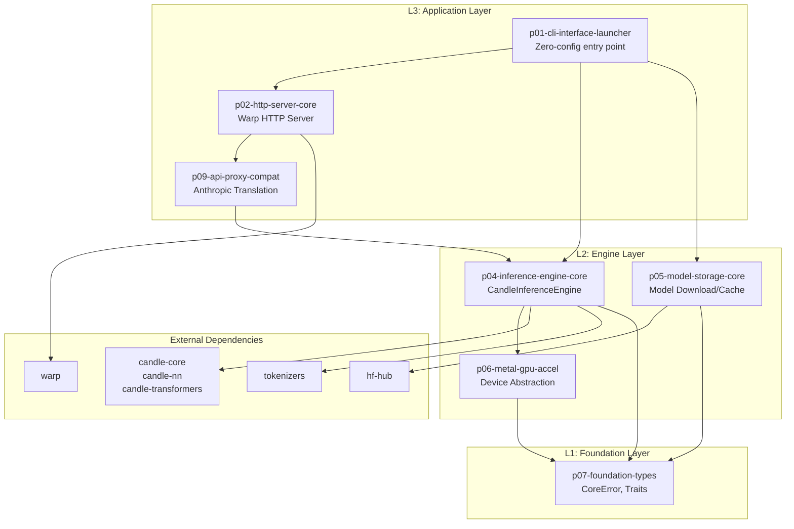
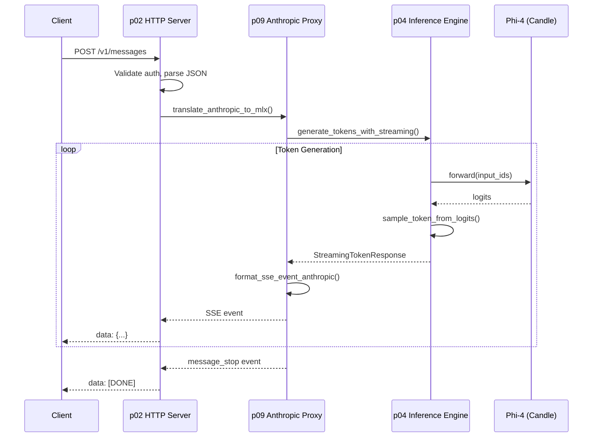
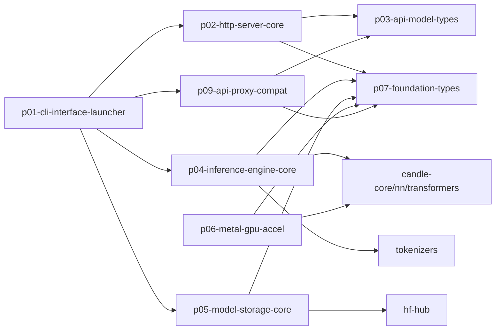

# Pensieve Local LLM Server - Rust Architecture Analysis
**Document ID:** architecture-prd01-rust-hld-lld-202411302345
**Generated:** 2025-11-30T23:45:00Z
**Methodology:** Ultra-deep analysis via Explore + Plan + General-Purpose agents
**Reference Repos:** refRepo/candle, refRepo/mistral.rs, refRepo/mlx-rs

---

## Executive Summary

### PRD01 Compliance Assessment

| Requirement | Target | Recommended Solution |
|-------------|--------|---------------------|
| Zero-config binary | `pensieve-local-llm-server` | Candle + existing p01 CLI |
| Model | Phi-4-reasoning-plus-4bit (~2.4GB) | GGUF Q4_K via Candle quantized |
| Port | 528491 (fixed) | Already hardcoded |
| Platform | Apple Silicon with Metal GPU | `Device::new_metal(0)` |
| API | Anthropic `/v1/messages` | Existing p09 SSE streaming |
| Performance | >=20 TPS, <5GB, <10s warm | Candle + KV cache optimization |

### Library Selection Decision

| Library | Verdict | Rationale |
|---------|---------|-----------|
| **Candle** | **RECOMMENDED** | Already in workspace, pure Rust, Metal support, GGUF/Phi support |
| mistral.rs | Alternative | Production-ready but adds complexity, uses Candle internally |
| mlx-rs | Viable | True MLX bindings but C++ FFI, less mature |

**Final Choice: Candle 0.9.1 with `features = ["metal"]`**

---

## Part 1: High-Level Design (HLD)

### 1.1 System Architecture Diagram



### 1.2 Data Flow: Request to Response



### 1.3 Crate Dependency Graph



---

## Part 2: Low-Level Design (LLD)

### 2.1 Key Trait Definitions (4-Word Parseltongue Names)

#### p07-foundation-types (L1 Core)

```rust
/// Base result type for all operations
pub type CoreResult<T> = Result<T, CoreError>;

/// Validation trait for all configurable types
pub trait ValidateConfigurationCompletely {
    fn validate_configuration_completely(&self) -> CoreResult<()>;
}

/// Reset trait for stateful components
pub trait ResetInternalStateCompletely {
    fn reset_internal_state_completely(&mut self);
}

/// RAII resource management trait
pub trait ManageResourceLifecycleRaii {
    type Error: Into<CoreError>;
    fn is_resource_currently_available(&self) -> bool;
    fn acquire_resource_for_use(&mut self) -> Result<(), Self::Error>;
    fn release_resource_after_use(&mut self) -> Result<(), Self::Error>;
}
```

#### p04-inference-engine-core (L2 Engine)

```rust
/// Main inference engine trait
#[async_trait]
pub trait InferenceEngineWithStreaming:
    ManageResourceLifecycleRaii + ResetInternalStateCompletely + Send + Sync
{
    type TokenStream: Stream<Item = CoreResult<StreamingTokenResponse>> + Send + Unpin;

    /// Load GGUF quantized model from path
    async fn load_gguf_model_from_path(
        &mut self,
        model_path: &Path
    ) -> CoreResult<()>;

    /// Generate tokens with async streaming
    async fn generate_tokens_with_streaming(
        &self,
        input: &str,
        config: GenerationConfig,
    ) -> CoreResult<Self::TokenStream>;

    /// Get memory usage for monitoring
    fn get_memory_usage_metrics(&self) -> MemoryUsageMetrics;

    /// Clear KV cache between requests
    fn clear_kv_cache_completely(&mut self) -> CoreResult<()>;
}

/// Token sampling with temperature/top-p
pub trait SampleTokenFromLogits: Send + Sync {
    fn sample_token_from_logits(
        &self,
        logits: &Tensor,
        temperature: f32,
        top_p: f32,
    ) -> CoreResult<u32>;
}

/// KV cache with eviction policy
pub trait ManageKvCacheMemory: ManageResourceLifecycleRaii + ResetInternalStateCompletely {
    fn get_cache_size_tokens(&self) -> usize;
    fn trim_cache_to_size(&mut self, target: usize) -> CoreResult<()>;
    fn get_cache_memory_megabytes(&self) -> f64;
}
```

#### p05-model-storage-core (L2 Storage)

```rust
/// Model download with progress tracking
#[async_trait]
pub trait DownloadModelWithProgress: Send + Sync {
    async fn download_model_with_progress(
        &self,
        repo_id: &str,
        callback: impl Fn(DownloadProgress) + Send,
    ) -> CoreResult<PathBuf>;

    fn verify_model_integrity_checksum(
        &self,
        path: &Path
    ) -> CoreResult<bool>;

    async fn ensure_model_available_cached(
        &self,
        repo_id: &str,
    ) -> CoreResult<PathBuf>;
}

/// GGUF file parsing and loading
pub trait LoadGgufModelWeights {
    fn load_gguf_weights_device(
        &self,
        path: &Path,
        device: &Device,
    ) -> CoreResult<ModelWeights>;

    fn get_gguf_metadata_config(
        &self,
        path: &Path,
    ) -> CoreResult<Phi4Config>;
}
```

### 2.2 Core Struct Definitions

#### Phi4InferenceEngine

```rust
/// Candle-based Phi-4 inference engine (p04)
pub struct Phi4InferenceEngine {
    // Candle components
    device: Device,                              // Metal or CPU
    model: Option<quantized_phi::ModelWeights>,  // GGUF Q4 weights
    tokenizer: Option<Tokenizer>,                // HF tokenizer

    // KV cache per layer
    kv_cache: Vec<Option<(Tensor, Tensor)>>,

    // Configuration
    config: Phi4Config,
    generation_config: GenerationConfig,

    // Monitoring
    performance: InferencePerformanceContract,
    memory: MemoryUsageMetrics,

    // State
    model_loaded: bool,
    cache_sequence_length: usize,
}

/// Phi-4 model configuration
#[derive(Debug, Clone, Deserialize)]
pub struct Phi4Config {
    pub vocab_size: usize,              // 51200
    pub hidden_size: usize,             // 3072
    pub intermediate_size: usize,       // 8192
    pub num_hidden_layers: usize,       // 32
    pub num_attention_heads: usize,     // 32
    pub num_key_value_heads: usize,     // 8 (GQA)
    pub max_position_embeddings: usize, // 4096
    pub rope_theta: f64,                // 10000.0
    pub rms_norm_eps: f64,              // 1e-5
}

/// Generation parameters
#[derive(Debug, Clone)]
pub struct GenerationConfig {
    pub max_tokens: usize,         // Default: 1024
    pub temperature: f32,          // Default: 0.7
    pub top_p: f32,                // Default: 0.9
    pub top_k: usize,              // Default: 40
    pub repetition_penalty: f32,   // Default: 1.1
    pub stream: bool,              // Default: true
}

/// Performance contract (PRD01 targets)
#[derive(Debug, Clone)]
pub struct InferencePerformanceContract {
    pub min_tokens_per_second: f64,    // 20.0
    pub max_memory_usage_gb: f64,      // 5.0
    pub max_first_token_latency_ms: u64, // 2000
    pub max_warm_start_seconds: u64,   // 10
}
```

#### ModelStorageManager

```rust
/// Model storage manager (p05)
pub struct ModelStorageManager {
    cache_dir: PathBuf,                     // ~/.cache/pensieve-models/
    hub_api: hf_hub::api::sync::Api,        // HuggingFace API
    checksums: HashMap<String, String>,     // Model -> SHA256
    download_timeout: Duration,             // 15 minutes
}

/// Download progress tracking
#[derive(Debug, Clone)]
pub struct DownloadProgress {
    pub bytes_downloaded: u64,
    pub total_bytes: u64,
    pub speed_bytes_per_sec: f64,
    pub eta_seconds: u64,
    pub current_file: String,
    pub percentage: f32,
}
```

#### HttpApiServer

```rust
/// HTTP API server (p02)
pub struct HttpApiServer {
    config: ServerConfig,
    inference_engine: Arc<Mutex<Phi4InferenceEngine>>,
    shutdown_tx: Option<oneshot::Sender<()>>,
}

/// Server configuration (PRD01 fixed)
pub struct ServerConfig {
    pub host: IpAddr,                    // 127.0.0.1
    pub port: u16,                       // 528491
    pub max_concurrent: usize,           // 10
    pub request_timeout_ms: u64,         // 30000
    pub cors_enabled: bool,              // true
}
```

### 2.3 Module Organization

```
p04-inference-engine-core/src/
├── lib.rs                      # Exports, trait re-exports
├── engine/
│   ├── mod.rs                  # InferenceEngineWithStreaming trait
│   ├── phi4_inference_engine.rs  # Main implementation
│   └── token_stream_async.rs   # Async stream wrapper
├── model/
│   ├── mod.rs                  # Model loading traits
│   ├── phi4_model_weights.rs   # Candle ModelWeights wrapper
│   └── gguf_loader_parser.rs   # GGUF file parsing
├── sampler/
│   ├── mod.rs                  # SampleTokenFromLogits trait
│   ├── temperature_sampler.rs  # Temperature scaling
│   └── nucleus_top_p.rs        # Top-p sampling
├── cache/
│   ├── mod.rs                  # ManageKvCacheMemory trait
│   └── kv_cache_layers.rs      # Per-layer KV storage
└── device/
    ├── mod.rs                  # Device abstraction
    └── metal_device_apple.rs   # Metal GPU wrapper

p05-model-storage-core/src/
├── lib.rs                      # Exports
├── manager/
│   ├── mod.rs                  # Storage manager
│   ├── hf_hub_client.rs        # HuggingFace integration
│   └── local_cache_dir.rs      # Cache management
├── download/
│   ├── mod.rs                  # Download traits
│   ├── progress_tracker.rs     # Progress callbacks
│   └── resume_download.rs      # Resume support
└── validation/
    ├── mod.rs                  # Validation traits
    └── sha256_checksum.rs      # Checksum verification
```

### 2.4 Error Hierarchy

```rust
// p07-foundation-types
#[derive(Debug, Clone, PartialEq)]
pub enum CoreError {
    InvalidConfiguration(&'static str),
    ResourceNotFound(&'static str),
    InvalidInputData(&'static str),
    OperationUnsupported(&'static str),
    ServiceUnavailable(&'static str),
    InternalError(&'static str),
}

// p04-inference-engine-core
#[derive(Debug, thiserror::Error)]
pub enum InferenceError {
    #[error("Model not loaded: call load_gguf_model_from_path first")]
    ModelNotLoaded,

    #[error("Tokenization failed: {0}")]
    TokenizationFailed(String),

    #[error("Forward pass failed: {0}")]
    ForwardPassFailed(#[from] candle_core::Error),

    #[error("Metal device unavailable")]
    MetalDeviceUnavailable,

    #[error("Memory limit exceeded: {current_mb:.1}MB > {limit_mb:.1}MB")]
    MemoryLimitExceeded { current_mb: f64, limit_mb: f64 },

    #[error("KV cache overflow at {tokens} tokens")]
    KvCacheOverflow { tokens: usize },

    #[error("Core error: {0:?}")]
    Core(CoreError),
}

// p05-model-storage-core
#[derive(Debug, thiserror::Error)]
pub enum StorageError {
    #[error("Download failed after {attempts} attempts: {reason}")]
    DownloadFailed { attempts: u32, reason: String },

    #[error("Checksum mismatch: expected {expected}, got {actual}")]
    ChecksumMismatch { expected: String, actual: String },

    #[error("Model file not found: {0}")]
    ModelFileNotFound(PathBuf),

    #[error("Insufficient disk space: need {need_mb}MB, have {available_mb}MB")]
    InsufficientDiskSpace { need_mb: u64, available_mb: u64 },

    #[error("Network error: {0}")]
    NetworkError(#[from] reqwest::Error),
}

// p02-http-server-core
#[derive(Debug, thiserror::Error)]
pub enum ServerError {
    #[error("Invalid request: {0}")]
    InvalidRequest(String),

    #[error("Authentication failed")]
    AuthenticationFailed,

    #[error("Inference error: {0}")]
    InferenceError(#[from] InferenceError),

    #[error("Server configuration error: {0}")]
    ConfigurationError(String),

    #[error("Internal server error")]
    InternalError,
}
```

---

## Part 3: Library Integration Strategy

### 3.1 Candle Integration (RECOMMENDED)

#### Cargo.toml Changes

```toml
# Workspace root Cargo.toml
[workspace.dependencies]
# Upgrade from 0.8 to 0.9.1
candle-core = { version = "0.9.1", features = ["metal"] }
candle-nn = { version = "0.9.1", features = ["metal"] }
candle-transformers = { version = "0.9.1", features = ["metal"] }

# Keep existing
tokenizers = "0.19"
hf-hub = { version = "0.3", features = ["tokio"] }
safetensors = "0.4"
```

#### Key Candle Code Patterns

**Device Selection (from refRepo/candle analysis):**
```rust
fn create_device_for_inference() -> CoreResult<Device> {
    if candle_core::utils::metal_is_available() {
        Device::new_metal(0).map_err(|e| InferenceError::MetalDeviceUnavailable)
    } else {
        Ok(Device::Cpu)
    }
}
```

**GGUF Model Loading (from candle-transformers/quantized_phi.rs):**
```rust
async fn load_phi4_from_gguf(path: &Path, device: &Device) -> CoreResult<ModelWeights> {
    let mut file = std::fs::File::open(path)?;
    let content = gguf_file::Content::read(&mut file)?;

    // Log tensor info
    let total_size: usize = content.tensor_infos.values()
        .map(|t| t.shape.elem_count() * t.ggml_dtype.type_size() / t.ggml_dtype.block_size())
        .sum();
    tracing::info!("Loading {} tensors ({:.2} GB)", content.tensor_infos.len(), total_size as f64 / 1e9);

    quantized_phi::ModelWeights::from_gguf(content, &mut file, device)
        .map_err(InferenceError::ForwardPassFailed)
}
```

**Token Generation Loop (from candle-examples/phi/main.rs):**
```rust
async fn generate_tokens_streaming(
    model: &mut ModelWeights,
    tokenizer: &Tokenizer,
    prompt: &str,
    config: &GenerationConfig,
) -> impl Stream<Item = CoreResult<String>> {
    async_stream::stream! {
        let mut tokens = tokenizer.encode(prompt, true)?.get_ids().to_vec();
        let mut generated = 0;
        let mut pos = 0;

        while generated < config.max_tokens {
            // Only process new token after first iteration
            let context_size = if generated > 0 { 1 } else { tokens.len() };
            let input = Tensor::new(&tokens[tokens.len() - context_size..], model.device())?
                .unsqueeze(0)?;

            // Forward pass
            let logits = model.forward(&input, pos)?;
            let logits = logits.squeeze(0)?.to_dtype(DType::F32)?;

            // Sample next token
            let next_token = sample_with_temperature(&logits, config.temperature, config.top_p)?;

            if next_token == tokenizer.token_to_id("<|endoftext|>").unwrap_or(0) {
                break;
            }

            tokens.push(next_token);
            generated += 1;
            pos += context_size;

            // Decode and yield
            if let Some(text) = tokenizer.decode(&[next_token], false).ok() {
                yield Ok(text);
            }
        }
    }
}
```

### 3.2 Why Not mistral.rs or mlx-rs

| Factor | Candle | mistral.rs | mlx-rs |
|--------|--------|------------|--------|
| **In workspace** | YES (v0.8) | NO | NO |
| **Pure Rust** | YES | YES (wraps Candle) | NO (C++ FFI) |
| **Complexity** | Low | High (many features) | Medium |
| **Phi support** | quantized_phi.rs | phi3.rs | Example only |
| **Metal** | Feature flag | Via Candle | Native MLX |
| **GGUF** | Native | Native | Partial |
| **Maintenance** | HuggingFace | Community | Community |

**Decision:** Use Candle directly. mistral.rs adds unnecessary abstraction (it uses Candle internally). mlx-rs requires C++ build complexity.

---

## Part 4: Implementation Phases

### v0.9.5: Real Inference Engine

**Goal:** Replace MockRequestHandler with Candle-based Phi-4

**Tasks:**
1. Upgrade Candle to 0.9.1 with metal feature
2. Implement `Phi4InferenceEngine` struct
3. Implement GGUF loading via `quantized_phi::ModelWeights::from_gguf()`
4. Implement basic greedy sampling
5. Wire to HTTP handler (non-streaming first)

**Key Files:**
- `Cargo.toml` - Upgrade deps
- `p04-inference-engine-core/src/engine/phi4_inference_engine.rs` - NEW
- `p04-inference-engine-core/src/model/gguf_loader_parser.rs` - NEW

**Test:**
```
WHEN Phi4InferenceEngine loads Phi-4-Q4 GGUF
AND generates for "Hello, world!"
THEN produces coherent response
AND uses Metal GPU
```

---

### v0.9.6: HTTP Server Integration

**Goal:** Start actual HTTP server, stream SSE

**Tasks:**
1. Implement server startup in `p01/src/main.rs` (line 73 TODO)
2. Wire Phi4InferenceEngine to Warp handler
3. Implement async stream → SSE conversion
4. Test with curl

**Key Files:**
- `p01-cli-interface-launcher/src/main.rs:73` - Implement startup
- `p02-http-server-core/src/lib.rs` - Real handler
- `p09-api-proxy-compat/src/streaming.rs` - SSE events

**Test:**
```
WHEN POST /v1/messages with valid request
THEN returns SSE stream
AND follows 6-event Anthropic sequence
```

---

### v0.9.7: Performance Optimization

**Goal:** Achieve >=20 TPS, <5GB, <10s warm

**Tasks:**
1. Implement KV cache with eviction
2. Add tensor pooling
3. Profile with Instruments
4. Tune context length

**Targets:**
| Metric | Target |
|--------|--------|
| Tokens/sec | >=20 |
| Memory | <5GB |
| Warm start | <10s |
| First token | <2000ms |

---

### v0.9.8: Integration Testing

**Goal:** Full test coverage

**Test Files:**
```
tests/
├── integration_full_flow.rs
├── api_compliance_anthropic.rs
├── stress_concurrent_requests.rs
├── performance_benchmark_suite.rs
└── edge_cases_validation.rs
```

---

### v0.9.9: Polish

**Goal:** Remove all TODOs, enforce naming

**Checklist:**
- [ ] Zero TODOs
- [ ] All functions: 4-word pattern
- [ ] `cargo clippy` clean
- [ ] `cargo doc` complete

---

### v1.0.0: Production Release

**Validation:**
```
ES001: Zero-Config First Launch      [VERIFIED]
ES002: Warm Start Fast Launch        [VERIFIED]
ES003: Anthropic API Compatibility   [VERIFIED]
ES004: Model Management Reliability  [VERIFIED]

PERF-COLD-001: <15 minutes           [PASSED]
PERF-WARM-002: <10 seconds           [PASSED]
PERF-THROUGHPUT-003: >=20 TPS        [PASSED]
PERF-MEMORY-004: <5GB                [PASSED]
PERF-API-005: <500ms p95             [PASSED]
PERF-COMPAT-006: 100% compliance     [PASSED]
```

---

## Part 5: Reference Implementation Locations

### Candle Reference Code (refRepo/candle)

| Component | File | Key Code |
|-----------|------|----------|
| Phi Model | `candle-transformers/src/models/phi.rs` | `Model::forward()` |
| Quantized Phi | `candle-transformers/src/models/quantized_phi.rs` | `ModelWeights::from_gguf()` |
| GGUF Parsing | `candle-core/src/quantized/gguf_file.rs` | `Content::read()` |
| Metal Device | `candle-core/src/device.rs` | `Device::new_metal()` |
| Sampling | `candle-transformers/src/generation/mod.rs` | `LogitsProcessor::sample()` |
| Phi Example | `candle-examples/examples/phi/main.rs` | Full generation loop |

### mistral.rs Patterns (refRepo/mistral.rs)

| Component | File | Useful Pattern |
|-----------|------|----------------|
| HTTP Server | `mistralrs-server-core/src/mistralrs_server_router_builder.rs` | Axum routing |
| SSE Streaming | `mistralrs-server-core/src/streaming.rs` | BaseStreamer impl |
| Phi Loader | `mistralrs-core/src/pipeline/gguf.rs` | Model::Phi3 variant |
| Memory Config | `mistralrs-core/src/paged_attention.rs` | MemoryGpuConfig |

### mlx-rs Patterns (refRepo/mlx-rs)

| Component | File | Useful Pattern |
|-----------|------|----------------|
| Model Loading | `examples/mistral/src/main.rs` | `load_safetensors()` |
| Inference Loop | `examples/mistral/src/main.rs` | `Generate` iterator |
| Quantization | `mlx-rs/src/nn/mod.rs` | `nn::quantize()` |

---

## Part 6: Critical Files for Implementation

### Priority Order

1. **`p04-inference-engine-core/src/lib.rs`**
   - Replace `MockRequestHandler` with `Phi4InferenceEngine`
   - Implement `InferenceEngineWithStreaming` trait

2. **`p01-cli-interface-launcher/src/main.rs:73`**
   - Remove TODO, implement actual server startup
   - Wire all components together

3. **`Cargo.toml` (workspace)**
   - Upgrade candle-* to 0.9.1
   - Add `features = ["metal"]`

4. **`p05-model-storage-core/src/lib.rs`**
   - Fix model ID to `Phi-4-reasoning-plus-4bit`
   - Implement GGUF download from HuggingFace

5. **`p02-http-server-core/src/lib.rs`**
   - Wire real inference to `/v1/messages` handler
   - Implement SSE streaming output

---

## Appendix A: Candle Model Architecture Reference

### Phi-4 Transformer Block (from quantized_phi.rs)

```rust
pub struct ModelWeights {
    tok_embeddings: Embedding,
    layers: Vec<LayerWeights>,
    output_norm: LayerNorm,
    output: QLinear,
    masks: HashMap<usize, Tensor>,
}

struct LayerWeights {
    attn_norm: LayerNorm,
    attn_qkv: QLinear,      // Fused Q, K, V projection
    attn_output: QLinear,   // Output projection
    ffn_norm: LayerNorm,
    mlp_fc1: QLinear,       // Up projection
    mlp_fc2: QLinear,       // Down projection
    n_head: usize,
    n_kv_head: usize,
    head_dim: usize,
    rotary: RotaryEmbedding,
    kv_cache: Option<(Tensor, Tensor)>,
}

impl ModelWeights {
    pub fn forward(&mut self, x: &Tensor, index_pos: usize) -> Result<Tensor> {
        let mut xs = self.tok_embeddings.forward(x)?;

        for layer in self.layers.iter_mut() {
            let residual = &xs;
            let xs_norm = xs.apply(&layer.attn_norm)?;

            // Self-attention with KV cache
            let attn_output = layer.forward_attn(&xs_norm, mask, index_pos)?;

            // Feed-forward
            let ffn_input = xs_norm.apply(&layer.ffn_norm)?;
            let ffn_output = layer.mlp_fc2.forward(
                &layer.mlp_fc1.forward(&ffn_input)?.gelu()?
            )?;

            xs = (attn_output + ffn_output + residual)?;
        }

        xs.apply(&self.output_norm)?
            .i((.., seq_len - 1, ..))?
            .apply(&self.output)
    }
}
```

---

## Appendix B: SSE Event Sequence (Anthropic Format)

```
event: message_start
data: {"type":"message_start","message":{"id":"msg_xxx","type":"message","role":"assistant","content":[],"model":"phi-4","stop_reason":null,"stop_sequence":null,"usage":{"input_tokens":10,"output_tokens":0}}}

event: content_block_start
data: {"type":"content_block_start","index":0,"content_block":{"type":"text","text":""}}

event: content_block_delta
data: {"type":"content_block_delta","index":0,"delta":{"type":"text_delta","text":"Hello"}}

event: content_block_delta
data: {"type":"content_block_delta","index":0,"delta":{"type":"text_delta","text":" world"}}

event: content_block_stop
data: {"type":"content_block_stop","index":0}

event: message_delta
data: {"type":"message_delta","delta":{"stop_reason":"end_turn","stop_sequence":null},"usage":{"output_tokens":25}}

event: message_stop
data: {"type":"message_stop"}
```

---

*Document generated by Claude Code using Explore + Plan + General-Purpose agents*
*Reference repositories cloned to refRepo/ for analysis*
