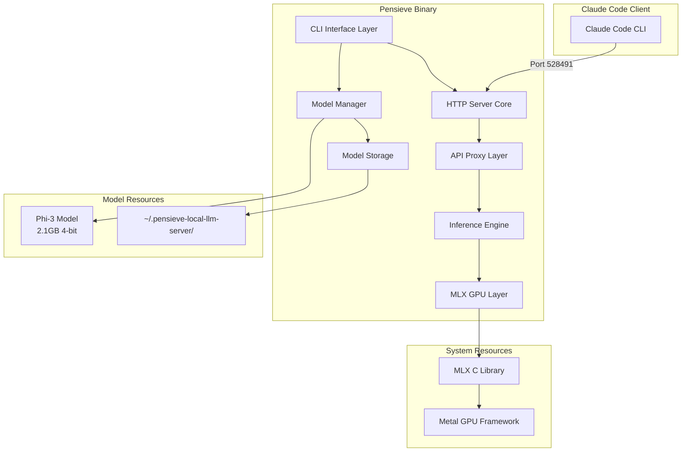
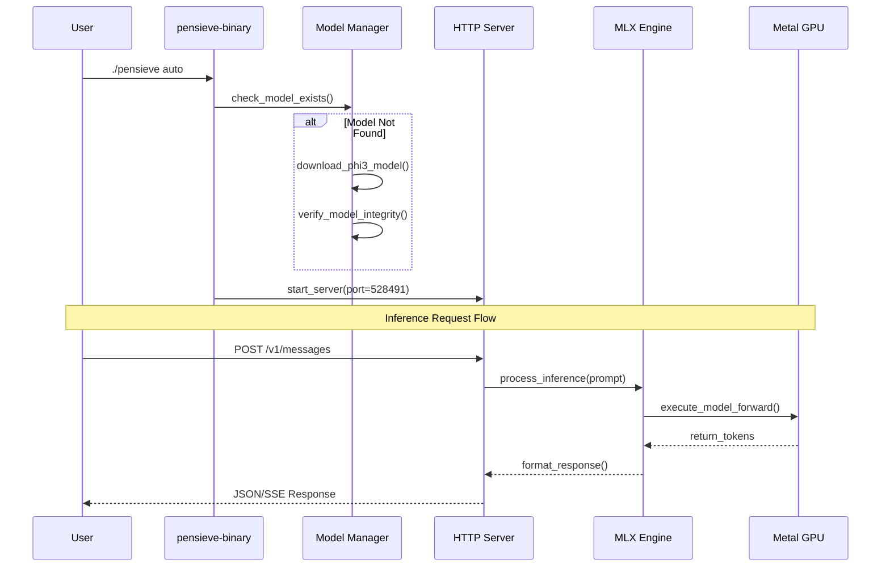
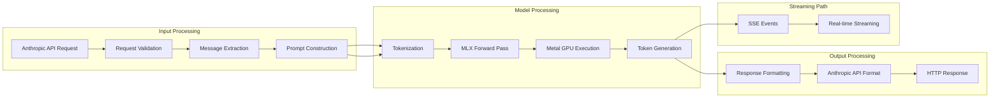
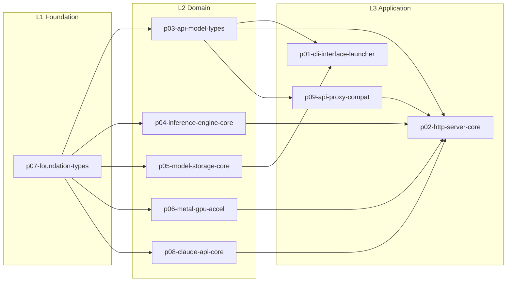

# Technical Architecture Document: Pensieve Local LLM Server

## Executive Summary

**System Identity**: Single-binary Rust LLM server with MLX Metal GPU acceleration
**Primary Mission**: Deploy zero-configuration local LLM inference with Phi-3 model
**Architecture Style**: Layered functional architecture with MLX C FFI integration
**Design Principles**: Parseltongue TDD-first, functional idiomatic Rust, minimal configuration

### Fixed System Constraints
- **Port**: 528491 (hardcoded for Claude Code compatibility)
- **Model Directory**: `~/.pensieve-local-llm-server` (fixed location)
- **Model**: Phi-3-mini-128k-instruct-4bit (2.1GB, 4-bit quantized)
- **Configuration**: Single download action parameter (auto/skip/force)

### Core Architectural Decisions
1. **Pure Rust Implementation**: Maximum performance, memory safety, single binary
2. **Direct MLX C FFI**: Zero Python overhead, native Metal GPU acceleration
3. **Layered Architecture**: Strict L1→L2→L3 separation with parseltongue naming
4. **Fixed Configuration**: Eliminates user error, ensures reliability
5. **Functional Composition**: Immutable data structures, result chaining

---

## High-Level Design (HLD)

### System Architecture Overview



### Component Interaction Diagram



### Data Flow Analysis



### Security and Performance Considerations

#### Security Architecture
- **Input Validation**: All requests validated against Anthropic API schema
- **Memory Safety**: Rust ownership prevents buffer overflows and memory leaks
- **Resource Limits**: Concurrency semaphores prevent memory exhaustion
- **File System**: Model files stored in user directory with proper permissions

#### Performance Architecture
- **Memory Gating**: System monitor blocks requests under memory pressure
- **Concurrency Limiting**: Semaphore limits simultaneous inference requests
- **GPU Optimization**: Direct MLX C FFI eliminates Python overhead
- **Streaming Support**: True streaming with server-sent events (SSE)

---

## Low-Level Design (LLD)

### Layered Architecture (L1→L2→L3)

#### Layer 1: Foundation Types (p07-foundation-types)
```rust
/// Core error types following Parseltongue four-word naming
pub mod error {
    #[derive(Debug, Clone, PartialEq)]
    pub enum CoreError {
        InvalidConfig(&'static str),
        NotFound(&'static str),
        InvalidInput(&'static str),
        Unsupported(&'static str),
        Unavailable(&'static str),
        Generic(&'static str),
    }
}

/// Core traits for all Pensieve components
pub mod traits {
    pub trait Validate {
        fn validate(&self) -> core::result::Result<(), CoreError>;
    }

    pub trait Resource {
        type Error: Into<CoreError>;
        fn is_available(&self) -> bool;
        fn acquire(&mut self) -> core::result::Result<(), Self::Error>;
        fn release(&mut self) -> core::result::Result<(), Self::Error>;
    }
}
```

#### Layer 2: Domain Components
The 9 Rust crates follow strict layering:



### Function Specifications with Four-Word Naming

#### CLI Interface Functions
```rust
/// Parse command line arguments with validation
///
/// # Preconditions
/// - Command line args available in env::args()
/// - Args follow pensieve CLI format
///
/// # Postconditions
/// - Returns Ok(CliArgs) if valid
/// - Returns Err(CliError) if invalid
///
/// # Error Conditions
/// - Invalid argument format
/// - Missing required arguments
/// - Invalid download action
pub fn parse_cli_arguments_validate() -> error::CliResult<CliArgs>;

/// Launch server with graceful shutdown handling
///
/// # Preconditions
/// - Valid CliArgs provided
/// - Model available in storage
/// - Port 528491 is available
///
/// # Postconditions
/// - Server listening on port 528491
/// - Shutdown handlers installed
/// - Returns exit code on completion
///
/// # Error Conditions
/// - Port already in use
/// - Model loading failure
/// - Permission denied
pub async fn launch_server_with_graceful_shutdown(
    config: &ServerConfig,
    model_path: &PathBuf,
) -> error::CliResult<i32>;
```

#### HTTP Server Functions
```rust
/// Create HTTP routes with middleware stack
///
/// # Preconditions
/// - Request handler available
/// - Server configuration valid
///
/// # Postconditions
/// - Returns Warp filter with all routes
/// - CORS middleware applied
/// - Authentication middleware configured
///
/// # Error Conditions
/// - Invalid route configuration
/// - Middleware stack conflict
pub fn create_http_routes_with_middleware(
    handler: Arc<dyn traits::RequestHandler>,
) -> impl Filter<Extract = impl warp::Reply, Error = warp::Rejection> + Clone;

/// Process inference request with memory gating
///
/// # Preconditions
/// - Valid Anthropic API request
/// - Sufficient system memory available
/// - Model loaded and ready
///
/// # Postconditions
/// - Returns inference response
/// - Updates usage statistics
/// - Logs processing metrics
///
/// # Error Conditions
/// - Request validation failure
/// - Insufficient memory
/// - Model inference error
pub async fn process_inference_with_memory_gating(
    request: CreateMessageRequest,
    handler: &MlxRequestHandler,
) -> error::ServerResult<CreateMessageResponse>;
```

#### Model Management Functions
```rust
/// Download Phi-3 model with progress tracking
///
/// # Preconditions
/// - Valid network connection
/// - Sufficient disk space (~3GB)
/// - Write permissions in model directory
///
/// # Postconditions
/// - Model downloaded to ~/.pensieve-local-llm-server/
/// - Integrity verification completed
/// - Returns model path
///
/// # Error Conditions
/// - Network connection failure
/// - Insufficient disk space
/// - Permission denied
/// - Corrupted download
pub async fn download_phi3_model_with_progress(
    model_dir: &PathBuf,
) -> error::CoreResult<PathBuf>;

/// Verify model file integrity with checksums
///
/// # Preconditions
/// - Model file exists at specified path
/// - Expected checksums available
///
/// # Postconditions
/// - Returns Ok(()) if integrity verified
/// - Returns Err(CoreError) if verification fails
/// - Logs verification results
///
/// # Error Conditions
/// - File not found
/// - Checksum mismatch
/// - File corruption detected
pub fn verify_model_file_integrity(
    model_path: &PathBuf,
) -> error::CoreResult<()>;
```

### Data Structures and Types

#### Core Configuration Types
```rust
/// Server configuration with fixed constraints
#[derive(Debug, Clone, Serialize, Deserialize)]
pub struct ServerConfig {
    pub host: String,           // Fixed: "127.0.0.1"
    pub port: u16,             // Fixed: 528491
    pub max_concurrent_requests: usize,  // Fixed: 10
    pub request_timeout_ms: u64,        // Fixed: 30000
    pub enable_cors: bool,              // Fixed: true
}

impl Default for ServerConfig {
    fn default() -> Self {
        Self {
            host: "127.0.0.1".to_string(),
            port: 528491,           // Fixed port for Claude Code
            max_concurrent_requests: 10,  // Conservative limit
            request_timeout_ms: 30000,
            enable_cors: true,
        }
    }
}

/// Model configuration with automatic path management
#[derive(Debug, Clone, Serialize, Deserialize)]
pub struct ModelConfig {
    pub model_name: String,           // Fixed: "phi-3-mini-128k-instruct-4bit"
    pub model_url: String,            // Fixed Microsoft URL
    pub model_size_bytes: u64,        // Fixed: 2.1GB
    pub model_checksum: String,       // Fixed SHA256
    pub model_directory: PathBuf,     // Fixed: ~/.pensieve-local-llm-server/
}

impl Default for ModelConfig {
    fn default() -> Self {
        let home_dir = std::env::var("HOME")
            .unwrap_or_else(|_| ".".to_string());

        Self {
            model_name: "phi-3-mini-128k-instruct-4bit".to_string(),
            model_url: "https://huggingface.co/microsoft/Phi-3-mini-128k-instruct-4bit/resolve/main/model.gguf".to_string(),
            model_size_bytes: 2_147_483_648,  // 2GB
            model_checksum: "PLACEHOLDER_SHA256".to_string(),  // To be updated
            model_directory: PathBuf::from(format!("{}/.pensieve-local-llm-server", home_dir)),
        }
    }
}
```

### Error Handling Strategies

#### Hierarchical Error Types
```rust
/// Application-level error handling with structured context
pub mod error {
    use thiserror::Error;

    #[derive(Error, Debug)]
    pub enum AppError {
        #[error("CLI error: {0}")]
        Cli(#[from] CliError),

        #[error("Server error: {0}")]
        Server(#[from] ServerError),

        #[error("Model error: {0}")]
        Model(#[from] ModelError),

        #[error("MLX inference error: {0}")]
        Mlx(#[from] MlxError),

        #[error("System resource error: {memory:.2}GB available, {required:.2}GB required")]
        InsufficientMemory { memory: f64, required: f64 },
    }

    #[derive(Error, Debug)]
    pub enum ModelError {
        #[error("Model download failed: {source}")]
        DownloadFailed { source: String },

        #[error("Model verification failed: checksum mismatch")]
        VerificationFailed,

        #[error("Model not found at path: {path}")]
        NotFound { path: String },

        #[error("Model corrupted: {details}")]
        Corrupted { details: String },
    }
}
```

### Implementation Contracts

#### TDD-First Test Contracts
```rust
/// Test contract for model download functionality
#[cfg(test)]
mod model_download_tests {
    use super::*;
    use tempfile::TempDir;
    use mockito::{mock, Server};

    /// Test contract: Model download with progress tracking
    ///
    /// Given: Valid model URL and temporary directory
    /// When: download_phi3_model_with_progress() is called
    /// Then: Model downloaded successfully with correct size
    #[tokio::test]
    async fn test_model_download_progress_contract() {
        let temp_dir = TempDir::new().unwrap();
        let model_config = ModelConfig::default();

        // Mock HTTP server
        let mock_server = Server::new();
        let mock = mock("GET", "/model.gguf")
            .with_status(200)
            .with_header("content-length", "1024")
            .with_body("mock model content")
            .create();

        let result = download_phi3_model_with_progress(&temp_dir.path().to_path_buf()).await;
        assert!(result.is_ok());

        let model_path = temp_dir.path().join("model.gguf");
        assert!(model_path.exists());
        assert_eq!(model_path.metadata().unwrap().len(), 18); // "mock model content"

        mock.assert();
    }

    /// Test contract: Memory gating prevents overload
    ///
    /// Given: System under memory pressure
    /// When: process_inference_with_memory_gating() is called
    /// Then: Request rejected with appropriate error
    #[tokio::test]
    async fn test_memory_gating_prevents_overload() {
        // Mock memory monitor reporting low memory
        let memory_monitor = Arc::new(MockMemoryMonitor::new(/* available_gb: */ 1.0));
        let handler = MlxRequestHandler::new("test_model".to_string());

        let request = CreateMessageRequest::default();
        let result = process_inference_with_memory_gating(request, &handler).await;

        assert!(result.is_err());
        match result.unwrap_err() {
            ServerError::Internal(msg) => {
                assert!(msg.contains("Insufficient memory"));
            }
            _ => panic!("Expected memory error"),
        }
    }
}
```

---

## Architecture Principles

### Layered Architecture (L1→L2→L3)

The system follows strict architectural layering with clear separation of concerns:

#### Layer 1: Foundation (Core Language Features)
- **Purpose**: Core abstractions, no external dependencies
- **Components**: `p07-foundation-types`
- **Characteristics**: no_std compatible, pure Rust traits
- **Examples**: CoreError, Resource trait, Validate trait

#### Layer 2: Domain (Business Logic)
- **Purpose**: Domain-specific logic, standard library usage
- **Components**: `p03-api-model-types`, `p04-inference-engine-core`, etc.
- **Characteristics**: Business rules, data models, internal APIs
- **Examples**: ModelConfig, InferenceEngine, RequestHandler

#### Layer 3: Application (External Integration)
- **Purpose**: External integrations, user interfaces
- **Components**: `p01-cli-interface-launcher`, `p02-http-server-core`
- **Characteristics**: HTTP server, CLI interface, external APIs
- **Examples**: Warp routes, Clap parsing, MLX FFI calls

### Functional Idiomatic Rust Principles

#### Immutability and Ownership
```rust
/// Immutable request handling with move semantics
pub struct InferenceRequest {
    pub prompt: String,
    pub max_tokens: u32,
    pub temperature: f32,
}

impl InferenceRequest {
    /// Process request with guaranteed immutability
    pub fn process_inference_immutable(self) -> InferenceResponse {
        // Self is moved, preventing modification
        let tokens = self.generate_tokens();
        InferenceResponse::new(tokens)
    }
}
```

#### Result/Option Chain Processing
```rust
/// Functional error chaining with context
pub async fn load_model_with_context(path: &Path) -> Result<Model, AppError> {
    let model_bytes = std::fs::read(path)
        .await
        .context("Failed to read model file")?
        .into();

    let model = Model::from_bytes(model_bytes)
        .context("Failed to parse model format")?;

    Ok(model)
}
```

#### Iterator-Based Transformations
```rust
/// Functional message processing pipeline
pub fn process_message_chain_immutable(messages: &[Message]) -> String {
    messages
        .iter()
        .filter_map(|msg| match msg.role {
            Role::User => Some(&msg.content),
            Role::Assistant => Some(&msg.content),
            _ => None,
        })
        .map(|content| content.as_str())
        .collect::<Vec<_>>()
        .join("\n")
}
```

### TDD Methodology

#### STUB → RED → GREEN → REFACTOR Cycle

```rust
/// Phase 1: STUB - Interface definition
pub async fn validate_api_request_contract(request: &ApiRequest) -> Result<(), ValidationError> {
    todo!("Implement request validation")
}

/// Phase 2: RED - Failing test
#[tokio::test]
async fn test_api_request_validation_rejects_invalid() {
    let invalid_request = ApiRequest {
        model: "".to_string(),  // Invalid: empty
        messages: vec![],
        max_tokens: 0,          // Invalid: zero
    };

    let result = validate_api_request_contract(&invalid_request).await;
    assert!(result.is_err());
}

/// Phase 3: GREEN - Minimal implementation
pub async fn validate_api_request_contract(request: &ApiRequest) -> Result<(), ValidationError> {
    if request.model.is_empty() {
        return Err(ValidationError::InvalidModel);
    }
    if request.max_tokens == 0 {
        return Err(ValidationError::InvalidMaxTokens);
    }
    Ok(())
}

/// Phase 4: REFACTOR - Optimized implementation
pub async fn validate_api_request_contract(request: &ApiRequest) -> Result<(), ValidationError> {
    use std::convert::TryInto;

    // Functional validation with early returns
    request.model.try_into().map_err(|_| ValidationError::InvalidModel)?;
    request.max_tokens.try_into().map_err(|_| ValidationError::InvalidMaxTokens)?;
    request.messages.try_into().map_err(|_| ValidationError::InvalidMessages)?;

    Ok(())
}
```

### Performance Optimization Strategies

#### Memory Management
```rust
/// Zero-copy message processing for performance
pub struct MessageProcessor {
    buffer_pool: Arc<Mutex<Vec<Vec<u8>>>>,
}

impl MessageProcessor {
    /// Process messages with buffer reuse
    pub async fn process_with_buffer_reuse(
        &self,
        messages: &[Message],
    ) -> Result<ProcessedMessages> {
        let mut pool = self.buffer_pool.lock().await;
        let mut buffers = Vec::new();

        // Reuse buffers from pool instead of allocating
        for _ in messages {
            buffers.push(pool.pop().unwrap_or_else(Vec::new));
        }

        // Process with minimal allocations
        let result = self.process_with_buffers(messages, &mut buffers).await?;

        // Return buffers to pool
        for mut buffer in buffers {
            buffer.clear();
            pool.push(buffer);
        }

        Ok(result)
    }
}
```

#### Concurrency Patterns
```rust
/// Actor pattern for safe concurrent state management
pub struct InferenceActor {
    state: InferenceState,
    receiver: mpsc::Receiver<InferenceMessage>,
}

pub enum InferenceMessage {
    Process {
        request: InferenceRequest,
        respond_to: oneshot::Sender<Result<InferenceResponse>>,
    },
    GetStatus {
        respond_to: oneshot::Sender<InferenceStatus>,
    },
}

impl InferenceActor {
    pub async fn run(mut self) {
        while let Some(msg) = self.receiver.recv().await {
            match msg {
                InferenceMessage::Process { request, respond_to } => {
                    let result = self.process_inference(&request).await;
                    let _ = respond_to.send(result);
                }
                InferenceMessage::GetStatus { respond_to } => {
                    let _ = respond_to.send(self.get_status());
                }
            }
        }
    }
}
```

---

## Component Specifications

### CLI Interface Design

#### Fixed Command Structure
```rust
/// Single command interface with download action
#[derive(Debug, Clone, clap::Parser)]
#[command(name = "pensieve")]
#[command(about = "Pensieve Local LLM Server", long_about = None)]
pub struct CliArgs {
    /// Download action: auto (check and download), skip (use existing), force (re-download)
    #[arg(default_value = "auto")]
    pub download: DownloadAction,
}

#[derive(Debug, Clone, clap::ValueEnum)]
pub enum DownloadAction {
    /// Automatically download if model not found
    Auto,
    /// Skip download, fail if model not found
    Skip,
    /// Force re-download even if model exists
    Force,
}
```

#### Four-Word CLI Functions
```rust
/// Initialize logging with configurable level
pub fn initialize_logging_system() -> error::CliResult<()>;

/// Check system prerequisites silently
pub fn check_system_prerequisites_quiet() -> error::CliResult<SystemCheckResult>;

/// Create model directory structure
pub fn ensure_model_directory_exists() -> error::CliResult<PathBuf>;

/// Launch inference server process
pub async fn launch_inference_server_process(
    config: &ServerConfig,
) -> error::CliResult<tokio::process::Child>;
```

### HTTP Server Implementation

#### Fixed Port Configuration
```rust
/// Server configuration with hardcoded constraints
impl HttpApiServer {
    /// Create server with fixed port 528491
    pub fn create_with_fixed_port(
        handler: Arc<dyn traits::RequestHandler>,
    ) -> Self {
        let config = ServerConfig {
            host: "127.0.0.1".to_string(),
            port: 528491,  // Fixed for Claude Code integration
            max_concurrent_requests: 10,
            request_timeout_ms: 30000,
            enable_cors: true,
        };

        Self::new(config, handler)
    }
}
```

#### API Route Handlers
```rust
/// Handle Anthropic-compatible message creation
pub async fn handle_anthropic_message_creation(
    auth_header: Option<String>,
    request: CreateMessageRequest,
    handler: Arc<dyn traits::RequestHandler>,
) -> std::result::Result<Box<dyn warp::Reply + Send>, warp::Rejection>;

/// Handle streaming message creation with SSE
pub async fn handle_streaming_message_creation(
    auth_header: Option<String>,
    request: CreateMessageRequest,
    handler: Arc<dyn traits::RequestHandler>,
) -> std::result::Result<Box<dyn warp::Reply + Send>, warp::Rejection>;

/// Handle model list endpoint
pub async fn handle_model_list_request() -> impl warp::Reply {
    warp::reply::json(&serde_json::json!({
        "object": "list",
        "data": [{
            "id": "phi-3-mini-128k-instruct-4bit",
            "object": "model",
            "created": 1677610602,
            "owned_by": "microsoft"
        }]
    }))
}
```

### Model Manager and Downloader

#### Automatic Model Management
```rust
/// Model manager with automatic download and verification
pub struct ModelManager {
    config: ModelConfig,
    http_client: reqwest::Client,
}

impl ModelManager {
    /// Ensure model is available, downloading if necessary
    pub async fn ensure_model_available(&self, action: DownloadAction) -> error::CoreResult<PathBuf> {
        match action {
            DownloadAction::Auto => {
                if !self.model_exists() {
                    self.download_model().await?;
                }
                self.verify_model().map(|_| self.get_model_path())
            }
            DownloadAction::Skip => {
                if self.model_exists() && self.verify_model().is_ok() {
                    Ok(self.get_model_path())
                } else {
                    Err(error::CoreError::NotFound("Model not available"))
                }
            }
            DownloadAction::Force => {
                self.download_model().await?;
                self.verify_model().map(|_| self.get_model_path())
            }
        }
    }

    /// Download model with progress tracking
    async fn download_model(&self) -> error::CoreResult<()> {
        let response = self.http_client.get(&self.config.model_url)
            .send()
            .await
            .map_err(|e| error::CoreError::Generic("download failed"))?;

        let total_size = response.content_length().unwrap_or(0);
        let mut downloaded = 0u64;
        let mut stream = response.bytes_stream();

        let mut file = tokio::fs::File::create(self.get_model_path()).await
            .map_err(|e| error::CoreError::Generic("file creation failed"))?;

        use futures::StreamExt;
        while let Some(chunk) = stream.next().await {
            let chunk = chunk.map_err(|e| error::CoreError::Generic("stream error"))?;
            file.write_all(&chunk).await
                .map_err(|e| error::CoreError::Generic("write failed"))?;

            downloaded += chunk.len() as u64;
            if total_size > 0 {
                let progress = (downloaded * 100) / total_size;
                eprintln!("Downloading model: {}% ({}MB/{}MB)",
                    progress, downloaded / 1024 / 1024, total_size / 1024 / 1024);
            }
        }

        Ok(())
    }
}
```

### MLX Integration Layer

#### C FFI Interface
```rust
/// MLX C FFI bindings for Metal GPU acceleration
#[link(name = "mlx", kind = "static")]
extern "C" {
    /// Initialize MLX context with Metal device
    fn mlx_context_init(device_id: i32) -> *mut c_void;

    /// Load model from file path
    fn mlx_model_load(context: *mut c_void, model_path: *const c_char) -> *mut c_void;

    /// Run inference with prompt and parameters
    fn mlx_inference_forward(
        model: *mut c_void,
        prompt: *const c_char,
        max_tokens: i32,
        temperature: f32,
        output_buffer: *mut c_char,
        output_size: i32,
    ) -> i32;

    /// Cleanup MLX resources
    fn mlx_context_cleanup(context: *mut c_void);
    fn mlx_model_cleanup(model: *mut c_void);
}

/// Safe Rust wrapper for MLX C API
pub struct MlxContext {
    context_ptr: *mut c_void,
    model_ptr: *mut c_void,
}

impl MlxContext {
    /// Create new MLX context with Metal GPU
    pub fn new(model_path: &Path) -> error::MlxResult<Self> {
        let context_ptr = unsafe {
            mlx_context_init(0)  // Use default Metal device
        };

        if context_ptr.is_null() {
            return Err(error::MlxError::ContextCreationFailed);
        }

        let model_path_c = CString::new(model_path.to_string_lossy().as_bytes())
            .map_err(|_| error::MlxError::InvalidPath)?;

        let model_ptr = unsafe {
            mlx_model_load(context_ptr, model_path_c.as_ptr())
        };

        if model_ptr.is_null() {
            unsafe { mlx_context_cleanup(context_ptr); }
            return Err(error::MlxError::ModelLoadFailed);
        }

        Ok(Self { context_ptr, model_ptr })
    }

    /// Run inference with prompt
    pub fn inference_forward(
        &self,
        prompt: &str,
        max_tokens: u32,
        temperature: f32,
    ) -> error::MlxResult<String> {
        let prompt_c = CString::new(prompt)
            .map_err(|_| error::MlxError::InvalidPrompt)?;

        let mut output_buffer = vec![0u8; 8192];  // 8KB output buffer

        let result = unsafe {
            mlx_inference_forward(
                self.model_ptr,
                prompt_c.as_ptr(),
                max_tokens as i32,
                temperature,
                output_buffer.as_mut_ptr() as *mut c_char,
                output_buffer.len() as i32,
            )
        };

        if result < 0 {
            return Err(error::MlxError::InferenceFailed);
        }

        // Find null terminator
        let end_pos = output_buffer.iter().position(|&b| b == 0)
            .unwrap_or(output_buffer.len());

        let output = String::from_utf8_lossy(&output_buffer[..end_pos])
            .into_owned();

        Ok(output)
    }
}

impl Drop for MlxContext {
    fn drop(&mut self) {
        unsafe {
            if !self.model_ptr.is_null() {
                mlx_model_cleanup(self.model_ptr);
            }
            if !self.context_ptr.is_null() {
                mlx_context_cleanup(self.context_ptr);
            }
        }
    }
}
```

### Inference Engine

#### Request Processing Pipeline
```rust
/// Inference engine with memory management and batching
pub struct InferenceEngine {
    mlx_context: Arc<Mutex<MlxContext>>,
    config: InferenceConfig,
    semaphore: Arc<Semaphore>,
}

impl InferenceEngine {
    /// Create new inference engine with resource limits
    pub fn new(model_path: &Path, max_concurrent: usize) -> error::CoreResult<Self> {
        let mlx_context = Arc::new(Mutex::new(MlxContext::new(model_path)?));
        let semaphore = Arc::new(Semaphore::new(max_concurrent));

        Ok(Self {
            mlx_context,
            config: InferenceConfig::default(),
            semaphore,
        })
    }

    /// Process inference request with resource management
    pub async fn process_inference_request(
        &self,
        request: InferenceRequest,
    ) -> error::CoreResult<InferenceResponse> {
        // Acquire semaphore permit (concurrency limiting)
        let _permit = self.semaphore.acquire().await
            .map_err(|_| error::CoreError::Unavailable("concurrency limit"))?;

        // Check memory before inference
        self.check_memory_requirements().await?;

        // Build prompt from message history
        let prompt = self.build_prompt_from_messages(&request.messages)?;

        // Run inference with timeout
        let result = tokio::time::timeout(
            Duration::from_secs(120),  // 2 minute timeout
            self.run_inference(&prompt, &request)
        ).await
        .map_err(|_| error::CoreError::Generic("inference timeout"))??;

        Ok(result)
    }

    /// Run streaming inference
    pub async fn process_streaming_inference(
        &self,
        request: InferenceRequest,
    ) -> error::CoreResult<impl Stream<Item = String> + Send> {
        let prompt = self.build_prompt_from_messages(&request.messages)?;
        let mlx_context = Arc::clone(&self.mlx_context);

        Ok(async_stream::stream! {
            let tokens = generate_tokens_stream(&prompt, request.max_tokens).await?;
            for token in tokens {
                yield format!("data: {{\"type\": \"content_block_delta\", \"delta\": {{\"text\": \"{}\"}}}}\n\n",
                    token.escape_default());
            }
        })
    }

    /// Internal inference execution
    async fn run_inference(
        &self,
        prompt: &str,
        request: &InferenceRequest,
    ) -> error::CoreResult<InferenceResponse> {
        let context = self.mlx_context.lock().await;
        let output = context.inference_forward(
            prompt,
            request.max_tokens,
            request.temperature.unwrap_or(0.7),
        )?;

        Ok(InferenceResponse {
            content: output,
            input_tokens: prompt.split_whitespace().count() as u32,
            output_tokens: output.split_whitespace().count() as u32,
        })
    }

    /// Check system memory before inference
    async fn check_memory_requirements(&self) -> error::CoreResult<()> {
        let memory_monitor = SystemMemoryMonitor::new();
        let status = memory_monitor.check_status();

        if !status.accepts_requests() {
            return Err(error::CoreError::Unavailable(
                format!("Insufficient memory: {:?}", status)
            ));
        }

        Ok(())
    }
}
```

---

## Implementation Guidelines

### Four-Word Naming Convention Checklist

Every function name must follow the pattern: `verb_constraint_target_qualifier()`

#### Function Name Examples
```rust
✅ parse_cli_arguments_validate()
✅ download_phi3_model_with_progress()
✅ process_inference_with_memory_gating()
✅ create_http_routes_with_middleware()
✅ verify_model_file_integrity()
✅ handle_streaming_message_creation()
✅ initialize_logging_system()
✅ check_system_prerequisites_quiet()
✅ launch_inference_server_process()
✅ ensure_model_directory_exists()

❌ parse()                    // Too short (1 word)
❌ download_model()          // Too short (2 words)
❌ handle_request()          // Too generic (2 words)
❌ process_inference_request_with_memory_gating_and_timeout() // Too long (6 words)
```

### TDD Implementation Workflow

#### 1. Test-First Development
```rust
// Step 1: Write failing test
#[tokio::test]
async fn test_inference_engine_handles_memory_pressure() {
    let engine = create_test_engine_with_memory_limit(/* 1GB */ 1024);
    let large_request = create_large_inference_request();

    let result = engine.process_inference_request(large_request).await;
    assert!(result.is_err());
    assert!(matches!(result.unwrap_err(), CoreError::Unavailable(_)));
}

// Step 2: Write minimal implementation (will fail)
pub async fn process_inference_request(&self, request: InferenceRequest) -> error::CoreResult<InferenceResponse> {
    todo!("Implement memory checking")
}

// Step 3: Make test pass
pub async fn process_inference_request(&self, request: InferenceRequest) -> error::CoreResult<InferenceResponse> {
    self.check_memory_requirements().await?;
    // ... rest of implementation
}

// Step 4: Refactor for production quality
pub async fn process_inference_request(&self, request: InferenceRequest) -> error::CoreResult<InferenceResponse> {
    let _permit = self.acquire_concurrency_permit().await?;
    self.check_memory_requirements().await?;
    self.run_inference_with_timeout(request).await
}
```

### Performance Validation Contracts

#### Memory Usage Monitoring
```rust
/// Contract: Inference engine uses <4GB memory for Phi-3
#[test]
fn test_inference_engine_memory_usage_contract() {
    let engine = InferenceEngine::new(create_test_model_path(), 1).unwrap();

    // Measure baseline memory
    let baseline_memory = get_process_memory();

    // Load model
    engine.load_model().unwrap();
    let model_loaded_memory = get_process_memory();
    let model_memory = model_loaded_memory - baseline_memory;

    // Validate model memory usage (<2GB for quantized Phi-3)
    assert!(model_memory < 2 * 1024 * 1024 * 1024,
        "Model uses {}MB, expected <2GB", model_memory / 1024 / 1024);

    // Run inference
    let request = create_test_inference_request();
    engine.process_inference_request(request).unwrap();
    let inference_memory = get_process_memory() - model_loaded_memory;

    // Validate inference memory usage (<1GB additional)
    assert!(inference_memory < 1024 * 1024 * 1024,
        "Inference uses {}MB, expected <1GB", inference_memory / 1024 / 1024);
}
```

#### Response Time Validation
```rust
/// Contract: API responses complete within time limits
#[tokio::test]
async fn test_api_response_time_contract() {
    let server = create_test_server().await;
    let client = reqwest::Client::new();

    // Test standard inference time (<30 seconds)
    let start = Instant::now();
    let response = client
        .post("http://127.0.0.1:528491/v1/messages")
        .json(&create_test_message_request())
        .send()
        .await
        .expect("Request should succeed");

    let elapsed = start.elapsed();
    assert!(response.status().is_success());
    assert!(elapsed < Duration::from_secs(30),
        "Response took {:?}, expected <30s", elapsed);

    // Test streaming latency (<100ms per token)
    let start = Instant::now();
    let mut stream = response.bytes_stream();
    let mut token_count = 0;

    use futures::StreamExt;
    while let Some(chunk) = stream.next().await {
        token_count += 1;
        if token_count >= 10 {  // Test first 10 tokens
            break;
        }
    }

    let elapsed_per_token = start.elapsed() / token_count;
    assert!(elapsed_per_token < Duration::from_millis(100),
        "Per-token latency {:?}, expected <100ms", elapsed_per_token);
}
```

### Security Validation

#### Input Sanitization Contract
```rust
/// Contract: All user inputs are properly sanitized
#[test]
fn test_input_sanitization_prevents_injection() {
    let malicious_inputs = vec![
        "'; DROP TABLE messages; --",
        "<script>alert('xss')</script>",
        "\x00\x01\x02\x03\x04",  // Control characters
        &"A".repeat(100_000),    // Oversized input
    ];

    for input in malicious_inputs {
        let result = validate_message_content(input, 10_000);
        assert!(result.is_err(),
            "Malicious input should be rejected: {:?}", input);
    }
}

/// Contract: Model file integrity is verified
#[test]
fn test_model_integrity_verification_contract() {
    let valid_model = create_test_model_with_checksum();
    let corrupted_model = create_corrupted_test_model();

    // Valid model passes verification
    assert!(verify_model_file_integrity(&valid_model.path).is_ok());

    // Corrupted model fails verification
    assert!(verify_model_file_integrity(&corrupted_model.path).is_err());
}
```

This comprehensive technical architecture document provides the complete blueprint for implementing the Pensieve Local LLM Server following Parseltongue principles with four-word naming conventions, TDD methodology, and functional Rust idioms throughout all layers of the system.