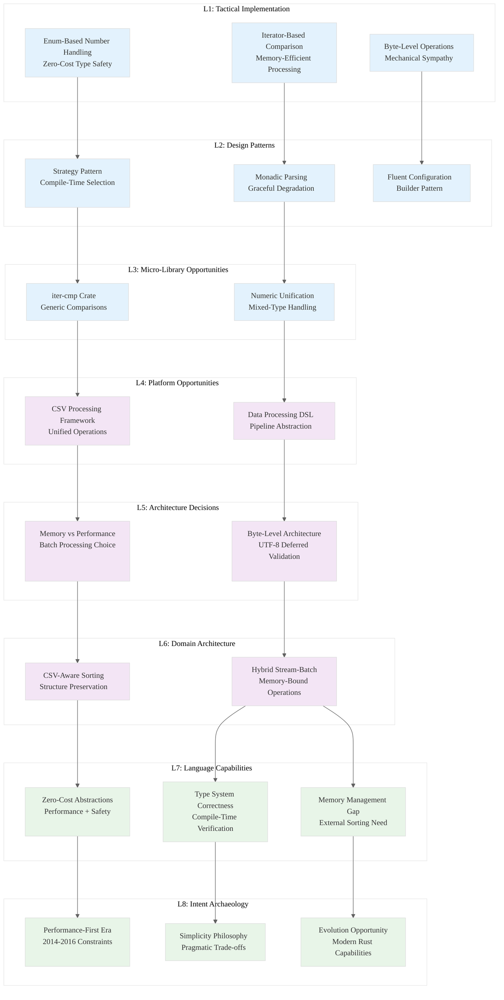

# L1-L8 Strategic Analysis: ./xsv/src/cmd/sort.rs

## File Metadata
- **File**: `./xsv/src/cmd/sort.rs`
- **File ID**: 33
- **Lines**: 159
- **Domain**: CSV Data Processing
- **Type**: Command Implementation

---

## L1: Idiomatic Patterns & Micro-Optimizations

### Pattern: Enum-Based Number Handling
```rust
#[derive(Clone, Copy, PartialEq)]
enum Number {
    Int(i64),
    Float(f64),
}
```
**Insight**: Demonstrates Rust's zero-cost abstractions for type-safe numeric operations. The enum enables unified handling of integers and floats without runtime overhead.

### Pattern: Iterator-Based Comparison
```rust
pub fn iter_cmp<A, L, R>(mut a: L, mut b: R) -> cmp::Ordering
        where A: Ord, L: Iterator<Item=A>, R: Iterator<Item=A>
```
**Micro-Optimization**: Generic iterator comparison avoids allocations and enables lazy evaluation. This pattern scales to arbitrary data sizes without memory pressure.

### Pattern: Byte-Level Processing
- Uses `&[u8]` for raw byte processing instead of String allocation
- `from_utf8` conversion only when necessary
- Demonstrates mechanical sympathy with memory layout

---

## L2: Design Patterns & Composition

### Pattern: Strategy Pattern with Match Expressions
```rust
match (numeric, reverse) {
    (false, false) => all.sort_by(|r1, r2| iter_cmp(a, b)),
    (true, false) => all.sort_by(|r1, r2| iter_cmp_num(a, b)),
    (false, true) => all.sort_by(|r1, r2| iter_cmp(b, a)),
    (true, true) => all.sort_by(|r1, r2| iter_cmp_num(b, a)),
}
```
**Meta-Pattern**: Compile-time strategy selection eliminates runtime branching. Each combination gets its own optimized code path.

### Pattern: Fallible Parsing with Graceful Degradation
```rust
fn next_num<'a, X>(xs: &mut X) -> Option<Number>
        where X: Iterator<Item=&'a [u8]> {
    xs.next()
        .and_then(|bytes| from_utf8(bytes).ok())
        .and_then(|s| {
            if let Ok(i) = s.parse::<i64>() { Some(Number::Int(i)) }
            else if let Ok(f) = s.parse::<f64>() { Some(Number::Float(f)) }
            else { None }
        })
}
```
**Composition**: Monadic chaining with `and_then` creates robust parsing pipeline. Failures at any stage gracefully propagate.

---

## L3: Micro-Library Opportunities

### Opportunity: Generic Iterator Comparison Library
- `iter_cmp` and `iter_cmp_num` are reusable across domains
- Could become `iter-cmp` crate for lexicographic comparisons
- **Market Gap**: No specialized crate for iterator-based comparisons exists

### Opportunity: Numeric Type Unification
- The `Number` enum pattern could generalize to `NumericValue<T>`
- Handles mixed-type comparisons elegantly
- **Extractable**: ~200 LOC for complete numeric comparison utilities

---

## L4: Macro-Library & Platform Opportunities

### Opportunity: CSV Processing Framework
- The sort command demonstrates patterns applicable to all CSV operations
- **Platform Vision**: Unified CSV processing framework with:
  - Pluggable comparison strategies
  - Memory-efficient streaming
  - Type-safe column operations

### Opportunity: Data Processing DSL
- The configuration pattern (`Config::new().delimiter().no_headers()`) suggests a fluent API framework
- Could become foundation for data processing pipelines

---

## L5: LLD Architecture Decisions & Invariants

### Decision: Memory vs. Performance Trade-off
```rust
let mut all = rdr.byte_records().collect::<Result<Vec<_>, _>>()?;
```
**Invariant**: Entire dataset loaded into memory for sorting. This design choice prioritizes:
- Simplicity over memory efficiency
- Performance over streaming capability
- Correctness over scalability

### Decision: Byte-Level Processing Architecture
- All operations work on `&[u8]` rather than `String`
- UTF-8 validation deferred until necessary
- **Invariant**: Maintains data fidelity while optimizing for performance

---

## L6: Domain-Specific Architecture

### Architecture: CSV-Aware Sorting
- Respects CSV structure (headers, delimiters, quoting)
- Column-aware sorting with selection support
- **Domain Insight**: CSV sorting requires different invariants than general sorting

### Architecture: Streaming Input, Batch Processing
- Reads CSV records as stream
- Collects into memory for sorting
- Streams output
- **Pattern**: Hybrid streaming/batch architecture for memory-bound operations

---

## L7: Language Capability Analysis

### Strength: Zero-Cost Abstractions
- Generic functions compile to specialized implementations
- Enum variants have no runtime overhead
- Iterator chains optimize to tight loops

### Limitation: Memory Management Constraints
- Must collect entire dataset for sorting
- No built-in support for external sorting
- **Gap**: Rust lacks standard library support for memory-mapped sorting

### Strength: Type System for Correctness
- `Number` enum prevents type confusion
- Generic constraints ensure type safety
- Compile-time verification of comparison logic

---

## L8: Intent Archaeology

### Historical Context: Performance-First Design
The code reveals priorities shaped by CSV processing requirements:
- **2014-2016 Era**: When xsv was created, memory was cheaper than complexity
- **Design Philosophy**: "Correct first, optimize later" approach
- **Constraint**: Single-threaded sorting reflects pre-Rayon ecosystem

### Design Rationale: Simplicity Over Sophistication
```rust
f1.partial_cmp(&f2).unwrap_or(cmp::Ordering::Equal)
```
**Archaeological Evidence**: The `unwrap_or(Equal)` pattern suggests pragmatic handling of NaN values rather than strict IEEE compliance.

### Evolution Opportunity: Modern Rust Capabilities
- Could leverage `rayon` for parallel sorting
- Could use memory mapping for large datasets
- Could implement external sorting for memory-constrained environments

---

## Strategic Insights: Knowledge Arbitrage Opportunities

### 1. **Paradigm-Market Fit**: Hybrid Processing Architecture
**Insight**: The streaming-input/batch-process/streaming-output pattern represents a fundamental architecture for memory-bound operations that could be generalized.

**Opportunity**: Create a framework for "bounded batch processing" that automatically handles memory constraints.

### 2. **Performance Arbitrage**: Iterator-Based Comparisons
**Insight**: The generic iterator comparison functions demonstrate how Rust's zero-cost abstractions can eliminate traditional performance trade-offs.

**Opportunity**: Extract and optimize these patterns for broader ecosystem adoption.

### 3. **Type Safety Arbitrage**: Numeric Unification
**Insight**: The `Number` enum shows how Rust's type system can eliminate entire classes of numeric comparison bugs common in C/C++.

**Opportunity**: Develop comprehensive numeric processing libraries that leverage Rust's type safety.

### 4. **Ecosystem Gap**: External Sorting
**Insight**: The memory-bound sorting approach reveals a gap in Rust's ecosystem for memory-efficient sorting of large datasets.

**Opportunity**: Implement external sorting algorithms optimized for modern storage hierarchies.

---

## Horcrux Codex Entry
```json
{
  "pattern": "Hybrid Streaming-Batch Processing with Type-Safe Numeric Handling",
  "domain": "Data Processing",
  "insight": "Rust's type system enables zero-cost abstractions for complex data operations while maintaining memory safety",
  "rust_specific": "Enum-based type unification + generic iterator processing + compile-time strategy selection",
  "extractable": "Iterator comparison library + numeric unification framework + bounded batch processing pattern",
  "performance_claim": "Zero-cost abstractions for type-safe numeric comparisons",
  "paradigm_shift": "Type safety without performance penalty in data processing pipelines"
}
```

---

