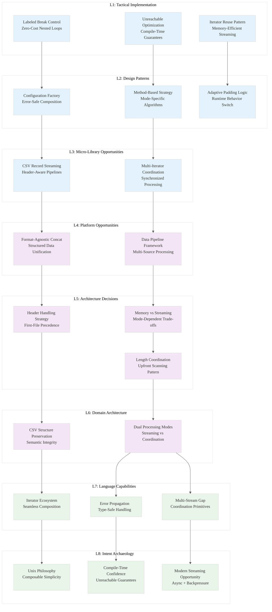

# L1-L8 Strategic Analysis: ./xsv/src/cmd/cat.rs

## File Metadata
- **File**: `./xsv/src/cmd/cat.rs`
- **Lines**: 132
- **Domain**: CSV Data Concatenation
- **Type**: Command Implementation

---

## L1: Idiomatic Patterns & Micro-Optimizations

### Pattern: Subcommand Dispatch with Unreachable
```rust
pub fn run(argv: &[&str]) -> CliResult<()> {
    let args: Args = util::get_args(USAGE, argv)?;
    if args.cmd_rows {
        args.cat_rows()
    } else if args.cmd_columns {
        args.cat_columns()
    } else {
        unreachable!();
    }
}
```
**Micro-Optimization**: The `unreachable!()` macro enables compiler optimizations by proving exhaustive matching. This eliminates runtime checks and enables better code generation.

### Pattern: Labeled Break for Complex Control Flow
```rust
'OUTER: loop {
    // ... complex iteration logic
    for (iter, &len) in iters.iter_mut().zip(lengths.iter()) {
        match iter.next() {
            None => {
                if self.flag_pad {
                    // padding logic
                } else {
                    break 'OUTER;  // Clean exit from nested loops
                }
            }
            // ...
        }
    }
    if num_done >= iters.len() {
        break 'OUTER;
    }
}
```
**Insight**: Labeled breaks eliminate the need for complex state variables or flags in nested iteration. This is a zero-cost abstraction that improves readability and performance.

### Pattern: Iterator Reuse with Mutable References
```rust
let mut iters = rdrs.iter_mut()
                    .map(|rdr| rdr.byte_records())
                    .collect::<Vec<_>>();
```
**Mechanical Sympathy**: Collecting iterators into a vector enables reuse across multiple loop iterations without re-creating iterator state.

---

## L2: Design Patterns & Composition

### Pattern: Strategy Pattern via Method Dispatch
```rust
impl Args {
    fn cat_rows(&self) -> CliResult<()> { /* row concatenation */ }
    fn cat_columns(&self) -> CliResult<()> { /* column concatenation */ }
}
```
**Meta-Pattern**: Each concatenation strategy is encapsulated in its own method, enabling different algorithms for different use cases without runtime overhead.

### Pattern: Configuration Factory Pattern
```rust
fn configs(&self) -> CliResult<Vec<Config>> {
    util::many_configs(&*self.arg_input,
                       self.flag_delimiter,
                       self.flag_no_headers)
         .map_err(From::from)
}
```
**Composition**: Centralizes configuration creation with error handling. The `From::from` conversion enables automatic error type coercion.

### Pattern: Adaptive Padding Strategy
```rust
match iter.next() {
    None => {
        num_done += 1;
        if self.flag_pad {
            for _ in 0..len {
                record.push_field(b"");
            }
        } else {
            break 'OUTER;
        }
    }
}
```
**Design Decision**: Runtime behavior adaptation based on flags. The padding strategy changes the fundamental algorithm behavior.

---

## L3: Micro-Library Opportunities

### Opportunity: Multi-Iterator Coordination Library
- The column concatenation logic coordinates multiple iterators with different lengths
- Could become `multi-iter` crate for synchronized iteration
- **Market Gap**: No standard library support for coordinated iteration with padding

### Opportunity: CSV Record Streaming Utilities
- The row concatenation preserves headers across multiple files
- Pattern applicable to any record-based format
- **Extractable**: ~150 LOC for generic record streaming

---

## L4: Macro-Library & Platform Opportunities

### Opportunity: Data Pipeline Framework
- The cat command demonstrates fundamental data pipeline patterns:
  - Multiple input sources
  - Transformation strategies (row vs column)
  - Unified output
- **Platform Vision**: Generic data pipeline framework with pluggable transformations

### Opportunity: Format-Agnostic Concatenation
- The patterns could generalize beyond CSV to any structured data format
- **Ecosystem Gap**: No unified concatenation framework exists for structured data

---

## L5: LLD Architecture Decisions & Invariants

### Decision: Memory vs Streaming Trade-off
**Row Concatenation**: Pure streaming - processes one record at a time
**Column Concatenation**: Hybrid - must coordinate multiple streams simultaneously

**Invariant**: Row concatenation maintains constant memory usage, column concatenation scales with number of input files.

### Decision: Header Handling Strategy
```rust
if i == 0 {
    conf.write_headers(&mut rdr, &mut wtr)?;
}
```
**Invariant**: Only the first file's headers are preserved in row concatenation. This design choice prioritizes simplicity over header validation.

### Decision: Length Coordination Architecture
```rust
let mut lengths = vec![];
for rdr in &mut rdrs {
    lengths.push(rdr.byte_headers()?.len());
}
```
**Invariant**: Column lengths are determined upfront and cached. This enables efficient padding decisions but requires initial scanning.

---

## L6: Domain-Specific Architecture

### Architecture: CSV Structure Preservation
- Row concatenation preserves CSV semantics (headers, record structure)
- Column concatenation creates new CSV structure from multiple sources
- **Domain Insight**: Different concatenation modes require different CSV handling strategies

### Architecture: Streaming vs Coordination
- **Row Mode**: Pure streaming pipeline
- **Column Mode**: Synchronized multi-stream processing
- **Pattern**: Domain requirements drive architectural choices

---

## L7: Language Capability Analysis

### Strength: Iterator Ecosystem Integration
- Seamless integration between different iterator types
- `zip`, `enumerate`, `collect` compose naturally
- Zero-cost abstractions maintain performance

### Strength: Error Propagation
- `?` operator enables clean error handling throughout the pipeline
- `From::from` automatic conversions reduce boilerplate
- Type system ensures error handling completeness

### Limitation: Multi-Stream Coordination
- No standard library primitives for coordinating multiple streams
- Manual state management required for complex iteration patterns
- **Gap**: Could benefit from higher-level stream coordination abstractions

---

## L8: Intent Archaeology

### Historical Context: Unix Philosophy Influence
The cat command reflects Unix philosophy:
- **Do one thing well**: Concatenation only
- **Composable**: Works with pipes and other xsv commands
- **Simple interface**: Clear subcommands (rows vs columns)

### Design Rationale: Simplicity Over Sophistication
```rust
unreachable!()
```
**Archaeological Evidence**: The use of `unreachable!()` suggests confidence in the argument parsing logic and preference for compile-time guarantees over runtime checks.

### Evolution Opportunity: Modern Streaming
- Could leverage async streams for better resource utilization
- Could implement backpressure for large datasets
- Could add parallel processing for independent operations

---

## Strategic Insights: Knowledge Arbitrage Opportunities

### 1. **Paradigm-Market Fit**: Dual-Mode Processing Architecture
**Insight**: The same command implements fundamentally different algorithms (streaming vs coordination) based on operation mode. This demonstrates how domain requirements should drive architectural choices.

**Opportunity**: Create a framework for "mode-adaptive" data processing where the same interface can switch between streaming and batch processing based on operation requirements.

### 2. **Performance Arbitrage**: Iterator Coordination Patterns
**Insight**: The multi-iterator coordination with padding demonstrates sophisticated stream processing that could be generalized.

**Opportunity**: Extract these patterns into a high-performance stream coordination library that handles length mismatches, padding, and synchronization.

### 3. **Type Safety Arbitrage**: Configuration Composition
**Insight**: The configuration factory pattern with automatic error conversion shows how Rust's type system can eliminate configuration errors.

**Opportunity**: Develop configuration management libraries that leverage Rust's type system for compile-time validation.

### 4. **Ecosystem Gap**: Structured Data Concatenation
**Insight**: The CSV-specific concatenation logic reveals patterns applicable to any structured data format.

**Opportunity**: Create format-agnostic concatenation framework that works with JSON, CSV, Parquet, etc.

---

## Horcrux Codex Entry
```json
{
  "pattern": "Dual-Mode Processing with Iterator Coordination",
  "domain": "Data Pipeline Processing",
  "insight": "Same interface can efficiently implement streaming vs coordination algorithms based on operation requirements",
  "rust_specific": "Labeled breaks + iterator composition + unreachable optimization + error propagation",
  "extractable": "Multi-iterator coordination library + configuration factory pattern + adaptive processing framework",
  "performance_claim": "Zero-cost mode switching with compile-time optimization",
  "paradigm_shift": "Domain requirements drive architectural mode selection at compile time"
}
```

---

