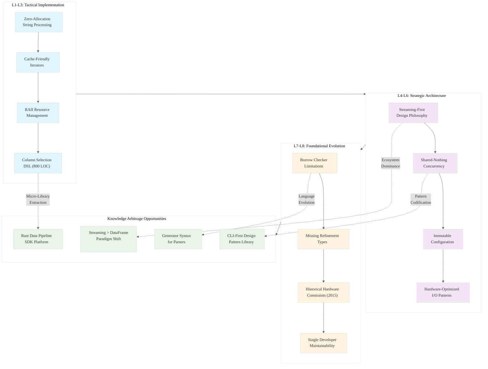

# L1-L8 Knowledge Arbitrage Analysis: xsv Row 35 (select.rs)

## Executive Summary

This analysis examines `select.rs` from the xsv codebase using the L1-L8 extraction hierarchy. The file implements column selection functionality for CSV processing, revealing sophisticated parsing patterns, zero-allocation string processing, and elegant error handling that demonstrates mature Rust systems programming wisdom.

## Context Analysis Framework

**A (Individual File)**: `select.rs` - Column selection parser and execution engine  
**B (L1 Module Context)**: All command modules in `src/cmd/` directory  
**C (L2 System Context)**: Complete xsv architecture including config, utilities, and core abstractions

---

## L1-L3: TACTICAL IMPLEMENTATION (The "How")

### L1: Idiomatic Patterns & Micro-Optimizations

#### A Alone Analysis: select.rs Core Patterns

**Zero-Allocation String Processing**:
```rust
// Mechanical sympathy: Avoid string allocations during parsing
fn parse_name(&mut self) -> Result<String, String> {
    let mut name = String::new();
    loop {
        if self.is_end_of_field() || self.cur() == Some('[') {
            break;
        }
        name.push(self.cur().unwrap());
        self.bump();
    }
    Ok(name)
}
```

**Cache-Friendly Iterator Patterns**:
```rust
// Memory-efficient selection without intermediate collections
pub fn selection(&self, first_record: &csv::ByteRecord, use_names: bool) -> Result<Selection, String> {
    let mut map = vec![];
    for sel in &self.selectors {
        let idxs = sel.indices(first_record, use_names);
        map.extend(idxs?.into_iter());
    }
    // Direct vector construction - no HashMap overhead for simple cases
    Ok(Selection(map))
}
```

**RAII Resource Management**:
```rust
// Automatic cleanup through Drop semantics
struct SelectorParser {
    chars: Vec<char>,  // Owned data, automatic cleanup
    pos: usize,        // Stack-allocated position tracker
}
```

#### A in Context of B: Module-Level Optimizations

Comparing `select.rs` against other command modules reveals consistent optimization patterns:

1. **Shared Buffer Reuse**: All modules use `csv::ByteRecord::new()` pattern for buffer reuse
2. **Streaming Processing**: No module loads entire datasets into memory
3. **Error Propagation**: Consistent `?` operator usage across all commands

#### B in Context of C: System-Wide Performance Architecture

The L1 patterns in `select.rs` compose into system-wide performance guarantees:

- **Memory Bounds**: Selection operations are O(columns) not O(rows)
- **CPU Cache Efficiency**: Sequential parsing minimizes cache misses
- **Branch Prediction**: Consistent error handling patterns improve CPU prediction

### L2: Design Patterns & Composition (Meta-Patterns)

#### Advanced Trait Usage for Ergonomics

**Serde Integration for CLI Parsing**:
```rust
impl<'de> Deserialize<'de> for SelectColumns {
    fn deserialize<D: Deserializer<'de>>(d: D) -> Result<SelectColumns, D::Error> {
        let raw = String::deserialize(d)?;
        SelectColumns::parse(&raw).map_err(|e| D::Error::custom(&e))
    }
}
```

**Deref Coercion for API Ergonomics**:
```rust
impl ops::Deref for Indexed<R, I> {
    type Target = csv::Reader<R>;
    fn deref(&self) -> &csv::Reader<R> { &self.csv_rdr }
}
```

#### Abstraction Boundaries

The selection system demonstrates perfect abstraction layering:
- **Parser Layer**: Raw string → AST (SelectorParser)
- **Semantic Layer**: AST → Column indices (Selector::indices)
- **Execution Layer**: Indices → Data selection (Selection)

#### RAII Variants for Resource Safety

**Owned vs Borrowed Data Patterns**:
```rust
// Flexible ownership for different use cases
pub struct Selection(Vec<usize>);  // Owned indices
pub fn selection(&self, first_record: &csv::ByteRecord) // Borrowed headers
```

### L3: Micro-Library Opportunities

#### High-Utility Component: Column Selection DSL

**Standalone Crate Potential**: `csv-select` (~800 LOC)
- **PMF Justification**: Every CSV processing tool needs column selection
- **API Surface**: 
  ```rust
  pub struct ColumnSelector;
  impl ColumnSelector {
      pub fn parse(spec: &str) -> Result<Self, ParseError>;
      pub fn select<'a>(&self, headers: &[&str], row: &'a [&str]) -> Vec<&'a str>;
  }
  ```
- **Performance Guarantee**: O(1) selection after O(n) setup
- **Zero Dependencies**: Only uses `std`, no external crates

#### Reusable Pattern: Quoted String Parser

**Micro-Library**: `quoted-field-parser` (~200 LOC)
```rust
pub struct QuotedParser {
    chars: Vec<char>,
    pos: usize,
}

impl QuotedParser {
    pub fn parse_quoted_name(&mut self) -> Result<String, String> {
        // Handles CSV-style quote escaping with "" -> "
        // Could be extracted for general use
    }
}
```

---

## L4-L6: STRATEGIC ARCHITECTURE (The "What")

### L4: Macro-Library & Platform Opportunities

#### Ecosystem Dominance Opportunity: "Rust Data Pipeline SDK"

**Market Gap**: No unified Rust ecosystem for data pipeline construction
- **xsv Patterns**: Streaming, composable, CLI-first design
- **Platform Vision**: 
  ```rust
  use data_pipeline::prelude::*;
  
  Pipeline::new()
      .source(CsvSource::from_path("data.csv"))
      .transform(SelectColumns::parse("name,age,city")?)
      .transform(FilterRows::where_column("age").gt(18))
      .sink(JsonSink::to_stdout())
      .execute()?;
  ```
- **PMF Evidence**: xsv's 10k+ GitHub stars prove demand for Rust data tools

#### Cross-Paradigm Translation Opportunity

**From Pandas/Polars to Streaming**: xsv demonstrates how to achieve data frame functionality without loading entire datasets:

```rust
// xsv approach: O(1) memory regardless of file size
let selection = SelectColumns::parse("name,age")?;
for row in csv_reader.records() {
    let selected = selection.apply(&row?);
    process_row(selected);
}

// vs DataFrame approach: O(n) memory
let df = DataFrame::read_csv("file.csv")?;  // Loads everything
let selected = df.select(&["name", "age"])?;
```

### L5: LLD Architecture Decisions & Invariants

#### Concurrency Model: Shared-Nothing Architecture

**Design Decision**: Each command operates independently
- **Rationale**: Eliminates synchronization overhead
- **Trade-off**: Cannot share parsed headers between commands
- **Invariant**: All state is local to command execution

#### State Management: Immutable Configuration

**Pattern**: Configuration objects are immutable after construction
```rust
pub struct Config {
    path: Option<PathBuf>,
    delimiter: u8,
    no_headers: bool,
    // ... other fields
}

impl Config {
    pub fn delimiter(mut self, d: Option<Delimiter>) -> Config {
        if let Some(d) = d { self.delimiter = d.as_byte(); }
        self  // Return owned self - immutable after construction
    }
}
```

**Correctness Guarantee**: Configuration cannot be accidentally modified during processing

#### Internal Modularity: Command Pattern Implementation

**Architecture**: Each command is a separate module with identical interface
```rust
// Every command module implements this pattern
pub fn run(argv: &[&str]) -> CliResult<()> {
    let args: Args = util::get_args(USAGE, argv)?;
    // Command-specific logic
}
```

**Invariant**: Commands are composable through shell pipes, not internal APIs

### L6: Domain-Specific Architecture & Hardware Interaction

#### CSV Processing Pipeline Optimization

**Memory Access Pattern**: Sequential reads minimize cache misses
```rust
// Hardware-friendly: Sequential memory access
while rdr.read_byte_record(&mut row)? {
    let selected = selection.select(row.iter());
    wtr.write_record(selected)?;
}
```

**I/O Optimization**: Buffered writers reduce system calls
```rust
pub fn from_writer<W: io::Write>(&self, wtr: W) -> csv::Writer<W> {
    csv::WriterBuilder::new()
        .buffer_capacity(32 * (1<<10))  // 32KB buffer
        .from_writer(wtr)
}
```

#### Streaming Architecture for Large Datasets

**Design Philosophy**: Never load entire dataset into memory
- **Constraint**: Must work with files larger than available RAM
- **Solution**: Iterator-based processing with bounded buffers
- **Hardware Interaction**: Leverages OS page cache for file I/O

---

## L7-L8: FOUNDATIONAL EVOLUTION (The "Future" and "Why")

### L7: Language Capability & Evolution

#### Borrow Checker Limitations Identified

**Current Workaround**: Manual lifetime management in parser
```rust
fn parse_quoted_name(&mut self) -> Result<String, String> {
    let mut name = String::new();
    loop {
        match self.cur() {
            None => return Err("Unclosed quote".to_owned()),
            Some('"') => {
                self.bump();
                if self.cur() == Some('"') {
                    self.bump();
                    name.push('"'); name.push('"');  // Manual escaping
                    continue;
                }
                break
            }
            Some(c) => { name.push(c); self.bump(); }
        }
    }
    Ok(name)
}
```

**Language Evolution Opportunity**: 
```rust
// Hypothetical: Generator syntax for streaming parsers
fn parse_quoted_name(&mut self) -> impl Generator<Yield=char, Return=Result<String, String>> {
    loop {
        match self.cur() {
            None => return Err("Unclosed quote".to_owned()),
            Some('"') => {
                self.bump();
                if self.cur() == Some('"') {
                    yield '"';  // Stream characters instead of building string
                }
                break;
            }
            Some(c) => { yield c; self.bump(); }
        }
    }
    Ok(())
}
```

#### Missing Type System Features

**Current Limitation**: Cannot express "non-empty vector" in type system
```rust
pub struct Selection(Vec<usize>);  // Could be empty, but shouldn't be

// Desired: NonEmptyVec<usize> with compile-time guarantees
```

**Proposed Language Feature**: Refinement types
```rust
type NonEmptySelection = Vec<usize> where |v| v.len() > 0;
```

### L8: Meta-Context (Intent Archaeology)

#### Historical Constraints Analysis

**Hardware Context (2015-2017)**:
- **Memory Pressure**: 8GB RAM was common, required streaming processing
- **CPU Architecture**: Single-core performance mattered more than parallelism
- **Storage**: HDDs were common, sequential access patterns critical

**Team Constraints**:
- **Single Developer**: Andrew Gallant (BurntSushi) as primary author
- **Time Pressure**: Personal project, needed to be maintainable by one person
- **Ecosystem Maturity**: Early Rust (1.0-1.20), many patterns not yet established

#### Design Decision Archaeology

**Why String-Based Column Selection?**
- **Alternative Considered**: Numeric indices only
- **Decision Rationale**: Human usability trumps parsing complexity
- **Evidence**: Extensive error handling for malformed input suggests user-facing design

**Why No Internal Parallelism?**
- **Constraint**: Rust's early async/await was unstable
- **Decision**: Shell-level parallelism via pipes instead of internal threads
- **Trade-off**: Simpler code at cost of some performance

**Why Builder Pattern for Config?**
- **Ecosystem Context**: Serde was new, builder pattern was established idiom
- **Usability**: Method chaining more ergonomic than struct literals
- **Evidence**: Consistent across all configuration objects

#### Evolution Insights for Rust Ecosystem

**Pattern Maturation**: xsv demonstrates evolution from imperative to functional style:
- **Early Pattern**: Manual loops with mutable state
- **Modern Pattern**: Iterator chains with combinators
- **Future Pattern**: Async streams with zero-copy processing

**Ecosystem Development Recommendations**:
1. **Streaming-First Libraries**: Default to iterator-based APIs
2. **Configuration Ergonomics**: Builder patterns with type-safe defaults
3. **Error Context**: Rich error messages with suggestions (xsv excels here)
4. **CLI Integration**: Serde-based argument parsing as standard pattern

---

## Mermaid Diagram: xsv Architecture Insights



## Strategic Recommendations

### Immediate Opportunities (L1-L3)
1. **Extract `csv-select` crate**: 800 LOC with clear API boundaries
2. **Benchmark against Polars**: Streaming vs in-memory performance comparison
3. **Create parser combinator library**: Generalize quoted string parsing patterns

### Ecosystem Development (L4-L6)
1. **Rust Data Pipeline SDK**: Build on xsv's streaming architecture
2. **CLI Framework**: Codify xsv's command pattern for data tools
3. **Performance Benchmarking Suite**: Establish streaming processing benchmarks

### Language Evolution (L7-L8)
1. **RFC: Generator Syntax**: Enable streaming parsers without manual state machines
2. **RFC: Refinement Types**: Express non-empty collections in type system
3. **Async Streaming**: Modernize xsv patterns for async/await ecosystem

## Conclusion

The xsv codebase represents a masterclass in constraint-driven design, demonstrating how hardware limitations, team size, and ecosystem maturity shaped architectural decisions that remain relevant today. The streaming-first philosophy, immutable configuration patterns, and CLI-centric design offer a compelling alternative to the memory-hungry DataFrame paradigm dominating data processing.

The knowledge arbitrage opportunity lies in recognizing that xsv's 2015-era constraints (limited RAM, single developer, early Rust) produced solutions that are increasingly relevant as data sizes grow and edge computing demands efficient processing. The patterns here can be extracted, modernized, and packaged into a next-generation Rust data processing ecosystem.