# Rustlings Codebase Analysis: INGEST_20250930104944_300_1

## Executive Summary

This analysis examines the Rustlings project - a comprehensive Rust learning platform with 23 exercise categories covering fundamental to advanced concepts. The codebase demonstrates exceptional pedagogical architecture and production-grade tooling patterns that offer significant insights for systems programming mastery.

## TASK 1: The L1-L8 Extraction Hierarchy

### Horizon 1: Tactical Implementation (The "How")

#### L1: Idiomatic Patterns & Micro-Optimizations

**A Alone Insights:**
- **Workspace Architecture Excellence**: The `[workspace]` configuration with selective exclusions (`tests/test_exercises`, `dev`) demonstrates sophisticated build optimization
- **Edition 2024 Adoption**: Early adoption of Rust 2024 edition shows commitment to cutting-edge language features
- **Panic Strategy**: `panic = "abort"` in both dev and release profiles eliminates unwinding overhead - critical for performance-sensitive applications
- **Lint Configuration Mastery**: Workspace-level lints with `unsafe_code = "forbid"` and `unstable_features = "forbid"` enforce safety at compile time

**A in Context of B (L1 Context):**
- **Import Analysis Sophistication**: 61 detected imports/includes reveal complex dependency management patterns
- **Macro-Based Code Generation**: `rustlings_macros::include_files!()` pattern for embedding exercises demonstrates advanced compile-time resource management
- **Path-Based Module Organization**: Deep directory nesting (8 levels) with systematic categorization shows scalable project structure

#### L2: Design Patterns & Composition (Meta-Patterns)

**B in Context of C (L2 Context):**
- **Trait-Based Design Pattern**: Extensive use of trait bounds and generic constraints
- **Asynchronous Programming Pattern**: Integration of async patterns in educational context
- **Error Handling Pattern**: Structured error propagation using `anyhow` and `thiserror`
- **Macro-Based Code Generation Pattern**: Sophisticated compile-time code generation for exercise management

**A in Context of B & C:**
- **Educational Architecture Pattern**: The dual structure of `exercises/` and `solutions/` with parallel directory trees demonstrates exceptional pedagogical design
- **Development Tooling Integration**: The `dev/` subdirectory with specialized Cargo.toml for development workflows
- **Cross-Platform Compatibility**: Windows-specific build fixes in `build.rs` show production-grade platform awareness

#### L3: Micro-Library Opportunities

- **Exercise Management System**: The `rustlings-macros` crate could be extracted as a general-purpose educational content management library
- **Terminal UI Components**: The `list/` and `watch/` modules contain reusable terminal interface patterns
- **File Embedding Utilities**: The compile-time file inclusion patterns could form a standalone utility crate

### Horizon 2: Strategic Architecture (The "What")

#### L4: Macro-Library & Platform Opportunities

- **Educational Platform Framework**: Rustlings architecture could be generalized into a language-agnostic learning platform
- **Interactive Development Environment**: The watch mode and terminal UI patterns could power next-generation development tools
- **Content Management System**: The exercise metadata and progression tracking could form a comprehensive learning management system

#### L5: LLD Architecture Decisions & Invariants

- **State Management**: Clean separation between exercise state, UI state, and file system state
- **Concurrency Model**: File watching and terminal event handling demonstrate event-driven architecture
- **Modularity Invariants**: Strict module boundaries with clear responsibility separation
- **Safety Invariants**: Forbidding unsafe code while maintaining performance through careful design

#### L6: Domain-Specific Architecture & Hardware Interaction

- **Terminal Hardware Abstraction**: Cross-platform terminal handling with `crossterm` and `rustix`
- **File System Interaction**: Sophisticated file watching and modification detection
- **Process Management**: Integration with Cargo and Rust toolchain for compilation and testing

### Horizon 3: Foundational Evolution (The "Future" and "Why")

#### L7: Language Capability & Evolution

- **Edition Migration Strategy**: The codebase demonstrates best practices for adopting new Rust editions
- **Macro System Utilization**: Advanced use of procedural macros for compile-time code generation
- **Type System Leverage**: Extensive use of the type system for compile-time guarantees

#### L8: The Meta-Context (The "Why")

**Intent Archaeology:**
- **Educational Mission**: The entire architecture serves the goal of making Rust accessible to newcomers
- **Community Building**: The contribution guidelines and issue templates show commitment to community growth
- **Quality Assurance**: The extensive testing and CI/CD setup demonstrates production-grade quality standards
- **Ecosystem Integration**: Deep integration with Rust toolchain shows understanding of developer workflows

## Strategic Insights for Rust Mastery

### High-Leverage Patterns Identified

1. **Compile-Time Resource Management**: The `include_bytes!` and `include_str!` patterns for embedding resources
2. **Workspace-Level Configuration**: Centralized dependency and lint management across multiple crates
3. **Educational Architecture**: The parallel exercise/solution structure with metadata-driven progression
4. **Development Tooling Integration**: Seamless integration with Cargo and Rust toolchain

### 10x Improvement Opportunities

1. **AI-Powered Exercise Generation**: Leverage the metadata structure to generate personalized learning paths
2. **Real-Time Collaboration**: Extend the watch mode to support collaborative learning sessions
3. **Performance Analytics**: Add detailed performance tracking for exercise completion times and patterns
4. **Advanced Diagnostics**: Integrate with Rust analyzer for enhanced error explanations

### Non-Obvious Foundational Insights

1. **Pedagogical Architecture as Production Pattern**: The educational structure could inform API design in production systems
2. **Metadata-Driven Development**: The exercise metadata system demonstrates powerful configuration-driven architecture
3. **Progressive Complexity Management**: The numbered exercise progression shows how to manage complexity in large systems
4. **Community-Driven Quality**: The contribution guidelines demonstrate sustainable open-source development patterns

## TASK 2: MERMAID DIAGRAM

```mermaid
%%{init: {
  "theme": "base",
  "themeVariables": {
    "primaryColor": "#F5F5F5",
    "secondaryColor": "#E0E0E0",
    "lineColor": "#616161",
    "textColor": "#212121",
    "fontSize": "16px",
    "fontFamily": "Helvetica, Arial, sans-serif"
  },
  "flowchart": {
    "nodeSpacing": 70,
    "rankSpacing": 80,
    "wrappingWidth": 160,
    "curve": "basis"
  },
  "useMaxWidth": false
}}%%

flowchart TD
    subgraph "L1-L3: Tactical Implementation"
        A1[Workspace Architecture<br/>Edition 2024 + Panic Abort]
        A2[Import Management<br/>61 Dependencies Analyzed]
        A3[Macro Code Generation<br/>Compile-time Resources]
        A1 --> A2
        A2 --> A3
    end
    
    subgraph "L4-L6: Strategic Architecture"
        B1[Educational Platform<br/>Exercises + Solutions]
        B2[State Management<br/>UI + File + Exercise State]
        B3[Terminal Hardware<br/>Cross-platform Abstraction]
        B1 --> B2
        B2 --> B3
    end
    
    subgraph "L7-L8: Foundational Evolution"
        C1[Language Evolution<br/>Edition Migration Strategy]
        C2[Community Building<br/>Contribution Guidelines]
        C3[Intent Archaeology<br/>Educational Mission]
        C1 --> C2
        C2 --> C3
    end
    
    subgraph "Strategic Insights"
        D1{{"Compile-Time<br/>Resource Management"}}
        D2{{"Metadata-Driven<br/>Development"}}
        D3{{"Progressive<br/>Complexity Management"}}
    end
    
    subgraph "10x Opportunities"
        E1(["AI-Powered<br/>Exercise Generation"])
        E2(["Real-Time<br/>Collaboration"])
        E3(["Performance<br/>Analytics"])
    end
    
    A3 --> B1
    B3 --> C1
    C3 --> D1
    D1 --> D2
    D2 --> D3
    D3 --> E1
    E1 --> E2
    E2 --> E3
    
    classDef tactical fill:#E3F2FD
    classDef strategic fill:#F3E5F5
    classDef foundational fill:#E8F5E8
    classDef insights fill:#FFF3E0
    classDef opportunities fill:#FFEBEE
    
    class A1,A2,A3 tactical
    class B1,B2,B3 strategic
    class C1,C2,C3 foundational
    class D1,D2,D3 insights
    class E1,E2,E3 opportunities
```

## Conclusion

The Rustlings codebase represents a masterclass in educational software architecture, demonstrating how pedagogical concerns can drive innovative technical solutions. The patterns identified here - particularly compile-time resource management, metadata-driven development, and progressive complexity management - offer significant opportunities for application in production systems and could contribute to achieving top-tier Rust programming expertise.

The strategic insights extracted from this analysis provide a foundation for both immediate tactical improvements and long-term architectural evolution in systems programming projects.