# Analysis: INGEST_20250930104944_300_1 - Rustlings Educational Framework

## Executive Summary

This analysis examines the Rustlings project, a comprehensive Rust learning framework that demonstrates sophisticated educational software architecture. The codebase reveals advanced patterns in CLI tooling, embedded resource management, and progressive skill development systems.

## L1-L8 Extraction Analysis

### Horizon 1: Tactical Implementation (The "How")

#### L1: Idiomatic Patterns & Micro-Optimizations

**A alone insights:**
- **Embedded Resource Pattern**: Uses `include_bytes!` and `include_str!` macros for zero-runtime-cost resource embedding
- **Panic Abort Strategy**: Both dev and release profiles use `panic = "abort"` for smaller binaries and faster failure modes
- **Conditional Compilation**: Windows-specific file handling with `#[cfg(windows)]` for cross-platform compatibility
- **Workspace Exclusion Pattern**: Strategic workspace exclusion of test directories to prevent circular dependencies

**A in context of B (L1 context):**
- **Import Analysis Sophistication**: 61 detected imports show heavy use of procedural macros and compile-time resource inclusion
- **Path-based Architecture**: 8-level deep directory structure indicates mature project organization
- **Module Dependency Mapping**: Clear separation between external dependencies and internal module relationships

**B in context of C (L2 context):**
- **Architectural Pattern Recognition**: Identifies object-oriented, trait-based, async, macro-based, and error handling patterns
- **Technology Stack Integration**: Serde + Clap combination for CLI with serialization capabilities
- **Cross-module Relationship Mapping**: Sophisticated dependency analysis showing qualified path usage

**A in context of B & C:**
- **Educational Framework Architecture**: The combination reveals a sophisticated learning management system built with Rust-native patterns
- **Progressive Complexity Design**: Directory structure (00_intro → 23_conversions) shows deliberate skill progression
- **Embedded Learning Resources**: Compile-time inclusion of exercises and solutions for offline-first learning

#### L2: Design Patterns & Composition (Meta-Patterns)

- **Exercise-Solution Duality**: Parallel directory structures for exercises and solutions with automated validation
- **Macro-driven Code Generation**: `rustlings-macros` crate for compile-time exercise metadata processing
- **CLI State Management**: Sophisticated command routing with `clap` derive macros
- **Resource Embedding Strategy**: Zero-runtime-cost inclusion of educational content

#### L3: Micro-Library Opportunities

- **Educational Framework Engine**: The core exercise validation and progression system (~2000 LOC opportunity)
- **Embedded Resource Manager**: Compile-time resource inclusion with runtime access patterns
- **CLI Learning Assistant**: Interactive terminal-based learning progression system

### Horizon 2: Strategic Architecture (The "What")

#### L4: Macro-Library & Platform Opportunities

- **Rust Education Platform**: Complete learning management system for systems programming languages
- **Interactive CLI Framework**: Advanced terminal-based user interaction patterns
- **Embedded Content Delivery**: Offline-first educational content distribution

#### L5: LLD Architecture Decisions & Invariants

- **Compile-time Resource Validation**: All educational content validated at compile time
- **Progressive Skill Validation**: Enforced learning progression through exercise dependencies
- **Cross-platform Compatibility**: Windows/Unix abstraction layers for file system operations
- **Memory Safety in Education**: Teaching memory safety through practical exercises

#### L6: Domain-Specific Architecture & Hardware Interaction

- **Terminal Interface Optimization**: Direct terminal control with `crossterm` for responsive UI
- **File System Abstraction**: Platform-specific file operations with `rustix` on Unix systems
- **Process Management**: Cargo integration for exercise compilation and testing

### Horizon 3: Foundational Evolution (The "Future" and "Why")

#### L7: Language Capability & Evolution

- **Educational Tooling Gaps**: Demonstrates need for better compile-time educational resource management
- **CLI Framework Evolution**: Shows patterns for next-generation interactive CLI tools
- **Macro System Utilization**: Advanced use of procedural macros for domain-specific languages

#### L8: The Meta-Context (The "Why")

**Intent Archaeology:**
- **Educational Philosophy**: Designed to teach Rust through progressive, hands-on exercises
- **Offline-First Design**: Embedded resources ensure learning works without internet connectivity
- **Community-Driven Development**: MIT license and contribution guidelines show open-source educational commitment
- **Production-Ready Learning**: Uses production-grade tooling (Clippy, formatting, testing) to teach best practices

**Historical Context:**
- **Rust Ecosystem Maturation**: Represents the ecosystem's evolution toward sophisticated educational tooling
- **Learning Methodology Evolution**: Shift from documentation-based to interactive, validated learning
- **Open Source Education**: Demonstrates sustainable models for community-driven technical education

## Strategic Insights for Rust Mastery

### High-Leverage Patterns Identified

1. **Compile-time Resource Embedding**: Zero-cost educational content delivery
2. **Progressive Validation Architecture**: Enforced learning progression through dependency management
3. **Cross-platform CLI Patterns**: Sophisticated terminal interaction with platform abstraction
4. **Macro-driven Domain Languages**: Educational DSL through procedural macros

### 10x Improvement Opportunities

1. **AI-Enhanced Learning Paths**: Dynamic exercise generation based on learner progress
2. **Real-time Code Analysis**: Integration with language servers for immediate feedback
3. **Collaborative Learning Platform**: Multi-user exercise sharing and peer review
4. **Performance-Aware Education**: Teaching optimization through measurable performance exercises

### Non-obvious Foundational Insights

1. **Educational Software as Systems Programming**: Rustlings demonstrates that educational tools can be as sophisticated as production systems
2. **Compile-time Validation for Learning**: Using Rust's type system to enforce educational progression
3. **Embedded Resources for Offline Learning**: Critical for environments with limited connectivity
4. **Community-Driven Curriculum**: Sustainable model for maintaining educational content

## Mermaid Diagram: Rustlings Architecture Insights

```mermaid
%%{init: {
  "theme": "base",
  "themeVariables": {
    "primaryColor": "#F5F5F5",
    "secondaryColor": "#E0E0E0",
    "lineColor": "#616161",
    "textColor": "#212121",
    "fontSize": "16px",
    "fontFamily": "Helvetica, Arial, sans-serif"
  },
  "flowchart": {
    "nodeSpacing": 70,
    "rankSpacing": 80,
    "wrappingWidth": 160,
    "curve": "basis"
  },
  "useMaxWidth": false
}}%%

flowchart TD
    subgraph L1["L1: Tactical Patterns"]
        A1["Embedded Resources<br/>include_bytes!"]
        A2["Panic Abort Strategy<br/>Smaller Binaries"]
        A3["Conditional Compilation<br/>Cross-platform"]
        A4["Workspace Exclusion<br/>Dependency Management"]
    end
    
    subgraph L2["L2: Design Patterns"]
        B1["Exercise-Solution Duality<br/>Parallel Structures"]
        B2["Macro-driven Generation<br/>Compile-time Metadata"]
        B3["CLI State Management<br/>Command Routing"]
        B4["Resource Embedding<br/>Zero Runtime Cost"]
    end
    
    subgraph L3["L3: Micro-Libraries"]
        C1["Educational Framework<br/>~2000 LOC Engine"]
        C2["Embedded Resource Manager<br/>Runtime Access"]
        C3["CLI Learning Assistant<br/>Interactive Terminal"]
    end
    
    subgraph L4["L4: Platform Opportunities"]
        D1["Rust Education Platform<br/>Complete LMS"]
        D2["Interactive CLI Framework<br/>Terminal Patterns"]
        D3["Embedded Content Delivery<br/>Offline-first"]
    end
    
    subgraph L5["L5: Architecture Invariants"]
        E1["Compile-time Validation<br/>Content Integrity"]
        E2["Progressive Skill Validation<br/>Learning Dependencies"]
        E3["Cross-platform Compatibility<br/>Abstraction Layers"]
        E4["Memory Safety Education<br/>Practical Exercises"]
    end
    
    subgraph L6["L6: Domain Architecture"]
        F1["Terminal Optimization<br/>Direct Control"]
        F2["File System Abstraction<br/>Platform-specific"]
        F3["Process Management<br/>Cargo Integration"]
    end
    
    subgraph L7["L7: Language Evolution"]
        G1["Educational Tooling Gaps<br/>Resource Management"]
        G2["CLI Framework Evolution<br/>Next-gen Patterns"]
        G3["Macro System Utilization<br/>Domain Languages"]
    end
    
    subgraph L8["L8: Meta-Context"]
        H1["Educational Philosophy<br/>Progressive Learning"]
        H2["Offline-First Design<br/>Embedded Resources"]
        H3["Community-Driven<br/>Open Source Model"]
        H4["Production-Ready Learning<br/>Best Practices"]
    end
    
    L1 --> L2
    L2 --> L3
    L3 --> L4
    L4 --> L5
    L5 --> L6
    L6 --> L7
    L7 --> L8
    
    classDef tactical fill:#E3F2FD
    classDef strategic fill:#F3E5F5
    classDef foundational fill:#E8F5E8
    
    class L1,L2,L3 tactical
    class L4,L5,L6 strategic
    class L7,L8 foundational
```

