# Analysis: INGEST_20250930104944_300_2 - GitHub Repository Scraper

## Executive Summary

This analysis examines a sophisticated GitHub repository scraper built in Rust, demonstrating advanced patterns in API client design, resilient network programming, and data pipeline architecture. The codebase reveals production-grade patterns for handling rate limits, concurrent requests, and persistent state management.

## L1-L8 Extraction Analysis

### Horizon 1: Tactical Implementation (The "How")

#### L1: Idiomatic Patterns & Micro-Optimizations

**A alone insights:**
- **Resilient API Client Pattern**: Sophisticated retry logic with exponential backoff and abuse detection
- **State Persistence Strategy**: JSON-based state management with atomic file operations
- **Concurrent Request Management**: AtomicUsize for tracking concurrent API calls
- **GraphQL + REST Hybrid**: Strategic use of both GitHub APIs for optimal data retrieval
- **Signal Handling**: Graceful shutdown with Ctrl+C handling using `ctrlc` crate

**A in context of B (L1 context):**
- **Minimal Import Footprint**: Only 11 detected imports showing focused, purpose-built design
- **Copyright Consistency**: Repeated copyright notices indicate mature, legally compliant codebase
- **File Size Efficiency**: 36KB for complete scraper shows optimized implementation

**B in context of C (L2 context):**
- **Architectural Pattern Sophistication**: Object-oriented, trait-based, macro-based, and error handling patterns
- **Technology Stack Focus**: Serde for serialization indicates data-centric architecture
- **Module Relationship Clarity**: Clean separation between config, data, GitHub API, and utilities

**A in context of B & C:**
- **Production-Grade Data Pipeline**: Complete ecosystem scraping solution with state management
- **API Rate Limit Mastery**: Sophisticated handling of GitHub's abuse detection and rate limiting
- **Concurrent Data Processing**: Thread-safe CSV writing with mutex-protected operations
- **Resumable Operations**: State persistence enables interrupted scraping to resume seamlessly

#### L2: Design Patterns & Composition (Meta-Patterns)

- **Repository Pattern**: Clean abstraction for data storage operations
- **Strategy Pattern**: Different API endpoints (REST vs GraphQL) based on data needs
- **Observer Pattern**: Signal handling for graceful shutdown
- **Builder Pattern**: RequestBuilder for HTTP client configuration
- **State Machine Pattern**: Retry logic with exponential backoff states

#### L3: Micro-Library Opportunities

- **Resilient HTTP Client**: Generic retry logic with abuse detection (~500 LOC opportunity)
- **GitHub API Wrapper**: Complete GitHub API client with rate limiting (~1000 LOC opportunity)
- **State Persistence Manager**: Generic JSON state management with atomic operations (~300 LOC opportunity)

### Horizon 2: Strategic Architecture (The "What")

#### L4: Macro-Library & Platform Opportunities

- **Ecosystem Analysis Platform**: Complete repository analysis and trend detection system
- **API Rate Limit Framework**: Generic rate limiting and abuse detection for any API
- **Data Pipeline Orchestration**: Resumable, concurrent data processing framework

#### L5: LLD Architecture Decisions & Invariants

- **Thread-Safe State Management**: Mutex-protected state with atomic file operations
- **Graceful Degradation**: Exponential backoff prevents API abuse while maintaining progress
- **Data Integrity Guarantees**: CSV writing with exclusive locks ensures data consistency
- **Memory Efficiency**: Streaming data processing without loading entire datasets

#### L6: Domain-Specific Architecture & Hardware Interaction

- **Network Resilience**: Multiple retry strategies for different failure modes
- **File System Optimization**: Atomic file operations with proper error handling
- **Process Signal Management**: Clean shutdown with resource cleanup
- **Concurrent I/O Management**: Balanced concurrent requests to avoid overwhelming APIs

### Horizon 3: Foundational Evolution (The "Future" and "Why")

#### L7: Language Capability & Evolution

- **Error Handling Evolution**: Uses `failure` crate (pre-`anyhow`/`thiserror` era)
- **Async/Await Absence**: Uses blocking HTTP client, predates mature async ecosystem
- **External Crate Dependencies**: Heavy reliance on external crates for core functionality

#### L8: The Meta-Context (The "Why")

**Intent Archaeology:**
- **Ecosystem Intelligence**: Built to understand the Rust ecosystem's growth and trends
- **Data-Driven Decision Making**: Enables analysis of Rust adoption patterns
- **Community Resource**: Provides public dataset for researchers and developers
- **Operational Efficiency**: Automated CI/CD pipeline for continuous data updates

**Historical Context:**
- **Pre-Async Era**: Built when blocking I/O was the primary pattern (2018)
- **GitHub API Evolution**: Demonstrates hybrid REST/GraphQL usage patterns
- **Rust Ecosystem Maturation**: Shows early patterns that influenced modern Rust tooling
- **Open Source Intelligence**: Represents early efforts in automated ecosystem analysis

## Strategic Insights for Rust Mastery

### High-Leverage Patterns Identified

1. **Resilient Network Programming**: Sophisticated retry logic with multiple failure modes
2. **Concurrent State Management**: Thread-safe operations with atomic guarantees
3. **API Rate Limit Handling**: Production-grade abuse detection and backoff strategies
4. **Resumable Data Processing**: State persistence enabling long-running operations

### 10x Improvement Opportunities

1. **Async/Await Migration**: Modern async patterns for better resource utilization
2. **Real-time Analytics**: Stream processing for live ecosystem insights
3. **Multi-Platform Support**: GitLab, Bitbucket, and other platform integration
4. **ML-Enhanced Analysis**: Repository quality scoring and trend prediction

### Non-obvious Foundational Insights

1. **API Client Architecture**: Demonstrates patterns that became standard in modern Rust HTTP clients
2. **State Management Patterns**: Early examples of patterns now common in distributed systems
3. **Error Handling Evolution**: Shows transition from `failure` to modern error handling
4. **Concurrent Programming**: Thread-safe patterns that influenced async Rust development

## Mermaid Diagram: GitHub Scraper Architecture Insights

```mermaid
%%{init: {
  "theme": "base",
  "themeVariables": {
    "primaryColor": "#F5F5F5",
    "secondaryColor": "#E0E0E0",
    "lineColor": "#616161",
    "textColor": "#212121",
    "fontSize": "16px",
    "fontFamily": "Helvetica, Arial, sans-serif"
  },
  "flowchart": {
    "nodeSpacing": 70,
    "rankSpacing": 80,
    "wrappingWidth": 160,
    "curve": "basis"
  },
  "useMaxWidth": false
}}%%

flowchart TD
    subgraph L1["L1: Tactical Patterns"]
        A1["Resilient API Client<br/>Retry + Backoff"]
        A2["State Persistence<br/>Atomic JSON Ops"]
        A3["Concurrent Tracking<br/>AtomicUsize"]
        A4["GraphQL + REST<br/>Hybrid Strategy"]
        A5["Signal Handling<br/>Graceful Shutdown"]
    end
    
    subgraph L2["L2: Design Patterns"]
        B1["Repository Pattern<br/>Data Abstraction"]
        B2["Strategy Pattern<br/>API Selection"]
        B3["Observer Pattern<br/>Signal Handling"]
        B4["Builder Pattern<br/>HTTP Config"]
        B5["State Machine<br/>Retry Logic"]
    end
    
    subgraph L3["L3: Micro-Libraries"]
        C1["Resilient HTTP Client<br/>~500 LOC"]
        C2["GitHub API Wrapper<br/>~1000 LOC"]
        C3["State Manager<br/>~300 LOC"]
    end
    
    subgraph L4["L4: Platform Opportunities"]
        D1["Ecosystem Analysis<br/>Trend Detection"]
        D2["Rate Limit Framework<br/>Generic API Protection"]
        D3["Data Pipeline<br/>Resumable Processing"]
    end
    
    subgraph L5["L5: Architecture Invariants"]
        E1["Thread-Safe State<br/>Mutex Protection"]
        E2["Graceful Degradation<br/>Exponential Backoff"]
        E3["Data Integrity<br/>Exclusive Locks"]
        E4["Memory Efficiency<br/>Streaming Processing"]
    end
    
    subgraph L6["L6: Domain Architecture"]
        F1["Network Resilience<br/>Multiple Retry Modes"]
        F2["File System Optimization<br/>Atomic Operations"]
        F3["Process Management<br/>Signal Handling"]
        F4["Concurrent I/O<br/>Balanced Requests"]
    end
    
    subgraph L7["L7: Language Evolution"]
        G1["Pre-Async Era<br/>Blocking Patterns"]
        G2["Error Handling<br/>failure Crate"]
        G3["External Dependencies<br/>Heavy Reliance"]
    end
    
    subgraph L8["L8: Meta-Context"]
        H1["Ecosystem Intelligence<br/>Growth Analysis"]
        H2["Data-Driven Decisions<br/>Adoption Patterns"]
        H3["Community Resource<br/>Public Dataset"]
        H4["Operational Efficiency<br/>Automated Pipeline"]
    end
    
    L1 --> L2
    L2 --> L3
    L3 --> L4
    L4 --> L5
    L5 --> L6
    L6 --> L7
    L7 --> L8
    
    classDef tactical fill:#E3F2FD
    classDef strategic fill:#F3E5F5
    classDef foundational fill:#E8F5E8
    
    class L1,L2,L3 tactical
    class L4,L5,L6 strategic
    class L7,L8 foundational
```

