# Analysis: INGEST_20250930104944_300_3 - RustPrimer Chinese Tutorial

## Executive Summary

This analysis examines RustPrimer, a comprehensive Chinese-language Rust tutorial and learning resource. The codebase demonstrates sophisticated educational content architecture, GitBook integration, and practical examples covering the full spectrum of Rust programming concepts from basics to advanced topics.

## L1-L8 Extraction Analysis

### Horizon 1: Tactical Implementation (The "How")

#### L1: Idiomatic Patterns & Micro-Optimizations

**A alone insights:**
- **GitBook Integration**: Sophisticated book.json configuration with Chinese language support and hierarchical navigation
- **Multi-format Publishing**: Package.json with build scripts for both serving and static generation
- **Educational Code Examples**: Practical implementations covering database operations, JSON processing, and web development
- **Error Documentation**: Real compiler error messages with explanations (E0282, E0495 type inference errors)
- **Community Integration**: QQ groups, Telegram channels, and GitHub-based authentication systems

**A in context of B (L1 context):**
- **Minimal Import Detection**: Only 8 imports detected, showing focused educational content structure
- **Large Content Volume**: 389KB file size with 11,390 lines indicates comprehensive tutorial coverage
- **Error Message Integration**: Compiler errors embedded in educational content for learning purposes

**B in context of C (L2 context):**
- **Educational Architecture**: Object-oriented, trait-based, macro-based, and error handling patterns for teaching
- **Cross-platform Considerations**: Multiple editor support (vim, emacs, vscode, atom, sublime, visual studio)
- **Community-Driven Development**: Multiple contributor attribution system throughout the content

**A in context of B & C:**
- **Comprehensive Learning Ecosystem**: Complete Rust education platform with practical examples and community support
- **Progressive Skill Building**: Structured learning path from installation to advanced topics like FFI and unsafe code
- **Real-world Application Focus**: Database operations, web development, and JSON processing examples
- **Chinese Rust Community Hub**: Central resource for Chinese-speaking Rust developers

#### L2: Design Patterns & Composition (Meta-Patterns)

- **Educational Content Architecture**: Hierarchical chapter organization with progressive complexity
- **Multi-modal Learning**: Text, code examples, practical projects, and community interaction
- **Version Control Integration**: Travis CI for automated testing and building
- **Contributor Attribution**: Systematic crediting of community contributors
- **Cross-platform Editor Support**: Comprehensive IDE/editor configuration guides

#### L3: Micro-Library Opportunities

- **GitBook Educational Framework**: Reusable educational content publishing system (~1000 LOC opportunity)
- **Rust Tutorial Generator**: Automated tutorial generation with code validation (~800 LOC opportunity)
- **Community Integration Platform**: QQ/Telegram/GitHub integration for educational communities (~500 LOC opportunity)

### Horizon 2: Strategic Architecture (The "What")

#### L4: Macro-Library & Platform Opportunities

- **Educational Content Management System**: Complete platform for technical tutorial creation and maintenance
- **Multi-language Programming Tutorial Framework**: Extensible system for creating programming language tutorials
- **Community-Driven Learning Platform**: Integrated community features with content contribution workflows

#### L5: LLD Architecture Decisions & Invariants

- **Content Versioning**: Git-based content management with automated publishing
- **Multi-format Output**: Single source generating multiple output formats (web, PDF, etc.)
- **Community Quality Control**: Contributor verification and content review processes
- **Progressive Learning Paths**: Structured dependency between tutorial chapters

#### L6: Domain-Specific Architecture & Hardware Interaction

- **Cross-platform Development Environment**: Support for multiple operating systems and editors
- **Database Integration Examples**: PostgreSQL connection patterns and error handling
- **Web Development Patterns**: HTTP server implementation and JSON processing
- **System Programming Concepts**: Memory management, unsafe code, and FFI examples

### Horizon 3: Foundational Evolution (The "Future" and "Why")

#### L7: Language Capability & Evolution

- **Educational Tooling Evolution**: GitBook and Node.js ecosystem for technical documentation
- **Rust Ecosystem Maturation**: Comprehensive coverage of Rust's evolution from basics to advanced features
- **Community-Driven Content**: Collaborative editing and contribution patterns for technical content

#### L8: The Meta-Context (The "Why")

**Intent Archaeology:**
- **Chinese Rust Adoption**: Facilitating Rust adoption in Chinese-speaking developer communities
- **Comprehensive Education**: Providing complete learning path from installation to production deployment
- **Community Building**: Creating sustainable community around Rust education and development
- **Practical Application Focus**: Emphasizing real-world usage over theoretical concepts

**Historical Context:**
- **Early Rust Education**: Created during Rust's early adoption phase (2016 era)
- **Language Barrier Reduction**: Addressing lack of Chinese-language Rust resources
- **Community-Driven Development**: Demonstrates successful open-source educational content creation
- **GitBook Era**: Represents peak usage of GitBook for technical documentation

## Strategic Insights for Rust Mastery

### High-Leverage Patterns Identified

1. **Progressive Educational Architecture**: Structured learning paths with dependency management
2. **Community-Driven Content Creation**: Sustainable model for maintaining educational resources
3. **Multi-modal Learning Integration**: Combining text, code, projects, and community interaction
4. **Real-world Application Focus**: Practical examples over theoretical explanations

### 10x Improvement Opportunities

1. **Interactive Code Execution**: Browser-based Rust playground integration
2. **Adaptive Learning Paths**: AI-driven personalized learning progression
3. **Real-time Community Integration**: Live coding sessions and mentorship matching
4. **Automated Content Validation**: Continuous testing of code examples and tutorials

### Non-obvious Foundational Insights

1. **Educational Content as Code**: Treating tutorial content with same rigor as software development
2. **Community Attribution Systems**: Systematic recognition driving sustainable contribution
3. **Error-Driven Learning**: Using compiler errors as teaching tools rather than obstacles
4. **Cultural Adaptation**: Successful localization beyond mere translation

## Mermaid Diagram: RustPrimer Educational Architecture

```mermaid
%%{init: {
  "theme": "base",
  "themeVariables": {
    "primaryColor": "#F5F5F5",
    "secondaryColor": "#E0E0E0",
    "lineColor": "#616161",
    "textColor": "#212121",
    "fontSize": "16px",
    "fontFamily": "Helvetica, Arial, sans-serif"
  },
  "flowchart": {
    "nodeSpacing": 70,
    "rankSpacing": 80,
    "wrappingWidth": 160,
    "curve": "basis"
  },
  "useMaxWidth": false
}}%%

flowchart TD
    subgraph L1["L1: Tactical Patterns"]
        A1["GitBook Integration<br/>Chinese Language"]
        A2["Multi-format Publishing<br/>Build Scripts"]
        A3["Educational Examples<br/>DB, JSON, Web"]
        A4["Error Documentation<br/>Compiler Messages"]
        A5["Community Integration<br/>QQ, Telegram, GitHub"]
    end
    
    subgraph L2["L2: Design Patterns"]
        B1["Educational Architecture<br/>Progressive Complexity"]
        B2["Multi-modal Learning<br/>Text + Code + Community"]
        B3["Version Control<br/>Travis CI Integration"]
        B4["Contributor Attribution<br/>Community Recognition"]
        B5["Cross-platform Support<br/>Multiple Editors"]
    end
    
    subgraph L3["L3: Micro-Libraries"]
        C1["GitBook Framework<br/>~1000 LOC"]
        C2["Tutorial Generator<br/>~800 LOC"]
        C3["Community Platform<br/>~500 LOC"]
    end
    
    subgraph L4["L4: Platform Opportunities"]
        D1["Educational CMS<br/>Tutorial Management"]
        D2["Multi-language Framework<br/>Programming Tutorials"]
        D3["Community Learning<br/>Integrated Platform"]
    end
    
    subgraph L5["L5: Architecture Invariants"]
        E1["Content Versioning<br/>Git-based Management"]
        E2["Multi-format Output<br/>Single Source"]
        E3["Quality Control<br/>Community Review"]
        E4["Progressive Learning<br/>Chapter Dependencies"]
    end
    
    subgraph L6["L6: Domain Architecture"]
        F1["Cross-platform Dev<br/>Multiple OS/Editors"]
        F2["Database Integration<br/>PostgreSQL Patterns"]
        F3["Web Development<br/>HTTP + JSON"]
        F4["System Programming<br/>Memory + FFI"]
    end
    
    subgraph L7["L7: Language Evolution"]
        G1["Educational Tooling<br/>GitBook + Node.js"]
        G2["Rust Ecosystem<br/>Comprehensive Coverage"]
        G3["Community Content<br/>Collaborative Editing"]
    end
    
    subgraph L8["L8: Meta-Context"]
        H1["Chinese Rust Adoption<br/>Language Barrier"]
        H2["Comprehensive Education<br/>Installation to Production"]
        H3["Community Building<br/>Sustainable Education"]
        H4["Practical Focus<br/>Real-world Applications"]
    end
    
    L1 --> L2
    L2 --> L3
    L3 --> L4
    L4 --> L5
    L5 --> L6
    L6 --> L7
    L7 --> L8
    
    classDef tactical fill:#E3F2FD
    classDef strategic fill:#F3E5F5
    classDef foundational fill:#E8F5E8
    
    class L1,L2,L3 tactical
    class L4,L5,L6 strategic
    class L7,L8 foundational
```

