# Analysis: INGEST_20250930104944_300_4 - Google Comprehensive Rust Course

## Executive Summary

This analysis examines Google's Comprehensive Rust course, a production-grade educational platform developed by the Android team. The codebase demonstrates enterprise-level educational architecture with sophisticated tooling, multi-platform support, and comprehensive coverage of Rust from basics to advanced topics including Android, Chromium, bare-metal, and concurrency programming.

## L1-L8 Extraction Analysis

### Horizon 1: Tactical Implementation (The "How")

#### L1: Idiomatic Patterns & Micro-Optimizations

**A alone insights:**
- **Custom mdbook Toolchain**: Sophisticated mdbook extensions (mdbook-course, mdbook-exerciser) for educational content
- **Multi-platform Integration**: Android AOSP, Chromium browser, bare-metal embedded systems
- **Automated Testing Infrastructure**: Comprehensive test suite for code snippets, exercises, and translations
- **Enterprise-Grade CI/CD**: GitHub Actions with automated builds, linting, and publishing workflows
- **Massive Content Volume**: 1.1MB file with 35,303 lines and 634 detected imports showing comprehensive coverage

**A in context of B (L1 context):**
- **Import Density**: 634 imports indicate sophisticated dependency management and cross-platform integration
- **Educational Scale**: Largest educational resource analyzed, showing enterprise-level commitment to Rust education
- **Multi-language Support**: Internationalization with Chinese, Japanese, Korean translations

**B in context of C (L2 context):**
- **Advanced Architectural Patterns**: All major patterns (OOP, traits, async, macros, error handling) for comprehensive education
- **Cross-platform Dependencies**: Complex module relationships spanning Android, Chromium, and embedded systems
- **Enterprise Integration**: Production-grade tooling integration with Google's development ecosystem

**A in context of B & C:**
- **Enterprise Educational Platform**: Complete ecosystem for teaching Rust at Google scale
- **Production Integration Examples**: Real-world usage patterns in Android AOSP and Chromium browser
- **Advanced Systems Programming**: Comprehensive coverage from high-level concepts to bare-metal programming
- **Multi-domain Expertise**: Single resource covering web, mobile, embedded, and systems programming

#### L2: Design Patterns & Composition (Meta-Patterns)

- **Modular Course Architecture**: Hierarchical content organization with day-based progression
- **Multi-target Compilation**: Single source generating content for different platforms and use cases
- **Interactive Learning Platform**: Playground integration with automated testing and validation
- **Enterprise Tooling Integration**: Custom mdbook plugins for course-specific functionality
- **Translation Management**: Sophisticated internationalization with automated change detection

#### L3: Micro-Library Opportunities

- **mdbook Educational Extensions**: Course management and exercise validation (~2000 LOC opportunity)
- **Multi-platform Rust Examples**: Cross-platform code generation and testing framework (~1500 LOC opportunity)
- **Translation Management System**: Automated i18n workflow with change detection (~800 LOC opportunity)

### Horizon 2: Strategic Architecture (The "What")

#### L4: Macro-Library & Platform Opportunities

- **Enterprise Educational Platform**: Complete system for large-scale technical training
- **Multi-platform Development Framework**: Unified approach to Rust across different domains
- **Advanced Systems Programming Curriculum**: Comprehensive coverage of systems-level concepts

#### L5: LLD Architecture Decisions & Invariants

- **Content Versioning and Validation**: Automated testing of all code examples and exercises
- **Multi-platform Compatibility**: Consistent experience across Android, Chromium, and embedded platforms
- **Scalable Translation Management**: Systematic approach to maintaining multiple language versions
- **Enterprise Integration Patterns**: Production-ready examples and best practices

#### L6: Domain-Specific Architecture & Hardware Interaction

- **Android AOSP Integration**: Complete AIDL, JNI, and native development patterns
- **Chromium Browser Development**: GN build system integration and C++ interoperability
- **Bare-metal Programming**: ARM Cortex-M, memory management, and hardware abstraction layers
- **Embedded Systems Development**: Real-time operating systems and hardware-specific programming

### Horizon 3: Foundational Evolution (The "Future" and "Why")

#### L7: Language Capability & Evolution

- **Advanced Rust Features**: Comprehensive coverage of unsafe code, FFI, and systems programming
- **Tooling Ecosystem Integration**: Custom mdbook plugins and automated testing infrastructure
- **Multi-platform Development**: Patterns for Rust usage across different domains and platforms

#### L8: The Meta-Context (The "Why")

**Intent Archaeology:**
- **Google's Rust Adoption Strategy**: Systematic approach to introducing Rust across Google's technology stack
- **Enterprise-Scale Education**: Addressing the challenge of training experienced engineers in systems programming
- **Production-Ready Patterns**: Teaching real-world usage rather than toy examples
- **Multi-domain Competency**: Building expertise across web, mobile, embedded, and systems programming

**Historical Context:**
- **Post-Memory-Safety Era**: Response to increasing focus on memory safety in systems programming
- **Android Security Initiative**: Part of Google's broader memory safety strategy in Android
- **Chromium Performance Goals**: Leveraging Rust for performance-critical browser components
- **Industry Leadership**: Establishing Google as a leader in Rust adoption and education

## Strategic Insights for Rust Mastery

### High-Leverage Patterns Identified

1. **Enterprise Educational Architecture**: Scalable approach to technical training with automated validation
2. **Multi-platform Integration Patterns**: Consistent Rust usage across different technology stacks
3. **Production-Ready Examples**: Real-world patterns from Google's production systems
4. **Advanced Systems Programming**: Comprehensive coverage of low-level programming concepts

### 10x Improvement Opportunities

1. **AI-Enhanced Learning Paths**: Personalized curriculum based on learner background and goals
2. **Real-time Collaboration**: Live coding sessions and peer programming integration
3. **Production System Integration**: Direct connection to real codebases for practical experience
4. **Advanced Performance Analysis**: Integration with profiling and optimization tools

### Non-obvious Foundational Insights

1. **Enterprise Education as Competitive Advantage**: Systematic technical education as strategic investment
2. **Multi-domain Rust Expertise**: Single language spanning multiple technology domains
3. **Production Integration Patterns**: Teaching through real-world examples rather than contrived exercises
4. **Scalable Content Management**: Automated validation and translation management for large-scale content

## Mermaid Diagram: Google Comprehensive Rust Architecture

```mermaid
%%{init: {
  "theme": "base",
  "themeVariables": {
    "primaryColor": "#F5F5F5",
    "secondaryColor": "#E0E0E0",
    "lineColor": "#616161",
    "textColor": "#212121",
    "fontSize": "16px",
    "fontFamily": "Helvetica, Arial, sans-serif"
  },
  "flowchart": {
    "nodeSpacing": 70,
    "rankSpacing": 80,
    "wrappingWidth": 160,
    "curve": "basis"
  },
  "useMaxWidth": false
}}%%

flowchart TD
    subgraph L1["L1: Tactical Patterns"]
        A1["Custom mdbook Toolchain<br/>Educational Extensions"]
        A2["Multi-platform Integration<br/>Android, Chromium, Embedded"]
        A3["Automated Testing<br/>Code Validation"]
        A4["Enterprise CI/CD<br/>GitHub Actions"]
        A5["Massive Content Volume<br/>634 Imports, 35K Lines"]
    end
    
    subgraph L2["L2: Design Patterns"]
        B1["Modular Course Architecture<br/>Day-based Progression"]
        B2["Multi-target Compilation<br/>Platform-specific Content"]
        B3["Interactive Learning<br/>Playground Integration"]
        B4["Enterprise Tooling<br/>Custom mdbook Plugins"]
        B5["Translation Management<br/>Automated i18n"]
    end
    
    subgraph L3["L3: Micro-Libraries"]
        C1["mdbook Extensions<br/>~2000 LOC"]
        C2["Multi-platform Examples<br/>~1500 LOC"]
        C3["Translation System<br/>~800 LOC"]
    end
    
    subgraph L4["L4: Platform Opportunities"]
        D1["Enterprise Education<br/>Large-scale Training"]
        D2["Multi-platform Framework<br/>Unified Development"]
        D3["Systems Programming<br/>Advanced Curriculum"]
    end
    
    subgraph L5["L5: Architecture Invariants"]
        E1["Content Validation<br/>Automated Testing"]
        E2["Multi-platform Compatibility<br/>Consistent Experience"]
        E3["Translation Management<br/>Systematic i18n"]
        E4["Enterprise Integration<br/>Production Patterns"]
    end
    
    subgraph L6["L6: Domain Architecture"]
        F1["Android AOSP<br/>AIDL, JNI, Native"]
        F2["Chromium Browser<br/>GN Build, C++ Interop"]
        F3["Bare-metal Programming<br/>ARM Cortex-M, HAL"]
        F4["Embedded Systems<br/>RTOS, Hardware-specific"]
    end
    
    subgraph L7["L7: Language Evolution"]
        G1["Advanced Rust Features<br/>Unsafe, FFI, Systems"]
        G2["Tooling Ecosystem<br/>Custom Extensions"]
        G3["Multi-platform Development<br/>Cross-domain Patterns"]
    end
    
    subgraph L8["L8: Meta-Context"]
        H1["Google's Rust Strategy<br/>Technology Stack Adoption"]
        H2["Enterprise Education<br/>Experienced Engineer Training"]
        H3["Production Patterns<br/>Real-world Usage"]
        H4["Multi-domain Competency<br/>Web, Mobile, Embedded"]
    end
    
    L1 --> L2
    L2 --> L3
    L3 --> L4
    L4 --> L5
    L5 --> L6
    L6 --> L7
    L7 --> L8
    
    classDef tactical fill:#E3F2FD
    classDef strategic fill:#F3E5F5
    classDef foundational fill:#E8F5E8
    
    class L1,L2,L3 tactical
    class L4,L5,L6 strategic
    class L7,L8 foundational
```

