# Analysis: INGEST_20250930104944_300_5 - Rust By Example Official Tutorial

## Executive Summary

This analysis examines Rust By Example (RBE), the official hands-on tutorial for the Rust programming language. The codebase demonstrates canonical educational architecture with live code execution, comprehensive language coverage, and sophisticated internationalization support. As the primary learning resource for Rust, it showcases best practices in technical documentation and interactive learning platforms.

## L1-L8 Extraction Analysis

### Horizon 1: Tactical Implementation (The "How")

#### L1: Idiomatic Patterns & Micro-Optimizations

**A alone insights:**
- **Live Code Editor Integration**: Sophisticated playground integration with editable, line-numbered code examples
- **Comprehensive Language Coverage**: Complete Rust language reference from primitives to advanced topics like unsafe code
- **Multi-language Translation System**: Advanced i18n support with gettext preprocessing and language-specific builds
- **Interactive Learning Architecture**: mdbook-based platform with custom CSS/JS for enhanced user experience
- **Community-Driven Development**: Extensive contribution guidelines and multiple language translations

**A in context of B (L1 context):**
- **Moderate Import Density**: 115 imports showing focused educational content with practical examples
- **Substantial Content Volume**: 472KB with 15,138 lines indicating comprehensive language coverage
- **Educational Focus**: Import patterns emphasize learning requirements and practical examples

**B in context of C (L2 context):**
- **Complete Architectural Pattern Coverage**: All major Rust patterns (OOP, traits, async, macros, error handling) for comprehensive education
- **Module Relationship Complexity**: Sophisticated cross-module dependencies showing real-world usage patterns
- **CLI Integration**: Clap library usage demonstrating command-line application development

**A in context of B & C:**
- **Canonical Rust Learning Resource**: Official tutorial representing the gold standard for Rust education
- **Interactive Code Execution**: Live playground integration enabling hands-on learning without local setup
- **Production-Quality Documentation**: Enterprise-grade documentation platform with translation support
- **Community-Centric Development**: Sustainable open-source educational resource with global reach

#### L2: Design Patterns & Composition (Meta-Patterns)

- **Interactive Documentation Architecture**: mdbook platform with custom enhancements for code execution
- **Hierarchical Learning Structure**: Progressive complexity from basic concepts to advanced topics
- **Multi-modal Content Delivery**: Text, code examples, interactive playgrounds, and community translations
- **Translation Management System**: Sophisticated i18n workflow with gettext integration
- **Community Contribution Framework**: Structured guidelines for content improvement and translation

#### L3: Micro-Library Opportunities

- **Interactive Documentation Platform**: mdbook extensions for live code execution (~1200 LOC opportunity)
- **Translation Management System**: Automated i18n workflow with change detection (~800 LOC opportunity)
- **Educational Content Validator**: Automated testing and validation of code examples (~600 LOC opportunity)

### Horizon 2: Strategic Architecture (The "What")

#### L4: Macro-Library & Platform Opportunities

- **Interactive Learning Platform**: Complete system for technical documentation with live code execution
- **Multi-language Educational Framework**: Scalable approach to technical content translation and localization
- **Community-Driven Content Management**: Sustainable model for maintaining educational resources

#### L5: LLD Architecture Decisions & Invariants

- **Content Validation and Testing**: Automated testing of all code examples to ensure accuracy
- **Translation Consistency**: Systematic approach to maintaining content across multiple languages
- **Interactive Code Execution**: Secure sandbox environment for running user code
- **Community Quality Control**: Structured review process for content contributions

#### L6: Domain-Specific Architecture & Hardware Interaction

- **Web-based Code Execution**: Browser-based Rust playground integration
- **Cross-platform Documentation**: Consistent experience across different operating systems
- **Offline Content Access**: Local documentation building and serving capabilities
- **Performance-Optimized Delivery**: Efficient content delivery with hash-based caching

### Horizon 3: Foundational Evolution (The "Future" and "Why")

#### L7: Language Capability & Evolution

- **Educational Tooling Maturation**: Advanced mdbook ecosystem with custom preprocessing
- **Interactive Documentation Standards**: Patterns for live code execution in technical documentation
- **Translation Infrastructure**: Sophisticated i18n support for technical content

#### L8: The Meta-Context (The "Why")

**Intent Archaeology:**
- **Official Language Tutorial**: Canonical learning resource representing Rust Foundation's educational vision
- **Hands-on Learning Philosophy**: Emphasis on practical examples over theoretical explanations
- **Global Accessibility**: Commitment to making Rust accessible across language barriers
- **Community-Driven Excellence**: Sustainable model for maintaining high-quality educational content

**Historical Context:**
- **Rust Adoption Strategy**: Part of broader effort to make Rust accessible to mainstream developers
- **Interactive Learning Evolution**: Response to demand for hands-on programming tutorials
- **Open Source Education**: Demonstrates successful community-driven educational resource development
- **Language Standardization**: Establishes canonical patterns and best practices for Rust development

## Strategic Insights for Rust Mastery

### High-Leverage Patterns Identified

1. **Interactive Documentation Architecture**: Live code execution integrated with comprehensive explanations
2. **Progressive Learning Design**: Carefully structured progression from basic to advanced concepts
3. **Community Translation Management**: Scalable approach to multi-language technical content
4. **Example-Driven Learning**: Practical code examples as primary teaching method

### 10x Improvement Opportunities

1. **AI-Enhanced Learning Paths**: Personalized curriculum based on learner progress and background
2. **Real-time Collaboration**: Shared coding sessions and peer learning integration
3. **Advanced Code Analysis**: Integration with Rust analyzer for real-time feedback and suggestions
4. **Gamified Learning Experience**: Achievement systems and progress tracking for motivation

### Non-obvious Foundational Insights

1. **Interactive Documentation as Standard**: Live code execution becoming expected feature in technical documentation
2. **Community-Driven Quality**: Distributed content creation and maintenance model for educational resources
3. **Translation as First-Class Feature**: Multi-language support as core requirement for global programming languages
4. **Example-First Learning**: Practical examples more effective than theoretical explanations for programming education

## Mermaid Diagram: Rust By Example Architecture

```mermaid
%%{init: {
  "theme": "base",
  "themeVariables": {
    "primaryColor": "#F5F5F5",
    "secondaryColor": "#E0E0E0",
    "lineColor": "#616161",
    "textColor": "#212121",
    "fontSize": "16px",
    "fontFamily": "Helvetica, Arial, sans-serif"
  },
  "flowchart": {
    "nodeSpacing": 70,
    "rankSpacing": 80,
    "wrappingWidth": 160,
    "curve": "basis"
  },
  "useMaxWidth": false
}}%%

flowchart TD
    subgraph L1["L1: Tactical Patterns"]
        A1["Live Code Editor<br/>Playground Integration"]
        A2["Comprehensive Coverage<br/>Complete Language Reference"]
        A3["Multi-language Translation<br/>i18n Support"]
        A4["Interactive Learning<br/>mdbook Platform"]
        A5["Community Development<br/>Contribution Guidelines"]
    end
    
    subgraph L2["L2: Design Patterns"]
        B1["Interactive Documentation<br/>Custom Enhancements"]
        B2["Hierarchical Learning<br/>Progressive Complexity"]
        B3["Multi-modal Content<br/>Text + Code + Playground"]
        B4["Translation Management<br/>gettext Integration"]
        B5["Community Framework<br/>Structured Contributions"]
    end
    
    subgraph L3["L3: Micro-Libraries"]
        C1["Interactive Platform<br/>~1200 LOC"]
        C2["Translation System<br/>~800 LOC"]
        C3["Content Validator<br/>~600 LOC"]
    end
    
    subgraph L4["L4: Platform Opportunities"]
        D1["Interactive Learning<br/>Live Code Execution"]
        D2["Multi-language Framework<br/>Educational i18n"]
        D3["Community Content<br/>Distributed Maintenance"]
    end
    
    subgraph L5["L5: Architecture Invariants"]
        E1["Content Validation<br/>Automated Testing"]
        E2["Translation Consistency<br/>Multi-language Sync"]
        E3["Interactive Execution<br/>Secure Sandbox"]
        E4["Quality Control<br/>Community Review"]
    end
    
    subgraph L6["L6: Domain Architecture"]
        F1["Web Code Execution<br/>Browser Playground"]
        F2["Cross-platform Docs<br/>Consistent Experience"]
        F3["Offline Access<br/>Local Building"]
        F4["Performance Delivery<br/>Hash-based Caching"]
    end
    
    subgraph L7["L7: Language Evolution"]
        G1["Educational Tooling<br/>mdbook Ecosystem"]
        G2["Interactive Standards<br/>Live Documentation"]
        G3["Translation Infrastructure<br/>Technical i18n"]
    end
    
    subgraph L8["L8: Meta-Context"]
        H1["Official Tutorial<br/>Rust Foundation Vision"]
        H2["Hands-on Philosophy<br/>Practical Examples"]
        H3["Global Accessibility<br/>Language Barriers"]
        H4["Community Excellence<br/>Sustainable Education"]
    end
    
    L1 --> L2
    L2 --> L3
    L3 --> L4
    L4 --> L5
    L5 --> L6
    L6 --> L7
    L7 --> L8
    
    classDef tactical fill:#E3F2FD
    classDef strategic fill:#F3E5F5
    classDef foundational fill:#E8F5E8
    
    class L1,L2,L3 tactical
    class L4,L5,L6 strategic
    class L7,L8 foundational
```

