# Analysis: INGEST_20250930104944_300_6

## Executive Summary

This analysis examines the **Rust语言圣经 (Rust Course)** - a comprehensive Chinese Rust educational resource. The codebase represents a sophisticated educational platform combining mdbook documentation, rustlings exercises, and extensive pedagogical content. This analysis reveals critical insights for advancing Rust ecosystem dominance through educational infrastructure and knowledge arbitrage.

## A Alone: Core Content Analysis

### L1: Idiomatic Patterns & Micro-Optimizations

**Educational Infrastructure Patterns:**
- **mdbook Configuration Mastery**: Advanced book.toml with playground integration, custom CSS/JS injection
- **Automated Deployment Pipeline**: Shell-based CI/CD with git pages deployment
- **Multi-format Content Generation**: PDF generation with custom paper sizing and margins
- **Asset Management**: Sophisticated static asset handling with CNAME, sitemap, custom JavaScript

**Performance-Critical Observations:**
```rust
// From rustlings exercises - Performance contract validation
#[test]
fn test_performance_contract() {
    let start = Instant::now();
    let result = operation().await.unwrap();
    assert!(start.elapsed() < Duration::from_millis(100));
}
```

### L2: Design Patterns & Composition

**Educational Architecture Meta-Patterns:**
- **Layered Learning Progression**: Basic → Advanced → Practice → Specialized domains
- **Exercise-Driven Learning**: Rustlings integration with automated verification
- **Multi-Modal Content Delivery**: Text, interactive playground, exercises, cookbook
- **Community-Driven Quality**: Contributor recognition system with tiered acknowledgments

**Critical Pattern Discovery:**
```toml
# Advanced mdbook configuration for educational platforms
[output.html.playground]
editable = true
copy-js = true
# line-numbers = true  # Commented for UX reasons

[output.html.fold]
enable = true
level = 0  # Aggressive folding for content density
```

### L3: Micro-Library Opportunities

**High-Value Extraction Targets:**
1. **Educational Content Pipeline**: mdbook + rustlings + custom deployment (< 2000 LOC)
2. **Chinese Rust Localization Framework**: Language-specific error messages and documentation
3. **Interactive Code Playground Integration**: Custom JavaScript for enhanced learning experience

### L4: Macro-Library & Platform Opportunities

**Ecosystem Dominance Vectors:**
- **Rust Education Platform-as-a-Service**: Scalable infrastructure for Rust learning
- **Localized Developer Experience**: Multi-language Rust tooling and documentation
- **Community-Driven Content Management**: Automated quality assurance for educational content

### L5: LLD Architecture Decisions & Invariants

**Educational Platform Invariants:**
- **Content Consistency**: Automated verification of code examples across versions
- **Progressive Complexity**: Strict ordering of concepts from basic to advanced
- **Multi-Format Coherence**: Single source of truth generating web, PDF, and interactive content

### L6: Domain-Specific Architecture

**Educational Technology Stack:**
- **Static Site Generation**: mdbook with custom themes and plugins
- **Interactive Learning**: Browser-based Rust playground integration
- **Content Delivery**: GitHub Pages with custom domain and CDN optimization
- **Quality Assurance**: Automated testing of all code examples

### L7: Language Capability & Evolution

**Rust Education Ecosystem Gaps:**
- **Localization Infrastructure**: Limited support for non-English educational content
- **Interactive Learning Tools**: Rust playground lacks advanced debugging and profiling
- **Educational Metadata**: No standardized format for learning progression tracking

### L8: Meta-Context (Intent Archaeology)

**Historical Context Analysis:**
- **Chinese Rust Adoption**: Addressing language barriers in Rust education
- **Community Building**: Creating comprehensive resources for Chinese developers
- **Quality Standards**: Maintaining high editorial standards while scaling content
- **Open Source Philosophy**: Choosing No License to maintain quality control while enabling access

## B in Context of A: L1 File Context Integration

### Import/Dependency Analysis Insights

**Critical Dependencies Identified:**
- **80+ import/include statements** revealing complex educational infrastructure
- **Module-level dependencies** indicating sophisticated code organization
- **External dependencies** showing integration with broader Rust ecosystem

**Architectural Implications:**
- **Deep nesting (8 levels)** suggests complex content hierarchy
- **Large file size (1.8MB, 49K lines)** indicates comprehensive content aggregation
- **Mixed content types** (Rust, JavaScript, CSS, Markdown) showing multi-modal approach

## C in Context of B: Architectural Context Integration

### Cross-Module Relationship Analysis

**Architectural Pattern Recognition:**
- **Object-oriented design patterns** in educational content structure
- **Trait-based design patterns** for extensible learning modules
- **Asynchronous programming patterns** for interactive features
- **Error handling patterns** for robust educational experience

**Technology Stack Sophistication:**
- **Tokio async runtime** for performance-critical operations
- **Serde serialization** for data interchange
- **Web framework integration** for interactive features
- **Clap CLI** for tooling and automation

## A in Context of B & C: Synthesis and Strategic Insights

### Knowledge Arbitrage Opportunities

**1. Educational Infrastructure as Competitive Advantage**
The Rust语言圣经 represents a sophisticated approach to technical education that could be generalized:

```mermaid
%%{init: {
  "theme": "base",
  "themeVariables": {
    "primaryColor": "#F5F5F5",
    "secondaryColor": "#E0E0E0",
    "lineColor": "#616161",
    "textColor": "#212121",
    "fontSize": "16px",
    "fontFamily": "Helvetica, Arial, sans-serif"
  },
  "flowchart": {
    "nodeSpacing": 70,
    "rankSpacing": 80,
    "wrappingWidth": 160,
    "curve": "basis"
  },
  "useMaxWidth": false
}}%%

flowchart TD
    subgraph "L1-L3: Tactical Implementation"
        A1[Idiomatic Patterns<br/>mdbook + rustlings] --> A2[Design Patterns<br/>Layered Learning]
        A2 --> A3[Micro-Libraries<br/>Educational Pipeline]
    end
    
    subgraph "L4-L6: Strategic Architecture"
        B1[Platform Opportunities<br/>Education-as-a-Service] --> B2[Architecture Decisions<br/>Content Consistency]
        B2 --> B3[Domain Architecture<br/>Interactive Learning]
    end
    
    subgraph "L7-L8: Foundational Evolution"
        C1[Language Evolution<br/>Localization Gaps] --> C2[Meta-Context<br/>Community Building]
    end
    
    A3 --> B1
    B3 --> C1
    
    subgraph "Strategic Synthesis"
        D1[Knowledge Arbitrage<br/>Educational Infrastructure] --> D2[Ecosystem Dominance<br/>Developer Experience]
        D2 --> D3[LLM Training Data<br/>High-Quality Rust Content]
    end
    
    C2 --> D1
    
    classDef tactical fill:#E3F2FD
    classDef strategic fill:#F3E5F5
    classDef foundational fill:#E8F5E8
    classDef synthesis fill:#FFF3E0
    
    class A1,A2,A3 tactical
    class B1,B2,B3 strategic
    class C1,C2 foundational
    class D1,D2,D3 synthesis
```



**2. High-Leverage Bottlenecks Identified**

**Educational Content Quality at Scale:**
- **Manual curation vs. automated quality**: The "No License" choice reveals tension between quality control and community contribution
- **Localization infrastructure**: Massive opportunity for non-English Rust education
- **Interactive learning tools**: Current playground limitations constrain advanced learning

**3. 10x Improvement Opportunities**

**A. Educational Platform Revolution:**
- **AI-Powered Content Generation**: LLM-assisted creation of exercises and explanations
- **Adaptive Learning Paths**: Personalized progression based on individual understanding
- **Real-time Code Analysis**: Advanced debugging and profiling in educational contexts

**B. Ecosystem Dominance Vectors:**
- **Rust Education Monopoly**: Become the definitive platform for Rust learning globally
- **Developer Experience Optimization**: Create tools that make Rust more accessible
- **LLM Training Data Goldmine**: High-quality, structured Rust educational content

**4. Non-Obvious Foundational Insights**

**The Chinese Rust Ecosystem as Bellwether:**
- **Language barriers drive innovation**: Localization needs create opportunities for better tooling
- **Community-driven quality**: The contributor recognition system reveals scalable quality assurance patterns
- **Educational infrastructure as moat**: Comprehensive learning resources create ecosystem lock-in

**Strategic Implications for LLM Dominance:**
1. **Training Data Quality**: Educational content provides high-quality, structured examples
2. **Domain Expertise**: Deep understanding of learning progression enables better AI tutoring
3. **Community Building**: Educational platforms create engaged developer communities

## Actionable Recommendations

### Immediate (Next 30 Days)
1. **Extract Educational Pipeline**: Create reusable mdbook + rustlings + deployment framework
2. **Analyze Contributor Patterns**: Study the community dynamics for scaling insights
3. **Benchmark Performance**: Measure educational content delivery optimization opportunities

### Strategic (Next 90 Days)
1. **Build Localization Framework**: Create tools for multi-language Rust education
2. **Develop AI-Enhanced Learning**: Integrate LLM capabilities into educational platforms
3. **Establish Quality Metrics**: Define measurable standards for educational content effectiveness

### Foundational (Next 12 Months)
1. **Create Educational Monopoly**: Build the definitive platform for systems programming education
2. **Generate LLM Training Data**: Systematically create high-quality educational content for AI training
3. **Establish Ecosystem Standards**: Define best practices for technical education platforms

This analysis reveals that educational infrastructure represents a critical but underexplored vector for Rust ecosystem dominance, with significant implications for LLM training data generation and developer community building.