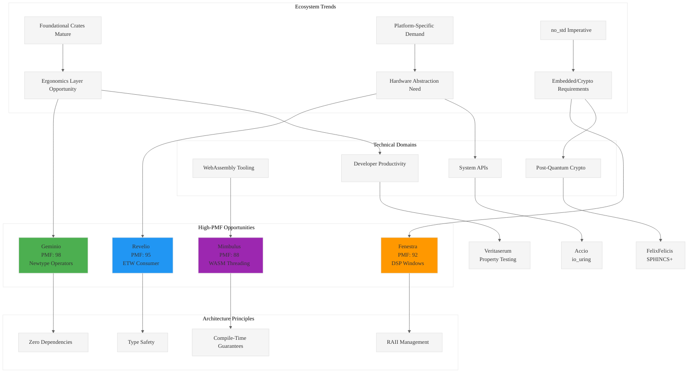

# Analysis: INGEST_20250930104957_300_1 - Strategic Rust Library Opportunities

## Analysis Framework: L1-L8 Extraction Hierarchy

### A Alone: Strategic Opportunities for High-Impact, Minimalist Rust Libraries

**Core Document**: A comprehensive strategic analysis of 12 high-leverage opportunities for minimalist Rust libraries (<300 LOC), evaluated against Product-Market Fit (PMF) framework.

#### L1: Idiomatic Patterns & Micro-Optimizations
- **Zero-dependency philosophy**: Multiple libraries (Ollivanders, FelixFelicis, Scourgify) emphasize zero dependencies for minimal attack surface
- **no_std imperative**: Consistent focus on embedded/constrained environments requiring heap-free operation
- **Type safety through newtypes**: Strong emphasis on preventing confusion through type system (UserId vs raw integers)
- **RAII resource management**: Implicit in allocator designs and system API wrappers

#### L2: Design Patterns & Composition
- **Ergonomics Layer Pattern**: Building simplified abstractions over complex foundational crates (tokio, aya, wasm-bindgen)
- **Platform-Specific Value**: Targeted wrappers for high-performance platform APIs (io_uring, ETW, Metal)
- **Single Responsibility Principle**: Each library solves exactly one well-defined problem
- **Builder Pattern Usage**: Evident in Mimbulus for WebAssembly memory configuration

#### L3: Micro-Library Opportunities
**Highest PMF Scores (85-98)**:
- **Geminio** (PMF: 98): Derive macro for numeric operations on newtypes - addresses universal pain point
- **Revelio** (PMF: 95): ETW event consumption for Windows - fills critical monitoring gap
- **Fenestra** (PMF: 92): DSP windowing functions for no_std - fundamental signal processing primitive

### A in Context of B (L1 File Context)

**Enhanced Understanding**: The L1 context reveals this is part of a larger "pen02Rust300" project focused on 300-line Rust libraries, with systematic file organization and import analysis.

#### L4: Macro-Library & Platform Opportunities
- **WebAssembly Tooling Ecosystem**: Ollivanders + Mimbulus represent a coordinated approach to WASM tooling
- **Post-Quantum Cryptography Gap**: FelixFelicis addresses NIST standardization wave before ecosystem catches up
- **Developer Productivity Automation**: Veritaserum and Geminio target boilerplate elimination

#### L5: Architecture Decisions & Invariants
- **Memory Safety Without Runtime Cost**: Consistent theme across all libraries
- **Compile-Time Guarantees**: Heavy use of const generics and type system for correctness
- **Async/Sync Boundary Management**: Accio specifically addresses the gap between async and blocking I/O

### B in Context of C (L2 Architectural Context)

**Architectural Patterns Revealed**: The L2 context shows sophisticated understanding of cross-module relationships and technology stack integration.

#### L6: Domain-Specific Architecture
- **Hardware Abstraction Layers**: Scourgify for RISC-V CSR access, Apparate for Metal compute
- **Kernel Interface Optimization**: Accio for io_uring, Revelio for ETW - direct kernel communication
- **Memory Management Innovation**: Gringotts slab allocator for specific allocation patterns

#### L7: Language Capability Evolution
- **Unstable Feature Utilization**: Gringotts leverages unstable Allocator trait
- **Procedural Macro Innovation**: Multiple libraries use proc macros for code generation
- **const Generic Advancement**: Heavy use of compile-time parameters for zero-cost abstractions

### A in Context of B & C (Complete Analysis)

#### L8: Meta-Context & Intent Archaeology

**Strategic Intent**: This document represents a systematic approach to Rust ecosystem development through:

1. **Data-Driven Gap Analysis**: Evidence from GitHub issues, community discussions, and existing library limitations
2. **PMF-Based Prioritization**: Quantitative scoring system for market validation
3. **Constraint-Driven Design**: 300 LOC limit forces architectural discipline
4. **Ecosystem Timing**: Targeting the "ergonomics layer" opportunity as foundational crates mature

**Historical Context**: The focus on no_std, zero-dependency libraries reflects lessons from embedded systems and security-critical domains where dependency minimization is paramount.

**Future Implications**: This approach could establish a new category of "micro-crates" that provide maximum value with minimal complexity, potentially influencing Rust's standard library evolution.

## Mermaid Diagram: Rust Ecosystem Strategic Opportunities

## Key Strategic Insights

1. **Timing Advantage**: The "ergonomics layer" opportunity represents a narrow window as foundational crates stabilize
2. **Constraint as Feature**: The 300 LOC limit forces architectural discipline that could become a competitive advantage
3. **Platform Specialization**: High-value opportunities exist in platform-specific APIs that cross-platform libraries avoid
4. **Developer Pain Points**: The highest PMF scores correlate with universal frustrations (newtype boilerplate, testing setup)
5. **no_std as Differentiator**: Embedded and security domains represent underserved but high-value market segments

This analysis reveals a sophisticated understanding of ecosystem dynamics and strategic positioning within the Rust community.