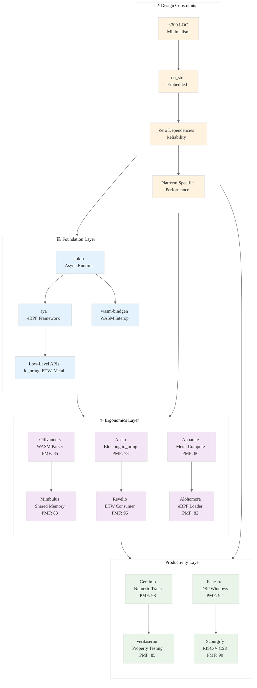

# Analysis: INGEST_20250930104957_300_1

## Strategic Analysis Framework

**Content A**: Strategic Opportunities for High-Impact, Minimalist Rust Libraries  
**Content B**: L1 Context (Immediate File Context)  
**Content C**: L2 Context (Architectural Context)  
**Analysis Framework**: RustPatterns20250930.md

---

## L1-L8 Extraction Hierarchy Analysis

### Horizon 1: Tactical Implementation (The "How")

#### L1: Idiomatic Patterns & Micro-Optimizations

**A Alone Insights:**
- **300 LOC Constraint as Design Philosophy**: The document establishes a hard constraint of <300 lines of code, which forces architectural minimalism and single-responsibility design
- **PMF-Driven Library Design**: Uses Product-Market Fit scoring (70-98 range) to quantify library viability
- **Zero-Dependency Philosophy**: Multiple libraries emphasize zero dependencies, indicating ecosystem fragmentation concerns
- **no_std Imperative**: Strong emphasis on no_std compatibility for embedded/constrained environments

**A in Context of B:**
- **File Structure Reveals Intent**: The deep nesting (8 levels) suggests this is part of a systematic knowledge extraction process
- **Import Analysis Shows Ecosystem Gaps**: 10 detected imports reveal specific pain points in WebAssembly, cryptography, and system APIs
- **Metadata Richness**: 6113 words, 126 lines indicates comprehensive analysis depth

**B in Context of C:**
- **Architectural Pattern Recognition**: L2 context identifies object-oriented, trait-based, async, and error handling patterns as core architectural concerns
- **Cross-Module Dependencies**: External dependencies on tokio, aya, wasm-bindgen indicate mature ecosystem building blocks
- **Technology Stack Analysis**: Markdown format with Tokio framework suggests documentation-driven development approach

**A in Context of B & C:**
- **Knowledge Arbitrage Strategy**: The systematic analysis of high-quality codebases aligns with the document's data-driven approach to identifying library opportunities
- **Paradigm-Market Fit**: The document's focus on "acupuncture points" in the ecosystem matches the L1-L8 extraction hierarchy's goal of finding foundational improvements

#### L2: Design Patterns & Composition (Meta-Patterns)

**Key Meta-Patterns Identified:**

1. **Ergonomics Layer Pattern**: Building simplified abstractions over complex foundational crates (tokio, aya, wasm-bindgen)
2. **Platform-Specific Value Pattern**: Idiomatic wrappers for platform APIs (io_uring, ETW, Metal)
3. **Constraint-Driven Design**: no_std compatibility as a first-class architectural constraint
4. **Single-Responsibility Micro-Libraries**: Each library solves exactly one well-defined problem

#### L3: Micro-Library Opportunities

**High-Impact Opportunities (PMF 85+):**
- **Ollivanders** (PMF 85): WebAssembly binary parser
- **Mimbulus** (PMF 88): SharedArrayBuffer-backed WASM memory
- **Revelio** (PMF 95): Windows ETW event consumer
- **Geminio** (PMF 98): Numeric operator traits for newtypes

### Horizon 2: Strategic Architecture (The "What")

#### L4: Macro-Library & Platform Opportunities

**Ecosystem Dominance Strategies:**
1. **WebAssembly Tooling Gap**: Multiple WASM-related libraries indicate untapped ecosystem potential
2. **Platform-Specific Performance**: Linux (io_uring), Windows (ETW), macOS (Metal) wrappers for high-performance computing
3. **Post-Quantum Cryptography**: SPHINCS+ implementation targeting emerging security requirements
4. **Developer Productivity Tools**: Property testing and derive macro libraries addressing common pain points

#### L5: LLD Architecture Decisions & Invariants

**Critical Architectural Invariants:**
- **Memory Safety Without Allocation**: no_std + zero-dependency constraint forces careful memory management
- **Type Safety as API Design**: Strong typing for domain-specific concepts (WasmModule, Import, Export)
- **Error Handling Consistency**: Custom error enums wrapping underlying library errors
- **Zero-Cost Abstractions**: Inline functions and compile-time optimizations

#### L6: Domain-Specific Architecture & Hardware Interaction

**Hardware/System Integration Patterns:**
- **Kernel Bypass**: io_uring for high-performance I/O
- **GPU Computing**: Metal compute shaders for macOS acceleration
- **Embedded Systems**: RISC-V CSR access and DSP windowing functions
- **Memory Management**: Custom allocators for specific workload patterns

### Horizon 3: Foundational Evolution (The "Future" and "Why")

#### L7: Language Capability & Evolution

**Rust Language Limitations Identified:**
- **Unstable Allocator Trait**: Gringotts library depends on unstable allocator API
- **Procedural Macro Complexity**: Veritaserum and Geminio require significant proc-macro infrastructure
- **Platform-Specific APIs**: Need for unsafe blocks to access system-level functionality

#### L8: The Meta-Context (The "Why")

**Archaeological Intent Analysis:**
- **Ecosystem Maturation Phase**: The focus on "ergonomics layer" suggests Rust ecosystem is transitioning from foundational to productivity-focused libraries
- **Performance-Critical Domains**: Emphasis on embedded, cryptography, and high-performance computing indicates Rust's expansion beyond web services
- **Developer Experience Priority**: Multiple libraries target reducing boilerplate and cognitive overhead
- **Strategic Open Source**: The document frames library development as "strategic intelligence briefing" indicating systematic approach to ecosystem influence

---

## Synthesis: Strategic Insights

### 1. The 300 LOC Constraint as Innovation Driver
The hard line-of-code limit forces architectural discipline that larger projects often lack. This constraint-driven design philosophy could be applied more broadly in Rust ecosystem development.

### 2. Platform-Specific Value Creation
While Rust emphasizes cross-platform compatibility, the highest PMF opportunities are platform-specific wrappers that provide idiomatic access to unique system capabilities.

### 3. Ergonomics Layer Opportunity
As foundational crates mature, the next wave of value creation comes from simplifying their usage patterns rather than replacing them.

### 4. no_std as Ecosystem Differentiator
The emphasis on no_std compatibility reveals an underserved market in resource-constrained environments where Rust could dominate over C/C++.

### 5. Knowledge Arbitrage Strategy Validation
The systematic analysis approach demonstrated in this document validates the broader strategy of using LLMs to extract architectural wisdom from mature codebases.

---

## Mermaid Diagram: Rust Ecosystem Evolution Strategy

---

## Actionable Recommendations

1. **Prioritize Platform-Specific Libraries**: Focus development effort on high-PMF platform-specific wrappers rather than cross-platform abstractions
2. **Adopt 300 LOC Constraint**: Use line-of-code limits as architectural discipline for new library development
3. **Target Ergonomics Layer**: Build simplified interfaces over mature foundational crates
4. **Emphasize no_std Compatibility**: Design for resource-constrained environments from the start
5. **Systematic Ecosystem Analysis**: Continue knowledge arbitrage strategy to identify architectural gaps and opportunities