# Analysis: INGEST_20250930104957_300_1

## Strategic Analysis of High-Impact Rust Library Opportunities

### A Alone: Core Document Analysis

**Document Type**: Strategic analysis report on minimalist Rust library opportunities
**Core Thesis**: Identifying "acupuncture points" in the Rust ecosystem where <300 LOC libraries can yield maximum impact

**Key Strategic Insights**:
- **Data-driven methodology**: Moving beyond brainstorming to evidence-based opportunity identification through community discussions, GitHub issues, and library analysis
- **PMF Framework**: Rigorous evaluation against Product-Market Fit considering validated demand, technical feasibility, adoption potential, and ecosystem gap value
- **Macro-trend identification**: Four key trends shaping Rust ecosystem evolution

### A in Context of B (L1 Context): Implementation Patterns

**L1-L8 Extraction Analysis**:

**L1 (Idiomatic Patterns)**: 
- Zero-dependency, no_std compatibility as core constraint
- Single-function APIs (e.g., `fn parse(bytes: &[u8]) -> Result<WasmModule, ParseError>`)
- RAII resource management patterns
- Type-safe abstractions over unsafe operations

**L2 (Design Patterns)**:
- Newtype pattern for type safety (`SlabAllocator<const BLOCK_SIZE: usize, const CAPACITY: usize>`)
- Builder patterns for complex initialization
- Trait-based abstractions (`Allocator` trait implementation)
- Procedural macro patterns for boilerplate elimination

**L3 (Micro-Library Opportunities)**:
- **Ollivanders**: WebAssembly binary parser (PMF: 85)
- **Gringotts**: Slab allocator (PMF: 70) - notably shares name with our workspace
- **Veritaserum**: Property testing macro (PMF: 85)

### B in Context of C (L2 Context): Architectural Patterns

**Cross-Module Relationships Analysis**:
- Heavy emphasis on platform-specific optimizations (io_uring, ETW, Metal)
- Layered architecture approach (L1 core → L2 std → L3 external)
- Dependency injection patterns for testability
- Performance-first design with measurable contracts

**Technology Stack Convergence**:
- WebAssembly ecosystem gaps
- Post-quantum cryptography implementation needs
- Embedded/no_std domain requirements
- Developer productivity tooling

### A in Context of B & C: Strategic Synthesis

**Knowledge Arbitrage Opportunities**:

1. **Platform-Specific Value Creation**: The document identifies a clear trend toward platform-specific wrappers (Linux io_uring, Windows ETW, macOS Metal) - this represents untapped value in the cross-platform-first Rust ecosystem.

2. **Ergonomics Layer Strategy**: Building on mature foundations (tokio, aya, wasm-bindgen) rather than competing with them - classic "standing on shoulders of giants" approach.

3. **no_std Market Segmentation**: Embedded/cryptography/HPC domains create distinct value segments with different constraints and requirements.

4. **Developer Productivity as Product**: Solving recurring frustrations (trait implementation boilerplate, testing harness setup) creates high-adoption potential.

**Strategic Recommendations**:

1. **Focus on "Gringotts" Pattern**: Custom allocators represent a high-leverage area where Rust's ownership model provides unique advantages over C/C++.

2. **WebAssembly Tooling Gap**: The document identifies clear gaps in WASM tooling - this aligns with the growing importance of WASM in cloud/edge computing.

3. **Procedural Macro Opportunities**: The "Veritaserum" and "Geminio" examples show high PMF for developer productivity macros.

## Mermaid Diagram: Rust Ecosystem Strategic Opportunities

```mermaid
%%{init: {
  "theme": "base",
  "themeVariables": {
    "primaryColor": "#F5F5F5",
    "secondaryColor": "#E0E0E0",
    "lineColor": "#616161",
    "textColor": "#212121",
    "fontSize": "16px",
    "fontFamily": "Helvetica, Arial, sans-serif"
  },
  "flowchart": {
    "nodeSpacing": 70,
    "rankSpacing": 80,
    "wrappingWidth": 160,
    "curve": "basis"
  },
  "useMaxWidth": false
}}%%

flowchart TD
    subgraph "Strategic Opportunity Matrix"
        direction TB
        
        subgraph "High-Leverage Domains"
            A1["🎯 Ergonomics Layer<br/>PMF: 85-95"]
            A2["⚡ Platform-Specific APIs<br/>PMF: 78-95"]
            A3["🔒 no_std Ecosystem<br/>PMF: 70-92"]
            A4["🛠️ Developer Productivity<br/>PMF: 85-98"]
        end
        
        subgraph "Implementation Patterns"
            B1["Single Function APIs<br/>fn parse() -> Result"]
            B2["Zero Dependencies<br/>no_std Compatible"]
            B3["Type-Safe Wrappers<br/>Newtype Pattern"]
            B4["Procedural Macros<br/>Boilerplate Elimination"]
        end
        
        subgraph "Concrete Opportunities"
            C1["Ollivanders<br/>WASM Parser"]
            C2["Gringotts<br/>Slab Allocator"]
            C3["Veritaserum<br/>Property Testing"]
            C4["Accio<br/>io_uring Wrapper"]
            C5["Revelio<br/>ETW Consumer"]
        end
        
        subgraph "Strategic Value"
            D1["Knowledge Arbitrage<br/>Mature → Rust"]
            D2["Ecosystem Gaps<br/>Unmet Needs"]
            D3["Performance Niches<br/>Hardware Sympathy"]
        end
    end
    
    A1 --> B1
    A1 --> B4
    A2 --> B3
    A3 --> B2
    A4 --> B4
    
    B1 --> C1
    B2 --> C2
    B3 --> C4
    B3 --> C5
    B4 --> C3
    
    C1 --> D2
    C2 --> D3
    C3 --> D1
    C4 --> D3
    C5 --> D2
    
    classDef highPMF fill:#e8f5e8,stroke:#4caf50,stroke-width:3px
    classDef mediumPMF fill:#fff3e0,stroke:#ff9800,stroke-width:2px
    classDef pattern fill:#e3f2fd,stroke:#2196f3,stroke-width:2px
    
    class A1,A4,C3 highPMF
    class A2,A3,C1,C4,C5 mediumPMF
    class B1,B2,B3,B4 pattern
```

**Key Strategic Insight**: The document reveals a systematic approach to identifying high-leverage opportunities in the Rust ecosystem through the lens of "Knowledge Arbitrage" - transferring proven patterns from mature ecosystems while leveraging Rust's unique strengths (ownership, type safety, zero-cost abstractions). The focus on <300 LOC libraries represents a "minimum viable complexity" approach that maximizes adoption while minimizing maintenance burden.