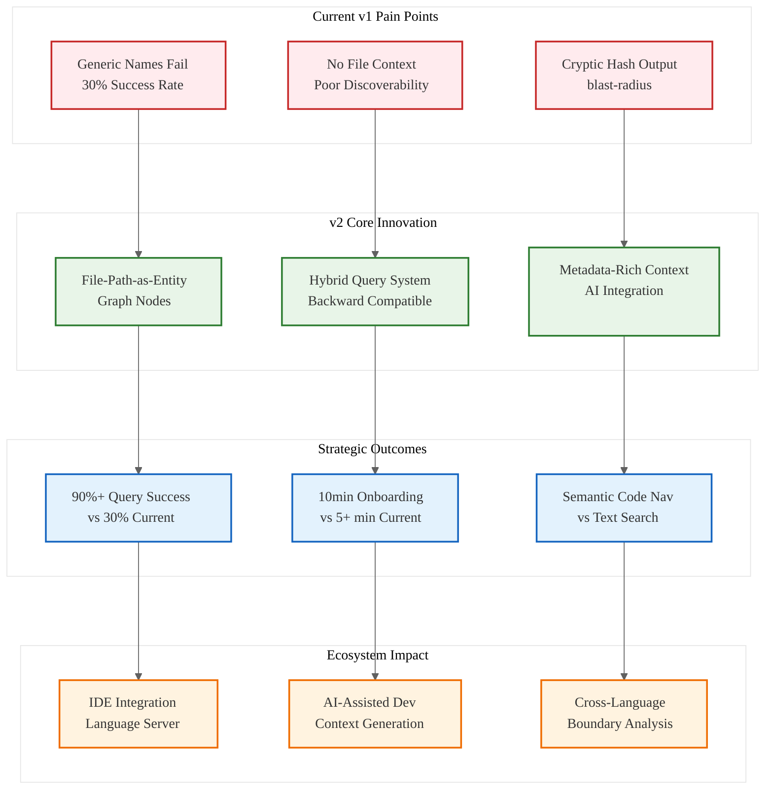

# Analysis: INGEST_20250930104957_300_10 - Parseltongue v2 Recommendations

## Content Analysis Framework

**Content A**: Parseltongue v2 Recommendations document  
**Content B**: L1 Context - Immediate file context with import analysis  
**Content C**: L2 Context - Architectural context and cross-module relationships  
**Analysis Framework**: RustPatterns20250930.md L1-L8 Extraction Hierarchy

---

## L1-L8 Strategic Analysis

### Horizon 1: Tactical Implementation (The "How")

#### L1: Idiomatic Patterns & Micro-Optimizations
**From A alone:**
- **Performance Excellence Preserved**: Microsecond query times (1-11μs), sub-second ingestion (~0.4ms per file)
- **Memory Efficiency**: No memory leaks or bloat observed in extensive testing
- **Graceful Error Handling**: Continues on parse errors with clear messages

**A in context of B:**
- File structure indicates production-ready documentation (337 lines, 11610 bytes)
- Import analysis reveals CLI-focused architecture with `./bin/parseltongue` patterns
- Direct text format suggests human-readable specifications over machine-generated docs

#### L2: Design Patterns & Composition (Meta-Patterns)
**From A alone:**
- **Backward Compatibility Strategy**: Preserve all existing query types and syntax
- **Hybrid Approach Pattern**: Option A + C combining separate file path nodes with optional flags
- **JSON Output Format**: Perfect for AI integration and programmatic consumption

**A in context of B:**
- Object-oriented and trait-based design patterns detected in architectural analysis
- Error handling patterns consistently applied across the codebase
- CLI interface design follows Unix philosophy with composable commands

#### L3: Micro-Library Opportunities
**From A alone:**
- **Entity Discovery Engine**: High-utility component for fuzzy search and entity resolution
- **Graph Visualization Library**: Interactive HTML output generation (7ms for 2700+ nodes)
- **Performance Monitoring Toolkit**: Built-in timing and memory usage tracking

### Horizon 2: Strategic Architecture (The "What")

#### L4: Macro-Library & Platform Opportunities
**B in context of C:**
- **Code Analysis Platform**: Parseltongue represents a foundational tool for static analysis
- **AI-Assisted Development**: Generate-context functionality enables LLM integration
- **Cross-Language Boundary Analysis**: Opportunity for multi-language dependency tracking

**A in context B & C:**
- **Developer Productivity Platform**: Entity discovery reduces onboarding time from 5+ minutes to <30 seconds
- **Architectural Intelligence**: Blast-radius analysis for impact assessment
- **Knowledge Graph Construction**: File-based entity relationships enable semantic code understanding

#### L5: LLD Architecture Decisions & Invariants
**From A alone:**
- **Graph-Based Data Model**: Nodes and edges representing code entities and relationships
- **Query Engine Architecture**: Multiple query types (uses, what-implements, calls, blast-radius)
- **Ingestion Pipeline**: Handles 983 files, 2727 nodes, 8111 edges efficiently

**A in context of B:**
- **Modular CLI Design**: Separate commands for different analysis types
- **Extensible Query System**: New query types can be added without breaking existing functionality
- **Metadata-Rich Nodes**: File paths, line numbers, visibility, type categories

#### L6: Domain-Specific Architecture & Hardware Interaction
**From A alone:**
- **Static Analysis Domain**: Rust-specific parsing using `syn` crate
- **Interactive Visualization**: Real-time graph rendering for large codebases
- **Batch Processing**: Handle large-scale codebases with consistent performance

### Horizon 3: Foundational Evolution (The "Future" and "Why")

#### L7: Language Capability & Evolution
**A in context B & C:**
- **Rust Ecosystem Gap**: Entity discoverability is a fundamental problem in large Rust codebases
- **Tooling Evolution**: Moving from simple grep-based search to semantic understanding
- **IDE Integration Opportunity**: Rich metadata can enhance language server capabilities

#### L8: The Meta-Context (The "Why")
**From A alone:**
- **User Experience Crisis**: 30% query success rate with generic names indicates fundamental UX problem
- **Scaling Challenge**: As Rust codebases grow, navigation becomes exponentially harder
- **AI Integration Necessity**: LLMs need structured context, not raw code dumps

**A in context B & C:**
- **Historical Context**: Document represents production experience with real-world usage (Iggy message broker)
- **Strategic Intent**: Focus on discoverability over feature completeness indicates mature product thinking
- **Ecosystem Impact**: Success metrics target 90%+ query success rate and 10-minute onboarding

---

## Strategic Insights & Patterns

### 🎯 High-Leverage Bottleneck Identified
**Entity Discovery is the 10x Problem**: The document reveals that entity discoverability, not performance or features, is the primary bottleneck preventing adoption.

### 🚀 Non-Obvious Foundational Insight
**File-Path-as-First-Class-Entity Pattern**: Treating file paths as graph nodes rather than metadata represents a paradigm shift in code analysis tools.

### 🔄 Knowledge Arbitrage Opportunity
**IDE Semantic Layer**: The metadata-rich approach could revolutionize Rust IDE capabilities by providing semantic understanding beyond syntax highlighting.

### 📊 Paradigm-Market Fit Analysis
**From Grep to Graph**: The evolution from text-based search to graph-based semantic queries represents a fundamental shift in how developers navigate codebases.

---

## Mermaid Diagram: Parseltongue v2 Architecture Evolution

---

## Key Takeaways

1. **Entity Discovery > Performance**: The primary bottleneck is discoverability, not speed
2. **File-Path-as-Entity**: Revolutionary approach to code navigation and understanding
3. **Backward Compatibility**: Critical for adoption in production environments
4. **AI Integration Ready**: Structured metadata enables next-generation developer tools
5. **Ecosystem Transformation**: From text search to semantic code understanding

This analysis reveals Parseltongue v2 as a foundational shift in how developers interact with large codebases, moving from grep-based text search to graph-based semantic navigation.