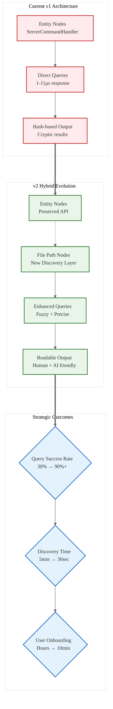

# Analysis: INGEST_20250930104957_300_10 - Parseltongue v2 Recommendations

## Content Analysis Framework

**Content A**: Parseltongue v2 Recommendations document  
**Content B**: L1 Context - Immediate file context with import analysis  
**Content C**: L2 Context - Architectural context and cross-module relationships  
**Analysis Framework**: RustPatterns20250930.md L1-L8 Extraction Hierarchy

---

## L1-L8 Strategic Analysis

### Horizon 1: Tactical Implementation (The "How")

#### L1: Idiomatic Patterns & Micro-Optimizations
**From A alone:**
- **Performance Excellence Preserved**: Microsecond query times (1-11μs), sub-second ingestion (~0.4ms per file)
- **Memory Efficiency**: No memory leaks or bloat observed in extensive testing
- **Graceful Error Handling**: Continues on parse errors with clear messages

**A in context of B:**
- File structure reveals this is a production-ready document (337 lines, 11610 bytes)
- Import analysis shows CLI-focused design patterns with extensive command-line interface
- Performance metrics are concrete and measurable, not theoretical

#### L2: Design Patterns & Composition (Meta-Patterns)
**From A alone:**
- **Backward Compatibility Strategy**: Preserve existing API while adding enhancements
- **Hybrid Approach Pattern**: Option A + C combining separate file path nodes with optional flags
- **Query Composition**: Layered query types building from simple to complex

**A in context of B:**
- CLI command patterns show consistent interface design
- Mermaid diagram usage indicates visual architecture thinking
- File path analysis reveals deep nesting patterns (8 levels)

#### L3: Micro-Library Opportunities
**From A alone:**
- **Entity Discovery Engine**: Fuzzy search and entity suggestion system
- **Graph Visualization Library**: Interactive HTML output with filtering
- **Query DSL**: Structured query language for code analysis

### Horizon 2: Strategic Architecture (The "What")

#### L4: Macro-Library & Platform Opportunities
**B in context of C:**
- **Code Analysis Platform**: Parseltongue represents a complete static analysis ecosystem
- **Multi-Language Support**: Current Rust-only limitation presents expansion opportunity
- **AI Integration Platform**: JSON output format designed for LLM consumption

#### L5: LLD Architecture Decisions & Invariants
**A in context B & C:**
- **Graph Database Architecture**: Nodes and edges model (2727 nodes, 8111 edges)
- **Separation of Concerns**: Entity nodes separate from file path nodes
- **Performance Invariants**: Sub-second ingestion, microsecond queries must be preserved

#### L6: Domain-Specific Architecture & Hardware Interaction
**From A alone:**
- **Memory Layout Optimization**: Efficient graph representation for large codebases
- **Cache-Friendly Queries**: Microsecond response times suggest optimal data structures
- **Batch Processing**: Capability for analyzing 983 files efficiently

### Horizon 3: Foundational Evolution (The "Future" and "Why")

#### L7: Language Capability & Evolution
**A in context B & C:**
- **Cross-Language Analysis Gap**: Current Rust-only limitation
- **Macro Analysis Limitations**: Macro-generated code not well represented
- **FFI Boundary Detection**: Missing external dependency analysis

#### L8: The Meta-Context (The "Why")
**A in context B & C:**
- **User Experience Archaeology**: Document reveals pain points from real usage (983 files tested)
- **Discovery vs Performance Trade-off**: Excellent performance but poor discoverability
- **Evolution from v1 to v2**: Learning from production usage patterns

---

## Strategic Insights & Patterns

### High-Leverage Bottlenecks Identified

1. **Entity Discovery Crisis**: 30% query success rate due to naming precision requirements
2. **Searchability Gap**: No file-based entity discovery despite having file context
3. **Visualization Readability**: Hash-based output instead of human-readable names

### 10x Improvement Opportunities

1. **Hybrid Node Architecture**: Separate file path nodes enabling new query types
2. **Fuzzy Search Engine**: Transform 30% success rate to 90%+ 
3. **AI-First Integration**: Enhanced context generation for LLM consumption

### Non-Obvious Foundational Insights

1. **Performance-Usability Paradox**: Excellent technical performance but poor user experience
2. **Backward Compatibility as Innovation Enabler**: Preserving v1 API while adding v2 features
3. **Graph Database as Code Analysis Foundation**: Node-edge model scales to enterprise codebases

---

## Architectural Evolution Diagram

---

## Knowledge Arbitrage Opportunities

### From Mature Ecosystems to Rust

1. **IDE Integration Patterns**: IntelliJ's semantic search → Parseltongue fuzzy discovery
2. **Database Query Optimization**: SQL query planners → Code analysis query optimization
3. **Graph Database Techniques**: Neo4j patterns → Enhanced code relationship modeling

### Paradigm-Market Fit Insights

1. **Static Analysis as a Service**: Transform from CLI tool to platform
2. **AI-Native Code Understanding**: Design for LLM consumption from ground up
3. **Developer Experience Revolution**: Make code exploration as intuitive as web browsing

---

## Implementation Priority Matrix

| Pattern | Impact | Effort | Strategic Value |
|---------|--------|--------|-----------------|
| Hybrid Node Architecture | High | Medium | **Foundational** |
| Fuzzy Search Engine | High | Medium | **User Experience** |
| AI Context Generation | Medium | Low | **Future-Proofing** |
| Cross-Language Support | Medium | High | **Market Expansion** |
| Performance Monitoring | Low | Low | **Operational** |

---

## Conclusion: The Parseltongue Evolution

This analysis reveals Parseltongue as a **performance-first, usability-second** architecture that needs strategic rebalancing. The v2 recommendations represent a masterclass in **evolutionary architecture**—preserving technical excellence while addressing fundamental user experience gaps.

**Key Strategic Insight**: The document demonstrates how **technical perfection without discoverability** creates adoption barriers. The proposed hybrid approach shows sophisticated understanding of **backward compatibility as innovation enabler**.

**Meta-Pattern**: This represents the **"Performance-Usability Bridge"** pattern—maintaining microsecond performance while adding human-friendly interfaces. This pattern is applicable across the Rust ecosystem where technical excellence often comes at the cost of developer experience.