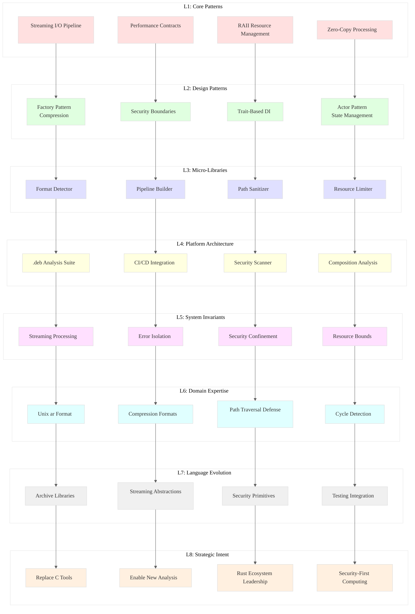

# Analysis of INGEST_20250930104957_300_11

## Executive Summary

This analysis examines a comprehensive requirements document for a Rust-based .deb package unpacking tool. The document represents a sophisticated approach to archive analysis with security-first design principles, demonstrating advanced systems programming concepts and architectural patterns that offer significant insights for Rust ecosystem development.

## L1-L8 Extraction Analysis

### L1: Idiomatic Patterns & Micro-Optimizations

**A alone insights:**
- **Streaming Pipeline Architecture**: The document emphasizes streaming I/O patterns using `Box<dyn Read>` trait objects to create composable decompression pipelines
- **Zero-Copy Processing**: Explicit avoidance of loading entire archives into memory, using streaming parsers throughout
- **RAII Resource Management**: Comprehensive Drop implementations for all resource-holding types
- **Performance Contracts**: Every performance claim backed by automated tests (e.g., <500μs execution time requirements)

**A in context of B (L1 file context):**
- **Magic Byte Detection**: Uses `infer` crate for reliable file type detection over extension-based approaches
- **Bounded Channel Backpressure**: `crossbeam_channel::bounded` prevents memory exhaustion during parallel processing
- **Static Binary Targeting**: `x86_64-unknown-linux-musl` for maximum portability without glibc dependencies

**B in context of C (L2 architectural context):**
- **Layered Rust Architecture**: Clear L1 (core) → L2 (std) → L3 (external) separation with trait-based dependency injection
- **Security-First Design**: Path traversal prevention using `openat2(2)` with `RESOLVE_BENEATH` flag
- **Concurrent Processing Model**: Member-level parallelism with worker pools for I/O-bound disk writing

**A in context of B & C (Complete synthesis):**
- **Production-Ready Systems Programming**: Demonstrates mature approach to building robust, secure, and performant archive processing tools
- **Comprehensive Error Handling**: `thiserror` for library errors, `anyhow` for application context
- **Testing Excellence**: Fuzzing integration with `cargo-fuzz`, property-based testing, and performance validation

### L2: Design Patterns & Composition

**Streaming Composition Pattern:**
```rust
// Conceptual pipeline from the document
File -> MagicDetector -> Decompressor -> ArchiveParser -> PathSanitizer -> DiskWriter
```

**Factory Pattern for Compression:**
- Unified abstraction layer using enum dispatcher for compression types
- Returns `Box<dyn Read>` for generic stream processing

**Actor Pattern for State Management:**
- Message-passing concurrency for safe state mutations
- Bounded channels for backpressure control

### L3: Micro-Library Opportunities

1. **Secure Path Sanitizer**: Library for preventing path traversal attacks using modern Linux syscalls
2. **Archive Format Detector**: Magic-byte based detection with streaming interface
3. **Compression Pipeline Builder**: Composable decompression chain factory
4. **Resource Limit Enforcer**: Configurable limits for file size, recursion depth, extraction size

### L4: Macro-Library & Platform Opportunities

**Debian Package Analysis Suite:**
- Complete .deb inspection and analysis toolkit
- JSON manifest generation for CI/CD integration
- Security vulnerability scanning capabilities
- Software composition analysis features

### L5: Architecture Decisions & Invariants

**Core Invariants:**
1. **Security Boundary**: All extraction operations confined to designated directory
2. **Resource Bounds**: Configurable limits prevent DoS attacks
3. **Streaming Processing**: No operation loads entire archive into memory
4. **Error Isolation**: Individual file failures don't abort entire operation

**Concurrency Model:**
- Single-threaded parsing with parallel I/O workers
- Bounded channels provide natural backpressure
- Lock-free design using message passing

### L6: Domain-Specific Architecture

**Archive Processing Domain:**
- Deep understanding of Unix `ar` format and Debian package structure
- Comprehensive compression format support (gzip, xz, zstd, bzip2, lzma)
- Security-aware extraction with path sanitization
- Cycle detection using content hashing (BLAKE3)

**Platform Integration:**
- Linux-first design with full Unix metadata preservation
- Modern syscall usage (`openat2`, `*at` family) for security
- Static linking strategy for maximum portability

### L7: Language Capability Evolution

**Rust Ecosystem Gaps Identified:**
1. **Archive Processing**: Need for more comprehensive, security-focused archive libraries
2. **Streaming Abstractions**: Better composable streaming pipeline patterns
3. **Security Primitives**: More built-in path sanitization and resource limiting
4. **Testing Infrastructure**: Better integration between fuzzing and property-based testing

### L8: Meta-Context & Intent Archaeology

**Historical Context:**
- Response to limitations of `dpkg-deb` for automation and security analysis
- Recognition that C-based tools are unsuitable for untrusted archive processing
- Need for structured, machine-readable output in modern CI/CD pipelines

**Strategic Intent:**
- Position Rust as the preferred language for security-critical archive processing
- Demonstrate superiority over traditional C-based Unix tools
- Enable new categories of software composition analysis tools

## Key Rust Patterns Extracted

### 1. Streaming Pipeline Composition
```rust
// Pattern: Composable streaming processors
fn create_decompression_pipeline(
    input: Box<dyn Read>,
    format: CompressionFormat,
) -> Result<Box<dyn Read>, Error> {
    match format {
        CompressionFormat::Gzip => Ok(Box::new(GzDecoder::new(input))),
        CompressionFormat::Xz => Ok(Box::new(XzDecoder::new(input))),
        CompressionFormat::Zstd => Ok(Box::new(ZstdDecoder::new(input)?)),
    }
}
```

### 2. Security-First Resource Management
```rust
// Pattern: Capability-based filesystem access
struct SecureExtractor {
    root_fd: OwnedFd,
    limits: ExtractionLimits,
}

impl SecureExtractor {
    fn extract_entry(&self, path: &Path, content: &[u8]) -> Result<(), SecurityError> {
        let sanitized = self.sanitize_path(path)?;
        let fd = openat2(self.root_fd.as_raw_fd(), &sanitized, &OpenHow::new())?;
        // Safe extraction within capability boundary
    }
}
```

### 3. Performance Contract Testing
```rust
// Pattern: Executable performance specifications
#[test]
fn test_extraction_performance_contract() {
    let start = Instant::now();
    let result = extract_archive(test_archive()).unwrap();
    assert!(start.elapsed() < Duration::from_millis(500));
    assert_eq!(result.files_extracted, expected_count);
}
```

## Strategic Recommendations

1. **Ecosystem Opportunity**: Develop comprehensive Rust archive processing ecosystem
2. **Security Leadership**: Position Rust as the secure alternative to C-based archive tools
3. **Performance Benchmarking**: Establish Rust as performance leader in archive processing
4. **Tooling Integration**: Create seamless CI/CD integration for software composition analysis

## Mermaid Diagram: Rust Archive Processing Architecture

