# Analysis of INGEST_20250930104957_300_11

## Content Analysis Framework

### A (Core Content) Analysis
The core content is a comprehensive JSON specification for a Rust-based .deb package unpacking tool. This represents a sophisticated architectural design document that demonstrates several advanced Rust patterns and system design principles.

### A in Context of B (L1 Context) Analysis
When viewed through the L1 context lens, this content reveals deep architectural thinking about streaming I/O, memory management, and security-first design. The specification shows awareness of Rust's ownership model and leverages it for RAII resource management patterns.

### B in Context of C (L2 Context) Analysis
The L2 architectural context reveals this as part of a larger pattern analysis system. The cross-module relationships show extensive use of trait-based design patterns and dependency injection, indicating a mature understanding of Rust's type system capabilities.

### A in Context of B & C (Comprehensive Analysis)
This represents a masterclass in systems programming architecture that synthesizes multiple advanced concepts into a cohesive design philosophy.

## L1-L8 Extraction Hierarchy Analysis

### Horizon 1: Tactical Implementation (The "How")

#### L1: Idiomatic Patterns & Micro-Optimizations
- **Streaming Pipeline Architecture**: Uses `Box<dyn Read>` composition for zero-copy decompression chains
- **RAII Resource Management**: Explicit Drop implementations for cleanup guards
- **Memory-Efficient Processing**: Bounded channels with backpressure to prevent memory exhaustion
- **Magic Byte Detection**: Uses `infer` crate for reliable file type detection over extension-based approaches

#### L2: Design Patterns & Composition (Meta-Patterns)
- **Trait-Based Dependency Injection**: All components depend on traits, not concrete types
- **Factory Pattern for Decompression**: Unified abstraction layer returning `Box<dyn Read>` for different compression formats
- **Command Pattern**: CLI design with hierarchical configuration (CLI flags → env vars → config files)
- **Strategy Pattern**: Pluggable compression backends through trait objects

#### L3: Micro-Library Opportunities
- **Path Sanitization Library**: Capability-based filesystem API wrapper using `openat2` syscalls
- **Archive Format Detection**: Magic-byte driven format detection with streaming support
- **Compression Pipeline Builder**: Composable decompression chain constructor
- **Security Policy Engine**: Configurable limits and validation rules for archive processing

### Horizon 2: Strategic Architecture (The "What")

#### L4: Macro-Library & Platform Opportunities
- **Universal Archive Processor**: Framework for recursive archive unpacking with security guarantees
- **Debian Package Analysis Suite**: Complete toolchain for .deb inspection and validation
- **Supply Chain Security Scanner**: Automated vulnerability detection in package dependencies

#### L5: LLD Architecture Decisions & Invariants
- **Security-First Design**: Path traversal prevention is non-negotiable and cannot be disabled
- **Streaming-Only Processing**: Never load entire archives into memory
- **Fail-Safe Error Handling**: Continue processing on individual file failures
- **Deterministic Resource Limits**: Configurable bounds on recursion depth, file size, and extraction size

#### L6: Domain-Specific Architecture & Hardware Interaction
- **Linux-First Design**: Leverages Linux-specific syscalls (`openat2`) for security
- **Static Binary Distribution**: `x86_64-unknown-linux-musl` target for maximum portability
- **Parallel I/O Architecture**: Worker pool for disk writes while maintaining sequential archive parsing
- **Memory Layout Optimization**: Considers cache alignment and memory access patterns

### Horizon 3: Foundational Evolution (The "Future" and "Why")

#### L7: Language Capability & Evolution
- **Async/Sync Boundary Management**: Careful separation of blocking I/O operations
- **Type-Safe Configuration**: Uses Rust's type system to prevent configuration errors
- **Zero-Cost Abstractions**: Trait objects only where dynamic dispatch is necessary
- **Compile-Time Validation**: Leverages Rust's type system for correctness guarantees

#### L8: The Meta-Context (The "Why")
This specification represents a response to the inadequacies of existing tools like `dpkg-deb` for modern security analysis and automation. The design philosophy prioritizes:

- **Supply Chain Security**: Growing concern about malicious packages in software ecosystems
- **Automation-First**: Machine-readable output for CI/CD integration
- **Memory Safety**: Rust's ownership model prevents entire classes of vulnerabilities
- **Performance at Scale**: Designed to handle large-scale package analysis workloads

## Key Architectural Insights

### 1. Security as a First-Class Concern
The specification treats security not as an afterthought but as a fundamental architectural constraint. Path traversal prevention, resource limits, and capability-based filesystem access are built into the core design.

### 2. Streaming-First Architecture
The consistent use of streaming I/O patterns demonstrates deep understanding of memory efficiency and scalability. The `Box<dyn Read>` composition pattern is particularly elegant.

### 3. Layered Abstraction Strategy
The separation between library and CLI crates, combined with trait-based dependency injection, creates a highly testable and reusable architecture.

### 4. Performance Engineering Discipline
The specification includes concrete performance contracts with automated validation, demonstrating a mature approach to performance engineering.

## Rust Ecosystem Implications

This specification represents several patterns that could benefit the broader Rust ecosystem:

1. **Security-First Archive Processing**: A template for safe handling of untrusted archive formats
2. **Streaming Pipeline Composition**: Reusable patterns for building efficient data processing pipelines
3. **Configuration Hierarchy Patterns**: Standardized approaches to CLI/env/config precedence
4. **Resource Management Patterns**: RAII-based approaches to complex resource cleanup

```mermaid
%%{init: {
  "theme": "base",
  "themeVariables": {
    "primaryColor": "#F5F5F5",
    "secondaryColor": "#E0E0E0",
    "lineColor": "#616161",
    "textColor": "#212121",
    "fontSize": "16px",
    "fontFamily": "Helvetica, Arial, sans-serif"
  },
  "flowchart": {
    "nodeSpacing": 70,
    "rankSpacing": 80,
    "wrappingWidth": 160,
    "curve": "basis"
  },
  "sequence": {
    "actorMargin": 50
  },
  "useMaxWidth": false
}}%%

flowchart TD
    subgraph "L1-L3: Tactical Implementation"
        direction TB
        L1["`**L1: Idiomatic Patterns**
        • Streaming Pipeline Architecture
        • RAII Resource Management
        • Memory-Efficient Processing
        • Magic Byte Detection`"]
        
        L2["`**L2: Design Patterns**
        • Trait-Based Dependency Injection
        • Factory Pattern for Decompression
        • Command Pattern CLI Design
        • Strategy Pattern Backends`"]
        
        L3["`**L3: Micro-Library Opportunities**
        • Path Sanitization Library
        • Archive Format Detection
        • Compression Pipeline Builder
        • Security Policy Engine`"]
        
        L1 --> L2
        L2 --> L3
    end
    
    subgraph "L4-L6: Strategic Architecture"
        direction TB
        L4["`**L4: Macro-Library Opportunities**
        • Universal Archive Processor
        • Debian Package Analysis Suite
        • Supply Chain Security Scanner`"]
        
        L5["`**L5: Architecture Decisions**
        • Security-First Design
        • Streaming-Only Processing
        • Fail-Safe Error Handling
        • Deterministic Resource Limits`"]
        
        L6["`**L6: Domain-Specific Architecture**
        • Linux-First Design
        • Static Binary Distribution
        • Parallel I/O Architecture
        • Memory Layout Optimization`"]
        
        L4 --> L5
        L5 --> L6
    end
    
    subgraph "L7-L8: Foundational Evolution"
        direction TB
        L7["`**L7: Language Capabilities**
        • Async/Sync Boundary Management
        • Type-Safe Configuration
        • Zero-Cost Abstractions
        • Compile-Time Validation`"]
        
        L8["`**L8: Meta-Context**
        • Supply Chain Security Response
        • Automation-First Philosophy
        • Memory Safety Priority
        • Performance at Scale`"]
        
        L7 --> L8
    end
    
    subgraph "Core Architectural Insights"
        direction TB
        SEC["`**Security as First-Class Concern**
        Path traversal prevention
        Resource limits
        Capability-based filesystem`"]
        
        STREAM["`**Streaming-First Architecture**
        Box<dyn Read> composition
        Memory efficiency
        Scalability focus`"]
        
        LAYER["`**Layered Abstraction Strategy**
        Library/CLI separation
        Trait-based injection
        High testability`"]
        
        PERF["`**Performance Engineering**
        Concrete performance contracts
        Automated validation
        Mature discipline`"]
        
        SEC --> STREAM
        STREAM --> LAYER
        LAYER --> PERF
    end
    
    L3 --> L4
    L6 --> L7
    L8 --> SEC
    
    classDef tactical fill:#E3F2FD
    classDef strategic fill:#F3E5F5
    classDef foundational fill:#E8F5E8
    classDef insights fill:#FFF3E0
    
    class L1,L2,L3 tactical
    class L4,L5,L6 strategic
    class L7,L8 foundational
    class SEC,STREAM,LAYER,PERF insights
```

## Strategic Recommendations

1. **Extract Reusable Components**: The path sanitization and streaming pipeline patterns could be extracted into standalone crates
2. **Performance Benchmarking**: The specification's performance contracts could serve as a template for other Rust projects
3. **Security Pattern Library**: The security-first design patterns could be documented and promoted across the Rust ecosystem
4. **Tooling Integration**: The machine-readable output format could be standardized for broader adoption in CI/CD pipelines

This analysis reveals a sophisticated understanding of systems programming principles applied through Rust's unique capabilities, representing a significant contribution to the ecosystem's maturity in security-critical applications.