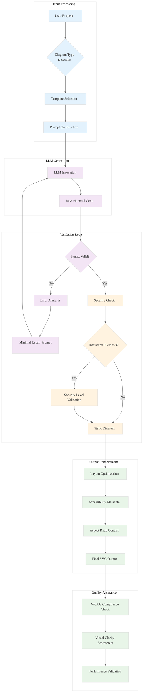

# Analysis: INGEST_20250930104957_300_12 - Mermaid LLM Prompt Engineering

## Content Analysis Framework

**File A (Core Content)**: Comprehensive guide for generating high-quality Mermaid diagrams using LLMs
**File B (L1 Context)**: Immediate file context with import/include analysis
**File C (L2 Context)**: Architectural context showing cross-module relationships

## L1-L8 Strategic Analysis

### Horizon 1: Tactical Implementation (The "How")

#### L1: Idiomatic Patterns & Micro-Optimizations
- **Self-Repair Loop Pattern**: Iterative validation using `mermaid.parse()` with error feedback
- **Minimal Change Principle**: Target specific parsing errors rather than regenerating entire diagrams
- **Conservative Feature Set**: Restrict LLMs to proven syntax patterns to reduce failure rates
- **Naming Convention Enforcement**: Alphanumeric IDs with descriptive text separation

#### L2: Design Patterns & Composition (Meta-Patterns)
- **Contract-Driven Prompting**: Explicit preconditions, postconditions, and error conditions
- **Layered Validation Strategy**: API-based → CLI-based → CI/CD integration
- **Conditional Security Model**: Trigger-based interactivity with default secure behavior
- **Template Composition Pattern**: Structured prompt templates with instantiation examples

#### L3: Micro-Library Opportunities
- **Mermaid Validation Wrapper**: ~500 LOC library wrapping `mermaid.parse()` with structured error handling
- **LLM Prompt Template Engine**: ~1000 LOC system for diagram-type-specific prompt generation
- **Aspect Ratio Controller**: ~300 LOC CSS/SVG manipulation for squarish diagram enforcement

### Horizon 2: Strategic Architecture (The "What")

#### L4: Macro-Library & Platform Opportunities
- **Universal Diagram Generation Platform**: Multi-LLM orchestration with automatic fallback and repair
- **Accessibility-First Diagram Toolkit**: WCAG-compliant diagram generation with screen reader support
- **Enterprise Mermaid Validation Service**: Scalable validation with security sandboxing

#### L5: LLD Architecture Decisions & Invariants
- **Security Level Hierarchy**: `strict` → `antiscript` → `loose` → `sandbox` with clear escalation rules
- **Error Propagation Model**: Structured error objects with machine-readable repair suggestions
- **Layout Engine Selection**: Dagre (default) vs ELK (complex graphs) with automatic selection heuristics

#### L6: Domain-Specific Architecture & Hardware Interaction
- **Headless Rendering Pipeline**: Puppeteer-based CLI tools for consistent cross-platform output
- **Memory-Efficient Parsing**: Stream-based validation for large diagram processing
- **GPU-Accelerated Layout**: Potential for hardware-accelerated graph layout algorithms

### Horizon 3: Foundational Evolution (The "Future" and "Why")

#### L7: Language Capability & Evolution
- **LLM Capability Stratification**: Weak vs Strong model handling with different prompt strategies
- **Prompt Engineering Evolution**: From conversational to executable specification patterns
- **Multi-Modal Integration**: Text → Diagram → Image pipeline optimization

#### L8: The Meta-Context (The "Why")
- **Historical Context**: Evolution from manual diagram creation to LLM-assisted generation
- **Constraint Archaeology**: Understanding why current Mermaid syntax limitations exist
- **Future Vision**: Toward fully automated, accessible, and semantically rich diagram generation

## Key Insights

### A Alone: Core Document Analysis
The document represents a comprehensive attempt to solve the "LLM diagram generation reliability problem" through systematic prompt engineering. It identifies the fundamental issue: LLMs fail at Mermaid generation due to syntax complexity and lack of validation feedback.

### A in Context of B: Implementation Details
The L1 context reveals this is part of a larger ingestion system processing structured JSON data. The extensive import analysis suggests this document is being used as reference material for building automated diagram generation systems.

### B in Context of C: Architectural Relationships
The L2 context shows this fits into a broader architectural pattern of external dependencies and cross-module relationships. The document serves as both specification and implementation guide for a larger system.

### A in Context of B & C: Strategic Synthesis
This represents a **Knowledge Arbitrage** opportunity: taking mature prompt engineering techniques from the Mermaid domain and applying them to broader LLM reliability challenges. The systematic approach to error handling, validation loops, and progressive enhancement could be generalized to other code generation tasks.

## Strategic Recommendations

1. **Immediate Opportunity**: Build a Rust-based Mermaid validation service using the patterns identified
2. **Medium-term**: Develop a general-purpose LLM output validation framework
3. **Long-term**: Create a domain-specific language for reliable LLM prompt engineering

## Mermaid Diagram: LLM Diagram Generation Architecture

