# Analysis of INGEST_20250930104957_300_13: Rayon Parallel Computing Patterns

## Executive Summary

This analysis examines a comprehensive JSON document containing idiomatic Rust patterns for the Rayon parallel computing library. The content represents a systematic extraction of high-quality patterns from the rayon-rs/rayon repository, organized into categories covering parallel iteration, aggregation, error handling, divide-and-conquer, and WebAssembly integration.

## L1-L8 Strategic Analysis

### L1: Idiomatic Patterns & Micro-Optimizations

**Core Parallel Iterator Patterns:**
- `par_iter()` → `par_iter_mut()` → `into_par_iter()` progression for different ownership models
- Work-stealing scheduler automatically balances load across CPU cores
- Sequential threshold patterns prevent overhead on small datasets
- Cache-friendly chunking with `par_chunks()` and `par_chunks_mut()`

**Performance-Critical Insights:**
- Floating-point parallel sums are non-deterministic due to associativity violations
- `par_sort_by_cached_key()` for expensive key extraction functions
- Memory layout optimization with Z-order curve traversal for cache locality
- Thread pool isolation for deterministic testing

### L2: Design Patterns & Composition (Meta-Patterns)

**Structured Parallelism Architecture:**
- `rayon::join` for binary divide-and-conquer algorithms
- `rayon::scope` for variable-arity task spawning with lifetime safety
- Fork-join model guarantees completion before scope exit
- Borrowing from stack frames without `'static` lifetime requirements

**Error Handling Composition:**
- `try_for_each` for early exit on first failure
- `try_fold().try_reduce()` for fallible aggregations
- Comprehensive error reporting via `collect::<Vec<Result<T,E>>>()`
- Short-circuiting vs. complete error collection trade-offs

### L3: Micro-Library Opportunities

**WebAssembly Integration Patterns:**
- `wasm-bindgen-rayon` bridge for Web Worker thread pools
- Cross-Origin headers requirement for SharedArrayBuffer
- Feature detection with graceful fallback to single-threaded execution
- Thread pool initialization lifecycle management

**Specialized Data Structures:**
- Parallel histogram construction via `fold().reduce()` pattern
- Lock-free aggregation avoiding `Arc<Mutex<T>>` anti-patterns
- Per-thread accumulators with final merge step

### L4: Macro-Library & Platform Opportunities

**Ecosystem Dominance Vectors:**
- Parallel sorting library with stability guarantees
- Scientific computing primitives (stencil operations, matrix multiplication)
- Stream processing framework built on parallel iterators
- GPU-CPU hybrid computation orchestration

### L5: LLD Architecture Decisions & Invariants

**Concurrency Model Invariants:**
- Data-race freedom guaranteed by Rust's type system
- Work-stealing scheduler with LIFO local queues, FIFO stealing
- Thread pool lifecycle tied to application lifetime
- Deterministic ordering only for `IndexedParallelIterator` sources

**State Management Patterns:**
- Immutable data sharing via `Arc<T>`
- Interior mutability through `Mutex<T>` or `RwLock<T>`
- Lock-free algorithms preferred over synchronized shared state
- Per-thread state accumulation with reduction phases

### L6: Domain-Specific Architecture & Hardware Interaction

**Hardware Optimization Strategies:**
- NUMA-aware work distribution (implicit in work-stealing)
- Cache line alignment for parallel data structures
- Vectorization hints through iterator patterns
- Memory bandwidth optimization via chunking strategies

**Platform-Specific Adaptations:**
- WebAssembly threads via Web Workers
- Native thread pool for desktop/server environments
- Single-threaded fallback for constrained environments
- Cross-platform thread count detection

### L7: Language Capability & Evolution

**Rust Language Leverage:**
- Ownership system prevents data races at compile time
- Trait system enables zero-cost abstractions
- Lifetime system allows stack borrowing in parallel contexts
- Type system enforces associativity requirements for reductions

**Potential Language Extensions:**
- Compile-time parallelism analysis
- Automatic work-stealing granularity tuning
- Hardware-specific optimization hints
- Parallel iterator fusion optimizations

### L8: The Meta-Context (Archaeological Intent)

**Historical Design Decisions:**
- Rayon emerged from need for safe parallelism in Rust ecosystem
- Work-stealing scheduler chosen over thread-per-task model
- Iterator-based API mirrors sequential Rust patterns
- WebAssembly support added as web platform matured

**Constraint-Driven Architecture:**
- Memory safety without garbage collection
- Zero-cost abstractions principle
- Composability with existing Rust ecosystem
- Cross-platform compatibility requirements

## A Alone: Core Content Analysis

The primary content (A) presents a systematic taxonomy of Rayon patterns organized into logical categories:

1. **Parallel Iterator Patterns** - Foundation layer for data parallelism
2. **Map-Reduce Aggregation** - Functional programming patterns for parallel computation
3. **Fallible Operations** - Error handling in parallel contexts
4. **Divide-and-Conquer** - Recursive parallelism patterns
5. **Structured Parallelism** - Lifetime-safe task spawning
6. **Slice Processing** - Specialized patterns for array/vector operations
7. **Parallel Sorting** - High-performance sorting algorithms
8. **WebAssembly Integration** - Browser-based parallel computing

Each pattern includes code templates, usage contexts, anti-patterns, and alternatives - providing a complete decision framework for developers.

## A in Context of B: Architectural Positioning

The L1 context (B) reveals this content as part of a larger ingestion system processing Rust codebases. The file represents extracted knowledge from the rayon repository, positioned within a broader analysis framework examining idiomatic patterns across the Rust ecosystem.

Key architectural insights:
- Part of systematic knowledge extraction from high-quality codebases
- Structured for LLM consumption and pattern recognition
- Emphasis on compile-time safety guarantees
- Integration with broader Rust ecosystem patterns

## B in Context of C: Strategic Framework

The L2 context (C) positions this analysis within a multi-layered architectural framework examining:
- Object-oriented and trait-based design patterns
- Asynchronous programming integration
- Macro-based code generation
- Cross-module dependency management

The content serves as a reference implementation for L3 external library patterns, demonstrating how external crates (Rayon) build upon L1 (core language) and L2 (standard library) foundations.

## A in Context of B & C: Complete Strategic Picture

Synthesizing all contexts reveals a comprehensive knowledge arbitrage strategy:

1. **Systematic Pattern Extraction** - Mining proven patterns from mature codebases
2. **Layered Architecture Analysis** - Understanding patterns across language abstraction levels
3. **LLM-Optimized Documentation** - Structuring knowledge for AI consumption and generation
4. **Ecosystem Evolution Tracking** - Identifying emergent patterns and anti-patterns

This represents a meta-level approach to accelerating Rust expertise by systematically analyzing and cataloging the collective wisdom of the ecosystem's most successful projects.

## Strategic Recommendations

1. **Pattern Library Development** - Create a comprehensive Rust pattern library based on this systematic analysis
2. **LLM Training Dataset** - Use this structured knowledge for training specialized Rust coding models
3. **Ecosystem Gap Analysis** - Identify missing patterns or suboptimal implementations in current ecosystem
4. **Performance Benchmarking** - Validate pattern performance claims with systematic benchmarks
5. **Cross-Language Pattern Translation** - Map these patterns to equivalent idioms in other systems languages

## Mermaid Diagram: Rayon Pattern Hierarchy

```mermaid
%%{init: {
  "theme": "base",
  "themeVariables": {
    "primaryColor": "#F5F5F5",
    "secondaryColor": "#E0E0E0",
    "lineColor": "#616161",
    "textColor": "#212121",
    "fontSize": "16px",
    "fontFamily": "Helvetica, Arial, sans-serif"
  },
  "flowchart": {
    "nodeSpacing": 70,
    "rankSpacing": 80,
    "wrappingWidth": 160,
    "curve": "basis"
  },
  "useMaxWidth": false
}}%%

flowchart TD
    subgraph Foundation["🏗️ Foundation Layer"]
        direction TB
        A["`**Parallel Iterators**
        par_iter() | par_iter_mut()
        into_par_iter()`"]
        B["`**Work-Stealing Scheduler**
        Automatic Load Balancing
        LIFO Local | FIFO Steal`"]
        C["`**Type Safety**
        Compile-time Data Race Prevention
        Ownership & Borrowing`"]
    end

    subgraph Patterns["🔄 Core Patterns"]
        direction TB
        D["`**Map-Reduce**
        .map().sum()
        .fold().reduce()`"]
        E["`**Error Handling**
        try_for_each()
        try_fold().try_reduce()`"]
        F["`**Divide & Conquer**
        rayon::join
        Binary Recursion`"]
    end

    subgraph Advanced["⚡ Advanced Patterns"]
        direction TB
        G["`**Structured Parallelism**
        rayon::scope
        Lifetime-Safe Tasks`"]
        H["`**Slice Processing**
        par_chunks()
        par_windows()`"]
        I["`**Parallel Sorting**
        par_sort_unstable()
        par_sort_by_cached_key()`"]
    end

    subgraph Platform["🌐 Platform Integration"]
        direction TB
        J["`**WebAssembly**
        wasm-bindgen-rayon
        Web Worker Threads`"]
        K["`**Testing**
        Per-Test Thread Pools
        Deterministic Execution`"]
        L["`**Performance**
        Cache Locality
        NUMA Awareness`"]
    end

    subgraph AntiPatterns["❌ Anti-Patterns"]
        direction TB
        M["`**Shared Mutex**
        Arc<Mutex<T>> in loops
        Lock Contention`"]
        N["`**Small Workloads**
        Overhead > Benefit
        Sequential Threshold`"]
        O["`**Non-Associative Ops**
        Floating Point Sums
        Order Dependencies`"]
    end

    Foundation --> Patterns
    Patterns --> Advanced
    Advanced --> Platform
    
    D -.-> M
    E -.-> N
    F -.-> O

    classDef foundationStyle fill:#E3F2FD,stroke:#1976D2,stroke-width:2px
    classDef patternStyle fill:#F3E5F5,stroke:#7B1FA2,stroke-width:2px
    classDef advancedStyle fill:#E8F5E8,stroke:#388E3C,stroke-width:2px
    classDef platformStyle fill:#FFF3E0,stroke:#F57C00,stroke-width:2px
    classDef antiStyle fill:#FFEBEE,stroke:#D32F2F,stroke-width:2px

    class Foundation foundationStyle
    class Patterns patternStyle
    class Advanced advancedStyle
    class Platform platformStyle
    class AntiPatterns antiStyle
```

