# Analysis: INGEST_20250930104957_300_14 - Zero-Trust Debian Package Analysis Tool

## L1-L8 Extraction Hierarchy Analysis

### Horizon 1: Tactical Implementation (The "How")

#### L1: Idiomatic Patterns & Micro-Optimizations
- **Streaming I/O Pipeline**: Constant memory footprint of 8MB per thread vs 1.5GB naive approach
- **BLAKE3 Content Hashing**: High-performance cycle detection for self-referential archives
- **Bounded Channel Back-Pressure**: Prevents OOM on slow storage by regulating memory usage
- **Static MUSL Linking**: Zero external dependencies, maximum portability across Linux distributions
- **Magic-Byte Detection**: More reliable than file extensions using `infer` crate

#### L2: Design Patterns & Composition (Meta-Patterns)
- **Two-Crate Architecture**: Library/CLI separation for testability and reusability
- **Reader Pipeline Composition**: `ar` → `infer` → decompressor factory → `tar` → worker pool
- **Error Handling Strategy**: `thiserror` for library errors, `anyhow` for application context
- **RAII Resource Management**: Automatic cleanup with Drop implementations
- **Trait-Based Dependencies**: Dependency injection for testability

#### L3: Micro-Library Opportunities
- **Path Traversal Defense**: `openat2(RESOLVE_BENEATH)` wrapper for secure extraction
- **Archive Format Detection**: Magic-byte based type inference system
- **Streaming Decompression Factory**: Dynamic decompressor selection based on format
- **Cycle Detection Engine**: BLAKE3-based hash set for preventing infinite loops

### Horizon 2: Strategic Architecture (The "What")

#### L4: Macro-Library & Platform Opportunities
- **Zero-Trust Archive Analysis Platform**: Comprehensive security-first toolchain for package analysis
- **Structured Output Ecosystem**: JSON manifest enabling CI/CD integration and SCA tools
- **Performance-Optimized Archive Processing**: 10k+ files/second throughput on modern storage
- **Memory-Bounded Processing**: <150MB peak usage regardless of archive size

#### L5: LLD Architecture Decisions & Invariants
- **Security-First Design**: Zero-trust philosophy with multiple defense layers
- **Streaming Architecture**: Constant memory usage through pipeline processing
- **Parallel I/O Model**: Worker pool with back-pressure for optimal throughput
- **Resource Exhaustion Guards**: Depth limits (16), size limits, timeout enforcement
- **Path Confinement**: Strict directory traversal prevention using modern syscalls

#### L6: Domain-Specific Architecture & Hardware Interaction
- **Linux-First Platform Strategy**: Leveraging `openat2` syscalls for maximum security
- **Storage-Aware Optimization**: Different strategies for SATA SSD vs NVMe performance
- **CPU-Aware Parallelism**: `min(8, logical CPUs)` worker thread heuristics
- **Memory Layout Optimization**: Streaming to avoid large temporary file creation

### Horizon 3: Foundational Evolution (The "Future" and "Why")

#### L7: Language Capability & Evolution
- **Memory Safety Advantage**: Rust eliminates entire classes of vulnerabilities vs C-based tools
- **Zero-Cost Abstractions**: High-level security without performance penalty
- **Trait System Power**: Enabling dependency injection and testability patterns
- **Async/Await Integration**: Modern concurrency model for I/O-bound operations

#### L8: The Meta-Context (The "Why")
- **Supply Chain Security Crisis**: Addressing blind spots in modern DevSecOps pipelines
- **Legacy Tool Limitations**: `dpkg-deb` not designed for untrusted archives or automation
- **CI/CD Integration Gap**: Need for structured, machine-readable output in security scanning
- **Performance Requirements**: Modern storage capabilities demand parallel processing approaches

## Context Analysis

### A Alone (Core Content)
The document presents a comprehensive strategic plan for a Rust-based Debian package analysis tool. Key insights:
- **Zero-Trust Philosophy**: Security is architectural, not an add-on
- **Performance Engineering**: Streaming pipeline achieving 3x speedup on NVMe
- **Memory Efficiency**: 8MB per thread vs 1.5GB naive approach
- **Platform Strategy**: Linux-first with static MUSL binaries

### A in Context of B (L1 Context)
The L1 context reveals this is part of a larger Rust codebase analysis project:
- **File Structure**: Deeply nested (8 levels) suggesting systematic organization
- **Import Analysis**: 5 detected imports showing external dependencies
- **Content Scale**: 265 lines, 4324 words indicating comprehensive documentation
- **Technical Focus**: Rust patterns and security-first design principles

### B in Context of C (L2 Context)
The L2 architectural context shows:
- **Design Patterns**: Object-oriented, trait-based, and error handling patterns
- **Technology Stack**: Markdown documentation with Clap CLI references
- **Cross-Module Relationships**: External dependencies on dpkg-deb, clap, xz2
- **Architectural Constraints**: Need for build configuration and CI/CD integration

### A in Context of B & C (Comprehensive Analysis)
This represents a sophisticated approach to systems programming documentation:
- **Strategic Documentation**: Not just code, but comprehensive architectural planning
- **Security-First Mindset**: Every design decision evaluated through security lens
- **Performance Engineering**: Quantified benchmarks and memory usage analysis
- **Ecosystem Integration**: Designed for CI/CD pipelines and automation tools

## Key Rust Patterns Identified

1. **Streaming Architecture Pattern**: Constant memory usage through pipeline composition
2. **Two-Crate Design Pattern**: Library/CLI separation for reusability
3. **Error Handling Hierarchy**: `thiserror` + `anyhow` combination
4. **Security-by-Design**: Multiple defense layers with fail-safe defaults
5. **Platform-Specific Optimization**: Leveraging Linux syscalls for maximum security
6. **Resource Management**: RAII patterns with explicit resource limits
7. **Parallel I/O Pattern**: Worker pools with back-pressure mechanisms
8. **Type-Safe Configuration**: Structured JSON output with versioned schemas

## Strategic Insights

This document exemplifies advanced Rust systems programming thinking:
- **Beyond Memory Safety**: Using Rust's type system for security guarantees
- **Performance + Safety**: Achieving both without compromise
- **Ecosystem Thinking**: Designing for integration, not isolation
- **Documentation as Architecture**: Comprehensive planning before implementation

```mermaid
%%{init: {
  "theme": "base",
  "themeVariables": {
    "primaryColor": "#F5F5F5",
    "secondaryColor": "#E0E0E0",
    "lineColor": "#616161",
    "textColor": "#212121",
    "fontSize": "16px",
    "fontFamily": "Helvetica, Arial, sans-serif"
  },
  "flowchart": {
    "nodeSpacing": 70,
    "rankSpacing": 80,
    "wrappingWidth": 160,
    "curve": "basis"
  },
  "useMaxWidth": false
}}%%

flowchart TD
    subgraph "L1-L3: Tactical Implementation"
        A[Streaming I/O Pipeline<br/>8MB per thread] --> B[BLAKE3 Cycle Detection<br/>Self-referential archives]
        B --> C[Bounded Channel<br/>Back-pressure control]
        C --> D[Static MUSL Binary<br/>Zero dependencies]
    end
    
    subgraph "L4-L6: Strategic Architecture"
        E[Zero-Trust Philosophy<br/>Security by design] --> F[Two-Crate Pattern<br/>Library + CLI separation]
        F --> G[openat2 Syscalls<br/>Path traversal defense]
        G --> H[Parallel I/O Workers<br/>10k+ files/second]
    end
    
    subgraph "L7-L8: Foundational Evolution"
        I[Memory Safety Advantage<br/>Rust vs C tools] --> J[Supply Chain Security<br/>CI/CD integration]
        J --> K[Performance Engineering<br/>3x NVMe speedup]
        K --> L[Ecosystem Integration<br/>JSON manifest output]
    end
    
    subgraph "Context Integration"
        M[A: Core Strategy<br/>Comprehensive planning] --> N[B: L1 Context<br/>File structure analysis]
        N --> O[C: L2 Context<br/>Architectural patterns]
        O --> P[Combined Insight<br/>Systems programming excellence]
    end
    
    D --> E
    H --> I
    L --> M
    
    classDef tactical fill:#E3F2FD
    classDef strategic fill:#F3E5F5
    classDef foundational fill:#E8F5E8
    classDef context fill:#FFF3E0
    
    class A,B,C,D tactical
    class E,F,G,H strategic
    class I,J,K,L foundational
    class M,N,O,P context
```

