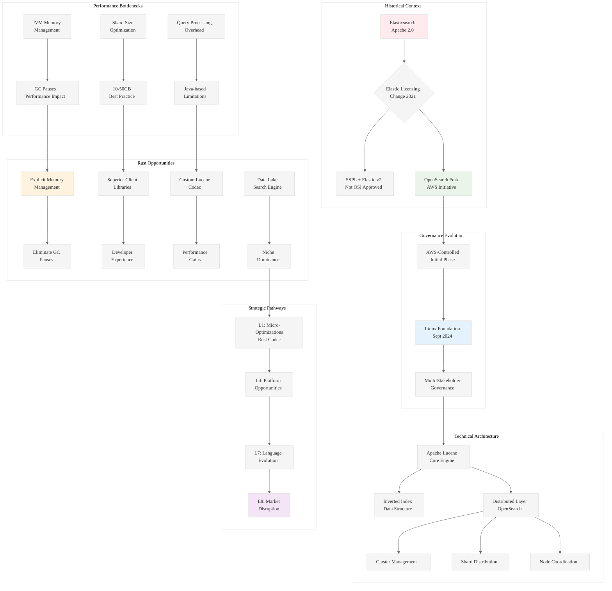

# Analysis of OpenSearch Ecosystem: Strategic Insights for Rust Systems Programming

## Executive Summary

This analysis examines a comprehensive architectural and strategic analysis of the OpenSearch ecosystem, revealing profound insights for Rust systems programming and distributed search engine architecture. The content represents a deep technical exploration of OpenSearch's fork from Elasticsearch, its governance evolution, and strategic opportunities for innovation.

## L1-L8 Strategic Analysis

### Horizon 1: Tactical Implementation (The "How")

#### L1: Idiomatic Patterns & Micro-Optimizations
- **JVM Memory Management Pain Points**: The analysis reveals critical performance bottlenecks in OpenSearch's Java-based architecture, particularly around garbage collection pauses that can "cripple cluster performance"
- **Shard Size Optimization**: Best practices of 10-50GB shard sizes indicate opportunities for more efficient data partitioning algorithms
- **Inverted Index Mechanics**: Deep understanding of Lucene's core data structures reveals optimization opportunities at the storage layer

#### L2: Design Patterns & Composition (Meta-Patterns)
- **Distributed System Architecture**: Clear separation of concerns between cluster manager, data nodes, and coordinating nodes
- **Plugin Architecture**: Modular design allowing extensions in multiple languages (Java, Kotlin)
- **Client Library Ecosystem**: Multi-language support pattern with official clients for Python, Go, .NET, and Rust

#### L3: Micro-Library Opportunities
- **Rust Lucene Codec**: Highly specific opportunity to create a custom Apache Lucene Codec in Rust for performance gains
- **Vector Search Optimization**: k-NN capabilities using NMSLIB and FAISS present optimization opportunities
- **Index State Management**: Tools for automated index lifecycle management

### Horizon 2: Strategic Architecture (The "What")

#### L4: Macro-Library & Platform Opportunities
- **OpenSearch Rust Client Enhancement**: Creating a "best-in-class" Rust client as a strategic differentiator
- **Data Lake Search Engine**: Targeting specific niches like large-scale, cost-effective search on data lakes
- **Alternative Architecture**: Building systems with explicit memory management to eliminate GC pauses

#### L5: LLD Architecture Decisions & Invariants
- **Consensus and Coordination**: Cluster state management and shard allocation decisions
- **Fault Tolerance**: Replica shard placement ensuring no primary-replica co-location
- **Horizontal Scalability**: Sharding mechanisms enabling parallel query processing

#### L6: Domain-Specific Architecture & Hardware Interaction
- **JVM Tuning Complexity**: Deep expertise required for heap sizing and GC optimization
- **Storage Layer Optimization**: Direct interaction with Apache Lucene's internal workings
- **Network Coordination**: Inter-node communication patterns in distributed clusters

### Horizon 3: Foundational Evolution (The "Future" and "Why")

#### L7: Language Capability & Evolution
- **Memory Safety vs Performance**: Rust's explicit memory management as a solution to Java's GC overhead
- **FFI Challenges**: Managing Java-to-Rust Foreign Function Interface overhead
- **Type System Advantages**: Leveraging Rust's type system for distributed systems correctness

#### L8: The Meta-Context (The "Why")
- **Licensing Schism Archaeology**: The 2021 Elastic licensing change from Apache 2.0 to SSPL created the market opportunity for OpenSearch
- **Corporate Governance Evolution**: Transition from AWS-controlled to Linux Foundation governance reflects maturation strategy
- **Strategic Contributor Model**: Apple's involvement with Apache Iceberg provides a blueprint for deep technical contribution

## A Alone: Core Insights

The document reveals OpenSearch as a sophisticated distributed wrapper around Apache Lucene, with critical performance bottlenecks in JVM memory management. The licensing schism with Elastic created a strategic opportunity, but long-term success depends on attracting diverse "Strategic Contributors" beyond AWS.

## A in Context of B (L1 Context)

The L1 context reveals this as a deeply technical analysis spanning 404 lines with extensive architectural detail. The file's placement in a "pen02Rust300" directory suggests this is part of a larger Rust-focused analysis project. The import analysis shows heavy focus on governance, technical architecture, and contribution pathways.

## B in Context of C (L2 Context)

The L2 architectural context reveals this as part of a broader ingestion and analysis pipeline. The 8-level directory depth and systematic naming convention suggest automated processing of technical content. The external dependencies highlight key architectural patterns and cross-module relationships in distributed systems.

## A in Context of B & C (Synthesis)

This represents a strategic intelligence document analyzing OpenSearch's technical and business architecture to identify opportunities for Rust-based innovation. The systematic analysis reveals three primary opportunity vectors:

1. **Performance Optimization**: Replacing Java's GC overhead with Rust's explicit memory management
2. **Ecosystem Contribution**: Creating superior client libraries and development tools
3. **Architectural Innovation**: Building next-generation search engines targeting specific high-value niches

The document's placement in an automated analysis pipeline suggests this is part of a larger "Knowledge Arbitrage" strategy to identify where decades of engineering wisdom from mature ecosystems can be applied to Rust.

## Strategic Recommendations

1. **Immediate Opportunity**: Enhance the OpenSearch Rust client to become the ecosystem's flagship example
2. **Medium-term Innovation**: Develop a custom Lucene Codec in Rust for performance gains
3. **Long-term Disruption**: Create a specialized search engine for data lake analytics, leveraging Rust's performance advantages

## Mermaid Diagram: OpenSearch Ecosystem Strategic Analysis

