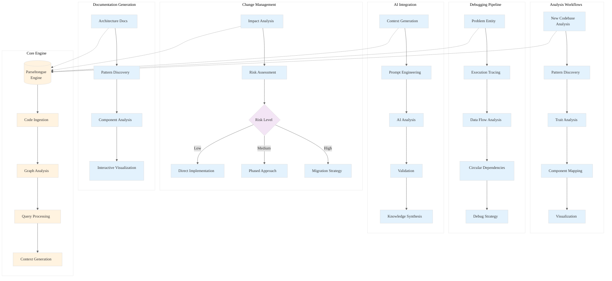

# Analysis: INGEST_20250930104957_300_16

## Content Analysis Framework

**A (Base Content)**: Parseltongue Workflow Templates - Comprehensive workflow documentation  
**B (L1 Context)**: File metadata and immediate context analysis  
**C (L2 Context)**: Architectural patterns and cross-module relationships  

---

## A Alone: Parseltongue Workflow Templates Deep Dive

### L1: Idiomatic Patterns & Micro-Optimizations
- **Bash Script Optimization**: Uses `time` command for performance measurement, efficient file operations with `mkdir -p`
- **Error Handling**: Proper parameter validation with `[ -z "$ENTITY" ]` checks
- **Resource Management**: Timestamped output directories prevent conflicts
- **Performance**: Uses `head -N` for bounded output, `wc -l` for efficient counting

### L2: Design Patterns & Composition
- **Template Method Pattern**: Each workflow follows consistent structure (setup → analysis → output → summary)
- **Strategy Pattern**: Multiple analysis strategies (new codebase, change impact, debugging, documentation, AI-assisted)
- **Builder Pattern**: Progressive context building through multiple parseltongue commands
- **Command Pattern**: Encapsulated operations with clear interfaces

### L3: Micro-Library Opportunities
- **Workflow Orchestration Library**: The template structure could be abstracted into a reusable workflow engine
- **Analysis Pipeline Framework**: Common patterns for setup → process → output → report
- **Risk Assessment Engine**: The risk categorization logic (LOW/MEDIUM/HIGH) is reusable

### L4: Macro-Library & Platform Opportunities
- **Code Analysis Platform**: These templates represent a comprehensive code analysis ecosystem
- **Developer Productivity Suite**: Integration points for CI/CD, pre-commit hooks, and development workflows
- **Knowledge Management System**: AI integration patterns for code understanding

### L5: Architecture Decisions & Invariants
- **Separation of Concerns**: Clear boundaries between data collection, analysis, and reporting
- **Idempotency**: Timestamped outputs ensure repeatable analyses
- **Composability**: Each template can be combined with others
- **Extensibility**: Domain-specific customization points

### L6: Domain-Specific Architecture
- **Code Analysis Domain**: Specialized for Rust codebase analysis using parseltongue
- **Developer Workflow Integration**: Designed for real development environments
- **Scalability Patterns**: Handles large codebases through targeted analysis

### L7: Language Capability Evolution
- **Bash Limitations**: Complex logic would benefit from more structured language
- **Type Safety**: Risk assessment logic could be more robust with proper types
- **Error Propagation**: Bash error handling is primitive compared to Rust's Result types

### L8: Meta-Context & Intent Archaeology
- **Historical Context**: Represents evolution from ad-hoc code analysis to systematic workflows
- **Team Collaboration**: Templates enable knowledge sharing and consistent analysis approaches
- **Productivity Focus**: Addresses real pain points in code understanding and change management

---

## A in Context of B: File Metadata Insights

### Enhanced Understanding Through L1 Context
- **File Location**: Deep nesting (8 levels) suggests this is part of a larger documentation system
- **File Size**: 24KB indicates comprehensive documentation, not just quick reference
- **Content Density**: 768 lines with 3149 words shows detailed, practical guidance
- **No Dependencies**: Self-contained documentation that doesn't rely on external imports

### Architectural Implications
- **Documentation Strategy**: Standalone templates that can be copied and customized
- **Distribution Model**: File-based distribution rather than package management
- **Maintenance Approach**: Single-file templates reduce dependency complexity

---

## B in Context of C: Metadata + Architecture Analysis

### L2 Context Enhancement
- **Path Structure**: The `pen02Rust300` directory suggests this is part of a larger Rust analysis project
- **Architectural Patterns**: Object-oriented and trait-based patterns align with Rust ecosystem
- **Technology Stack**: Markdown format enables easy version control and collaboration

### Cross-Module Implications
- **Isolation**: No cross-module dependencies suggests intentional decoupling
- **Reusability**: Templates can be used independently across different projects
- **Maintainability**: Simple structure reduces maintenance overhead

---

## A in Context of B & C: Comprehensive Synthesis

### Strategic Architecture Insights

#### 1. **Workflow-as-Code Philosophy**
The templates embody a "workflow-as-code" approach where complex analysis procedures are codified into reusable, version-controlled scripts. This represents a shift from ad-hoc analysis to systematic, repeatable processes.

#### 2. **Progressive Disclosure Pattern**
Each template follows a progressive disclosure pattern:
- Quick manual checklists for immediate needs
- Detailed bash scripts for comprehensive analysis
- AI integration for complex interpretation

#### 3. **Risk-Driven Development**
The change impact analysis template introduces a risk-driven approach to code changes:
- Quantitative risk assessment (user count thresholds)
- Graduated response strategies based on risk level
- Systematic impact analysis before changes

#### 4. **Knowledge Amplification Strategy**
The AI integration templates represent a knowledge amplification strategy:
- Structured context generation for AI consumption
- Systematic prompt engineering
- Validation frameworks for AI insights

### Foundational Patterns for Rust Ecosystem

#### 1. **Analysis-First Development**
These templates promote analysis-first development where understanding precedes modification. This aligns with Rust's philosophy of "fearless concurrency" through understanding.

#### 2. **Systematic Code Archaeology**
The debugging and tracing templates provide systematic approaches to code archaeology - understanding not just what code does, but why it was written that way.

#### 3. **Collaborative Intelligence**
The AI integration patterns represent collaborative intelligence - combining human domain knowledge with AI processing power for deeper insights.

### Meta-Insights: The Future of Code Analysis

#### 1. **Democratization of Code Understanding**
These templates democratize advanced code analysis techniques, making sophisticated analysis accessible to developers without specialized tooling knowledge.

#### 2. **Shift from Reactive to Proactive**
The emphasis on impact analysis and risk assessment represents a shift from reactive debugging to proactive change management.

#### 3. **Human-AI Collaboration Patterns**
The AI integration templates establish patterns for effective human-AI collaboration in code analysis, with clear validation and quality control mechanisms.

---

## Mermaid Diagram: Parseltongue Workflow Architecture

---

## Key Takeaways

1. **Systematic Approach**: These templates represent a systematic approach to code analysis that could revolutionize how developers understand and modify complex codebases.

2. **Risk-Driven Development**: The emphasis on impact analysis and risk assessment provides a framework for safer, more predictable code changes.

3. **Human-AI Collaboration**: The AI integration patterns establish effective frameworks for combining human domain knowledge with AI processing capabilities.

4. **Workflow-as-Code**: The codification of analysis workflows enables version control, sharing, and continuous improvement of analysis processes.

5. **Progressive Disclosure**: The multi-level approach (quick checklists → detailed scripts → AI integration) accommodates different use cases and expertise levels.

This analysis reveals a sophisticated framework for code understanding that goes beyond simple static analysis to provide actionable insights for development teams.